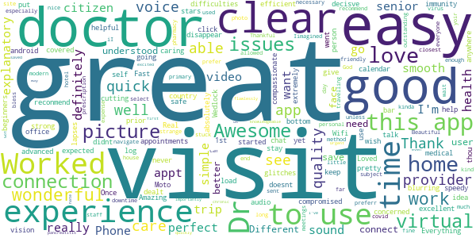
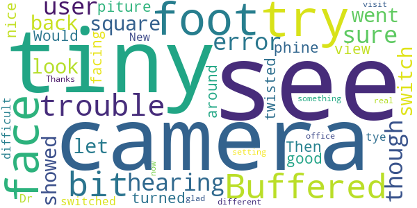
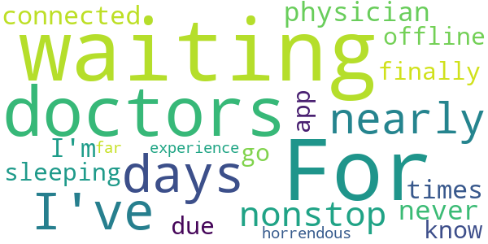

# myVirtualHealthVisit
App version ``12.0.16.005_01``

Analyzed with [covid-apps-observer](http://github.com/covid-apps-observer) project, version ``0.1``

## App overview
| | |
|-------------------------|-------------------------| 
| **Name**&nbsp;&nbsp;&nbsp;&nbsp;&nbsp;&nbsp;&nbsp;&nbsp;&nbsp;&nbsp;&nbsp;&nbsp;&nbsp;&nbsp;&nbsp;&nbsp;&nbsp;&nbsp;&nbsp;&nbsp;&nbsp;&nbsp;&nbsp;&nbsp;&nbsp;&nbsp;&nbsp;&nbsp;&nbsp;&nbsp;&nbsp;&nbsp;&nbsp;&nbsp;&nbsp;&nbsp;&nbsp;&nbsp;&nbsp;&nbsp;  | myVirtualHealthVisit |
| **Unique identifier** | com.suburbanhealth.android.sbho.myvirtualhealthvisit |
| **Link to Google Play** | [https://play.google.com/store/apps/details?id=com.suburbanhealth.android.sbho.myvirtualhealthvisit](https://play.google.com/store/apps/details?id=com.suburbanhealth.android.sbho.myvirtualhealthvisit) |
| **Summary**  | Feel better today, connect with myVirtualHealthVisit to see a provider now! |
| **Privacy policy** | [https://www.americanwell.com/privacy-policy/](https://www.americanwell.com/privacy-policy/) |
| **Latest version** | 12.0.16.005_01 |
| **Last update** | 2020-10-25 06:08:00 |
| **Recent changes** | We continue to improve the patient experience with these new features: • Performance enhancements to increase reliability and speed |
| **Installs**  | 5,000+ |
| **Category** | Medical |
| **First release** | Feb 2, 2017 |
| **Size**  | 52M |
| **Supported Android version**  | 5.0 and up |

### Description
> Feeling sick usually happens at the most inconvenient times. However, that doesn’t mean getting the care you need has to be inconvenient too.
 You can now have convenient and quality care at your fingertips and even in the comfort of your own bed with the myVirtualHealthVisit app. The myVirtualHealthVisit app provides an easy way to connect with a live provider when it’s convenient for you. You can access a provider in your car, office, or home. A virtual health video visit eliminates time traveling to the urgent care or waiting for an appointment at a doctor’s office.
 Receive quality and convenient care on your terms at a time, location, and cost that fits your lifestyle. Urgent care visits on myVirtualHealthVisit cost only $49 or less.
 You might be thinking, “When can I use this app—for a sore throat, cough, or headache?” The answer is Yes! Yes! Yes! myVirtualHealthVisit can be used for common conditions such as:
 • Upper Respiratory Infections/Flu
 • Bronchitis
 • Sinus Infection
 • Earache
 • Conjunctivitis (Pinkeye)
 • Urinary Tract Infection
 • Skin Disorders
 • Back Pain
 In addition to on-demand urgent care services, myVirtualHealthVisit now offers scheduled visits across a variety of specialties with many of Suburban Health Organization’s own Hospital Providers. myVirtualHealthVisit is not for emergency or life-threatening conditions, such as chest pain or shortness of breath. If you have a medical emergency, please call 911 immediately.
 Now that you have decided to download the app and are waiting for your virtual health visit to begin, you might be wondering what to expect. You can expect to communicate with a provider through a live video and audio chat. The video and audio chat features allow the myVirtualHealthVisit provider to diagnose, prescribe medication, and suggest an in-person follow-up visit, if you need it.  
 Your next question might be, “I have a child who is sick. Can I use this app for my child?” The answer is yes! Additionally, as a patient you can invite others to join your video visit (i.e. a spouse, son/daughter of an elderly patient, parent of a college student, etc.)
 Along with your care, your privacy is very important to us. Any information that you provide when enrolling, including your personal health and credit card details, is secure. Your visit is private, and any information that you share with the provider is protected in accordance with HIPAA guidelines for patient safety and confidentiality.
 myVirtualHealthVisit is also integrated with Apple Health (iOS only), so you can choose to share your health information with the doctor during your virtual visit, including heart rate, blood pressure, body temperature, blood glucose levels, weight, nutritional information, and respiratory rate.
 myVirtualHealthVisit brings a provider to you, regardless of where you live in Indiana. myVirtualHealthVisit is a collaboration among Indiana hospitals working together to promote quality, efficiency, and patient access in the communities they serve. Collaborating hospitals include:
 • Goshen Health
 • Hancock Health
 • Hendricks Regional Health
 • Henry Community Health
 • Johnson Memorial Health
 • Major Health Partners
 • Margaret Mary Health
 • Marion General Hospital
 • Riverview Health
 • Witham Health Services
 For more information, visit our website:
 https://www.suburbanhealth.com/shared-services/online-doctor-visits/

### User interface
The developers of the app provide the following screenshots in the Google play store.
| | | |
|:-------------------------:|:-------------------------:|:-------------------------:|
 |   |   |   | 
 |   |   |   | 
 |   |   |   | 
 |   |   |   | 

## Development team
In the following we report the main information provided by the development team in the Google play store.

| | |
|-------------------------|-------------------------|
| **Developer**  | Suburban Health Organization |
| **Website**  | - |
| **Email** | shodeveloper@suburbanhealth.com |
| **Physical address**  | - |
| **Other developed apps**  | [https://play.google.com/store/apps/developer?id=Suburban+Health+Organization](https://play.google.com/store/apps/developer?id=Suburban+Health+Organization) |

## Android support

| | |
|-------------------------|-------------------------|
| **Declared target Android version**  | Pie, version 9 (API level 28) |
| **Effective target Android version**  | Pie, version 9 (API level 28) |
| **Minimum supported Android version**  | Lollipop, version 5.0 (API level 21) |
| **Maximum target Android version**  | - |

The larger the difference between the minimum and maximum supported Android versions, the better. A larger difference means a wider audience. For example, old phones have a very low Android version, so a high minimum supported Android version means that the app cannot be used by users with old phones, thus leading to accessibility problems. 

## Requested permissions

In the following we report the complete list of the permissions requested by the app. 

| **Permission** | **Protection level** | **Description** | 
|-------------------------|-------------------------|-------------------------|
 **android.permission ACCESS_COARSE_LOCATION** | :warning:**Dangerous** | Allows an app to access approximate location. 
 **android.permission ACCESS_FINE_LOCATION** | :warning:**Dangerous** | Allows an app to access precise location. 
 **android.permission ACCESS_LOCATION_EXTRA_COMMANDS** | Normal | Allows an application to access extra location provider commands. 
 **android.permission ACCESS_NETWORK_STATE** | Normal | Allows applications to access information about networks. 
 **android.permission ACCESS_WIFI_STATE** | Normal | Allows applications to access information about Wi-Fi networks. 
 **android.permission BLUETOOTH** | Normal | Allows applications to connect to paired bluetooth devices. 
 **android.permission BROADCAST_STICKY** | Normal | Allows an application to broadcast sticky intents. 
 **android.permission CAMERA** | :warning:**Dangerous** | Required to be able to access the camera device. 
 **android.permission GET_TASKS** | Deprecated | This constant was deprecated in API level 21. No longer enforced. 
 **android.permission INTERNET** | Normal | Allows applications to open network sockets. 
 **android.permission MODIFY_AUDIO_SETTINGS** | Normal | Allows an application to modify global audio settings. 
 **android.permission READ_EXTERNAL_STORAGE** | :warning:**Dangerous** | Allows an application to read from external storage. 
 **android.permission READ_PHONE_STATE** | :warning:**Dangerous** | Allows read only access to phone state, including the phone number of the device, current cellular network information, the status of any ongoing calls, and a list of any PhoneAccounts registered on the device. 
 **android.permission RECEIVE_BOOT_COMPLETED** | Normal | Allows an application to receive the Intent.ACTION_BOOT_COMPLETED that is broadcast after the system finishes booting. 
 **android.permission RECORD_AUDIO** | :warning:**Dangerous** | Allows an application to record audio. 
 **android.permission REORDER_TASKS** | Normal | Allows an application to change the Z-order of tasks. 
 **android.permission SYSTEM_ALERT_WINDOW** | Signature - preinstalled - appop - pre23 - development | Allows an app to create windows using the type WindowManager.LayoutParams.TYPE_APPLICATION_OVERLAY, shown on top of all other apps. 
 **android.permission VIBRATE** | Normal | Allows access to the vibrator. 
 **android.permission WAKE_LOCK** | Normal | Allows using PowerManager WakeLocks to keep processor from sleeping or screen from dimming. 
 **android.permission WRITE_EXTERNAL_STORAGE** | :warning:**Dangerous** | Allows an application to write to external storage. 
 **com.facebook.katana.provider ACCESS** | - | - 
 **com.google.android.c2dm.permission RECEIVE** | - | - 
 **com.google.android.finsky.permission BIND_GET_INSTALL_REFERRER_SERVICE** | - | - 
 **com.suburbanhealth.android.sbho.myvirtualhealthvisit.permission C2D_MESSAGE** | - | - 

## Mentioned servers

| **Server** | **Registrant** | **Registrant country** | **Creation date** | 
|-------------------------|-------------------------|-------------------------|-------------------------|
 | amwell.com | American Well Corporation | :us: US | 2004-02-13 19:02:32 |
 | facebook.com | Facebook, Inc. | :us: US | 1997-03-29 05:00:00 |
 | doubleclick.net | Google Inc. | :us: US | 1996-01-16 05:00:00 |
 | googleadservices.com | Google LLC | :us: US | 2003-06-19 16:34:53 |
 | google.com | Google LLC | :us: US | 1997-09-15 04:00:00 |
 | googlesyndication.com | Google LLC | :us: US | 2003-01-21 06:17:24 |
 | googleapis.com | Google LLC | :us: US | 2005-01-25 17:52:26 |
 | google-analytics.com | Google LLC | :us: US | 2005-07-18 19:24:32 |
 | app-measurement.com | Google LLC | :us: US | 2015-06-19 20:13:31 |
 | appboy.com | Braze, Inc. | :us: US | 2008-10-06 23:28:32 |
 | braze.com | Braze, Inc. | :us: US | 2000-01-19 02:18:28 |
 | optimizely.com | Optimizely | :us: US | 2010-01-11 03:01:32 |
 | twitter.com | Twitter, Inc. | :us: US | 2000-01-21 16:28:17 |
 | crashlytics.com | Google LLC | :us: US | 2011-01-21 15:30:40 |
 | gstatic.com | Google LLC | :us: US | 2008-02-11 15:31:25 |
 | ggpht.com | Google LLC | :us: US | 2008-01-16 18:55:33 |

## Security analysis 

Below we report the main security warnings raised by our execution of the [Androwarn](https://github.com/maaaaz/androwarn) security analysis tool.

**Telephony identifiers leakage**
> - This application reads the ISO country code equivalent for the SIM provider's country code 
> - This application reads the ISO country code equivalent of the current registered operator's MCC (Mobile Country Code) 
> - This application reads the device phone type value 
> - This application reads the numeric name (MCC+MNC) of current registered operator 
> - This application reads the operator name 
> - This application reads the phone's current state 
> - This application reads the radio technology (network type) currently in use on the device for data transmission 

**Connection interfaces exfiltration**
> - This application reads details about the currently active data network 
> - This application tries to find out if the currently active data network is metered 

**Telephony services abuse**
> - This application makes phone calls 

**Audio video eavesdropping**
> - This application captures video from the 'CAMERA' source 

**Suspicious connection establishment**
> - This application opens a Socket and connects it to the remote address '' on the 'N/A' port  
> - This application opens a Socket and connects it to the remote address 'Ljava/lang/StringBuilder;->toString()Ljava/lang/String;' on the 'N/A' port  
> - This application opens a Socket and connects it to the remote address 'Ljava/net/Proxy;->type()Ljava/net/Proxy$Type;' on the 'N/A' port  
> - This application opens a Socket and connects it to the remote address 'timeout' on the 'N/A' port  

**Code execution**
> - This application loads a native library 
> - This application loads a native library: 'VidyoClientApp' 
> - This application loads a native library: 'ndkVideoClient' 
> - This application executes a UNIX command containing this argument: '2' 

## User ratings and reviews

Below we provide information about how end users are reacting to the app in terms of ratings and reviews in the Google Play store.

### Ratings

The myVirtualHealthVisit app has been installed by more than **5000** times. At this time, **125** rated the app and its average score is **4.841584**. Below we show the distribution of the ratings across the usual star-based rating of Google Play

:star::star::star::star::star:: 111

:star::star::star::star:: 11

:star::star::star:: 2

:star::star:: 1

:star:: 0

### Reviews 

#### 5-star reviews

> Worked well  :date: __2020-12-07 16:48:28__

> Worked great on my android Moto Phone.  :date: __2020-11-04 16:46:05__

> Everything was great with the visit. I would just love to go in and see my health care providers in person.  :date: __2020-09-21 19:10:38__

> Very easy to use and never any issues with connection. The appointments are put on the calendar prior so when you log on, you just have to click "get started" and it connects you to the doctor or medical provider.  :date: __2020-09-15 19:59:03__

> I'm a senior citizen w compromised immunity. I just had my 1st, virtual Dr visit ever! It was a very clear picture, & I had a perfect connection in the country, & w/out Wifi in r home. W/no lapses in time, no voices cutting out, & no glitches. It was above, what I had expected. Thank u all, for a clear & excellent virtual Dr visit, to help keep this Senior Citizen, @ home & safe. :)  :date: __2020-07-15 22:45:29__

> Good app  :date: __2020-06-19 15:44:58__

> Works pretty good  :date: __2020-06-09 16:36:07__

> This app is great...didnt have any issues with my appt at all...  :date: __2020-06-03 15:30:30__

> Fast easy-to-use  :date: __2020-06-02 14:50:28__

> The app worked great!  :date: __2020-05-21 22:06:18__

#### 4-star reviews

> Buffered a bit and had trouble hearing. Not sure if that was user error though....  :date: __2020-04-27 16:49:28__

> I had just a tiny square that showed and when I went to switch the camera to the back camera it wouldn't let me. So I had to try and look at the tiny piture on the phine w it turned facing my foot. Then had to try and get a good view of my foot with it twisted around. Would be nice if it switched so it wasn't so difficult for tye Dr to see.  :date: __2020-04-20 19:29:20__

> New something different  :date: __2020-04-03 20:28:11__

> I do not like to see myself. It is not at all like a face to face real office visit but for now I am glad to see him. Thanks for setting this up.  :date: __2020-03-30 16:48:44__

#### 3-star reviews

> Asks too many personal questions getting started. This app does not need to know  :date: __2020-03-31 22:22:25__

> If my health network is part of this why can't I enter my insurance information? Why is there no where to ask questions not already addressed in FAQ?  :date: __2018-02-19 14:13:01__

#### 2-star reviews

No recent reviews available with 2 stars.

#### 1-star reviews

> For 2 days I've been waiting nearly nonstop for a physician and have never been connected. The only times which I haven't been waiting are when I'm sleeping or the doctors finally go offline. I don't know if this is due to the app or the doctors, but my experience so far has been horrendous!  :date: __2020-03-19 00:04:35__

