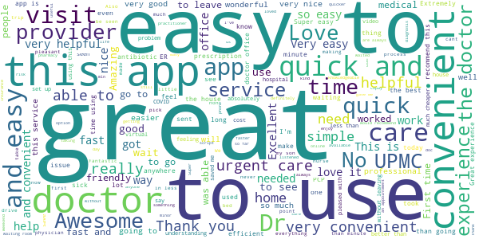
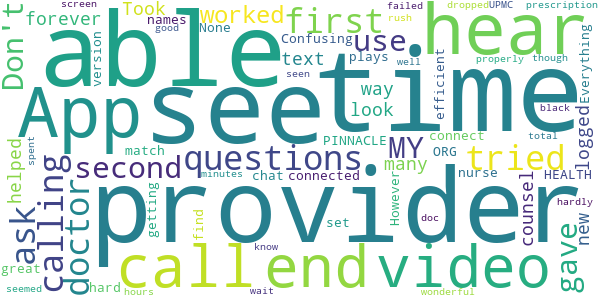
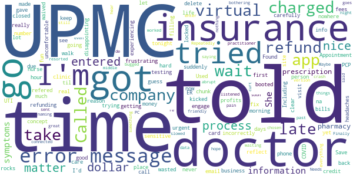
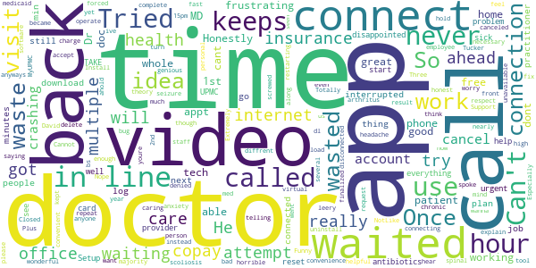

# UPMC AnywhereCare
App version ``12.10.01.010_02``

Analyzed with [covid-apps-observer](http://github.com/covid-apps-observer) project, version ``0.1``

## App overview
| | |
|-------------------------|-------------------------| 
| **Name**&nbsp;&nbsp;&nbsp;&nbsp;&nbsp;&nbsp;&nbsp;&nbsp;&nbsp;&nbsp;&nbsp;&nbsp;&nbsp;&nbsp;&nbsp;&nbsp;&nbsp;&nbsp;&nbsp;&nbsp;&nbsp;&nbsp;&nbsp;&nbsp;&nbsp;&nbsp;&nbsp;&nbsp;&nbsp;&nbsp;&nbsp;&nbsp;&nbsp;&nbsp;&nbsp;&nbsp;&nbsp;&nbsp;&nbsp;&nbsp;  | UPMC AnywhereCare |
| **Unique identifier** | com.upmc.android.upmcanywherecare |
| **Link to Google Play** | [https://play.google.com/store/apps/details?id=com.upmc.android.upmcanywherecare](https://play.google.com/store/apps/details?id=com.upmc.android.upmcanywherecare) |
| **Summary**  | Quick 24/7 UPMC online medical visits and care plans that fit your schedule. |
| **Privacy policy** | [https://www.americanwell.com/privacy-policy/](https://www.americanwell.com/privacy-policy/) |
| **Latest version** | 12.10.01.010_02 |
| **Last update** | 2021-06-29 20:13:01 |
| **Recent changes** | We continue to improve the patient experience with these new features: • Performance enhancements to increase reliability and speed |
| **Installs**  | 50,000+ |
| **Category** | Medical |
| **First release** | Oct 31, 2016 |
| **Size**  | 46M |
| **Supported Android version**  | 5.0 and up |

### Description
> Because symptoms can strike anytime, UPMC AnywhereCare offers quick 24/7 virtual video visits with a diagnosis and care plan that fit in your schedule. Whether you’re at home, at work, traveling or it’s the middle of the night, UPMC AnywhereCare offers patients with non-emergency symptoms quality care online quickly. No germ filled waiting rooms, traffic or parking hassles. Connect with an online healthcare professional in an affordable, convenient and secure way using your smartphone or tablet. If needed, prescriptions can be sent directly to your pharmacy. Download the free UPMC AnywhereCare app and have round-the-clock access to a medical professional at your fingertips.
 The following are examples of some of the conditions that can be treated via UPMC AnywhereCare:
 • Bronchitis and cough
 • Cold and flu symptoms
 • Diarrhea
 • Earache
 • Pink eye
 • Rash
 • Seasonal allergies
 • Sinus infection
 • Tick bites
 • Urinary tract infection
 • Vaginal yeast infection
 • General medical advice
 Your information is kept private and your connection is secure and HIPPA compliant. If you think you are experiencing life-threating symptoms, call 911 or seek immediate medical attention. You must be over the age of 18 to use UPMC AnywhereCare for yourself or a minor 3 years or older.

### User interface
The developers of the app provide the following screenshots in the Google play store.
| | | |
|:-------------------------:|:-------------------------:|:-------------------------:|
 |   |   |   | 
 |   |   |   | 
 |   |   |   | 
 |   |   |   | 

## Development team
In the following we report the main information provided by the development team in the Google play store.

| | |
|-------------------------|-------------------------|
| **Developer**  | UPMC Enterprises |
| **Website**  | [http://www.upmc.com/](http://www.upmc.com/) |
| **Email** | tdc.upmc@gmail.com |
| **Physical address**  | - |
| **Other developed apps**  | [https://play.google.com/store/apps/developer?id=UPMC+Enterprises](https://play.google.com/store/apps/developer?id=UPMC+Enterprises) |

## Android support

| | |
|-------------------------|-------------------------|
| **Declared target Android version**  | Android10, version 10 (API level 29) |
| **Effective target Android version**  | Android10, version 10 (API level 29) |
| **Minimum supported Android version**  | Lollipop, version 5.0 (API level 21) |
| **Maximum target Android version**  | - |

The larger the difference between the minimum and maximum supported Android versions, the better. A larger difference means a wider audience. For example, old phones have a very low Android version, so a high minimum supported Android version means that the app cannot be used by users with old phones, thus leading to accessibility problems. 

## Requested permissions

In the following we report the complete list of the permissions requested by the app. 

| **Permission** | **Protection level** | **Description** | 
|-------------------------|-------------------------|-------------------------|
 **android.permission ACCESS_COARSE_LOCATION** | :warning:**Dangerous** | Allows an app to access approximate location. 
 **android.permission ACCESS_FINE_LOCATION** | :warning:**Dangerous** | Allows an app to access precise location. 
 **android.permission ACCESS_LOCATION_EXTRA_COMMANDS** | Normal | Allows an application to access extra location provider commands. 
 **android.permission ACCESS_NETWORK_STATE** | Normal | Allows applications to access information about networks. 
 **android.permission ACCESS_WIFI_STATE** | Normal | Allows applications to access information about Wi-Fi networks. 
 **android.permission BLUETOOTH** | Normal | Allows applications to connect to paired bluetooth devices. 
 **android.permission BROADCAST_STICKY** | Normal | Allows an application to broadcast sticky intents. 
 **android.permission CAMERA** | :warning:**Dangerous** | Required to be able to access the camera device. 
 **android.permission GET_TASKS** | Deprecated | This constant was deprecated in API level 21. No longer enforced. 
 **android.permission INTERNET** | Normal | Allows applications to open network sockets. 
 **android.permission MODIFY_AUDIO_SETTINGS** | Normal | Allows an application to modify global audio settings. 
 **android.permission READ_EXTERNAL_STORAGE** | :warning:**Dangerous** | Allows an application to read from external storage. 
 **android.permission READ_PHONE_STATE** | :warning:**Dangerous** | Allows read only access to phone state, including the phone number of the device, current cellular network information, the status of any ongoing calls, and a list of any PhoneAccounts registered on the device. 
 **android.permission RECEIVE_BOOT_COMPLETED** | Normal | Allows an application to receive the Intent.ACTION_BOOT_COMPLETED that is broadcast after the system finishes booting. 
 **android.permission RECORD_AUDIO** | :warning:**Dangerous** | Allows an application to record audio. 
 **android.permission REORDER_TASKS** | Normal | Allows an application to change the Z-order of tasks. 
 **android.permission SYSTEM_ALERT_WINDOW** | Signature - preinstalled - appop - pre23 - development | Allows an app to create windows using the type WindowManager.LayoutParams.TYPE_APPLICATION_OVERLAY, shown on top of all other apps. 
 **android.permission USE_BIOMETRIC** | Normal | Allows an app to use device supported biometric modalities. 
 **android.permission USE_FINGERPRINT** | Normal | This constant was deprecated in API level 28. Applications should request USE_BIOMETRIC instead 
 **android.permission VIBRATE** | Normal | Allows access to the vibrator. 
 **android.permission WAKE_LOCK** | Normal | Allows using PowerManager WakeLocks to keep processor from sleeping or screen from dimming. 
 **android.permission WRITE_EXTERNAL_STORAGE** | :warning:**Dangerous** | Allows an application to write to external storage. 
 **com.facebook.katana.provider ACCESS** | - | - 
 **com.google.android.c2dm.permission RECEIVE** | - | - 
 **com.google.android.finsky.permission BIND_GET_INSTALL_REFERRER_SERVICE** | - | - 
 **com.upmc.android.upmcanywherecare.permission C2D_MESSAGE** | - | - 

## Mentioned servers

| **Server** | **Registrant** | **Registrant country** | **Creation date** | 
|-------------------------|-------------------------|-------------------------|-------------------------|
 | amwell.com | American Well Corporation | :us: US | 2004-02-13 19:02:32 |
 | facebook.com | Facebook, Inc. | :us: US | 1997-03-29 05:00:00 |
 | doubleclick.net | Google Inc. | :us: US | 1996-01-16 05:00:00 |
 | googleadservices.com | Google LLC | :us: US | 2003-06-19 16:34:53 |
 | google.com | Google LLC | :us: US | 1997-09-15 04:00:00 |
 | googlesyndication.com | Google LLC | :us: US | 2003-01-21 06:17:24 |
 | google-analytics.com | Google LLC | :us: US | 2005-07-18 19:24:32 |
 | app-measurement.com | Google LLC | :us: US | 2015-06-19 20:13:31 |
 | appboy.com | Braze, Inc. | :us: US | 2008-10-06 23:28:32 |
 | braze.com | Braze, Inc. | :us: US | 2000-01-19 02:18:28 |
 | optimizely.com | Optimizely | :us: US | 2010-01-11 03:01:32 |
 | twitter.com | Twitter, Inc. | :us: US | 2000-01-21 16:28:17 |
 | branch.io | Branch | :us: US | 2011-11-10 13:52:13 |
 | gstatic.com | Google LLC | :us: US | 2008-02-11 15:31:25 |
 | crashlytics.com | Google LLC | :us: US | 2011-01-21 15:30:40 |
 | bnc.lt | - | - | 2016-11-14 00:00:00 |
 | ggpht.com | Google LLC | :us: US | 2008-01-16 18:55:33 |

## Security analysis 

Below we report the main security warnings raised by our execution of the [Androwarn](https://github.com/maaaaz/androwarn) security analysis tool.

**Telephony identifiers leakage**
> - This application reads the ISO country code equivalent for the SIM provider's country code 
> - This application reads the ISO country code equivalent of the current registered operator's MCC (Mobile Country Code) 
> - This application reads the device phone type value 
> - This application reads the numeric name (MCC+MNC) of current registered operator 
> - This application reads the operator name 
> - This application reads the phone's current state 
> - This application reads the radio technology (network type) currently in use on the device for data transmission 

**Connection interfaces exfiltration**
> - This application reads details about the currently active data network 
> - This application tries to find out if the currently active data network is metered 

**Telephony services abuse**
> - This application makes phone calls 

**Audio video eavesdropping**
> - This application records audio from the 'VOICE_RECOGNITION' source  
> - This application captures video from the 'CAMERA' source 

**Suspicious connection establishment**
> - This application opens a Socket and connects it to the remote address ' returned no addresses for  ; port is out of range' on the 'N/A' port  
> - This application opens a Socket and connects it to the remote address '' on the 'N/A' port  
> - This application opens a Socket and connects it to the remote address 'Ljava/net/Proxy;->type()Ljava/net/Proxy$Type;' on the 'N/A' port  
> - This application opens a Socket and connects it to the remote address 'timeout' on the 'N/A' port  

**Code execution**
> - This application loads a native library 
> - This application executes a UNIX command containing this argument: '2' 

## User ratings and reviews

Below we provide information about how end users are reacting to the app in terms of ratings and reviews in the Google Play store.

### Ratings

The UPMC AnywhereCare app has been installed by more than **50000** times. At this time, **957** rated the app and its average score is **4.6960783**. Below we show the distribution of the ratings across the usual star-based rating of Google Play

:star::star::star::star::star:: 818

:star::star::star::star:: 65

:star::star::star:: 37

:star::star:: 0

:star:: 37

### Reviews 

#### 5-star reviews

> This was quick and so convenient.  :date: __2021-07-24 20:03:00__

> This is very convenient. I have used it several times and am extremely happy with the virtual visits, the staff and the medical care I received.  :date: __2021-07-18 16:43:25__

> Quick and simple  :date: __2021-07-09 15:58:28__

> My doctor was very helpful and polite.  :date: __2021-07-03 21:04:08__

> Very easy very helpful. Also very nice to be in your own home speaking with a physician!  :date: __2021-06-29 15:34:07__

> This is such a great app, it really helps knowing that I can use this app instead of taking the long trip to the hospital to be seen for minor illnesses. Great experiences all around.  :date: __2021-06-23 12:39:33__

> Very easy to use, and got detailed explanation.  :date: __2021-06-22 18:47:16__

> Very easy process  :date: __2021-06-12 16:36:41__

> Fast easy from the comfort of my home  :date: __2021-05-30 18:29:01__

> An absolute Godsend. I live alone, no longer drive, and my trusted PCP's office is located out of town. Having the opportunity to have the medication delivered is a huge help also.  :date: __2021-05-29 19:58:45__

#### 4-star reviews

> N/A  :date: __2021-07-08 23:51:30__

> Wait was long  :date: __2020-12-12 23:04:45__

> Good advice to take.  :date: __2020-11-26 02:26:35__

> Good  :date: __2020-10-14 14:38:06__

> This app has saved me hours of drive time to and from specialists for me and my daughter. The providers have always been knowledgeable, helpful, and take time to listen to my concerns. I had an issue with my daughter's visit. While we both have UPMC, we each have different plans. I was unable to add her insurance and had to pay $59 for her visit, but later had it refunded. If that glitch is fixed I'll change my review to 5 stars.  :date: __2020-07-07 04:14:08__

> Video was jumpy but convenient  :date: __2020-04-21 01:03:45__

> Good except the wait was long.  :date: __2020-02-24 14:00:05__

> Not bad...just strange to talk to some on the phone and they give u medical advice. But so much better than guessing what you may have by searching online. That aspect it's really nice. So just keep taking over the counter meds.  :date: __2019-12-30 18:47:04__

> Other than my phone didnt show video it seemed well for a first time experience.  :date: __2019-11-10 11:45:07__

> very good  :date: __2019-06-29 21:21:56__

#### 3-star reviews

> Took forever way to many questions then they ask you the same questions by text then the provider ask again  :date: __2021-05-15 00:03:30__

> The first time I tried calling the doctor was not able to hear me but see me. The second time I logged in I was able to get a new doctor and she was able to see me and hear me and gave me counsel and helped me.  :date: __2021-03-30 19:22:04__

> U look.  :date: __2021-03-09 21:34:45__

> Confusing names. I can't find plays version of MY PINNACLE HEALTH. ORG. None of these match.  :date: __2020-12-28 21:01:41__

> Don't use it  :date: __2020-12-02 03:33:50__

> Everything worked to set up the app but when the provider tried calling me the video chat wouldn't connect on their end...  :date: __2020-10-02 23:12:12__

> App is great when u get connected.  :date: __2020-04-29 23:33:17__

> The nurse was very efficient. However, we had a hard time getting the call through properly. She could hardly hear me on her end. I had to wait for over 2 hours to be seen. Then she seemed to rush me through. I spent about 3 minutes total in my call. In the end though she gave me a prescription. I don't know if I would use this again.  :date: __2020-03-17 20:08:08__

> Provider was wonderful but video not good. First time I was able to get to the doc video failed and call was dropped. Second time provider could see me but I could only see black screen  :date: __2020-03-15 16:52:25__

> App worked well, UPMC did not  :date: __2016-11-05 14:57:29__

#### 2-star reviews

> I keep getting booted from virtual visit  :date: __2020-11-03 05:14:21__

> Used the app as told to do by my PCP doctor and insurance company(UPMC). Got charged $60 (when told fees are waived by insurance company) just to see a doctor after a 2 hour wait and be refered for COVID testing. Called UPMC was told they where refunding my $60 and would take 7-10 business days to reflect on my credit card, yet never got a refund and now it is "to late" to process a refund. Save your time and money, go to the ER or walk-in clinic.  :date: __2020-09-02 05:18:39__

> Out of nowhere for no reason it's suddenly kicked me on would not let me back in. No matter how hard I tried, it locked me out.  :date: __2020-06-02 06:47:25__

> concept is nice but I just wasted 15 dollars. all they told me was go in to the doctors. going in would be nice if I could take time off to do it. which is why I did this in the first place. frustrating......  :date: __2019-04-11 05:51:33__

> UPMC rocks in real life, their IT is not so much fun. The number of times I got an error message; if they were dollar bills I'd own a good chunk of the profits. Error message after error message no matter how carefully I entered sensitive information. I gave up trying to get a Virtual Appointment. Found out they had my information entered incorrectly and guess what, I had to engage a person to fix it. Including an email and a phone call and a lot of headaches.  :date: __2019-04-10 02:34:09__

> na  :date: __2019-02-18 22:33:26__

> Do you really have to have UPMC insurance....if so that should be made clear... so I have to delete the app disappointing  :date: __2018-10-18 16:57:57__

> I tried it out late tonight due to experiencing UTI symptoms that I'm too 
uncomfortable with to wait til morning to go to an urgent care for. The 
site closed a few times while I was filling out my info, and the nurse 
practitioner I was connected with was not at all friendly, very curt and 
abrupt like I was bothering her or something. She listened to my symptoms 
and said she would have a prescription sent in to my chosen 
pharmacy...which I'm still waiting to hear from saying the prescription had 
even been called in. Maybe its just because its the middle of the night and 
things are slowed down, but I'm in pain here! I hope it goes through soon 
or else they charged me $50 for nothing  :date: __2018-08-07 06:45:42__

> Needs to be de-bugged. Repeatedly tried to get past naming my Pharmacy and the process would crash and then I had to re-enter all of my data. Finally resorted to the PC version and everything worked out great.  :date: __2017-09-11 00:14:39__

#### 1-star reviews

> keeps crashing  :date: __2021-05-04 12:10:35__

> I can never get the video connection to work on this app, yet have no problems at all connecting to virtual visits on the MyUPMC app. I have no idea why this app never works. Providers never called me back after they cancel the call, so a waste of time.  :date: __2021-05-04 10:45:51__

> I can never get into my account and no idea why????  :date: __2021-04-15 05:26:09__

> Tried 4 times to connect. Wasted an hour, very frustrating. Three times the doctors canceled the visit because it wouldn't connect. Once the doctor finalized the visit even though it didn't connect.  :date: __2021-01-06 18:23:25__

> Do NotLike this  :date: __2020-12-11 00:54:42__

> I tried the video appt. I dont mind waiting. Honestly an hour & 1/2 isn't bad when youre home & not doc office. So the convenience of it (in theory) is a wonderful idea. The 2 attempts for an appt were more headache than necessary. 1st attempt I was kept waiting with 1 person in front of me for nearly 2 hours. 2nd try the 6 patients before me went fast. My turn and the doc cant get video working and cancels on me - no phone call. This isn't a good tool if the med staff cant operate the tech.  :date: __2020-12-05 01:56:58__

> I honestly feel very leery about all this and also i dont think it is being very honest as a chronic care patient of my personal MD. Dr. David Tucker... I have very much high respect for him because he is a very caring, and a complete genious!! I have been with my Dr. for over 10 year's now!!.. He has been great and i have been great and able to be seizure free and anxiety free majority of the time! Plus ive got some horrible spinal scoliosis along with arthritus through my whole back.  :date: __2020-11-26 12:46:15__

> Nope, will not load, keeps saying internet interrupted try again. Funny my internet was good enough to download the app. Tried several times. Install uninstall repeat with the same result.  :date: __2020-10-06 15:30:26__

> forced to dl app because there are no mds in the employee health office. bs. had to delete apps i use.  :date: __2020-09-24 16:52:24__

> App keeps crashing or restarting. Cannot get connected to a doctor. Extremely frustrating  :date: __2020-09-23 12:36:37__

