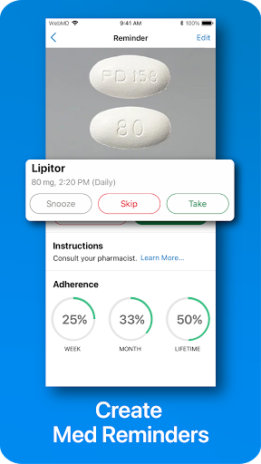
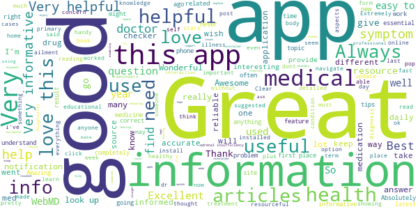
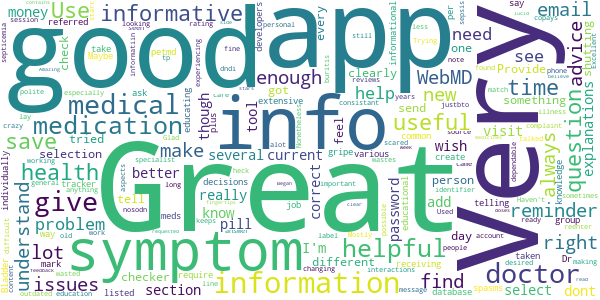
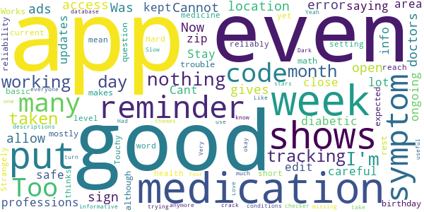
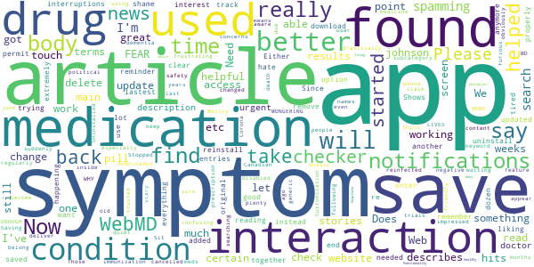
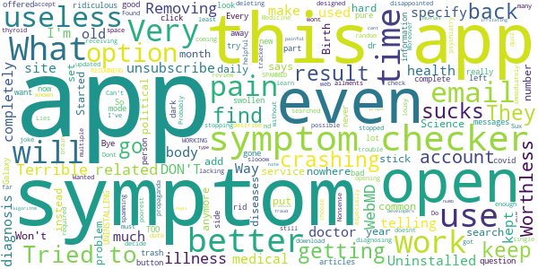

# WebMD: Check Symptoms, Rx Savings, & Find Doctors
App version ``8.5``

Analyzed with [covid-apps-observer](http://github.com/covid-apps-observer) project, version ``0.1``

## App overview
| | |
|-------------------------|-------------------------| 
| **Name**&nbsp;&nbsp;&nbsp;&nbsp;&nbsp;&nbsp;&nbsp;&nbsp;&nbsp;&nbsp;&nbsp;&nbsp;&nbsp;&nbsp;&nbsp;&nbsp;&nbsp;&nbsp;&nbsp;&nbsp;&nbsp;&nbsp;&nbsp;&nbsp;&nbsp;&nbsp;&nbsp;&nbsp;&nbsp;&nbsp;&nbsp;&nbsp;&nbsp;&nbsp;&nbsp;&nbsp;&nbsp;&nbsp;&nbsp;&nbsp;  | WebMD: Check Symptoms, Rx Savings, & Find Doctors |
| **Unique identifier** | com.webmd.android |
| **Link to Google Play** | [https://play.google.com/store/apps/details?id=com.webmd.android](https://play.google.com/store/apps/details?id=com.webmd.android) |
| **Summary**  | Lookup treatments, create med reminders, and get prescription drug discounts. |
| **Privacy policy** | [http://www.webmd.com/about-webmd-policies/about-privacy-policy](http://www.webmd.com/about-webmd-policies/about-privacy-policy) |
| **Latest version** | 8.5 |
| **Last update** | 2021-01-05 18:50:02 |
| **Recent changes** | Performance improvements and bug fixes. |
| **Installs**  | 10,000,000+ |
| **Category** | Medical |
| **First release** | May 6, 2011 |
| **Size**  | 40M |
| **Supported Android version**  | 5.0 and up |

### Description
> ** Coronavirus / COVID-19 Outbreak: Tap the card on our home screen for the latest updates on the 2020 coronavirus outbreak. **
 From WebMD, the one healthcare app you need to check symptoms; learn about conditions and drugs; research treatments and diagnoses; find doctors and specialists in your area; get Rx discounts available at your local pharmacy; and set medication reminders. 
 Key Features: 
 • Symptom Checker – Choose your symptoms, learn about potential conditions or issues, and lookup treatment and care options.
 • Doctor Directory – Find the closest doctors and specialists based on your current location or search by city, state or zip. 
 • WebMD Rx – We partner with major pharmacy chains to find the lowest prescription drug prices, which often beat insurance co-pays. It’s 100% free to use. No registration required.
 • Medication Reminders – Never miss a dose. You’ll receive reminders when it’s time to take your medications. View daily prescription schedules and instructions, plus pill images with dosage and timing information for each drug. 
 • Conditions – Find medically-reviewed information about conditions relevant to you and learn more about causes, treatments, and related symptoms. 
 • Customization and Saving Functionality – Save your conditions, drugs, doctors, hospitals, pharmacies, and healthy living articles for secure, easy access and reference. 
 • Drug Interaction Checker – Find and identify potentially harmful and unsafe combinations of prescription medications by entering two or more drugs in question.
 ABOUT WebMD
 WebMD Health Corp. (Nasdaq: WBMD) is the leading provider of health information services, serving consumers, physicians, healthcare professionals, employers, and health plans through our public and private online portals, mobile platforms and health-focused publications. More than 95 million unique visitors access the WebMD Health Network each month.
 If you are a California resident, California law may provide you with certain rights regarding our use of your personal information. For more information relevant to our users who are California residents, please review the "California Residents" section of our Privacy Policy linked on this download page or within our app.
 The WebMD Health Network includes WebMD Health, Medscape, MedicineNet, emedicineHealth, RxList, theheart.org, drugs.com and Medscape Education.
 SOURCE WebMD Health Corp.
 WebMD. Better Information. Better Health.
 WebMD does not provide medical advice, diagnosis or treatment. Always seek the advice of your physician or other qualified health provider with any questions you may have regarding a medical condition. Never disregard professional medical advice or delay in seeking it because of something you have read on the WebMD mobile application.

### User interface
The developers of the app provide the following screenshots in the Google play store.
| | | |
|:-------------------------:|:-------------------------:|:-------------------------:|
 |   |   |   | 
 |   |   |   | 
 |   |  

## Development team
In the following we report the main information provided by the development team in the Google play store.

| | |
|-------------------------|-------------------------|
| **Developer**  | WebMD, LLC |
| **Website**  | [http://www.webmd.com](http://www.webmd.com) |
| **Email** | android@webmd.net |
| **Physical address**  | - |
| **Other developed apps**  | [https://play.google.com/store/apps/developer?id=WebMD,+LLC](https://play.google.com/store/apps/developer?id=WebMD,+LLC) |

## Android support

| | |
|-------------------------|-------------------------|
| **Declared target Android version**  | - |
| **Effective target Android version**  | - |
| **Minimum supported Android version**  | Lollipop, version 5.0 (API level 21) |
| **Maximum target Android version**  | - |

The larger the difference between the minimum and maximum supported Android versions, the better. A larger difference means a wider audience. For example, old phones have a very low Android version, so a high minimum supported Android version means that the app cannot be used by users with old phones, thus leading to accessibility problems. 

## Requested permissions

In the following we report the complete list of the permissions requested by the app. 

| **Permission** | **Protection level** | **Description** | 
|-------------------------|-------------------------|-------------------------|
 **android.permission ACCESS_COARSE_LOCATION** | :warning:**Dangerous** | Allows an app to access approximate location. 
 **android.permission ACCESS_FINE_LOCATION** | :warning:**Dangerous** | Allows an app to access precise location. 
 **android.permission ACCESS_NETWORK_STATE** | Normal | Allows applications to access information about networks. 
 **android.permission ACCESS_WIFI_STATE** | Normal | Allows applications to access information about Wi-Fi networks. 
 **android.permission CAMERA** | :warning:**Dangerous** | Required to be able to access the camera device. 
 **android.permission FOREGROUND_SERVICE** | Normal | Allows a regular application to use Service.startForeground. 
 **android.permission GET_TASKS** | Deprecated | This constant was deprecated in API level 21. No longer enforced. 
 **android.permission INTERNET** | Normal | Allows applications to open network sockets. 
 **android.permission READ_EXTERNAL_STORAGE** | :warning:**Dangerous** | Allows an application to read from external storage. 
 **android.permission READ_INTERNAL_STORAGE** | - | - 
 **android.permission RECEIVE_BOOT_COMPLETED** | Normal | Allows an application to receive the Intent.ACTION_BOOT_COMPLETED that is broadcast after the system finishes booting. 
 **android.permission REQUEST_IGNORE_BATTERY_OPTIMIZATIONS** | Normal | Permission an application must hold in order to use Settings.ACTION_REQUEST_IGNORE_BATTERY_OPTIMIZATIONS. 
 **android.permission WAKE_LOCK** | Normal | Allows using PowerManager WakeLocks to keep processor from sleeping or screen from dimming. 
 **android.permission WRITE_CONTACTS** | :warning:**Dangerous** | Allows an application to write the user's contacts data. 
 **android.permission WRITE_EXTERNAL_STORAGE** | :warning:**Dangerous** | Allows an application to write to external storage. 
 **android.permission WRITE_INTERNAL_STORAGE** | - | - 
 **com.android.alarm.permission SET_ALARM** | Normal | Allows an application to broadcast an Intent to set an alarm for the user. 
 **com.google.android.c2dm.permission RECEIVE** | - | - 
 **com.google.android.finsky.permission BIND_GET_INSTALL_REFERRER_SERVICE** | - | - 

## Mentioned servers

| **Server** | **Registrant** | **Registrant country** | **Creation date** | 
|-------------------------|-------------------------|-------------------------|-------------------------|
 | xmlpull.org | WhoisGuard, Inc. | PA | 2001-11-26 20:33:08 |
 | zqtk.net | comScore, Inc | :us: US | 2014-06-24 22:24:22 |
 | voicefive.com | VoiceFive, Inc | :us: US | 2000-07-14 19:53:09 |
 | scorecardresearch.com | TMRG, Inc | :us: US | 2007-11-01 18:07:51 |
 | googlesyndication.com | Google LLC | :us: US | 2003-01-21 06:17:24 |
 | google.com | Google LLC | :us: US | 1997-09-15 04:00:00 |
 | googleapis.com | Google LLC | :us: US | 2005-01-25 17:52:26 |
 | omniture.com | Adobe Inc. | :us: US | 2002-03-29 21:33:52 |
 | appboy.com | Braze, Inc. | :us: US | 2008-10-06 23:28:32 |
 | braze.com | Braze, Inc. | :us: US | 2000-01-19 02:18:28 |
 | crashlytics.com | Google LLC | :us: US | 2011-01-21 15:30:40 |
 | googleapis.com | Google LLC | :us: US | 2005-01-25 17:52:26 |
 | gstatic.com | Google LLC | :us: US | 2008-02-11 15:31:25 |
 | doubleclick.net | Google Inc. | :us: US | 1996-01-16 05:00:00 |
 | googleapis.com | Google LLC | :us: US | 2005-01-25 17:52:26 |
 | app-measurement.com | Google LLC | :us: US | 2015-06-19 20:13:31 |
 | stackoverflow.com | Stack Exchange, Inc. | :us: US | 2003-12-26 19:18:07 |
 | webmd.com | WebMD, LLC | :us: US | 1998-04-06 04:00:00 |
 | googleadservices.com | Google LLC | :us: US | 2003-06-19 16:34:53 |
 | tapstream.com | - | PA | 2000-04-26 17:41:17 |
 | akamaihd.net | Akamai Technologies, inc. | :us: US | 2009-09-14 20:35:31 |
 | walgreens.com | Walgreens | :us: US | 1995-05-04 04:00:00 |
 | medscape.com | WebMD, LLC | :us: US | 1999-03-04 05:00:00 |
 | truste.com | TrustArc Inc. | :us: US | 1997-06-13 04:00:00 |
 | trustarc.com | TrustArc Inc. | :us: US | 2012-07-10 18:34:27 |
 | w3.org | W3C | :us: US | 1994-07-06 04:00:00 |
 | xml.org | OASIS Open | :us: US | 1997-02-03 05:00:00 |
 | engagedrx.com | Digital Health Dialog LLC | :us: US | 2012-03-28 14:50:43 |

## Security analysis 

Below we report the main security warnings raised by our execution of the [Androwarn](https://github.com/maaaaz/androwarn) security analysis tool.

**Telephony identifiers leakage**
> - This application reads the MCC+MNC of the provider of the SIM 
> - This application reads the device phone type value 
> - This application reads the numeric name (MCC+MNC) of current registered operator 
> - This application reads the operator name 
> - This application reads the radio technology (network type) currently in use on the device for data transmission 
> - This application reads the unique device ID, i.e the IMEI for GSM and the MEID or ESN for CDMA phones 
> - This application reads the unique subscriber ID, for example, the IMSI for a GSM phone 

**Connection interfaces exfiltration**
> - This application reads details about the currently active data network 
> - This application tries to find out if the currently active data network is metered 

**Telephony services abuse**
> - This application makes phone calls 

**Suspicious connection establishment**
> - This application opens a Socket and connects it to the remote address '' on the 'N/A' port  
> - This application opens a Socket and connects it to the remote address 'Ljava/lang/StringBuilder;->toString()Ljava/lang/String;' on the 'N/A' port  
> - This application opens a Socket and connects it to the remote address 'Ljava/net/Proxy;->type()Ljava/net/Proxy$Type;' on the 'N/A' port  
> - This application opens a Socket and connects it to the remote address 'timeout' on the 'N/A' port  

**Code execution**
> - This application loads a native library: 'v0' 
> - This application executes a UNIX command 
> - This application executes a UNIX command containing this argument: '2' 
> - This application executes a UNIX command containing this argument: '3' 

## User ratings and reviews

Below we provide information about how end users are reacting to the app in terms of ratings and reviews in the Google Play store.

### Ratings

The WebMD: Check Symptoms, Rx Savings, & Find Doctors app has been installed by more than **10000000** times. At this time, **64149** rated the app and its average score is **4.444462**. Below we show the distribution of the ratings across the usual star-based rating of Google Play

:star::star::star::star::star:: 44583

:star::star::star::star:: 11972

:star::star::star:: 2588

:star::star:: 1539

:star:: 3467

### Reviews 

#### 5-star reviews

> I really like this app. Keeps me informed about meds I might switch to or others I might need to take with the ones I am on now. Always like reading the post too. FYI to anyone who is reading this and who made WebMD. I tried to open it and it kept rejecting me. I uninstalled and reinstalled and worked. So if having any problems try it. It's like the last update didn't fully install or install right. Hope that helps someone.  :date: __2021-01-18 19:12:21__

> Very informative app that I use as a primary and secondary resource for medical applications. Used in support of medical disability issues.  :date: __2021-01-17 10:20:57__

> Great for finding out what symptoms can be indicating or treatment at home to help with a illness, injury, or ailment.  :date: __2021-01-08 18:32:21__

> I'm always enjoyment so i recomend to anybody  :date: __2021-01-07 22:43:41__

> Very good  :date: __2021-01-07 11:35:10__

> I really love this app its help me out more way than I would have thought its awesome 👌  :date: __2020-12-29 09:22:08__

> Great app!  :date: __2020-12-10 05:30:14__

> Awesome  :date: __2020-12-09 13:40:18__

> Vomiting nausa weak constapated  :date: __2020-11-30 01:14:34__

> Superb  :date: __2020-11-18 19:54:51__

#### 4-star reviews

> Great info. Use as a medical info on or after receiving new meds and visits to Dr.  :date: __2020-12-14 20:52:12__

> Great health info. My only gripe is the reminder section. I take various medications and have it listed on the reminder section, however you have to select each medication individually to mark it as taken. I wish there was a way to select all at once. Maybe create a group of medications. The medication database is not extensive but have most common ones.  :date: __2020-11-02 17:39:18__

> Very useful app! The symptom tracker is very informational. I use their petmd app also. Great job developers !!  :date: __2020-09-29 04:22:11__

> Find out what your doctor's not telling you.  :date: __2020-09-22 20:06:55__

> Bladder spasms  :date: __2020-08-14 04:39:41__

> It gives good explanations I can understand. Its not medical advice per-say, its more like an educational tool that helps me make better decisions with my health issues plus if I require a doctor visit I know enough to ask the right questions. For me, educating myself enough gives me the knowledge to know I'm being referred to the right specialist. Saves time and less money wasted on copays  :date: __2020-07-25 01:54:21__

> Great info🚑🤗🦋  :date: __2020-07-08 16:35:23__

> Useful.  :date: __2020-07-01 23:21:02__

> I like this app especially for possible interactions,which is very important for me but I had problems making an account  :date: __2020-06-23 22:04:53__

> Very helpful  :date: __2020-06-07 01:14:28__

#### 3-star reviews

> Was a good app. Now won't even open.  :date: __2021-01-08 12:59:01__

> Cannot sign up... Shows error  :date: __2020-12-13 07:36:07__

> Too many ads  :date: __2020-11-16 03:43:46__

> I allow access to my location, it gives me doctors & professions that aren't even close to my area! I put my zip code in & I get nothing! This is ongoing even with updates! Be careful! Stay safe! 😷😷😷😷🙏🏾🙏🏾🙏🏾🙏🏾💜💜💜💜  :date: __2020-10-27 23:37:12__

> Put in symptoms and it just kept saying I'm diabetic which I'm not but it is does have a lot of info  :date: __2020-08-24 06:00:08__

> Cant edit my birthday  :date: __2020-08-07 16:48:00__

> Works mostly as expected; although the medication reminder and tracking has trouble with basic math, which makes me question reliability on rest of the app. The medication tracking reliably shows I have taken 100% of my medicine since setting up the reminder; 100% for the month; but only 88% for the week, and each day shows taken. Strangely, 88% = 7/8 of a week; does this mean the app thinks a week has 8 days? And how can I be 100% for the month, yet not reach that level in the current week.  :date: __2020-07-27 15:57:52__

> Hard to put in my health symptoms. Touchy with even short word descriptions. Like trying to crack a code that you know nothing about.  :date: __2020-07-24 15:02:31__

> Love this app. Very useful. Had to take off 2 stars because the database is missing many medications and conditions.  :date: __2020-06-22 06:31:47__

> Not what it use to be  :date: __2020-06-14 07:40:45__

#### 2-star reviews

> I am tired of trying to read an article of interest and having interruptions that change what am reading and I can't back to the original article. Either permit to read my article to it's end or I will remove this app.  :date: __2021-01-16 15:00:48__

> No notifications after 2 weeks uninstall and reinstall not helped had to download another pill reminder app to track my pills instead shame as webmd is a good app  :date: __2021-01-04 23:04:35__

> This was updated. Since then, I can't save my medications on the check interactions. We use to be able to do that. Save our medications. That helped me a lot. It helped me remember what not to take together. I have about a dozen medications that I take. I was really liking this. The medication you added, was there until you would delete it. Now, that's not a option at all. What's the clear all needed for, if medications don't get saved. Now, I hate it.  :date: __2020-12-30 01:45:09__

> The drug interaction checker not working properly. Says it found 2 interactions but only describes 1.Shows it found 3 interactions but only describes 2...and so on.Does not save my drug interaction entries anymore. Have to re-enter everything,each time I want to check something. This started happening with the lastest update..extremely frustrating  :date: __2020-12-19 19:54:00__

> Need to deliver still waiting on my prescription  :date: __2020-12-03 01:39:54__

> I used to like the WebMD app before its main screen changed so drastically. It's confusing and not as helpful. Those junk news articles belong in a subcategory, not on the main screen. Not impressed. Please change it back to the old one.  :date: __2020-11-09 14:18:03__

> This was a great app especially with the symptoms checker but now that feature doesn't work.  :date: __2020-10-22 15:26:48__

> I've had and trusted the app for years, but about 2 months ago it suddenly started regularly spamming me with notifications with Corona news... Mostly scary and negative stories about people being reinfected, death and about immunization trials being cancelled by johnson and johnson due to safety concerns etc.... WHY ARE YOU SPAMMING ME WITH MORE FEAR MONGERING DON'T WE HAVE ENOUGH FEAR IN OUR LIVES!?!? I'm so furious. Sit on my phone and keep quiet until I need you. Notifications disabled  :date: __2020-10-15 20:02:53__

> I have found that searching for certain terms, such as "dementia", will get no hits inside the app but will get plenty of hits on the WebMD website. I would say that about one-third of the time when I search for a condition or anasic keyword that obviously should get results, I get no results at all. So it would appear that the app does not have access to all of the content found on the Web MD website. To me, this means there is really no point in using the app.  :date: __2020-10-13 20:13:12__

> Notifications have become political. Delete  :date: __2020-10-09 02:43:16__

#### 1-star reviews

> Crashing out of nowhere  :date: __2021-01-20 15:05:35__

> This App is NOT WORKING. Won't even open.  :date: __2021-01-14 16:40:21__

> Keeps crashing, not opening!!  :date: __2021-01-12 20:14:41__

> Worthless account set up designed by a moron  :date: __2021-01-12 03:32:29__

> Started getting political propaganda from web md. Very disappointed. Removing App. They should stick to Science and Medicine.  :date: __2021-01-12 00:22:25__

> Can't even open the app anymore. It just says WebMD has stopped or keeps stopping  :date: __2021-01-09 00:55:32__

> The app just updated and the app will not open.  :date: __2021-01-08 07:03:04__

> Terrible service ..trouble diagnosing problem or illness  :date: __2021-01-05 03:30:52__

> Wanted to learn about possible thyroid problem and got a lousy quiz instead. What a joke!  :date: __2020-12-29 15:58:27__

> many symptoms lacking especially related to brain and psychiatry.  :date: __2020-12-04 19:48:57__

