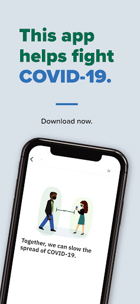
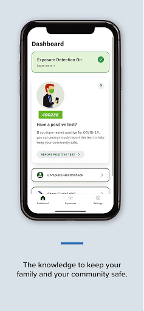
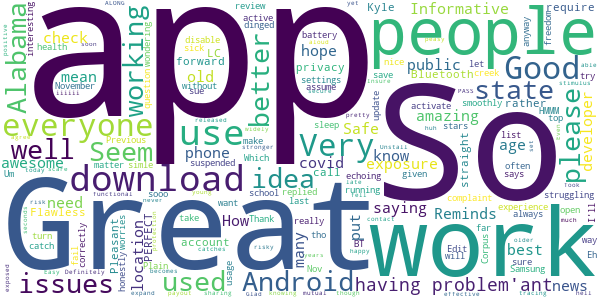

# GuideSafe
App version ``1.10.0``

Analyzed with [covid-apps-observer](http://github.com/covid-apps-observer) project, version ``0.1``

## App overview
| | |
|-------------------------|-------------------------| 
| **Name**&nbsp;&nbsp;&nbsp;&nbsp;&nbsp;&nbsp;&nbsp;&nbsp;&nbsp;&nbsp;&nbsp;&nbsp;&nbsp;&nbsp;&nbsp;&nbsp;&nbsp;&nbsp;&nbsp;&nbsp;&nbsp;&nbsp;&nbsp;&nbsp;&nbsp;&nbsp;&nbsp;&nbsp;&nbsp;&nbsp;&nbsp;&nbsp;&nbsp;&nbsp;&nbsp;&nbsp;&nbsp;&nbsp;&nbsp;&nbsp;  | GuideSafe |
| **Unique identifier** | gov.adph.exposurenotifications |
| **Link to Google Play** | [https://play.google.com/store/apps/details?id=gov.adph.exposurenotifications](https://play.google.com/store/apps/details?id=gov.adph.exposurenotifications) |
| **Summary**  | A future safe from COVID-19 is in all of our hands with Alabama’s GuideSafe app. |
| **Privacy policy** | [https://www.guidesafe.org/privacy-statement/](https://www.guidesafe.org/privacy-statement/) |
| **Latest version** | 1.10.0 |
| **Last update** | 2021-02-03 22:14:14 |
| **Recent changes** | GuideSafe™ has been updated to make the experience easier to protect the health of yourself, your family, your community, and beyond.  Updates include: - Instant exposure checks with a button click - Alignment with updated CDC guidelines on daily exposures - Onboarding and screen design updates for user accessibility - Synchronization with standards used by other states - Support for Version 1.6 exposure notifications - Optional anonymous and aggregated event data sharing for community awareness |
| **Installs**  | 100,000+ |
| **Category** | Medical |
| **First release** | Aug 12, 2020 |
| **Size**  | 64M |
| **Supported Android version**  | 6.0 and up |

### Description
> Use the GuideSafe™ Exposure Notification app to anonymously share a positive COVID-19 test result — and be anonymously notified of your own possible exposure to someone who later reports a positive COVID-19 test result — all without sharing anyone’s identity. The app protects your privacy while giving you the power to protect your health, your family’s and your community’s. 
  
 Using the app is easy: 
 Step one: Download the GuideSafe™ Exposure Notification app and enable Bluetooth. 
 Step two: If you have tested positive for COVID-19, you can choose to report it. Your test will be verified by the Alabama Department of Public Health. 
 Step three: Those who may have been in close contact with you in the last 14 days will be notified they were near someone with a positive test, but they won’t know who or where. Your identity and location remain completely anonymous, and your personal information isn’t disclosed, no matter what. 
  
 Why it’s important 
 Stopping the spread of COVID-19 is essential to helping our communities, schools and businesses reopen and stay open. When someone tests positive for COVID-19, contact tracers with the Alabama Department of Public Health will help notify those the person has been near — but they won’t know every person’s close contacts. The more people who use the app, the better the ability to notify those who have been exposed. 
  
 How it works 
 When you are within about six feet of others, phones using the GuideSafe™ Exposure Notification app exchange encrypted, anonymous codes via low-energy Bluetooth. If you test positive for COVID-19, those with whom you came in close contact — defined as within six feet for at least 15 minutes over the last 14 days — will get an anonymous notification that they were exposed. The notification they get is completely anonymous — they will not know who tested positive, the time, or the location — only the date of the possible exposure. 
  
 Your privacy is our priority 
 The GuideSafe™ Exposure Notification app was developed by the Alabama Department of Public Health in cooperation with the University of Alabama at Birmingham and MotionMobs, using technology from a collaboration between Apple and Google. Users of the app exchange anonymous codes among their phones using Bluetooth — no location data is ever stored or exchanged, and your personal information is never shared.

### User interface
The developers of the app provide the following screenshots in the Google play store.
| | | |
|:-------------------------:|:-------------------------:|:-------------------------:|
 |   |   |   | 

## Development team
In the following we report the main information provided by the development team in the Google play store.

| | |
|-------------------------|-------------------------|
| **Developer**  | Alabama Department of Public Health |
| **Website**  | - |
| **Email** | alabamapublichealth@gmail.com |
| **Physical address**  | [201 Monroe Street Montgomery, Alabama 36104](https://www.google.com/maps/search/201%20Monroe%20Street%20Montgomery,%20Alabama%2036104) (Google Maps) |
| **Other developed apps**  | [https://play.google.com/store/apps/developer?id=Alabama+Department+of+Public+Health](https://play.google.com/store/apps/developer?id=Alabama+Department+of+Public+Health) |

## Android support

| | |
|-------------------------|-------------------------|
| **Declared target Android version**  | - |
| **Effective target Android version**  | - |
| **Minimum supported Android version**  | Marshmallow, version 6.0 (API level 23) |
| **Maximum target Android version**  | - |

The larger the difference between the minimum and maximum supported Android versions, the better. A larger difference means a wider audience. For example, old phones have a very low Android version, so a high minimum supported Android version means that the app cannot be used by users with old phones, thus leading to accessibility problems. 

## Requested permissions

In the following we report the complete list of the permissions requested by the app. 

| **Permission** | **Protection level** | **Description** | 
|-------------------------|-------------------------|-------------------------|
 **android.permission ACCESS_NETWORK_STATE** | Normal | Allows applications to access information about networks. 
 **android.permission ACCESS_WIFI_STATE** | Normal | Allows applications to access information about Wi-Fi networks. 
 **android.permission BLUETOOTH** | Normal | Allows applications to connect to paired bluetooth devices. 
 **android.permission FOREGROUND_SERVICE** | Normal | Allows a regular application to use Service.startForeground. 
 **android.permission INTERNET** | Normal | Allows applications to open network sockets. 
 **android.permission RECEIVE_BOOT_COMPLETED** | Normal | Allows an application to receive the Intent.ACTION_BOOT_COMPLETED that is broadcast after the system finishes booting. 
 **android.permission VIBRATE** | Normal | Allows access to the vibrator. 
 **android.permission WAKE_LOCK** | Normal | Allows using PowerManager WakeLocks to keep processor from sleeping or screen from dimming. 

## Mentioned servers

| **Server** | **Registrant** | **Registrant country** | **Creation date** | 
|-------------------------|-------------------------|-------------------------|-------------------------|
 | bugsnag.com | Bugsnag Inc. | GB | 2011-08-18 03:26:10 |
 | android.com | Google LLC | :us: US | 1997-06-23 04:00:00 |
 | google.com | Google LLC | :us: US | 1997-09-15 04:00:00 |
 | windows.net | Microsoft Corporation | :us: US | 1995-08-10 04:00:00 |
 | github.com | GitHub, Inc. | :us: US | 2007-10-09 18:20:50 |
 | azure-api.net | Microsoft Corporation | :us: US | 2014-01-09 14:55:23 |

## Security analysis 

Below we report the main security warnings raised by our execution of the [Androwarn](https://github.com/maaaaz/androwarn) security analysis tool.

**Telephony identifiers leakage**
> - This application reads the numeric name (MCC+MNC) of current registered operator 
> - This application reads the operator name 

**Connection interfaces exfiltration**
> - This application reads details about the currently active data network 
> - This application tries to find out if the currently active data network is metered 

**Suspicious connection establishment**
> - This application opens a Socket and connects it to the remote address 'Ljava/lang/StringBuilder;->toString()Ljava/lang/String;' on the ': connect, resolve' port  
> - This application opens a Socket and connects it to the remote address 'Ljava/lang/StringBuilder;->toString()Ljava/lang/String;' on the 'N/A' port  
> - This application opens a Socket and connects it to the remote address 'Ljava/net/Proxy;->type()Ljava/net/Proxy$Type;' on the 'N/A' port  
> - This application opens a Socket and connects it to the remote address 'No route to  ' on the 'N/A' port  
> - This application opens a Socket and connects it to the remote address 'timeout' on the 'N/A' port  

**Pim data leakage**
> - This application accesses data stored in the clipboard 

**Code execution**
> - This application loads a native library 
> - This application executes a UNIX command 

## User ratings and reviews

Below we provide information about how end users are reacting to the app in terms of ratings and reviews in the Google Play store.

### Ratings

The GuideSafe app has been installed by more than **100000** times. At this time, **309** rated the app and its average score is **3.5294118**. Below we show the distribution of the ratings across the usual star-based rating of Google Play

:star::star::star::star::star:: 161

:star::star::star::star:: 24

:star::star::star:: 24

:star::star:: 18

:star:: 82

### Reviews 

#### 5-star reviews

> How to my account privacy from public  :date: __2021-06-28 19:10:45__

> Kyle call me please  :date: __2021-06-24 17:35:27__

> Informative  :date: __2021-05-19 22:10:43__

> great  :date: __2021-05-19 03:22:35__

> Good  :date: __2021-05-06 17:36:26__

> Great to have  :date: __2021-04-17 18:11:47__

> 🤳? having a problem'ant🤳? having a problem'ant🤳? having a problem'ant  :date: __2021-04-16 18:57:46__

> Works great. I like how it does not require my location but rather issues Bluetooth.  :date: __2021-04-13 16:06:11__

> 🌨️🏌️🐾🤫  :date: __2021-04-02 16:15:27__

> Great App  :date: __2021-03-26 23:19:44__

#### 4-star reviews

> Were going to get in touch  :date: __2021-02-19 03:09:38__

> Seems to be fixed. My confidence is renewed!  :date: __2021-02-13 00:05:05__

> They should add something for the blind site challenge  :date: __2020-12-22 14:23:39__

> Haven't actually tried it out,but the idea it self is brilliant. If everything play the part being identified I will give you five.  :date: __2020-12-21 13:33:27__

> When trying to report test results, it only says "Server Failure" and won't allow them to be reported. Makes me very skeptical about others being able to report positive tests and alert others. This app has one very important function and it's failing to do its one job.  :date: __2020-12-04 00:17:48__

> The app itself was easy enough to set up. I think most of the issues people are having with this all is not understanding it won't work as accurately if more people don't use it, and people not understanding how the technology works. I will continue to use the app and update my review later.  :date: __2020-11-27 07:41:56__

> The Whole Problem With This Is Unless Everyone Uses App Kinda Useless Because No Matter How Many People I Try To Educate On The Importance Of Everyone Doing This No One Sees The Importance ! Needs To Be Mandatory !  :date: __2020-11-23 03:04:20__

> Just started the app.  :date: __2020-11-04 21:03:09__

> Ok  :date: __2020-10-18 23:44:48__

> It works  :date: __2020-10-11 15:57:28__

#### 3-star reviews

> I give it 3 stars because you do not have any way to show that the person has had inoculation against Covid-19.  :date: __2021-05-27 05:43:51__

> I don't know, I haven't been around enough people to make sure. Even though, how would I know if they have the app?  :date: __2021-05-04 04:55:17__

> This application worked fine however, I found it to be very intrusive. It requires Bluetooth to function. I use Bluetooth to remotely manage my computer, every time the app needed to take a reading I would lose my connection with my computer and then have to physically establish connection again between phone and computer.  :date: __2021-04-16 18:37:30__

> I'm giving it a three stars on this particular phone because it is going off like crazy and I'm not even leaving the house I here by myself & I haven't left the house in weeks. It's just eating my battery up going off constantly like... there it goes again... It's going off about every 30 seconds If it works or not, like I said, I usually stay home. But I love the idea & I don't understand people not using it. Everybody's got to do their part and then some.  :date: __2021-04-01 17:48:23__

> Good  :date: __2021-03-23 04:15:11__

> Works sometimes  :date: __2021-03-20 01:55:29__

> Ballz in ya mouth 👄👄  :date: __2021-03-16 06:21:44__

> Its not working on my Droid  :date: __2021-02-07 04:03:52__

> The app has not sent since November 26. Devs, please advise  :date: __2021-01-21 17:55:40__

> I just wish more people used it. I kinda feel like it is not useful since people have to opt in for each aspect... BUT I will keep using it as long as this pandemic drags on. Update: This app is a fail. :( Very disappointed but not surprised at this point. It just stopped updating early Dec. Then 2 days ago it locked my phone up downloading. I had to force close & uninstall to stop it from locking up my phone. I wish this worked better.  :date: __2021-01-01 15:38:52__

#### 2-star reviews

> We  :date: __2021-06-21 18:34:29__

> Plays a notification tone when checking for exposures, even when it doesn't find any, making you look at your phone for no reason.  :date: __2021-05-15 00:22:25__

> It keep restarting. I love the outlook and long term visionary goals. Its a great asset if no problems  :date: __2021-04-07 02:57:31__

> As others have stated, when first downloaded this past fall, it notified me of possible exposures. However since December 16, it has been inactive. I have restarted the phone, checked and updated settings, still it shows Dec 16. I was really excited about this app only to be disappointed after a few months.  :date: __2021-01-30 01:52:12__

> My last update is from December 17th, 2020. I don't see an option to manually refresh/check.  :date: __2021-01-24 22:08:22__

> App is not "CHECKING " on a daily basis. Last time checked shows December 13??  :date: __2021-01-18 18:15:29__

> I THINK this works but I've never been notified of an exposure. I see notifications of contact trace downloads but the app constantly says it's never checked for exposure so I can't be sure it's doing any good.  :date: __2021-01-15 23:54:09__

> Doesn't seem to work. My wife and I both have this installed. She tested positive, I went through the process of telling the app she was positive. And I never received a notification that I had been exposed. I noticed that her bluetooth was off. I turned it back on, waited a couple of days and tried the notification process again and verified that her bluetooth was still on. I still didn't get an exposure notification. I've been a big advocate for this technology... Why isn't it working?  :date: __2020-12-18 13:58:55__

> App questionnaire requires email verification, but doesn't work, so don't bother. If that basic feature does not work then how can you rely on it to correctly perform contact tracing?! This is not an in consequential function. Get it right!  :date: __2020-09-29 19:27:11__

> It would work better if more people had it on their phones.  :date: __2020-08-18 18:54:55__

#### 1-star reviews

> App does absolutely nothing except use battery. I understand that people have to identify themselves, but no one does which make the app pointless, unfortunately.  :date: __2021-05-11 05:39:50__

> Waste of time and space. It just never took off.  :date: __2021-05-10 06:59:54__

> I tested positive for Covid-19 on February 12, 2021, too bad this stupid app will only allow users to report they tested positive as far back as March 17, 2021! How useless is that! Covid can & DOES stick around in SOME people (such as myself!) for longer than one month which is as far back as this app's devs think anyone using it could've POSSIBLY tested positive - because everyone KNOWS Covid has only been around for the past month, right devs?! If that is so screwed then whole app's FUBARED!!  :date: __2021-04-15 04:56:38__

> Stop spamming me about the Asian flu. I don't want your app so stop telling me to download this  :date: __2021-04-13 19:18:38__

> OMG worst app, sucked my battery life just after turning on location. It disconnected my wifi after turning on location as well. Uninstalled. Worthless.  :date: __2021-04-04 21:04:41__

> Sucks  :date: __2021-04-01 03:14:17__

> Contact tracing does not work when the incubation eriod is so long as with covid-19  :date: __2021-03-26 14:22:28__

> Contact tracing is useless on a disease with such a long incubation time  :date: __2021-03-23 17:56:40__

> Dont need a app to tell when someone is sick  :date: __2021-03-23 15:37:09__

> i want to install it 😭 but i dont have gigabites and i only have 1 app installed so sad  :date: __2021-03-02 23:08:46__

