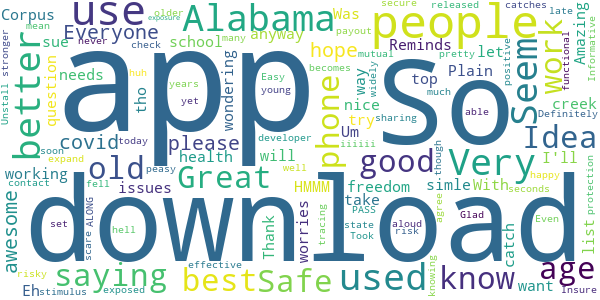
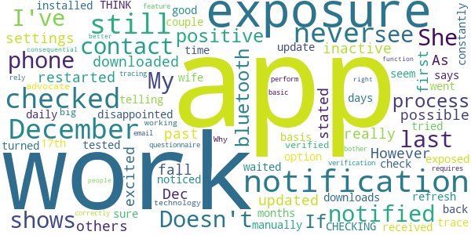
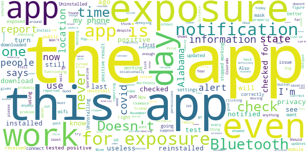

# GuideSafe
App version ``v1.3``

Analyzed with [covid-apps-observer](http://github.com/covid-apps-observer) project, version ``0.1``

## App overview
| | |
|-------------------------|-------------------------| 
| **Name**&nbsp;&nbsp;&nbsp;&nbsp;&nbsp;&nbsp;&nbsp;&nbsp;&nbsp;&nbsp;&nbsp;&nbsp;&nbsp;&nbsp;&nbsp;&nbsp;&nbsp;&nbsp;&nbsp;&nbsp;&nbsp;&nbsp;&nbsp;&nbsp;&nbsp;&nbsp;&nbsp;&nbsp;&nbsp;&nbsp;&nbsp;&nbsp;&nbsp;&nbsp;&nbsp;&nbsp;&nbsp;&nbsp;&nbsp;&nbsp;  | GuideSafe |
| **Unique identifier** | gov.adph.exposurenotifications |
| **Link to Google Play** | [https://play.google.com/store/apps/details?id=gov.adph.exposurenotifications](https://play.google.com/store/apps/details?id=gov.adph.exposurenotifications) |
| **Summary**  | A future safe from COVID-19 is in all of our hands with Alabama’s GuideSafe app. |
| **Privacy policy** | [https://www.guidesafe.org/privacy-statement/](https://www.guidesafe.org/privacy-statement/) |
| **Latest version** | v1.3 |
| **Last update** | 2020-09-11 17:33:27 |
| **Recent changes** | Spread the app, not COVID. For this version of the GuideSafe™ app, we&#39;ve made some minor improvements to help you better understand exposure dates and what to do if you receive an exposure. |
| **Installs**  | 50,000+ |
| **Category** | Medical |
| **First release** | Aug 12, 2020 |
| **Size**  | 2.3M |
| **Supported Android version**  | 7.0 and up |

### Description
> Use the GuideSafe™ Exposure Notification app to anonymously share a positive COVID-19 test result — and be anonymously notified of your own possible exposure to someone who later reports a positive COVID-19 test result — all without sharing anyone’s identity. The app protects your privacy while giving you the power to protect your health, your family’s and your community’s. 
  
 Using the app is easy: 
 Step one: Download the GuideSafe™ Exposure Notification app and enable Bluetooth. 
 Step two: If you have tested positive for COVID-19, you can choose to report it. Your test will be verified by the Alabama Department of Public Health. 
 Step three: Those who may have been in close contact with you in the last 14 days will be notified they were near someone with a positive test, but they won’t know who or where. Your identity and location remain completely anonymous, and your personal information isn’t disclosed, no matter what. 
  
 Why it’s important 
 Stopping the spread of COVID-19 is essential to helping our communities, schools and businesses reopen and stay open. When someone tests positive for COVID-19, contact tracers with the Alabama Department of Public Health will help notify those the person has been near — but they won’t know every person’s close contacts. The more people who use the app, the better the ability to notify those who have been exposed. 
  
 How it works 
 When you are within about six feet of others, phones using the GuideSafe™ Exposure Notification app exchange encrypted, anonymous codes via low-energy Bluetooth. If you test positive for COVID-19, those with whom you came in close contact — defined as within six feet for at least 15 minutes over the last 14 days — will get an anonymous notification that they were exposed. The notification they get is completely anonymous — they will not know who tested positive, the time, or the location — only the date of the possible exposure. 
  
 Your privacy is our priority 
 The GuideSafe™ Exposure Notification app was developed by the Alabama Department of Public Health in cooperation with the University of Alabama at Birmingham and MotionMobs, using technology from a collaboration between Apple and Google. Users of the app exchange anonymous codes among their phones using Bluetooth — no location data is ever stored or exchanged, and your personal information is never shared.

### User interface
The developers of the app provide the following screenshots in the Google play store.
| | | |
|:-------------------------:|:-------------------------:|:-------------------------:|
 |   |   |   | 

## Development team
In the following we report the main information provided by the development team in the Google play store.

| | |
|-------------------------|-------------------------|
| **Developer**  | Alabama Department of Public Health |
| **Website**  | - |
| **Email** | alabamapublichealth@gmail.com |
| **Physical address**  | [201 Monroe Street Montgomery, Alabama 36104](https://www.google.com/maps/search/201%20Monroe%20Street%20Montgomery,%20Alabama%2036104) (Google Maps) |
| **Other developed apps**  | [https://play.google.com/store/apps/developer?id=Alabama+Department+of+Public+Health](https://play.google.com/store/apps/developer?id=Alabama+Department+of+Public+Health) |

## Android support

| | |
|-------------------------|-------------------------|
| **Declared target Android version**  | Android10, version 10 (API level 29) |
| **Effective target Android version**  | Android10, version 10 (API level 29) |
| **Minimum supported Android version**  | Nougat, version 7.0 (API level 24) |
| **Maximum target Android version**  | - |

The larger the difference between the minimum and maximum supported Android versions, the better. A larger difference means a wider audience. For example, old phones have a very low Android version, so a high minimum supported Android version means that the app cannot be used by users with old phones, thus leading to accessibility problems. 

## Requested permissions

In the following we report the complete list of the permissions requested by the app. 

| **Permission** | **Protection level** | **Description** | 
|-------------------------|-------------------------|-------------------------|
 **android.permission ACCESS_NETWORK_STATE** | Normal | Allows applications to access information about networks. 
 **android.permission BLUETOOTH** | Normal | Allows applications to connect to paired bluetooth devices. 
 **android.permission FOREGROUND_SERVICE** | Normal | Allows a regular application to use Service.startForeground. 
 **android.permission INTERNET** | Normal | Allows applications to open network sockets. 
 **android.permission RECEIVE_BOOT_COMPLETED** | Normal | Allows an application to receive the Intent.ACTION_BOOT_COMPLETED that is broadcast after the system finishes booting. 
 **android.permission WAKE_LOCK** | Normal | Allows using PowerManager WakeLocks to keep processor from sleeping or screen from dimming. 

## Mentioned servers

| **Server** | **Registrant** | **Registrant country** | **Creation date** | 
|-------------------------|-------------------------|-------------------------|-------------------------|
 | guidesafe.org | Contact Privacy Inc. Customer 1247737132 | :canada: CA | 2020-07-18 15:39:08 |
 | azure-api.net | Microsoft Corporation | :us: US | 2014-01-09 14:55:23 |
 | google.com | Google LLC | :us: US | 1997-09-15 04:00:00 |
 | googleapis.com | Google LLC | :us: US | 2005-01-25 17:52:26 |
 | azureedge.net | Microsoft Corporation | :us: US | 2014-01-22 16:14:52 |

## Security analysis 

Below we report the main security warnings raised by our execution of the [Androwarn](https://github.com/maaaaz/androwarn) security analysis tool.

**Connection interfaces exfiltration**
> - This application reads details about the currently active data network 
> - This application tries to find out if the currently active data network is metered 

**Suspicious connection establishment**
> - This application opens a Socket and connects it to the remote address ': ; port is out of range' on the 'N/A' port  
> - This application opens a Socket and connects it to the remote address 'Lg/a/a/a/a;->c(Ljava/lang/String;)Ljava/lang/StringBuilder;' on the 'N/A' port  
> - This application opens a Socket and connects it to the remote address 'Ljava/net/Proxy;->type()Ljava/net/Proxy$Type;' on the 'N/A' port  
> - This application opens a Socket and connects it to the remote address 'timeout' on the 'N/A' port  

## User ratings and reviews

Below we provide information about how end users are reacting to the app in terms of ratings and reviews in the Google Play store.

### Ratings

The GuideSafe app has been installed by more than **50000** times. At this time, **127** rated the app and its average score is **3.3**. Below we show the distribution of the ratings across the usual star-based rating of Google Play

:star::star::star::star::star:: 59

:star::star::star::star:: 11

:star::star::star:: 9

:star::star:: 6

:star:: 42

### Reviews 

#### 5-star reviews

> Amazing  :date: __2020-11-12 13:16:22__

> Eh Um.... HMMM 1# question tho why this app 4 all the phone's?.. Just wondering...  :date: __2020-10-27 02:22:20__

> Be. Safe  :date: __2020-10-16 04:11:57__

> I don't know it want let me download it  :date: __2020-10-13 18:44:15__

> Very nice  :date: __2020-10-13 18:03:47__

> Good app  :date: __2020-10-13 01:25:16__

> Great Idea. Thank you. It is at the top of my list of worries. With my age and health issues.  :date: __2020-10-11 21:28:21__

> Everyone in Alabama needs to download this. It doesn't work at all. If you catch covid and use this app you get to sue the developer as well as the state of Alabama. Definitely a better payout than a stimulus check.  :date: __2020-10-11 16:41:29__

> We need this in society, this would help us a lot in America. Although all the comments say it's not accurate, but the reason I posted a five star review is because if they update this to work properly then everyone can at least consider using this to reduce Covid-19.  :date: __2020-10-11 06:04:06__

> Informative !!  :date: __2020-10-11 04:00:56__

#### 4-star reviews

> Just started the app.  :date: __2020-11-04 21:03:09__

> Ok  :date: __2020-10-18 23:44:48__

> It works  :date: __2020-10-11 15:57:28__

> No issues. Does this share exposure notifications with the other notification apps or only with users of this app?  :date: __2020-08-23 14:57:47__

> No issues downloading. I agree with a previous review, it would be more useful if it was utilized by more people. But i do feel better that this tool is avaliable! Thanks.  :date: __2020-08-18 14:39:51__

#### 3-star reviews

> I just wish more people used it. I kinda feel like it is not useful since people have to opt in for each aspect... BUT I will keep using it as long as this pandemic drags on.  :date: __2020-11-10 14:09:40__

> Giving a 3 star review now because I've not used this app on an Android device. I have both Android and iPhone devices. Upon reading reviews of when using on Android devices, as opposed to iPhone devices, I know my iPhone works in real time notifications. Update was recently done on this application, so I'm going to give it a try. He!l, in reality even it notifying a few days later is better than NOT BEING NOTIFIED AT ALL. I will update with a comparison review. Stay safe, do the right thing masks don't hurt ya, and vote. Truly, Your Fellow American  :date: __2020-10-12 15:50:41__

> Works but Annoyed - had this for UAB support, though it kept saying I had been exposed, the problem my phone was charging at the time it said the exposure happened on 2 different days at the same time of day (late Sunday evenings) I didn't go anywhere during those timeframes. It has to be binging off one of my neighbors but I had to quarantine and not attend classes. I've now removed it.  :date: __2020-10-04 08:18:57__

> Easy to use.  :date: __2020-08-18 01:12:50__

#### 2-star reviews

> App questionnaire requires email verification, but doesn't work, so don't bother. If that basic feature does not work then how can you rely on it to correctly perform contact tracing?! This is not an in consequential function. Get it right!  :date: __2020-09-29 19:27:11__

> It would work better if more people had it on their phones.  :date: __2020-08-18 18:54:55__

#### 1-star reviews

> This is of no use if health providers do not turn in the information. No.one will actually do it and YES..then there is Hippa..  :date: __2020-11-08 16:58:36__

> I just can't figure out out bc I know as many places as I have been lately I must have had some kind of course contact somewhere and haven't received 1 alert, just everything about it is confusing I don't even know if I'm even logged in correctly or whatever you're supposed to do.. Hence being clueless  :date: __2020-11-08 13:15:03__

> Don't work  :date: __2020-10-29 11:31:00__

> Not accurate in the least!!!! Good intentions, but poorly executed.  :date: __2020-10-26 12:50:39__

> 10/25/2020 complete and total invasion of our privacy.  :date: __2020-10-25 16:48:19__

> The absolute state of Pandemic politicization. Hear me now: I don't fear the plague. I fear the government and private sector for whom their belief in synthetic solutions divide us from our rights like a the wake of a speedboat.  :date: __2020-10-25 02:09:41__

> I have this app with Bluetooth on. I have found out I've been exposed and they have the app... and crickets. Nothing.  :date: __2020-10-25 01:36:04__

> I live in Colorado, reading a local news story and this app pops up, annoying on that level, but moving on, I'm like heck yeah, I want to be informed about Covid locally. As the app is installing it shows it's for Alabama?!?!? How does that help me in Colorado? Pop ups are annoying to begin with, but if you're going to do it, at least get the state correct. If you can't get that right, I'm not going to put a lot of stock in your other life changing information.  :date: __2020-10-23 23:58:20__

> I can't reactivate after updated. Now after I check permissions boxes when I click on enable it says "Internal e0rror, please try again."  :date: __2020-10-23 09:31:08__

> Won't work  :date: __2020-10-22 22:47:15__

