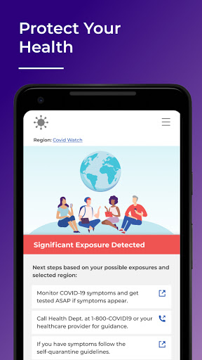
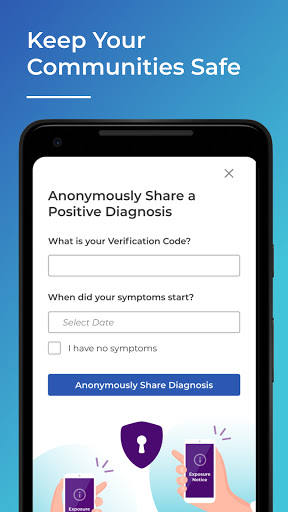
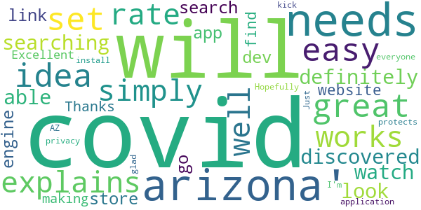
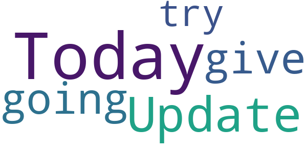
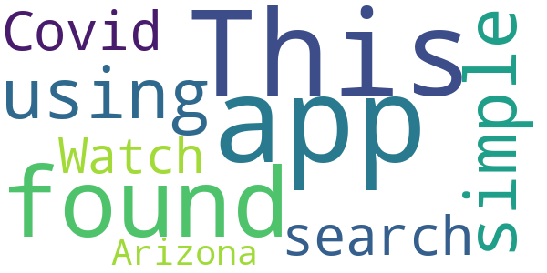
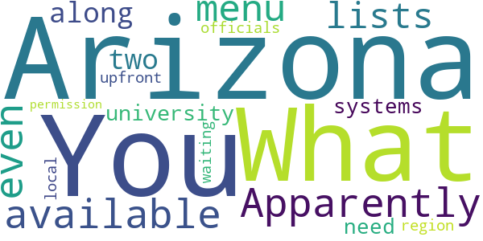

# Covid Watch Arizona
App version ``1.0.25``

Analyzed with [covid-apps-observer](http://github.com/covid-apps-observer) project, version ``0.1``

## App overview
| | |
|-------------------------|-------------------------| 
| **Name**&nbsp;&nbsp;&nbsp;&nbsp;&nbsp;&nbsp;&nbsp;&nbsp;&nbsp;&nbsp;&nbsp;&nbsp;&nbsp;&nbsp;&nbsp;&nbsp;&nbsp;&nbsp;&nbsp;&nbsp;&nbsp;&nbsp;&nbsp;&nbsp;&nbsp;&nbsp;&nbsp;&nbsp;&nbsp;&nbsp;&nbsp;&nbsp;&nbsp;&nbsp;&nbsp;&nbsp;&nbsp;&nbsp;&nbsp;&nbsp;  | Covid Watch Arizona |
| **Unique identifier** | gov.azdhs.covidwatch.android |
| **Link to Google Play** | [https://play.google.com/store/apps/details?id=gov.azdhs.covidwatch.android](https://play.google.com/store/apps/details?id=gov.azdhs.covidwatch.android) |
| **Summary**  | Help stop COVID-19 in Arizona |
| **Privacy policy** | [https://azdhs.gov/documents/privacy-policy/covid-watch-application-privacy-policy.pdf](https://azdhs.gov/documents/privacy-policy/covid-watch-application-privacy-policy.pdf) |
| **Latest version** | 1.0.25 |
| **Last update** | 2020-09-03 21:39:49 |
| **Recent changes** | - Add better support for the Font size and display size accessibility options. - Minor fixes and improvements. |
| **Installs**  | 1,000+ |
| **Category** | Medical |
| **First release** | Aug 19, 2020 |
| **Size**  | 13M |
| **Supported Android version**  | 6.0 and up |

### Description
> Let your smartphone notify you to potential exposure to COVID-19–using fully anonymous Bluetooth signals–and help stop the spread of coronavirus in Arizona.
 Get peace of mind by taking this small step and start rebuilding trust in your community – install this free app, released in partnership with the Arizona Department of Health Services (ADHS).
 Once you opt-in and enable exposure notification on your phone, Covid Watch works in the background, automatically detecting if you come into close proximity with someone else, without tracking you by GPS or ever revealing any personal data.
  
 The more people participate, the more effective we can be. Encourage your friends, family, and colleagues to install Covid Watch today. Members of the following campus communities can access a customized version of the app: 
 • University of Arizona
 • Northern Arizona University 
 Provided by Covid Watch, an Arizona non-profit organization dedicated to your health and privacy.

### User interface
The developers of the app provide the following screenshots in the Google play store.
| | | |
|:-------------------------:|:-------------------------:|:-------------------------:|
 |   |   |   | 
 |   |  

## Development team
In the following we report the main information provided by the development team in the Google play store.

| | |
|-------------------------|-------------------------|
| **Developer**  | ADHS-Arizona Department of Health Services |
| **Website**  | [https://covidwatch.org](https://covidwatch.org) |
| **Email** | contact@covidwatch.org |
| **Physical address**  | [150 N 18TH AVE](https://www.google.com/maps/search/150%20N%2018TH%20AVE) (Google Maps) |
| **Other developed apps**  | [https://play.google.com/store/apps/developer?id=ADHS-Arizona+Department+of+Health+Services](https://play.google.com/store/apps/developer?id=ADHS-Arizona+Department+of+Health+Services) |

## Android support

| | |
|-------------------------|-------------------------|
| **Declared target Android version**  | Android10, version 10 (API level 29) |
| **Effective target Android version**  | Android10, version 10 (API level 29) |
| **Minimum supported Android version**  | Marshmallow, version 6.0 (API level 23) |
| **Maximum target Android version**  | - |

The larger the difference between the minimum and maximum supported Android versions, the better. A larger difference means a wider audience. For example, old phones have a very low Android version, so a high minimum supported Android version means that the app cannot be used by users with old phones, thus leading to accessibility problems. 

## Requested permissions

In the following we report the complete list of the permissions requested by the app. 

| **Permission** | **Protection level** | **Description** | 
|-------------------------|-------------------------|-------------------------|
 **android.permission ACCESS_NETWORK_STATE** | Normal | Allows applications to access information about networks. 
 **android.permission BLUETOOTH** | Normal | Allows applications to connect to paired bluetooth devices. 
 **android.permission FOREGROUND_SERVICE** | Normal | Allows a regular application to use Service.startForeground. 
 **android.permission INTERNET** | Normal | Allows applications to open network sockets. 
 **android.permission RECEIVE_BOOT_COMPLETED** | Normal | Allows an application to receive the Intent.ACTION_BOOT_COMPLETED that is broadcast after the system finishes booting. 
 **android.permission WAKE_LOCK** | Normal | Allows using PowerManager WakeLocks to keep processor from sleeping or screen from dimming. 

## Mentioned servers

| **Server** | **Registrant** | **Registrant country** | **Creation date** | 
|-------------------------|-------------------------|-------------------------|-------------------------|
 | google.com | Google LLC | :us: US | 1997-09-15 04:00:00 |
 | googleapis.com | Google LLC | :us: US | 2005-01-25 17:52:26 |
 | covidwatch.org | Contact Privacy Inc. Customer 1247431163 | :canada: CA | 2020-03-01 18:20:50 |
 | arizona.edu | University of Arizona | - | 1986-01-23 00:00:00 |
 | nau.edu | Northern Arizona University | - | 1989-08-14 00:00:00 |
 | googleapis.com | Google LLC | :us: US | 2005-01-25 17:52:26 |

## Security analysis 

Below we report the main security warnings raised by our execution of the [Androwarn](https://github.com/maaaaz/androwarn) security analysis tool.

**Connection interfaces exfiltration**
> - This application reads details about the currently active data network 
> - This application tries to find out if the currently active data network is metered 

**Telephony services abuse**
> - This application makes phone calls 

**Suspicious connection establishment**
> - This application opens a Socket and connects it to the remote address ' returned no addresses for  ; port is out of range' on the 'N/A' port  
> - This application opens a Socket and connects it to the remote address '' on the 'N/A' port  
> - This application opens a Socket and connects it to the remote address 'Ljava/lang/StringBuilder;->toString()Ljava/lang/String;' on the 'N/A' port  
> - This application opens a Socket and connects it to the remote address 'Ljava/net/Proxy;->type()Ljava/net/Proxy$Type;' on the 'N/A' port  
> - This application opens a Socket and connects it to the remote address 'timeout' on the 'N/A' port  

## User ratings and reviews

Below we provide information about how end users are reacting to the app in terms of ratings and reviews in the Google Play store.

### Ratings

The Covid Watch Arizona app has been installed by more than **1000** times. At this time, **21** rated the app and its average score is **4.3809524**. Below we show the distribution of the ratings across the usual star-based rating of Google Play

:star::star::star::star::star:: 15

:star::star::star::star:: 3

:star::star::star:: 1

:star::star:: 0

:star:: 2

### Reviews 

#### 5-star reviews

> The idea is great/it is easy to set up/explains how it works well. I will rate 5 simply for that. It definitely needs to be able to be discovered by searching 'covid arizona' or 'covid watch arizona'. I had to look it up on a search engine then go through an app store link on the dev's website to find it.  :date: __2020-09-11 05:38:37__

> Thanks for making this!  :date: __2020-09-10 10:11:21__

> Excellent application !  :date: __2020-08-24 13:16:53__

> Just what AZ needs to kick the covid! Hopefully everyone will install. I'm glad it protects privacy.  :date: __2020-08-19 20:42:29__

#### 4-star reviews

> Today Update  :date: __2020-09-08 20:52:33__

> I am going to give this a try  :date: __2020-09-02 08:55:19__

#### 3-star reviews

> This app can't be found using a simple search for "Covid Watch Arizona".  :date: __2020-08-26 04:58:02__

#### 2-star reviews

No recent reviews available with 2 stars.

#### 1-star reviews

> Apparently, it's not available in for most of Arizona even if the menu lists Arizona along with two university systems. You need to be upfront about this. What "region" am I in and what "local" officials are you waiting for permission from?  :date: __2020-09-05 21:40:37__

