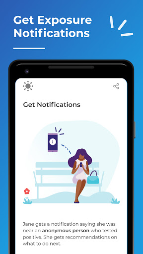
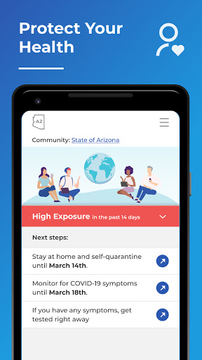
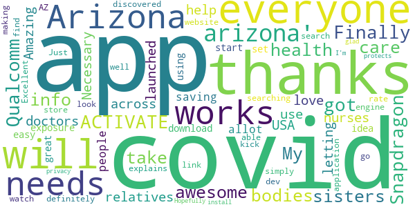
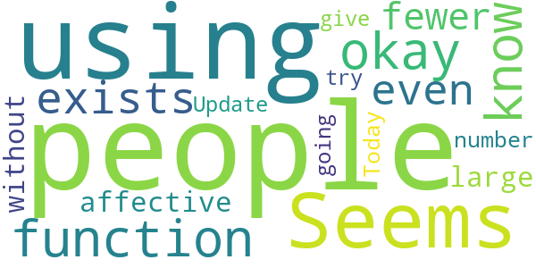
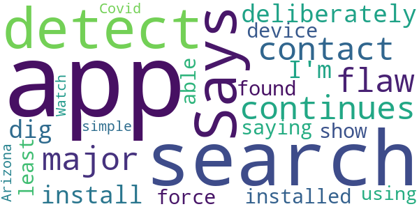
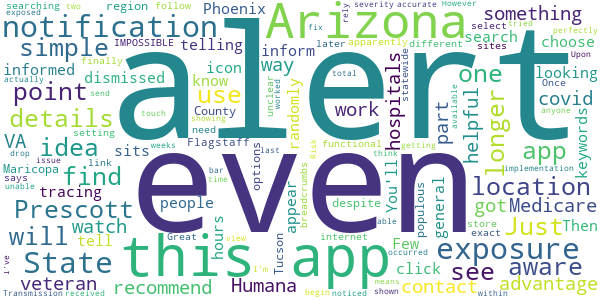
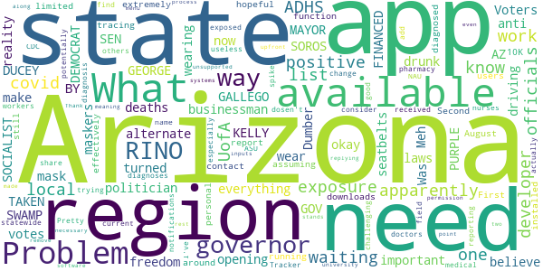

# Covid Watch Arizona
App version ``2.1.2``

Analyzed with [covid-apps-observer](http://github.com/covid-apps-observer) project, version ``0.1``

## App overview
| | |
|-------------------------|-------------------------| 
| **Name**                                          | Covid Watch Arizona |
| **Unique identifier** | gov.azdhs.covidwatch.android |
| **Link to Google Play** | [https://play.google.com/store/apps/details?id=gov.azdhs.covidwatch.android](https://play.google.com/store/apps/details?id=gov.azdhs.covidwatch.android) |
| **Summary**  | Help stop COVID-19 in Arizona |
| **Privacy policy** | [https://azdhs.gov/documents/privacy-policy/covid-watch-application-privacy-policy.pdf](https://azdhs.gov/documents/privacy-policy/covid-watch-application-privacy-policy.pdf) |
| **Latest version** | 2.1.2 |
| **Last update** | 2021-04-09 18:38:14 |
| **Recent changes** | We have been busy making major improvements!   Here’s what’s new: Statewide Vaccination Support! Get access to the most reliable and up-to-date information on how to get a vaccine within your selected county or organization. |
| **Installs**  | 10,000+ |
| **Category** | Medical |
| **First release** | Aug 19, 2020 |
| **Size**  | 7.8M |
| **Supported Android version**  | 6.0 and up |

### Description
> Let your smartphone notify you of potential exposure to COVID-19—using fully anonymous Bluetooth signals—and help stop the spread of coronavirus throughout the state Arizona.
 NEW Vaccine Support: In a single tap, you can easily access the most up-to-date and reliable information on how to get a vaccine within your chosen community.
 Get peace of mind and start rebuilding trust in your community with just one small step: Install this free app, released in partnership with the Arizona Department of Health Services (ADHS).
 Once you opt-in and enable exposure notifications on your phone, Covid Watch starts working immediately to detect if you come into close proximity with someone who has tested positive for COVID-19. The app is completely anonymous and works in the background without ever needing to know your location or personal information. It’s simple, safe, and secure.
 The more people who download the app, the more effective we can be. We have now extended support statewide, so encourage your friends, family, and colleagues to install Covid Watch today. Together, we can slow the spread of COVID-19.
 Provided by Covid Watch, an Arizona non-profit organization dedicated to your health and privacy.WeHealth is a public benefit corporation and the developer of Covid Watch Arizona.

### User interface
The developers of the app provide the following screenshots in the Google play store.
| | | |
|:-------------------------:|:-------------------------:|:-------------------------:|
 |   |   |   | 
 |   |   |   | 

## Development team
In the following we report the main information provided by the development team in the Google play store.

| | |
|-------------------------|-------------------------|
| **Developer**  | ADHS-Arizona Department of Health Services |
| **Website**  | [https://covidwatch.org](https://covidwatch.org) |
| **Email** | contact@covidwatch.org |
| **Physical address**  | [150 N 18TH AVE](https://www.google.com/maps/search/150%20N%2018TH%20AVE) (Google Maps) |
| **Other developed apps**  | [https://play.google.com/store/apps/developer?id=ADHS-Arizona+Department+of+Health+Services](https://play.google.com/store/apps/developer?id=ADHS-Arizona+Department+of+Health+Services) |

## Android support

| | |
|-------------------------|-------------------------|
| **Declared target Android version**  | - |
| **Effective target Android version**  | - |
| **Minimum supported Android version**  | Marshmallow, version 6.0 (API level 23) |
| **Maximum target Android version**  | - |

The larger the difference between the minimum and maximum supported Android versions, the better. A larger difference means a wider audience. For example, old phones have a very low Android version, so a high minimum supported Android version means that the app cannot be used by users with old phones, thus leading to accessibility problems. 

## Requested permissions

In the following we report the complete list of the permissions requested by the app. 

| **Permission** | **Protection level** | **Description** | 
|-------------------------|-------------------------|-------------------------|
 **android.permission ACCESS_NETWORK_STATE** | Normal | Allows applications to access information about networks. 
 **android.permission BLUETOOTH** | Normal | Allows applications to connect to paired bluetooth devices. 
 **android.permission FOREGROUND_SERVICE** | Normal | Allows a regular application to use Service.startForeground. 
 **android.permission INTERNET** | Normal | Allows applications to open network sockets. 
 **android.permission RECEIVE_BOOT_COMPLETED** | Normal | Allows an application to receive the Intent.ACTION_BOOT_COMPLETED that is broadcast after the system finishes booting. 
 **android.permission WAKE_LOCK** | Normal | Allows using PowerManager WakeLocks to keep processor from sleeping or screen from dimming. 
 **com.google.android.finsky.permission BIND_GET_INSTALL_REFERRER_SERVICE** | - | - 

## Mentioned servers

| **Server** | **Registrant** | **Registrant country** | **Creation date** | 
|-------------------------|-------------------------|-------------------------|-------------------------|
 | wehealth.org | Domains By Proxy, LLC | :us: US | 2017-07-17 14:30:24 |
 | google.com | Google LLC | :us: US | 1997-09-15 04:00:00 |
 | googlesyndication.com | Google LLC | :us: US | 2003-01-21 06:17:24 |
 | googleadservices.com | Google LLC | :us: US | 2003-06-19 16:34:53 |
 | app-measurement.com | Google LLC | :us: US | 2015-06-19 20:13:31 |
 | covidwatch.org | Contact Privacy Inc. Customer 1247431163 | :canada: CA | 2020-03-01 18:20:50 |

## Security analysis 

Below we report the main security warnings raised by our execution of the [Androwarn](https://github.com/maaaaz/androwarn) security analysis tool.

**Connection interfaces exfiltration**
> - This application reads details about the currently active data network 
> - This application tries to find out if the currently active data network is metered 

**Telephony services abuse**
> - This application makes phone calls 

**Suspicious connection establishment**
> - This application opens a Socket and connects it to the remote address '' on the '80' port  
> - This application opens a Socket and connects it to the remote address '; port is out of range' on the 'N/A' port  
> - This application opens a Socket and connects it to the remote address 'Ljava/net/Proxy;->type()Ljava/net/Proxy$Type;' on the 'N/A' port  
> - This application opens a Socket and connects it to the remote address 'Lm/a/a/a/a;->k(Ljava/lang/String;)Ljava/lang/StringBuilder;' on the 'N/A' port  
> - This application opens a Socket and connects it to the remote address 'timeout' on the 'N/A' port  

## User ratings and reviews

Below we provide information about how end users are reacting to the app in terms of ratings and reviews in the Google Play store.

### Ratings

The Covid Watch Arizona app has been installed by more than **10000** times. At this time, **64** rated the app and its average score is **3.90625**. Below we show the distribution of the ratings across the usual star-based rating of Google Play

:star::star::star::star::star:: 38

:star::star::star::star:: 7

:star::star::star:: 4

:star::star:: 5

:star:: 10

### Reviews 

#### 5-star reviews

> Qualcomm & Snapdragon ACTIVATE  :date: __2021-04-04 10:08:32__

> Finally they got Arizona down  :date: __2021-03-30 21:18:21__

> It's awesome for info for me and any bodies health and take care of yourself too.thanks for the app it works for everyone else. My sisters and relatives are doctors and nurses and thanks for letting me use this app.  :date: __2021-03-30 10:09:09__

> Necessary  :date: __2020-12-03 06:41:57__

> The app is Amazing and I love it. This should be launched across USA and it will help in saving allot of people from exposure of Covid-19. Everyone in Arizona should download and start using it.  :date: __2020-10-06 13:43:59__

> The idea is great/it is easy to set up/explains how it works well. I will rate 5 simply for that. It definitely needs to be able to be discovered by searching 'covid arizona' or 'covid watch arizona'. I had to look it up on a search engine then go through an app store link on the dev's website to find it.  :date: __2020-09-11 05:38:37__

> Thanks for making this!  :date: __2020-09-10 10:11:21__

> Excellent application !  :date: __2020-08-24 13:16:53__

> Just what AZ needs to kick the covid! Hopefully everyone will install. I'm glad it protects privacy.  :date: __2020-08-19 20:42:29__

#### 4-star reviews

> Seems to function okay but very few people know it exists and even fewer are using it. It can't be all that affective without a large number of people using it.  :date: __2021-02-08 19:48:02__

> Today Update  :date: __2020-09-08 20:52:33__

> I am going to give this a try  :date: __2020-09-02 08:55:19__

#### 3-star reviews

> Says it can't detect if it continues contact app...  :date: __2020-12-20 16:04:55__

> It's a major flaw to have to deliberately dig for this and install. I'm not saying it should be force installed on any device but it should at /least/ be able to show up in a search 🙃  :date: __2020-10-09 02:43:42__

> This app can't be found using a simple search for "Covid Watch Arizona".  :date: __2020-08-26 04:58:02__

#### 2-star reviews

> Just something I just got from doing the covid-19 watch but being a veteran I have no and I use the VA I have no idea what way we can use it to my advantage I also have Humana for Medicare and they're not part of it so what do you recommend  :date: __2021-04-01 06:27:20__

> Not even the hospitals where i work at are aware of this app.  :date: __2021-03-07 16:49:46__

> I don't see how this app can be helpful at all for contact tracing. Few people in Arizona I know are aware of this app, and even if they're informed about it, it doesn't even appear in a general search with keywords. Then it will randomly inform you that you have a notification and, when you click to find out what it is, it will tell you that you have no notifications. You'll have an icon that sits in your notifications for 12 hours telling you that it's looking for exposures that can't be dismissed. Also, you can't even choose Phoenix nor Maricopa County as your location despite that being the most populous region of the state; your options are Tucson, Flagstaff, and "State of Arizona" which apparently isn't even functional.  :date: __2021-01-13 20:07:20__

> Great idea but unclear. IMPOSSIBLE to find by simple searching for it in the app store. I had to follow internet breadcrumbs over the different sites to finally get a link to the exact app. Once here, while setting up, you need to select your location, one of which is "State of Arizona". But later it says that statewide implementation means that you can get alerts, but not alert anyone else. So if I'm in Prescott, and no one in Prescott can actually send an alert, what is the point????  :date: __2020-10-06 19:06:36__

> This app worked perfectly for me to begin with. Upon getting an exposure alert, I was able to view the details and severity with a simple touch. However, within the last two weeks, I noticed when I received an alert, I am unable to see the details. I am shown when it occurred, but the drop down bar showing the Transmission Risk and total time exposed is no longer available. I've tried all I can think to fix the issue, but at this point, I can no longer rely on it for accurate exposure alerts.  :date: __2020-09-25 01:17:53__

#### 1-star reviews

> Meh! Problem is not with the app, problem is with the state of Arizona. The state and it's governor are anti maskers. The governor is a businessman turned politician so opening up everything is more important than deaths. Voters believe in a alternate reality freedom. It's okay to have laws about drunk driving, and wearing seatbelts but make them wear a mask and you won't get their votes.  :date: __2021-04-13 04:56:21__

> ARIZONA SWAMP - GOV DUCEY RINO ; MAYOR GALLEGO SOCIALIST AND SEN. M KELLY DEMOCRAT FINANCED BY GEORGE SOROS. PURPLE RINO'S HAVE TAKEN AZ.  :date: __2021-04-10 10:33:45__

> Dumber now  :date: __2021-04-04 12:24:03__

> Was hopeful for this, but this app is *extremely* limited. With only around 10K downloads (assuming these are still installed and running), there's no way it can function effectively for contact tracing. First, this had apparently been available since August 2020? No one knows about this app. Second, there needs to be a way for users to report their own exposures to those diagnosed covid positive, not just personal diagnoses - consider medical field workers: doctors, nurses, pharmacy.  :date: __2021-03-05 20:29:24__

> I know I've been potentially exposed and have received no exposure notifications  :date: __2021-01-30 19:11:05__

> Pretty useless since statewide reporting is not available for the app. Need to change the name to UofA/ASU COVID Tracker since they're the only regions that actually work.  :date: __2020-12-16 16:06:21__

> This app only works for UofA & NAU and isn't on the CDC's list so trying to find it is challenging. What are the developers waiting for, especially with the current spike in Arizona? It dosen't do any good to share this with others if no one can add there positive diagnosis in an unsupported region (meaning the rest of the state).  :date: __2020-11-23 16:02:59__

> Apparently, it's not available in for most of Arizona even if the menu lists Arizona along with two university systems. You need to be upfront about this. What "region" am I in and what "local" officials are you waiting for permission from? Thank you, ADHS, for replying on 10/09/20, but my point stands. There's no State of Arizona region and you need to remove that until ADHS, state and local officials, and your software developer have all made their necessary inputs to this process.  :date: __2020-10-19 03:19:06__

