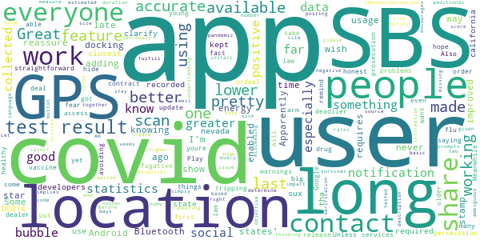

# CA Notify
App version ``minted14020``

Analyzed with [covid-apps-observer](http://github.com/covid-apps-observer) project, version ``0.1``

## App overview
| | |
|-------------------------|-------------------------| 
| **Name**&nbsp;&nbsp;&nbsp;&nbsp;&nbsp;&nbsp;&nbsp;&nbsp;&nbsp;&nbsp;&nbsp;&nbsp;&nbsp;&nbsp;&nbsp;&nbsp;&nbsp;&nbsp;&nbsp;&nbsp;&nbsp;&nbsp;&nbsp;&nbsp;&nbsp;&nbsp;&nbsp;&nbsp;&nbsp;&nbsp;&nbsp;&nbsp;&nbsp;&nbsp;&nbsp;&nbsp;&nbsp;&nbsp;&nbsp;&nbsp;  | CA Notify |
| **Unique identifier** | gov.ca.covid19.exposurenotifications |
| **Link to Google Play** | [https://play.google.com/store/apps/details?id=gov.ca.covid19.exposurenotifications](https://play.google.com/store/apps/details?id=gov.ca.covid19.exposurenotifications) |
| **Summary**  | CA Notify is the official Exposure Notification app for California |
| **Privacy policy** | [https://covid19.ca.gov/notify-privacy/](https://covid19.ca.gov/notify-privacy/) |
| **Latest version** | minted14020 |
| **Last update** | 2020-12-12 00:14:15 |
| **Recent changes** | Bug fixes and performance improvements |
| **Installs**  | 100,000+ |
| **Category** | Medical |
| **First release** | Dec 7, 2020 |
| **Size**  | 10M |
| **Supported Android version**  | 5.0 and up |

### Description
> CA Notify is the official COVID-19 exposure notification app of California, supported by the California Department of Public Health (CDPH). The app was developed using the Google Apple Exposure Notification API through a collaboration between Google, Apple, California Department of Technology, CDPH and the University of California.
 CA Notify can help slow the spread of COVID-19. It supports both local contact tracing efforts and the State’s COVID-19 prevention program. Using CA Notify is voluntary and free of charge. The more people who install and use it, the more effective it will be.
 Once you install and activate CA Notify and turn on Bluetooth, the app works in the background and exchanges anonymous keys with other devices. (Keys are long random strings of characters that are not tied to any personal information.) Devices with the app installed will record the keys generated by other devices nearby. The app will record the signal strength, used to estimate the distance between devices, the duration and date of the exposure. To protect the users’ privacy, these keys are only kept on the user’s own device. After 14 days the keys are deleted.
 If a CA Notify user tests positive for COVID-19, they will be able to obtain a verification code that allows them to activate the notification function in the app. Other app users will receive a notification of possible exposure if they were within six feet for a total of 15 minutes or more when the infected person may have been contagious. Anyone who receives a notification can then follow the guidance in the app to find out what to do next.
 You must use the verification code to report a positive result via the app. This prevents people from falsely reporting positive results, which could generate false exposure notifications. CDPH wants all app users to feel confident that when they receive a COVID-19 exposure notification through the app, it is a verified message.
 How CA Notify Protects Your Privacy:
 CDPH takes your privacy and confidentiality very seriously. This is why we chose to use the Apple and Google Exposure Notification API. No personal data or location tracking occurs in this app. In fact, there is no need for CDPH to know where you are or who you are with for CA Notify to work. If you are close enough to another app user, the Bluetooth technology will share signals with that user. The CA Notify Privacy Policy is available at https://covid19.ca.gov/notify-privacy.
 Laboratory results for all persons who test positive (cases) for COVID-19 are routinely sent to public health authorities in California to support disease control activities such as case investigation and contact tracing. This process is independent of the app. Local public health authorities use information from  laboratory reports to follow up with cases to give them guidance and identify those they may have exposed.
 Thank you for downloading CA Notify! California can stop the spread.  You have the power to help your family, friends, and community.

### User interface
The developers of the app provide the following screenshots in the Google play store.
| | | |
|:-------------------------:|:-------------------------:|:-------------------------:|
 |   |  

## Development team
In the following we report the main information provided by the development team in the Google play store.

| | |
|-------------------------|-------------------------|
| **Developer**  | CA Dept of Technology |
| **Website**  | - |
| **Email** | ucsd-mychart.voicemails@ctg.com |
| **Physical address**  | - |
| **Other developed apps**  | [https://play.google.com/store/apps/developer?id=CA+Dept+of+Technology](https://play.google.com/store/apps/developer?id=CA+Dept+of+Technology) |

## Android support

| | |
|-------------------------|-------------------------|
| **Declared target Android version**  | - |
| **Effective target Android version**  | - |
| **Minimum supported Android version**  | Lollipop, version 5.0 (API level 21) |
| **Maximum target Android version**  | - |

The larger the difference between the minimum and maximum supported Android versions, the better. A larger difference means a wider audience. For example, old phones have a very low Android version, so a high minimum supported Android version means that the app cannot be used by users with old phones, thus leading to accessibility problems. 

## Requested permissions

In the following we report the complete list of the permissions requested by the app. 

| **Permission** | **Protection level** | **Description** | 
|-------------------------|-------------------------|-------------------------|
 **android.permission ACCESS_NETWORK_STATE** | Normal | Allows applications to access information about networks. 
 **android.permission BLUETOOTH** | Normal | Allows applications to connect to paired bluetooth devices. 
 **android.permission FOREGROUND_SERVICE** | Normal | Allows a regular application to use Service.startForeground. 
 **android.permission INTERNET** | Normal | Allows applications to open network sockets. 
 **android.permission RECEIVE_BOOT_COMPLETED** | Normal | Allows an application to receive the Intent.ACTION_BOOT_COMPLETED that is broadcast after the system finishes booting. 
 **android.permission WAKE_LOCK** | Normal | Allows using PowerManager WakeLocks to keep processor from sleeping or screen from dimming. 

## Mentioned servers

| **Server** | **Registrant** | **Registrant country** | **Creation date** | 
|-------------------------|-------------------------|-------------------------|-------------------------|
 | google.com | Google LLC | :us: US | 1997-09-15 04:00:00 |

## Security analysis 

Below we report the main security warnings raised by our execution of the [Androwarn](https://github.com/maaaaz/androwarn) security analysis tool.

**Telephony identifiers leakage**
> - This application reads the ISO country code equivalent of the current registered operator's MCC (Mobile Country Code) 

**Connection interfaces exfiltration**
> - This application reads details about the currently active data network 
> - This application tries to find out if the currently active data network is metered 

**Suspicious connection establishment**
> - This application opens a Socket and connects it to the remote address 'timeout' on the 'N/A' port  

**Code execution**
> - This application loads a native library: 'prioclient' 

## User ratings and reviews

Below we provide information about how end users are reacting to the app in terms of ratings and reviews in the Google Play store.

### Ratings

The CA Notify app has been installed by more than **100000** times. At this time, **282** rated the app and its average score is **4.22293**. Below we show the distribution of the ratings across the usual star-based rating of Google Play

:star::star::star::star::star:: 203

:star::star::star::star:: 18

:star::star::star:: 18

:star::star:: 7

:star:: 36

### Reviews 

#### 5-star reviews

> Happy to have it  :date: __2020-12-28 02:47:36__

> Very comforting just to know...  :date: __2020-12-26 04:03:57__

> Very helpful  :date: __2020-12-25 07:59:47__

> Is a Great App. It could save your Life  :date: __2020-12-25 03:16:14__

> I know nothing about this app but keep up the good work  :date: __2020-12-25 02:41:56__

> WelCome & Thanks 😊 !!! AMEN 🙏 !!!  :date: __2020-12-24 17:59:23__

> Fine  :date: __2020-12-24 12:42:58__

> It's Help to stop this virus covid-19.  :date: __2020-12-24 00:46:18__

> Most needed tool for all devices. Stay safe.  :date: __2020-12-23 07:06:12__

> I choose something over my own type and its called feeling over nothing that i would stand together defenceless  :date: __2020-12-23 01:37:15__

#### 4-star reviews

> Great Covid-19 app  :date: __2020-12-22 00:59:37__

> I wish this app had been made available long ago, but better late than never. I'm docking 1 star because there is no way of knowing if it is working. Some other states' apps show the time stamp from the last scan. This app would be improved by adding such a feature to reassure the users that it is working. About GPS- Apparently Android 6+ requires GPS enabled to do a lower energy usage Bluetooth scan. The developers should clarify tha GPS is required, but that location isn't recorded or kept.  :date: __2020-12-21 19:56:05__

> DD214  :date: __2020-12-16 09:20:04__

> The nevada one sux so I had to use an app made by the closest state to me (california). 🤷‍♀️🤷‍♂️🙃  :date: __2020-12-15 12:09:10__

> The app is pretty straightforward not that many problems but they could do better things and have more people using it.  :date: __2020-12-14 22:25:55__

> And will everyone be honest if they in fact contract it? Out of fear of persecution? I hope for the sake of all, we are. AND for everyone tripping on the location ordeal, they have to be able to access the location in order to release accurate warnings. Unless youre a drug dealer, or a fugative on the lam avoiding prosecution from the long arm of the law, what's the big deal? You have something to hide? This is about the greater good, its not only all about you.  :date: __2020-12-14 21:14:27__

> Notifications didn't work at first, but I got a notification saying update Google Play services and now it works. Meanwhile, I want to remind everyone that covid is deadlier than the flu, especially since there's no vaccine available yet. Also, even if you're young and healthy, you could come into contact with people who are older or immunocompromised, who could get pretty sick. So it's good to know if you have covid so you can stay at home. Let's work together to end this pandemic sooner!  :date: __2020-12-13 04:12:10__

> Before posting statistics on survival rates, please cite the source of your data and have a basic understanding of STATISTICS. The data collected is essential to combating the virus. You can't measure what you don't know!  :date: __2020-12-11 21:23:48__

> I was thinking a great additional feature to this app would be to create a "social bubble score" (SBS) with the information collected during the last 14 days. If every user had an SBS based on the number and duration of contacts with other users this would help people determine a more accurate estimated size of their social bubble. Contact with users with a higher SBS would obviously have a greater impact than users with a lower SBS.  :date: __2020-12-11 21:15:16__

> Easy to install  :date: __2020-12-11 05:28:16__

#### 3-star reviews

> It would be helpful if you gave one some kind of feedback about how well it is working. E.g. how many unique bluetooth connectors today? How many were to phones running the app? And how many positives.  :date: __2020-12-27 22:57:43__

> Edit: I got a notification today. I could notify others, but the app doesnt let you know if the notification went through or not. Maybe this app works for others, but I tested positive for COVID-19 a few days ago, called the number that they suggested, and I still havent received a verification code to allow me to report my case to others. I like the idea of this app, but I have proof of a positive case, yet I still cannot report it to the app  :date: __2020-12-22 03:40:58__

> Hard to rate cause it is dependent upon others downloading the app, keeping their bluetooth on and advising if they are diagnosed as having covid.  :date: __2020-12-20 21:51:05__

> Three stars based on there's no way to know if it actually works as described. Docked two stars because all info leading up to the launch said no GPS necessary for it to work. When I checked the APP after installation, text plainly stated "Notification OFF; no notification until GPS Location turned on" (--paraphrasing) So I will see if there's any affect on battery life; if severe or annoying, may uninstall. Don't worry though; i never go anywhere!  :date: __2020-12-18 23:34:56__

> App reports it used 0% battery however the system status showed bluetooth used 34% of the battery. That never happened prior to installing this app  :date: __2020-12-17 23:58:46__

> Rated 3 stars for the following reasons. 1) This app assumes the person who tested positive will actually enter the code. 2) The person who tested positive is dumb enuph to not self quarantine and knowingly risk exposing others.  :date: __2020-12-13 10:26:26__

> Not sure it actually works. I work at a business that has had multiple positive Covid-19 tests...and this app hasn't pinged a single one.  :date: __2020-12-12 07:16:37__

> Okay  :date: __2020-12-11 19:28:58__

> Im concerened by the fact that I can be hacked through bluetooth. Luckily not everyone is walking around hacking, but still...  :date: __2020-12-11 03:14:54__

> So if someone tests positive, they download the app and enter in the health provider code so others with the app are notified? Shouldn't someone who tests positive be quarantining at home? Why would this app be useful to anyone? If someone is positive and doesn't stay at home, what's the likelihood they are going to install this app? Is an antibody test considered positive or just pcr? The only way would be to retroactively notify previous contact when you find out you are positive.  :date: __2020-12-11 02:36:55__

#### 2-star reviews

> This app needs the option to report if you have been near another user running this app but not tested positive so you can verify the app is actually doing something. Right now it just sits there and we "Assumbe" its working.  :date: __2020-12-25 15:29:26__

> I'm not sure yet I'm not sure yet  :date: __2020-12-20 20:51:58__

> Giving this a 2 for intent, my Android version doesn't work. My roomie's version on iPhone works fine. Is there a setting that I can check? Please help app developers.  :date: __2020-12-18 22:07:04__

> Must be the official Plan-Demic App  :date: __2020-12-18 08:52:44__

> I don't understand?  :date: __2020-12-15 07:38:41__

> Battery Draining App. Had to charge my phone multiple times a day. Decided to uninstall app for above reason. Even though, I uninstalled app I keep getting notifications....asking me to install it again. I feel like it is invading my privacy and spamming me at this point. Avoid it. Do not recommend.  :date: __2020-12-15 02:07:09__

> I have already downloaded the app but I keep getting the notification to downloaded the app. This is getting very annoying it makes me want to either uninstall or turn off the notifications which will defeat the purpose of this campaign. Please fix.  :date: __2020-12-14 21:15:19__

> Why share your location and the details within the ads states in order to work location is nessasary to be on ? Too much  :date: __2020-12-14 20:22:38__

> The news reported it uses bluetooth but you actually have to have GPS on. :( boo  :date: __2020-12-13 01:31:18__

> Installation and operation seems very straightforward... However I will not consistently use this because it *requires* my location services (GPS) to be enabled. The documentation and press releases all claim that the application doesn't use your location. So... What's up with the GPS requirement? If GPS was used solely for this application I would consider leaving it enabled, but so many other services/Apps on my phone use this information in ways I would prefer not to participate in.  :date: __2020-12-12 19:22:07__

#### 1-star reviews

> I just don't understand how will I be notified if someone else around me has covid-19 because the app doesn't show me or alert me so basically I need to know how does it work.  :date: __2020-12-28 04:00:41__

> Unable to turn on notification. Got error message "Something went wrong. Try again." Update: I uninstalled, re-downloaded, re-installed a couple of times. Still unable to turn on notification. More update: I am pretty good with computers and phones, yet I still cannot activate. No wonder this pandemic is out of control. Now I question the accuracy of the information even for those who succeeded in activating the software. Uninstalled. Cannot download again. I am blocked!!!  :date: __2020-12-27 17:39:06__

> Can't give anything lower then 1 star, app sucks I've had it for 2 months, working in a hospital and I have never gotten a notification of any kind.  :date: __2020-12-27 08:06:47__

> Can't use it as it needs Blutooth.  :date: __2020-12-27 07:43:09__

> This app is just a notch above useless. It does require gps, it also requires you opt in and report a positive test result for covid-19. <--- here's the biggest problem, lots of users report not receiving the code... That you must call for, wait through long recorded messages and often get code that doesn't work. On top of that, how many will get that far? Even use this app? Out of that many, who would use it, enter positive code then not self quarantine and expose others to notify app? Duhhhm  :date: __2020-12-27 06:46:12__

> The pitfall of this app is the verification process. I know people who test positive for covid and tried to report it via app, but couldn't because they need a verification code. If you want more people to use the app, stop making reporters jump through hoops to notify others.  :date: __2020-12-27 02:40:30__

> Doesn't work my friends tested Positive never got notified  :date: __2020-12-27 02:04:02__

> I couldn't notify because I don't have a code the I supposed get by txt  :date: __2020-12-26 15:53:09__

> I have Covid-19 and there is no way to get one of the "magical" codes to alert others that might have been around me. I thought the point of this app was to help with contact tracing if you test positive. I don't know how people can be notified of your positive results if you can't tell the app that you are positive. Useless.  :date: __2020-12-26 05:48:30__

> The day I installed this app my battery started draining like crazy. No other changes made. Make sense since it likely pings your GPS often. Uninstaller it but the battery drain remains. Regretful. And unfortunate since the idea of the app is fantastic  :date: __2020-12-26 04:31:12__

