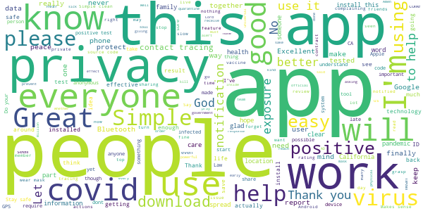
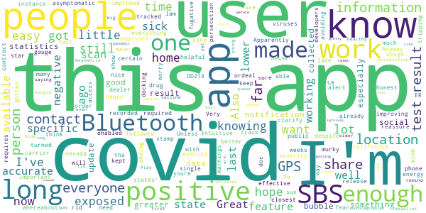
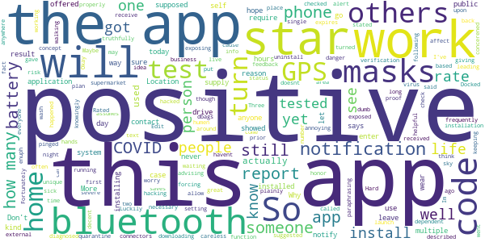
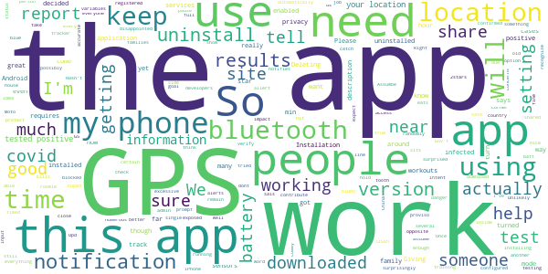

# CA Notify
App version ``minted141007``

Analyzed with [covid-apps-observer](http://github.com/covid-apps-observer) project, version ``0.1``

## App overview
| | |
|-------------------------|-------------------------| 
| **Name**&nbsp;&nbsp;&nbsp;&nbsp;&nbsp;&nbsp;&nbsp;&nbsp;&nbsp;&nbsp;&nbsp;&nbsp;&nbsp;&nbsp;&nbsp;&nbsp;&nbsp;&nbsp;&nbsp;&nbsp;&nbsp;&nbsp;&nbsp;&nbsp;&nbsp;&nbsp;&nbsp;&nbsp;&nbsp;&nbsp;&nbsp;&nbsp;&nbsp;&nbsp;&nbsp;&nbsp;&nbsp;&nbsp;&nbsp;&nbsp;  | CA Notify |
| **Unique identifier** | gov.ca.covid19.exposurenotifications |
| **Link to Google Play** | [https://play.google.com/store/apps/details?id=gov.ca.covid19.exposurenotifications](https://play.google.com/store/apps/details?id=gov.ca.covid19.exposurenotifications) |
| **Summary**  | CA Notify is the official Exposure Notification app for California |
| **Privacy policy** | [https://covid19.ca.gov/notify-privacy/](https://covid19.ca.gov/notify-privacy/) |
| **Latest version** | minted141007 |
| **Last update** | 2020-12-22 20:49:42 |
| **Recent changes** | Bug fixes and performance improvements |
| **Installs**  | 500,000+ |
| **Category** | Medical |
| **First release** | Dec 7, 2020 |
| **Size**  | 10M |
| **Supported Android version**  | 5.0 and up |

### Description
> CA Notify is the official COVID-19 exposure notification app of California, supported by the California Department of Public Health (CDPH). The app was developed using the Google Apple Exposure Notification API through a collaboration between Google, Apple, California Department of Technology, CDPH and the University of California.
 CA Notify can help slow the spread of COVID-19. It supports both local contact tracing efforts and the State’s COVID-19 prevention program. Using CA Notify is voluntary and free of charge. The more people who install and use it, the more effective it will be.
 Once you install and activate CA Notify and turn on Bluetooth, the app works in the background and exchanges anonymous keys with other devices. (Keys are long random strings of characters that are not tied to any personal information.) Devices with the app installed will record the keys generated by other devices nearby. The app will record the signal strength, used to estimate the distance between devices, the duration and date of the exposure. To protect the users’ privacy, these keys are only kept on the user’s own device. After 14 days the keys are deleted.
 If a CA Notify user tests positive for COVID-19, they will be able to obtain a verification code that allows them to activate the notification function in the app. Other app users will receive a notification of possible exposure if they were within six feet for a total of 15 minutes or more when the infected person may have been contagious. Anyone who receives a notification can then follow the guidance in the app to find out what to do next.
 You must use the verification code to report a positive result via the app. This prevents people from falsely reporting positive results, which could generate false exposure notifications. CDPH wants all app users to feel confident that when they receive a COVID-19 exposure notification through the app, it is a verified message.
 How CA Notify Protects Your Privacy:
 CDPH takes your privacy and confidentiality very seriously. This is why we chose to use the Apple and Google Exposure Notification API. No personal data or location tracking occurs in this app. In fact, there is no need for CDPH to know where you are or who you are with for CA Notify to work. If you are close enough to another app user, the Bluetooth technology will share signals with that user. The CA Notify Privacy Policy is available at https://covid19.ca.gov/notify-privacy.
 Laboratory results for all persons who test positive (cases) for COVID-19 are routinely sent to public health authorities in California to support disease control activities such as case investigation and contact tracing. This process is independent of the app. Local public health authorities use information from  laboratory reports to follow up with cases to give them guidance and identify those they may have exposed.
 Thank you for downloading CA Notify! California can stop the spread.  You have the power to help your family, friends, and community.

### User interface
The developers of the app provide the following screenshots in the Google play store.
| | | |
|:-------------------------:|:-------------------------:|:-------------------------:|
 |   |  

## Development team
In the following we report the main information provided by the development team in the Google play store.

| | |
|-------------------------|-------------------------|
| **Developer**  | CA Dept of Technology |
| **Website**  | - |
| **Email** | ucsd-mychart.voicemails@ctg.com |
| **Physical address**  | - |
| **Other developed apps**  | [https://play.google.com/store/apps/developer?id=CA+Dept+of+Technology](https://play.google.com/store/apps/developer?id=CA+Dept+of+Technology) |

## Android support

| | |
|-------------------------|-------------------------|
| **Declared target Android version**  | - |
| **Effective target Android version**  | - |
| **Minimum supported Android version**  | Lollipop, version 5.0 (API level 21) |
| **Maximum target Android version**  | - |

The larger the difference between the minimum and maximum supported Android versions, the better. A larger difference means a wider audience. For example, old phones have a very low Android version, so a high minimum supported Android version means that the app cannot be used by users with old phones, thus leading to accessibility problems. 

## Requested permissions

In the following we report the complete list of the permissions requested by the app. 

| **Permission** | **Protection level** | **Description** | 
|-------------------------|-------------------------|-------------------------|
 **android.permission ACCESS_NETWORK_STATE** | Normal | Allows applications to access information about networks. 
 **android.permission BLUETOOTH** | Normal | Allows applications to connect to paired bluetooth devices. 
 **android.permission FOREGROUND_SERVICE** | Normal | Allows a regular application to use Service.startForeground. 
 **android.permission INTERNET** | Normal | Allows applications to open network sockets. 
 **android.permission RECEIVE_BOOT_COMPLETED** | Normal | Allows an application to receive the Intent.ACTION_BOOT_COMPLETED that is broadcast after the system finishes booting. 
 **android.permission WAKE_LOCK** | Normal | Allows using PowerManager WakeLocks to keep processor from sleeping or screen from dimming. 

## Mentioned servers

| **Server** | **Registrant** | **Registrant country** | **Creation date** | 
|-------------------------|-------------------------|-------------------------|-------------------------|
 | google.com | Google LLC | :us: US | 1997-09-15 04:00:00 |

## Security analysis 

Below we report the main security warnings raised by our execution of the [Androwarn](https://github.com/maaaaz/androwarn) security analysis tool.

**Telephony identifiers leakage**
> - This application reads the ISO country code equivalent of the current registered operator's MCC (Mobile Country Code) 

**Connection interfaces exfiltration**
> - This application reads details about the currently active data network 
> - This application tries to find out if the currently active data network is metered 

**Suspicious connection establishment**
> - This application opens a Socket and connects it to the remote address 'timeout' on the 'N/A' port  

**Code execution**
> - This application loads a native library: 'prioclient' 

## User ratings and reviews

Below we provide information about how end users are reacting to the app in terms of ratings and reviews in the Google Play store.

### Ratings

The CA Notify app has been installed by more than **500000** times. At this time, **644** rated the app and its average score is **3.6764705**. Below we show the distribution of the ratings across the usual star-based rating of Google Play

:star::star::star::star::star:: 367

:star::star::star::star:: 50

:star::star::star:: 38

:star::star:: 31

:star:: 158

### Reviews 

#### 5-star reviews

> Super easy to use  :date: __2021-01-15 00:39:18__

> Sweet  :date: __2021-01-14 21:28:31__

> Excellent  :date: __2021-01-11 20:42:47__

> Until people who test positive start entering the verification code into this app nobody will receive any notifications about possible exposure. It's so simple that a fifth grader could probably do it.  :date: __2021-01-11 08:59:44__

> Scary times. Thank you  :date: __2021-01-10 18:21:55__

> Good  :date: __2021-01-10 10:12:40__

> Fast and easy  :date: __2021-01-08 19:58:47__

> Extremely stable. Well done.  :date: __2021-01-08 18:40:14__

> Great thanks  :date: __2021-01-06 23:28:51__

> Define  :date: __2021-01-06 07:59:05__

#### 4-star reviews

> Intuitive and easy but I don't think enough users to be effective. I'm an ER doc in CA and have had on my phone with bluetooth on fo weeks and haven't gotten a single alert despite knowing for certain that I've been exposed. A lot.  :date: __2021-01-16 05:46:47__

> Very helpful 🙂  :date: __2020-12-31 17:27:24__

> I am happy this app is made now. I have seen many other states have this for a while Anyway I hope this app improving updates with a little more specific information about the exposure. For instance, how far are we from the person who is covid-19 positive? How long ago were we exposed to that person? Also the positive covid-19 is still a little murky because does it mean the person is sick or just asymptomatic carrier? And some more specific information to gauge the severity.  :date: __2020-12-31 07:26:19__

> Would be nice to keep track of all negative results as well.  :date: __2020-12-29 04:36:15__

> Great Covid-19 app  :date: __2020-12-22 00:59:37__

> I wish this app had been made available long ago, but better late than never. I'm docking 1 star because there is no way of knowing if it is working. Some other states' apps show the time stamp from the last scan. This app would be improved by adding such a feature to reassure the users that it is working. About GPS- Apparently Android 6+ requires GPS enabled to do a lower energy usage Bluetooth scan. The developers should clarify tha GPS is required, but that location isn't recorded or kept.  :date: __2020-12-21 19:56:05__

> DD214  :date: __2020-12-16 09:20:04__

> The nevada one sux so I had to use an app made by the closest state to me (california). 🤷‍♀️🤷‍♂️🙃  :date: __2020-12-15 12:09:10__

> And will everyone be honest if they in fact contract it? Out of fear of persecution? I hope for the sake of all, we are. AND for everyone tripping on the location ordeal, they have to be able to access the location in order to release accurate warnings. Unless youre a drug dealer, or a fugative on the lam avoiding prosecution from the long arm of the law, what's the big deal? You have something to hide? This is about the greater good, its not only all about you.  :date: __2020-12-14 21:14:27__

> Notifications didn't work at first, but I got a notification saying update Google Play services and now it works. Meanwhile, I want to remind everyone that covid is deadlier than the flu, especially since there's no vaccine available yet. Also, even if you're young and healthy, you could come into contact with people who are older or immunocompromised, who could get pretty sick. So it's good to know if you have covid so you can stay at home. Let's work together to end this pandemic sooner!  :date: __2020-12-13 04:12:10__

#### 3-star reviews

> Would be decent app if we could install on external drive.  :date: __2021-01-07 00:36:43__

> Fortunately, I've not come in contact with anyone w/ COVID-19. So I can't rate it yet.  :date: __2021-01-06 07:50:42__

> Just installed it  :date: __2021-01-05 06:26:37__

> Can't get it to function properly  :date: __2021-01-05 03:49:07__

> I got my code more than 12 hours before I got my test results and the code expires in 24 hours...  :date: __2021-01-03 21:13:56__

> I just installed the app. I see no reason for my GPS to be on when I am at home. My plan is to turn on my phone's GPS when I am in a public place, like the supermarket. I will turn off the GPS when I get back in my car for the drive home. I am giving the app just 3 stars because it's forcing me to leave my Bluetooth on. But I often turn off my phone at night. I hope there's a setting to receive any notifications only during the day. I will have to check that out.  :date: __2021-01-03 11:27:22__

> Not sure what this app is supposed to be doing but as long as it's the virus is not in my area I can live with it  :date: __2021-01-03 04:54:42__

> Someone showed me their positive result yet it still says that I haven't been exposed. I wear multiple masks and wash my hands frequently, but a careless person could be in danger.  :date: __2021-01-02 05:40:18__

> waiting for first alert  :date: __2020-12-31 05:42:37__

> It would be helpful if you gave one some kind of feedback about how well it is working. E.g. how many unique bluetooth connectors today? How many were to phones running the app? And how many positives.  :date: __2020-12-27 22:57:43__

#### 2-star reviews

> App doesn't do much. I think it works off blue tooth and if the other person has their Bluetooth on. I know for certain I've been danger close to numerous people that tested positive with covid-19, but app doesn't recognize that. I assume they need to report it to the app as well . It's a good idea, but requires too many variables to line up.  :date: __2021-01-16 10:21:31__

> There has not been any impact. I cannot tell its working. I do not like that you have to have location on all the time. Kills the batt. It sais you dont need location in. Phones have a tracker inside for 911 for your location however there are too much privacy concerns being able to track you all the time. China does and a commy country. I would not be surprised if it does come with the biden admin since that side wants to hold you down.  :date: __2021-01-12 02:52:23__

> It only works if infected people input their status. Gov't, testing sites need to take this site over to protect us all  :date: __2021-01-10 19:11:06__

> This app has a great goal, but the version I tried on my old-but-still-good-enough Moto G5+ blocked all the Bluetooth sensors I use for workouts and training. All the app needs is a timed pause mode during workouts. Once installed, the only way for me to use my sensors is to uninstall the app!  :date: __2021-01-09 20:26:13__

> There have been 4 or possibly 4 confirmed cases at my job site but no alerts.  :date: __2021-01-08 21:20:56__

> So far tell me that I am not exposed, when the true it's the opposite, it's not accurate at all, my GPS is on at all times  :date: __2021-01-05 09:25:33__

> This app needs the option to report if you have been near another user running this app but not tested positive so you can verify the app is actually doing something. Right now it just sits there and we "Assumbe" its working. I have decided to uninstall this app. It has no test mode to tell me it is even working, eats up excessive battery and it only notifies if you are near someone using this app that has shared that they have covid, and only if near you for 15 min. You can catch it in under 15  :date: __2021-01-05 02:58:08__

> This app will only work if the people who download it actually report there positive results and share it. Not everyone will. It would of been nice if the test results from people would automatically be registered 🤔  :date: __2020-12-31 18:43:11__

> Unlikely to work. Hasn't for me. I installed this app due to a prompt randomly. I configured it with full access to everything. A week later a breakout occured at work and positive tests resulted in some departments at my business. I got zero notifications at all. We find ourselves in the center of a venne diagram where the same people who are deniers and doubters who won't share on the app are crossing over the people who get sick most often.  :date: __2020-12-31 10:57:29__

> The app is really good and that's why I gave you a two-star but I took away three stars and because no one's using the app and you need to have Corona results you put in it. It would need over a couple million people using it and giving their results. Sadly only 500k people are using it so far from here  :date: __2020-12-30 01:58:34__

#### 1-star reviews

> Please delete app  :date: __2021-01-16 12:30:34__

> I'm living with a person that tested positive 3 days ago and there are 2 people within a half mile from me who both tested positive a week ago and I've got no notice. How close, how long? Not helpful.  :date: __2021-01-16 06:01:46__

> Useless. You can't get test results posted until you get a verification code. I was nearly past isolation requirements and still didn't get the code. I just uninstalled the app. Good concept. Poor execution.  :date: __2021-01-15 22:17:48__

> Does not work, dont download!!!  :date: __2021-01-15 21:26:06__

> Impossible to report contact and a positive Covid test on app. Three days trying. I give up!!!  :date: __2021-01-15 18:11:11__

> I'm as liberal as they come and open to this sort of thing 100%, but this app is pure, unadulterated garbage.  :date: __2021-01-15 08:23:44__

> Only 64 people have used this app to notify others of a positive covid test result. 64 people out of 250,000+ users and this app being available for months and whilst having magnitudes positive results a day. You can grab these figures from their press releases.  :date: __2021-01-14 23:50:50__

> Waste of time  :date: __2021-01-14 21:05:23__

> I have been exposed 4 times. 3 housemates and Facilitator have all tested positive and this App states I have not been exposed. WTH???  :date: __2021-01-14 20:32:18__

> I was exposed to someone on dec 27th!! This app is useless.  :date: __2021-01-13 11:42:49__

