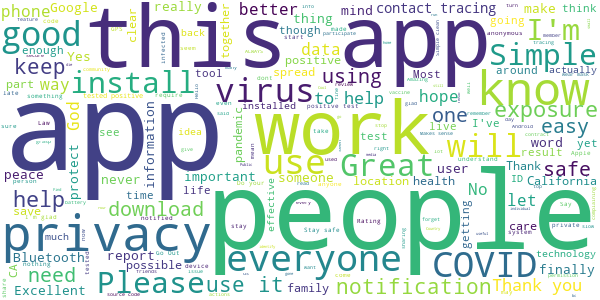
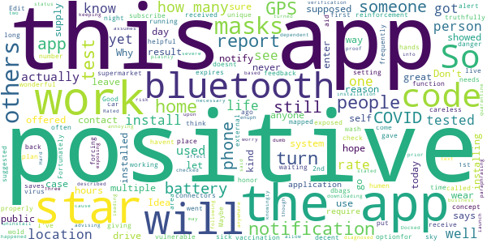
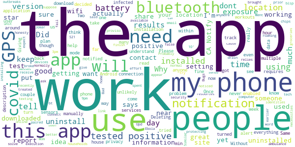
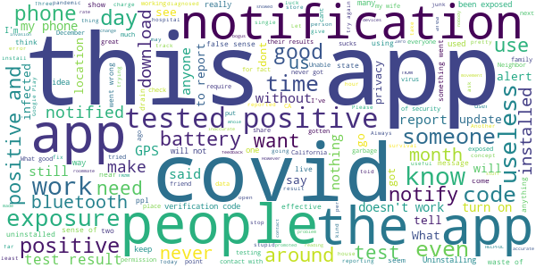

# CA Notify
App version ``minted151007``

Analyzed with [covid-apps-observer](http://github.com/covid-apps-observer) project, version ``0.1``

## App overview
| | |
|-------------------------|-------------------------| 
| **Name**                                          | CA Notify |
| **Unique identifier** | gov.ca.covid19.exposurenotifications |
| **Link to Google Play** | [https://play.google.com/store/apps/details?id=gov.ca.covid19.exposurenotifications](https://play.google.com/store/apps/details?id=gov.ca.covid19.exposurenotifications) |
| **Summary**  | CA Notify is the official Exposure Notification app for California |
| **Privacy policy** | [https://covid19.ca.gov/notify-privacy/](https://covid19.ca.gov/notify-privacy/) |
| **Latest version** | minted151007 |
| **Last update** | 2021-02-24 05:10:35 |
| **Recent changes** | Bug fixes and performance improvements |
| **Installs**  | 500,000+ |
| **Category** | Medical |
| **First release** | Dec 7, 2020 |
| **Size**  | 10M |
| **Supported Android version**  | 5.0 and up |

### Description
> CA Notify is the official COVID-19 exposure notification app of California, supported by the California Department of Public Health (CDPH). The app was developed using the Google Apple Exposure Notification API through a collaboration between Google, Apple, California Department of Technology, CDPH and the University of California.
 CA Notify can help slow the spread of COVID-19. It supports both local contact tracing efforts and the State’s COVID-19 prevention program. Using CA Notify is voluntary and free of charge. The more people who install and use it, the more effective it will be.
 Once you install and activate CA Notify and turn on Bluetooth, the app works in the background and exchanges anonymous keys with other devices. (Keys are long random strings of characters that are not tied to any personal information.) Devices with the app installed will record the keys generated by other devices nearby. The app will record the signal strength, used to estimate the distance between devices, the duration and date of the exposure. To protect the users’ privacy, these keys are only kept on the user’s own device. After 14 days the keys are deleted.
 If a CA Notify user tests positive for COVID-19, they will be able to obtain a verification code that allows them to activate the notification function in the app. Other app users will receive a notification of possible exposure if they were within six feet for a total of 15 minutes or more when the infected person may have been contagious. Anyone who receives a notification can then follow the guidance in the app to find out what to do next.
 You must use the verification code to report a positive result via the app. This prevents people from falsely reporting positive results, which could generate false exposure notifications. CDPH wants all app users to feel confident that when they receive a COVID-19 exposure notification through the app, it is a verified message.
 How CA Notify Protects Your Privacy:
 CDPH takes your privacy and confidentiality very seriously. This is why we chose to use the Apple and Google Exposure Notification API. No personal data or location tracking occurs in this app. In fact, there is no need for CDPH to know where you are or who you are with for CA Notify to work. If you are close enough to another app user, the Bluetooth technology will share signals with that user. The CA Notify Privacy Policy is available at https://covid19.ca.gov/notify-privacy.
 Laboratory results for all persons who test positive (cases) for COVID-19 are routinely sent to public health authorities in California to support disease control activities such as case investigation and contact tracing. This process is independent of the app. Local public health authorities use information from  laboratory reports to follow up with cases to give them guidance and identify those they may have exposed.
 Thank you for downloading CA Notify! California can stop the spread.  You have the power to help your family, friends, and community.

### User interface
The developers of the app provide the following screenshots in the Google play store.
| | | |
|:-------------------------:|:-------------------------:|:-------------------------:|
 |   |  

## Development team
In the following we report the main information provided by the development team in the Google play store.

| | |
|-------------------------|-------------------------|
| **Developer**  | CA Dept of Technology |
| **Website**  | - |
| **Email** | ucsd-mychart.voicemails@ctg.com |
| **Physical address**  | - |
| **Other developed apps**  | [https://play.google.com/store/apps/developer?id=CA+Dept+of+Technology](https://play.google.com/store/apps/developer?id=CA+Dept+of+Technology) |

## Android support

| | |
|-------------------------|-------------------------|
| **Declared target Android version**  | - |
| **Effective target Android version**  | - |
| **Minimum supported Android version**  | Lollipop, version 5.0 (API level 21) |
| **Maximum target Android version**  | - |

The larger the difference between the minimum and maximum supported Android versions, the better. A larger difference means a wider audience. For example, old phones have a very low Android version, so a high minimum supported Android version means that the app cannot be used by users with old phones, thus leading to accessibility problems. 

## Requested permissions

In the following we report the complete list of the permissions requested by the app. 

| **Permission** | **Protection level** | **Description** | 
|-------------------------|-------------------------|-------------------------|
 **android.permission ACCESS_NETWORK_STATE** | Normal | Allows applications to access information about networks. 
 **android.permission BLUETOOTH** | Normal | Allows applications to connect to paired bluetooth devices. 
 **android.permission FOREGROUND_SERVICE** | Normal | Allows a regular application to use Service.startForeground. 
 **android.permission INTERNET** | Normal | Allows applications to open network sockets. 
 **android.permission RECEIVE_BOOT_COMPLETED** | Normal | Allows an application to receive the Intent.ACTION_BOOT_COMPLETED that is broadcast after the system finishes booting. 
 **android.permission WAKE_LOCK** | Normal | Allows using PowerManager WakeLocks to keep processor from sleeping or screen from dimming. 

## Mentioned servers

| **Server** | **Registrant** | **Registrant country** | **Creation date** | 
|-------------------------|-------------------------|-------------------------|-------------------------|
 | google.com | Google LLC | :us: US | 1997-09-15 04:00:00 |

## Security analysis 

Below we report the main security warnings raised by our execution of the [Androwarn](https://github.com/maaaaz/androwarn) security analysis tool.

**Telephony identifiers leakage**
> - This application reads the ISO country code equivalent of the current registered operator's MCC (Mobile Country Code) 

**Connection interfaces exfiltration**
> - This application reads details about the currently active data network 
> - This application tries to find out if the currently active data network is metered 

**Suspicious connection establishment**
> - This application opens a Socket and connects it to the remote address 'timeout' on the 'N/A' port  

**Code execution**
> - This application loads a native library: 'prioclient' 

## User ratings and reviews

Below we provide information about how end users are reacting to the app in terms of ratings and reviews in the Google Play store.

### Ratings

The CA Notify app has been installed by more than **500000** times. At this time, **960** rated the app and its average score is **3.4466019**. Below we show the distribution of the ratings across the usual star-based rating of Google Play

:star::star::star::star::star:: 466

:star::star::star::star:: 93

:star::star::star:: 56

:star::star:: 93

:star:: 252

### Reviews 

#### 5-star reviews

> It is a comfort to have  :date: __2021-03-10 17:53:08__

> Works well, hope app saves lives, and the U.S. I love my Country!  :date: __2021-03-08 19:55:33__

> Elpata  :date: __2021-03-06 05:29:16__

> I like it  :date: __2021-03-02 01:51:35__

> Secures privacy while still providing information on COVID exposure.  :date: __2021-03-01 22:08:15__

> The underlying message is insuring individual privacy... I'm glad there is a way to get the word out via media tool kit.. nice....  :date: __2021-02-28 22:42:28__

> Neve used it  :date: __2021-02-25 05:07:55__

> Hello My Name Is Carolene Mae Sears And Yes I Have Have Been Falsely Caqused About What I May Have Said To The Public & What I Have On My Private Phone. Yes I Live In A Senior Apptarment One Of Four Buildings. Yes at First Things & Places That We Both Had Been To Had Been Closed Or Their Buiding had a improved or removed So Yes Would Go Out Just To Go Out For A Meal & Find Out Where The Different & Meet People That We'd Pass each & Say Hello To & Yes Because Just Met & Yes Nothing Important  :date: __2021-02-17 22:01:46__

> We need to keep safe the community  :date: __2021-02-16 04:41:18__

> Ca  :date: __2021-02-15 20:20:27__

#### 4-star reviews

> I just learned n downloaded app  :date: __2021-03-10 02:33:19__

> App is good, easy to use App should have option to enter Covid vaccination info, then could track vaccine versus exposure,  :date: __2021-03-07 23:22:49__

> We have several cases of Covid around the corner and the app does not show them. Very disappointed! I hoped this app would help keep my family safe. The app is working. They must have fixed the bugs!  :date: __2021-02-15 04:13:22__

> Simple, easy, negligible effect on battery, and unobtrusive. That's great. The biggest problem with this app is that it doesn't indicate that it's even working in any way. I'd suggest that it at least note the number of other devices that it encountered on a daily basis, so a user would 1. be able to gauge how many actual potential exposures they've had and 2. see that the app is actually doing something. e.g. 'You saw 7 other phones today with the CA Notify app...no exposures reported."  :date: __2021-02-09 08:19:14__

> Need asisstance  :date: __2021-02-07 07:10:03__

> Yes body ache little headache tired but made it though thank God  :date: __2021-01-27 17:36:33__

> At least we've gotten around to using technology in the fight against the Virus.  :date: __2021-01-24 04:21:46__

> I'm sure it works for the people that don't mind being followed and tracked but I'm not one of those I know how important the viruses but people know enough about my whereabouts and everything else already as it is I'm home enough then I don't need to worry so much and I don't want my Bluetooth turned on all the time so I got rid of this app if I was out in public a lot I would still have it  :date: __2021-01-19 07:30:18__

> Intuitive and easy but I don't think enough users to be effective. I'm an ER doc in CA and have had on my phone with bluetooth on fo weeks and haven't gotten a single alert despite knowing for certain that I've been exposed. A lot.  :date: __2021-01-16 05:46:47__

> Very helpful 🙂  :date: __2020-12-31 17:27:24__

#### 3-star reviews

> It wold be great to have an optionfor people to report when they get 1st and 2nd vaccination mapped by location. It would be wonderful positive reinforcement and an aid to the most vulnerable.  :date: __2021-02-18 07:54:03__

> Good Idea needs more people to subscribe  :date: __2021-01-28 18:35:31__

> This is an honor system app. People who get sick are supposed to self report but this won't work because people are dbags.  :date: __2021-01-19 18:39:12__

> I think its great concept but truthfully I haven't had time to use the app. but if it does what it says, it's a 5 star app, and if it saves just 1 life. well how many stars can you put on a humen life. More then the stars in the sky.  :date: __2021-01-17 08:12:49__

> Would be decent app if we could install on external drive.  :date: __2021-01-07 00:36:43__

> Fortunately, I've not come in contact with anyone w/ COVID-19. So I can't rate it yet.  :date: __2021-01-06 07:50:42__

> Just installed it  :date: __2021-01-05 06:26:37__

> Can't get it to function properly  :date: __2021-01-05 03:49:07__

> I got my code more than 12 hours before I got my test results and the code expires in 24 hours...  :date: __2021-01-03 21:13:56__

> I just installed the app. I see no reason for my GPS to be on when I am at home. My plan is to turn on my phone's GPS when I am in a public place, like the supermarket. I will turn off the GPS when I get back in my car for the drive home. I am giving the app just 3 stars because it's forcing me to leave my Bluetooth on. But I often turn off my phone at night. I hope there's a setting to receive any notifications only during the day. I will have to check that out.  :date: __2021-01-03 11:27:22__

#### 2-star reviews

> Bad battery drain. Without the app installed I finish my day at 9pm around 30% battery on S21. With the app installed my phone is at 30% by 3pm. Similar use both days.  :date: __2021-03-11 05:12:14__

> Ca Notify Need to work on the Bugs. I can't have the app. On My phone cause it broke the texting link that I have with My Mom.  :date: __2021-03-10 00:55:32__

> It messes up my other bluetooth connections. Only noticed this recently that connection to my car bt would fail where it was prior fine. Same problem on other earlier paired devices. Once I uninstalled this app everything went back to normal  :date: __2021-03-08 00:43:59__

> It just used resources but I was never notified of any outbreaks.  :date: __2021-03-02 01:01:33__

> How does this work? I read online but I don't get how it can tell if you have covid or not. Does it take the positive people's identities and connect it with the phone or do people with covid have to manually put in that they tested positive? If they have to manually put it in, it's unlikely that they will. I give it 2 stars for the effort but I don't understand how its suppose to tell who has covid or not.  :date: __2021-02-26 00:53:52__

> CA Notify used to appear on my phone, but I can't see it anymore. I tried to download it again, and my computer says that CA Notify is installed on my phone. Why can't I see it there?  :date: __2021-02-24 20:14:24__

> If you dont have a data plan for wifi while not at home i dont think this works and there is no contact us or email to ask anyone . false sense of security and not protecting you or anyone else if you dont have data/roaming wifi.  :date: __2021-02-22 06:07:45__

> Did not notified me when I was in contact  :date: __2021-02-21 06:15:41__

> The app is a great idea, however, no one uses it. I spent a couple weeks in a covid unit and I normally work on an ambulance and have never had an exposure alert.  :date: __2021-02-11 15:57:11__

> I have not seen so much as a blip with this app. Probably because people don't want to be treated like they have Ebola. It was a good idea to use available tech to try to solve a problem, but the execution relies on people's honesty. Like the Joker said, "When the chips are down...."  :date: __2021-02-10 23:38:12__

#### 1-star reviews

> Good concept but poorly executed. This app goes by voluntary indication by people if they are positive. If people are not aware of the app, are lazy, do not want to have extra apps installed, or dont care, then the app will not know who's infected or not. It would be better if they tied people's medical info & made it a required install to get a more accurate reading of an area. However privacy advocates wouldn't want that & cell companies wont enforce this install.  :date: __2021-03-13 01:46:15__

> I tested positive and apparently I got it somewhere. I am trying to add to the app Im a positive and I cant. This is super inaccurate!!  :date: __2021-03-07 17:54:02__

> If I could rate this no stars I would. Do not download stuff on to my phone without my permission. Disgusting.  :date: __2021-03-06 03:57:35__

> Doesn't do anything  :date: __2021-03-03 19:14:08__

> My roommate had covid and this app showed no exposure. I was around him the whole time, fortunately I didn't get it. I've been around others who were positive and the app still said no exposure. It's useless. Uninstalling.  :date: __2021-03-02 02:07:57__

> Does it even work? At the very least tell us how many devices did u check per day, if others are not using this service, it's just using my battery for nothing  :date: __2021-02-25 20:14:10__

> Never worked  :date: __2021-02-21 23:25:40__

> Does this app work? It does not seem to be doing anything after having used it for over a month. It does not show any feedback or confirmation if it is effective or even working. Another problem is the California government has never aggressively promoted this app, which needs widespread adoption to be effective. Without any apparent benefit, what this app only does is constantly consuming power and tracking my every movement, which is why I am uninstalling it after writing this review.  :date: __2021-02-21 14:06:20__

> NEED manual location update button OR ability to temporarily change time between checkins for this to be effective and reduce false sense of security. DOES NOT check frequently enough. Users may go many places in between app updating our location, therefore MISSING DATA for all those locations and people. We NEED an update so app can know ALL places we have been. Otherwise WE MAY NEVER KNOW we were exposed to Covid by someone using the app because the app didn't realize we were near them! What good is this app if it only recognizes very few places someone with Covid has been instead of all of them? NOT HELPFUL!!  :date: __2021-02-19 00:01:38__

> Useless and not helpful. More Spyware  :date: __2021-02-18 10:51:44__

