# CDC
App version ``2.7.1``

Analyzed with [covid-apps-observer](http://github.com/covid-apps-observer) project, version ``0.1``

## App overview
| | |
|-------------------------|-------------------------| 
| **Name**&nbsp;&nbsp;&nbsp;&nbsp;&nbsp;&nbsp;&nbsp;&nbsp;&nbsp;&nbsp;&nbsp;&nbsp;&nbsp;&nbsp;&nbsp;&nbsp;&nbsp;&nbsp;&nbsp;&nbsp;&nbsp;&nbsp;&nbsp;&nbsp;&nbsp;&nbsp;&nbsp;&nbsp;&nbsp;&nbsp;&nbsp;&nbsp;&nbsp;&nbsp;&nbsp;&nbsp;&nbsp;&nbsp;&nbsp;&nbsp;  | CDC |
| **Unique identifier** | gov.cdc.general |
| **Link to Google Play** | [https://play.google.com/store/apps/details?id=gov.cdc.general](https://play.google.com/store/apps/details?id=gov.cdc.general) |
| **Summary**  | Health Information at Your Fingertips—CDC 24/7 |
| **Privacy policy** | [http://t.cdc.gov/1MVV](http://t.cdc.gov/1MVV) |
| **Latest version** | 2.7.1 |
| **Last update** | 2020-04-24 15:57:52 |
| **Recent changes** | Optimizes article loading |
| **Installs**  | 100,000+ |
| **Category** | Health & Fitness |
| **First release** | Oct 16, 2012 |
| **Size**  | 23M |
| **Supported Android version**  | 4.4 and up |

### Description
> NOW AVAILABLE ON YOUR SMARTPHONE OR TABLET
 Get the official CDC Mobile application for your tablet and/or smartphone and access the most up to date health information.
 FILTERING OPTIONS
 Organize your home page so that the information that’s most important to you appears first! Turn off the content you don’t want with just a flip of a switch and reset it all with the tap of a button.
 CONTENT
 The app ensures that you’re getting the most up to date health information. The home screen lets you see all your information in one place and updates whenever your device is connected to WI-FI. Enjoy a greater variety of content such as stories, videos, podcasts, and features to give you the most current health information from CDC. 
 Browse Featured Articles, stay on top of health news in the Newsroom section, and view CDC Images of the Week. If you’re a journal reader, view the latest Morbidity & Mortality Weekly Report, Emerging and Infectious Disease journal, or the latest on Preventing Chronic Diseases. You can even search CDC’s web content from the app.  
 We'd love to hear your thoughts about the app! Rate the CDC Mobile App in the App Store or leave a comment to let us know how we're doing. You can even send us an email through the app if you have suggestions for improvements!
 DISCLAIMER
 THE MATERIALS EMBODIED IN THIS SOFTWARE ARE PROVIDED TO YOU "AS-IS" AND WITHOUT WARRANTY OF ANY KIND, EXPRESSED, IMPLIED OR OTHERWISE, INCLUDING WITHOUT LIMITATION, ANY WARRANTY OF FITNESS FOR A PARTICULAR PURPOSE. IN NO EVENT SHALL THE CENTERS FOR DISEASE CONTROL AND PREVENTION (CDC) OR THE UNITED STATES (U.S.) GOVERNMENT BE LIABLE TO YOU OR ANYONE ELSE FOR ANY DIRECT, SPECIAL, INCIDENTAL, INDIRECT OR CONSEQUENTIAL DAMAGES OF ANY KIND, OR ANY DAMAGES WHATSOEVER, INCLUDING WITHOUT LIMITATION, LOSS OF PROFIT, LOSS OF USE, SAVINGS OR REVENUE, OR THE CLAIMS OF THIRD PARTIES, WHETHER OR NOT CDC OR THE U.S. GOVERNMENT HAS BEEN ADVISED OF THE POSSIBILITY OF SUCH LOSS, HOWEVER CAUSED AND ON ANY THEORY OF LIABILITY, ARISING OUT OF OR IN CONNECTION WITH THE POSSESSION, USE OR PERFORMANCE OF THIS SOFTWARE.

### User interface
The developers of the app provide the following screenshots in the Google play store.
| | | |
|:-------------------------:|:-------------------------:|:-------------------------:|
 | 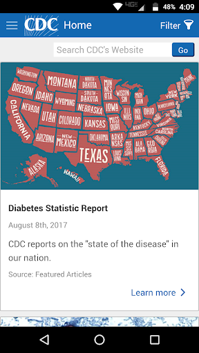  | 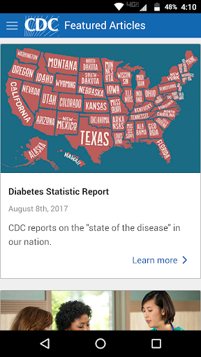  |   | 
 | 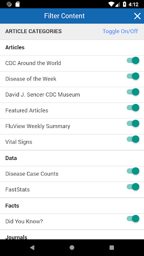  |   | 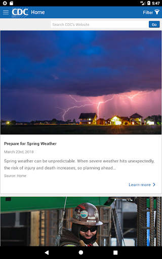  | 
 |   |   |   | 
 |   |   |   | 
 |   | 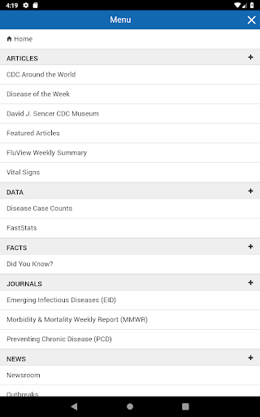  | 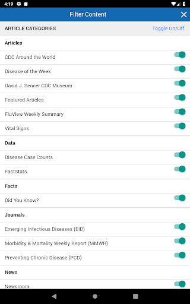  | 

## Development team
In the following we report the main information provided by the development team in the Google play store.

| | |
|-------------------------|-------------------------|
| **Developer**  | Centers for Disease Control and Prevention |
| **Website**  | [http://www.cdc.gov](http://www.cdc.gov) |
| **Email** | CDCMobileDevelopment@cdc.gov |
| **Physical address**  | - |
| **Other developed apps**  | [https://play.google.com/store/apps/developer?id=Centers+for+Disease+Control+and+Prevention](https://play.google.com/store/apps/developer?id=Centers+for+Disease+Control+and+Prevention) |

## Android support

| | |
|-------------------------|-------------------------|
| **Declared target Android version**  | Pie, version 9 (API level 28) |
| **Effective target Android version**  | Pie, version 9 (API level 28) |
| **Minimum supported Android version**  | KitKat, version 4.4 - 4.4.4 (API level 19) |
| **Maximum target Android version**  | - |

The larger the difference between the minimum and maximum supported Android versions, the better. A larger difference means a wider audience. For example, old phones have a very low Android version, so a high minimum supported Android version means that the app cannot be used by users with old phones, thus leading to accessibility problems. 

## Requested permissions

In the following we report the complete list of the permissions requested by the app. 

| **Permission** | **Protection level** | **Description** | 
|-------------------------|-------------------------|-------------------------|
 **android.permission ACCESS_NETWORK_STATE** | Normal | Allows applications to access information about networks. 
 **android.permission INTERNET** | Normal | Allows applications to open network sockets. 
 **android.permission READ_APP_BADGE** | - | - 
 **android.permission RECEIVE_BOOT_COMPLETED** | Normal | Allows an application to receive the Intent.ACTION_BOOT_COMPLETED that is broadcast after the system finishes booting. 
 **android.permission VIBRATE** | Normal | Allows access to the vibrator. 
 **android.permission WAKE_LOCK** | Normal | Allows using PowerManager WakeLocks to keep processor from sleeping or screen from dimming. 
 **android.permission WRITE_EXTERNAL_STORAGE** | :warning:**Dangerous** | Allows an application to write to external storage. 
 **com.amazon.device.messaging.permission RECEIVE** | - | - 
 **com.anddoes.launcher.permission UPDATE_COUNT** | - | - 
 **com.google.android.c2dm.permission RECEIVE** | - | - 
 **com.google.android.finsky.permission BIND_GET_INSTALL_REFERRER_SERVICE** | - | - 
 **com.htc.launcher.permission READ_SETTINGS** | - | - 
 **com.htc.launcher.permission UPDATE_SHORTCUT** | - | - 
 **com.huawei.android.launcher.permission CHANGE_BADGE** | - | - 
 **com.huawei.android.launcher.permission READ_SETTINGS** | - | - 
 **com.huawei.android.launcher.permission WRITE_SETTINGS** | - | - 
 **com.majeur.launcher.permission UPDATE_BADGE** | - | - 
 **com.oppo.launcher.permission READ_SETTINGS** | - | - 
 **com.oppo.launcher.permission WRITE_SETTINGS** | - | - 
 **com.sec.android.provider.badge.permission READ** | - | - 
 **com.sec.android.provider.badge.permission WRITE** | - | - 
 **com.sonyericsson.home.permission BROADCAST_BADGE** | - | - 
 **com.sonymobile.home.permission PROVIDER_INSERT_BADGE** | - | - 
 **gov.cdc.general.permission RECEIVE_ADM_MESSAGE** | - | - 
 **me.everything.badger.permission BADGE_COUNT_READ** | - | - 
 **me.everything.badger.permission BADGE_COUNT_WRITE** | - | - 

## Mentioned servers

| **Server** | **Registrant** | **Registrant country** | **Creation date** | 
|-------------------------|-------------------------|-------------------------|-------------------------|
 | googlesyndication.com | Google LLC | :us: US | 2003-01-21 06:17:24 |
 | google.com | Google LLC | :us: US | 1997-09-15 04:00:00 |
 | app-measurement.com | Google LLC | :us: US | 2015-06-19 20:13:31 |
 | hockeyapp.net | Microsoft Corporation | :us: US | 2011-01-23 18:46:43 |
 | pushwoosh.com | Arello Mobile | :new_zealand: NZ | 2011-05-02 11:00:31 |
 | gstatic.com | Google LLC | :us: US | 2008-02-11 15:31:25 |
 | omniture.com | Adobe Inc. | :us: US | 2002-03-29 21:33:52 |
 | googleapis.com | Google LLC | :us: US | 2005-01-25 17:52:26 |
 | googleadservices.com | Google LLC | :us: US | 2003-06-19 16:34:53 |

## Security analysis 

Below we report the main security warnings raised by our execution of the [Androwarn](https://github.com/maaaaz/androwarn) security analysis tool.

**Telephony identifiers leakage**
> - This application reads the ISO country code equivalent for the SIM provider's country code 
> - This application reads the MCC+MNC of the provider of the SIM 
> - This application reads the Service Provider Name (SPN) 
> - This application reads the device phone type value 
> - This application reads the numeric name (MCC+MNC) of current registered operator 
> - This application reads the operator name 
> - This application reads the radio technology (network type) currently in use on the device for data transmission 
> - This application reads the unique device ID, i.e the IMEI for GSM and the MEID or ESN for CDMA phones 

**Connection interfaces exfiltration**
> - This application reads details about the currently active data network 
> - This application tries to find out if the currently active data network is metered 

**Telephony services abuse**
> - This application makes phone calls 

**Code execution**
> - This application executes a UNIX command containing this argument: '3' 

## User ratings and reviews

Below we provide information about how end users are reacting to the app in terms of ratings and reviews in the Google Play store.

### Ratings

The CDC app has been installed by more than **100000** times. At this time, **1180** rated the app and its average score is **3.7391305**. Below we show the distribution of the ratings across the usual star-based rating of Google Play

:star::star::star::star::star:: 677

:star::star::star::star:: 82

:star::star::star:: 112

:star::star:: 51

:star:: 256

### Reviews 

#### 5-star reviews

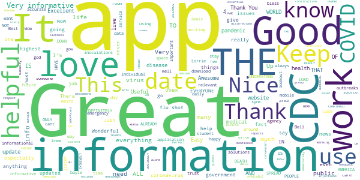

> Awsome  :date: __2020-05-22 21:10:05__

> Great app for all humanity.  :date: __2020-05-20 19:40:13__

> Perfect .thanks to warming when sickness comes alone  :date: __2020-05-20 18:11:24__

> Keeps me up to date  :date: __2020-05-20 11:21:54__

> Keeps updated and convenient for all. Recommend it  :date: __2020-05-18 16:39:02__

> Coronavirus (COVID-19) every day updates  :date: __2020-05-17 16:54:18__

> Good  :date: __2020-05-15 14:40:09__

> OBVIOUSLY this is DEFINITELY AN AMAZING APP AVAILABLE ON MOBILE DEVICES ESPECIALLY DURING THIS WORLD SPREAD EXTREMELY DEADLY PANDEMIC THAT NOT ONLY JUST HERE IN AMERICA, BUT ALL OVER THE ENTIRE WORLD THE DEATH TOLLS HAVE ALREADY FAR SURPASSED THE HUNDREDS OF THOUSANDS ALREADY CONFIRMED DEATHS AND EVEN WORSE, IT IS NOT GOING TO DO ANYTHING OTHER THAN WORSEN WORLDWIDE , HIGHEST IN AMERICA ONLY CAN IMPROVE BY CONTINUING 2 SELF QUARANTINE  :date: __2020-05-12 11:32:13__

> Awesome 👍👍👍  :date: __2020-05-07 05:35:52__

> government for me mean everything that means CDC is a nice company yeah they're working really nice the highest voice control sync, external complete is you want to get in touch with something like business you could you should use this you get more information about how it works for me work nice you should try to  :date: __2020-05-07 01:38:57__

#### 4-star reviews

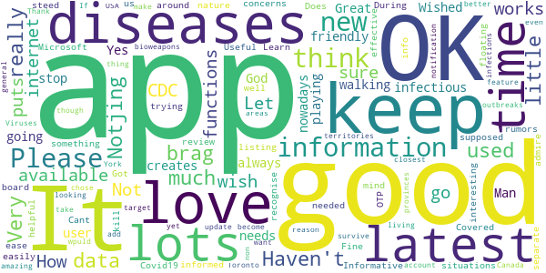

> It's OK. Notjing to brag about. Haven't used it that much really.  :date: __2020-05-15 06:06:05__

> Very little data a available.  :date: __2020-05-08 15:45:49__

> Not sure its functions or How it works  :date: __2020-04-25 10:08:09__

> I love the CDC but I wish it wouldn't be a app that puts you on the internet  :date: __2020-04-23 02:17:52__

> Let's go walking Yes ok?  :date: __2020-04-21 19:21:07__

> Wished it was more user-friendly  :date: __2020-04-17 23:47:35__

> Great app !!!!!!!!!!!!!  :date: __2020-04-15 15:38:41__

> Ok app.  :date: __2020-04-15 14:59:38__

> It's always good to keep up on what's going on with all these infectious diseases nowadays. Man needs to stop playing God before he creates something that will kill us all off.  :date: __2020-04-15 04:39:06__

> Fine. Does what it's supposed to do. Keep me informed on the latest situations.  :date: __2020-04-14 04:22:52__

#### 3-star reviews

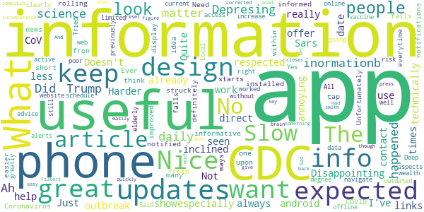

> Disappointing. Not as useful as I expected. Doesn't show up to date info. Just info we've already seen 1000 times. Expected more from the CDC whom I've always respected.  :date: __2020-05-23 06:09:07__

> App does not work on android phones.  :date: __2020-05-15 00:22:26__

> Useful to keep up, especially with the Sars-CoV-2 outbreak, but really annoying design. Harder to help less technically inclined use it.  :date: __2020-05-08 04:29:03__

> Nice  :date: __2020-05-03 06:10:21__

> great  :date: __2020-04-27 21:31:31__

> could offer more direct contact links  :date: __2020-04-25 21:10:30__

> Quite informative  :date: __2020-04-24 06:55:32__

> Need rolling updates to keep the information fresh.  :date: __2020-04-21 17:00:11__

> Ever since the COVID-19 Coronavirus struck the U.S., I want to be more informed and so I installed the CDC app so I can be so. Unfortunately for me however, everytime I tap on notifications fron this app, this app fails to display the news article it notified me about within the app once it starts it.  :date: __2020-04-10 23:42:01__

> I think it is a great idea and it's definitely one that should be improved upon. The app falls short in information and in many ways it's easier to navigate the CDC website. Local alerts and information would greatly increase the useful aspects of the app.  :date: __2020-04-02 01:32:17__

#### 2-star reviews

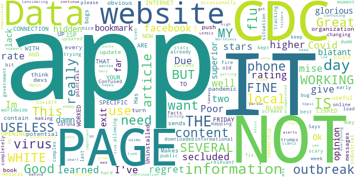

> I give only two stars only because I've only learned of the "CDC" Due to the Covid-19. Im very secluded other then facebook so i regret i can not rate CDC with a higher rating.  :date: __2020-05-07 08:06:04__

> Poor app mise well use website as this is a glorious bookmark hidden as an app in my opinion  :date: __2020-04-30 07:18:34__

> Ok  :date: __2020-04-28 15:22:50__

> This damn app doesn't exit  :date: __2020-04-23 08:54:01__

> Use the website it is far superior, this app has a blatant lack of organization, however does contain useful information.  :date: __2020-04-19 03:08:59__

> THE APP IS NOT OPENING UP TO THE PAGES THAT ARE LINKED WITH THE SPECIFIC INFORMATION . ITS A BLANK WHITE PAGE MY ISP INTERNET CONNECTION IS WORKING FINE. ITS YOUR APP NOT WORKING FRIDAY IT WORKED SEVERAL DAYS AGO, BUT NOW ITS USELESS  :date: __2020-04-14 22:23:39__

> Good information, But sends several push messages every day and there is no obvious way to turn them off. Makes it a virus in my book. Uninstalled  :date: __2020-04-13 22:01:35__

> 🚮  :date: __2020-04-06 00:58:13__

> Great content, but app bogs my phone down.  :date: __2020-04-04 06:13:31__

> Has great potential. However, during a pandemic you would think devs would update the content occasionally. Covid19 facts and stats worldwide are changing by the moment. This app hasn't updated since I downloaded it early last week making this app pointless and not relevant. It's very scary this is the best the CDC can do with an app for the public.  :date: __2020-04-02 13:50:08__

#### 1-star reviews

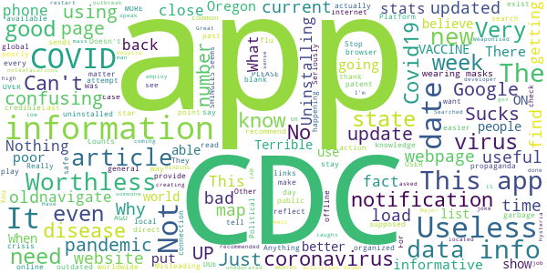

> Someone on a government level has used this app illegally to track my being I did not give permission to download this app and it will not allow me to uninstall the covid-19 app  :date: __2020-05-23 05:23:02__

> Useless. Can't find covid19 numbers. Or CDC publications on re-opening.  :date: __2020-05-21 06:38:53__

> Just a poor app (Mickey mouse programmers)  :date: __2020-05-19 10:58:58__

> What's the point? It's easier to navigate CDC.gov.  :date: __2020-05-15 11:20:46__

> Data is not up to date!  :date: __2020-05-15 03:02:09__

> PLEASE NEEDS MORE UP DATE .. ALL THE UP DATE IS OVER DUE .. IAM READING UP DATES BACK 3 OR 4 MONTHS AGO 🤔🤔  :date: __2020-05-12 17:11:45__

> COVID-19: *laughs in coronavirus*  :date: __2020-05-09 18:02:54__

> Stop the noteafacations  :date: __2020-05-08 22:47:05__

> Sucks ... need update .. uninstalled..  :date: __2020-05-08 01:58:58__

> The CDC is nothing but uneducated garbage!! You need to employ someone who actually has some common sense to not speak before they have the facts. Great job creating mass hysteria!!!! Well done coming with recommended activities and wearing of masks after the fact.  :date: __2020-05-05 06:19:56__

