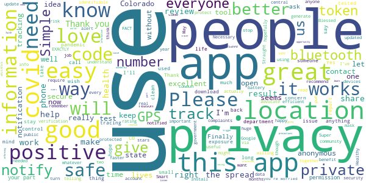

# CO Exposure Notifications
App version ``minted11011``

Analyzed with [covid-apps-observer](http://github.com/covid-apps-observer) project, version ``0.1``

## App overview
| | |
|-------------------------|-------------------------| 
| **Name**&nbsp;&nbsp;&nbsp;&nbsp;&nbsp;&nbsp;&nbsp;&nbsp;&nbsp;&nbsp;&nbsp;&nbsp;&nbsp;&nbsp;&nbsp;&nbsp;&nbsp;&nbsp;&nbsp;&nbsp;&nbsp;&nbsp;&nbsp;&nbsp;&nbsp;&nbsp;&nbsp;&nbsp;&nbsp;&nbsp;&nbsp;&nbsp;&nbsp;&nbsp;&nbsp;&nbsp;&nbsp;&nbsp;&nbsp;&nbsp;  | CO Exposure Notifications |
| **Unique identifier** | gov.co.cdphe.exposurenotifications |
| **Link to Google Play** | [https://play.google.com/store/apps/details?id=gov.co.cdphe.exposurenotifications](https://play.google.com/store/apps/details?id=gov.co.cdphe.exposurenotifications) |
| **Summary**  | Colorado&#39;s official Exposure Notification app. |
| **Privacy policy** | [https://www.colorado.gov/pacific/cdphe/exposure-notifications-privacy-policy](https://www.colorado.gov/pacific/cdphe/exposure-notifications-privacy-policy) |
| **Latest version** | minted11011 |
| **Last update** | 2020-10-24 01:07:27 |
| **Recent changes** | Bug fixes and performance improvements |
| **Installs**  | 100,000+ |
| **Category** | Medical |
| **First release** | Oct 16, 2020 |
| **Size**  | 9.9M |
| **Supported Android version**  | 5.0 and up |

### Description
> Exposure Notifications is a voluntary new service available on both iPhone and Android phones that helps slow the spread of COVID-19. If you have enabled Exposure Notifications on your phone, whenever you are within close proximity (approximately 6 feet of someone for at least 10 minutes), your phones will exchange secure, anonymous tokens. If you test positive for COVID-19, you can share these anonymous tokens, which will send a notification to anyone with whom you have exchanged tokens with recently, notifying them of possible exposure. The service is available nationwide, but will be customized for Colorado. This service does not collect any personally identifying information or share it with the State of Colorado, your Local Public Health Agency, Apple, or Google.

### User interface
The developers of the app provide the following screenshots in the Google play store.
| | | |
|:-------------------------:|:-------------------------:|:-------------------------:|
 |   |   |   | 
 |  

## Development team
In the following we report the main information provided by the development team in the Google play store.

| | |
|-------------------------|-------------------------|
| **Developer**  | Colorado Department of Public Health & Environment |
| **Website**  | [https://covid19.colorado.gov/Exposure-notifications](https://covid19.colorado.gov/Exposure-notifications) |
| **Email** | CO_Exposure_Notifications@state.co.us |
| **Physical address**  | - |
| **Other developed apps**  | [https://play.google.com/store/apps/developer?id=Colorado+Department+of+Public+Health+%26+Environment](https://play.google.com/store/apps/developer?id=Colorado+Department+of+Public+Health+%26+Environment) |

## Android support

| | |
|-------------------------|-------------------------|
| **Declared target Android version**  | Android10, version 10 (API level 29) |
| **Effective target Android version**  | Android10, version 10 (API level 29) |
| **Minimum supported Android version**  | Lollipop, version 5.0 (API level 21) |
| **Maximum target Android version**  | - |

The larger the difference between the minimum and maximum supported Android versions, the better. A larger difference means a wider audience. For example, old phones have a very low Android version, so a high minimum supported Android version means that the app cannot be used by users with old phones, thus leading to accessibility problems. 

## Requested permissions

In the following we report the complete list of the permissions requested by the app. 

| **Permission** | **Protection level** | **Description** | 
|-------------------------|-------------------------|-------------------------|
 **android.permission ACCESS_NETWORK_STATE** | Normal | Allows applications to access information about networks. 
 **android.permission BLUETOOTH** | Normal | Allows applications to connect to paired bluetooth devices. 
 **android.permission FOREGROUND_SERVICE** | Normal | Allows a regular application to use Service.startForeground. 
 **android.permission INTERNET** | Normal | Allows applications to open network sockets. 
 **android.permission RECEIVE_BOOT_COMPLETED** | Normal | Allows an application to receive the Intent.ACTION_BOOT_COMPLETED that is broadcast after the system finishes booting. 
 **android.permission WAKE_LOCK** | Normal | Allows using PowerManager WakeLocks to keep processor from sleeping or screen from dimming. 

## Mentioned servers

| **Server** | **Registrant** | **Registrant country** | **Creation date** | 
|-------------------------|-------------------------|-------------------------|-------------------------|
 | google.com | Google LLC | :us: US | 1997-09-15 04:00:00 |

## Security analysis 

Below we report the main security warnings raised by our execution of the [Androwarn](https://github.com/maaaaz/androwarn) security analysis tool.

**Telephony identifiers leakage**
> - This application reads the ISO country code equivalent of the current registered operator's MCC (Mobile Country Code) 

**Connection interfaces exfiltration**
> - This application reads details about the currently active data network 
> - This application tries to find out if the currently active data network is metered 

**Suspicious connection establishment**
> - This application opens a Socket and connects it to the remote address 'timeout' on the 'N/A' port  

**Code execution**
> - This application loads a native library: 'prioclient' 

## User ratings and reviews

Below we provide information about how end users are reacting to the app in terms of ratings and reviews in the Google Play store.

### Ratings

The CO Exposure Notifications app has been installed by more than **100000** times. At this time, **360** rated the app and its average score is **3.5045872**. Below we show the distribution of the ratings across the usual star-based rating of Google Play

:star::star::star::star::star:: 196

:star::star::star::star:: 19

:star::star::star:: 23

:star::star:: 16

:star:: 106

### Reviews 

#### 5-star reviews

> great!  :date: __2020-11-23 03:02:21__

> Very useful app for telling me if there are covid positive reports.  :date: __2020-11-22 18:06:19__

> This is an excellent tool. I think they could do a better job informing people on how they get the code to start the notification part though. For those interested, the health department can generate the code for you when you receive a call from a contact tracer. You cannot just trigger it based on a positive test result. Please answer the phone when they call after you have been tested or call them back.  :date: __2020-11-21 21:28:48__

> Anonymous and opt-in only so your information and privacy is protected. Since it's release, the old manual verification system has been updated to be more automated. This app can save lives and works better when more users have it installed.  :date: __2020-11-20 19:54:03__

> Yes. It is safe to use. It uses tokens and your identity is kept private. Please, please do your part and help stop/track the spread!  :date: __2020-11-20 05:29:03__

> This app is great to have.  :date: __2020-11-19 07:30:26__

> Yes!.I was cyberstalked by city. Web beacon put on my browser by internal affairs, Mayor John Suthers, two corrupt judged and SA in 4th Judicial Dist Which I have spent years litigating against here. I am a journalist by educational laurels, druthers and whatever others add.  :date: __2020-11-18 09:48:10__

> Like  :date: __2020-11-16 04:26:07__

> I got the covid and tried to alert other people and it asks for a one time code that I do not know where it comes from. It makes it hard to notify other people which makes it almost useless. They need to have a service where you can screenshot your results  :date: __2020-11-13 23:09:45__

> Excellent  :date: __2020-11-13 22:53:18__

#### 4-star reviews

> I would like the app to have some way to tell me that I have exchanged tokens with someone, maybe giving me a total for a day. No details, just some indication that the app is doing its job.  :date: __2020-11-20 08:25:57__

> It does work for sharing a positive result! But don't go into the app because you'll get stopped at the verification code part. Instead wait for a text message from the health department - click on that link and follow the steps. It does share that way! You'll even see evidence that it was shared in the app. Would have given 5 stars but no explanation about the verification code or follow up text was given.  :date: __2020-11-19 19:19:46__

> Interesting stuff  :date: __2020-11-03 04:21:26__

> Great concept but kills my battery. I do have an old phone though so that may be the issue.  :date: __2020-10-27 15:53:56__

> I had trouble getting the notifications to work like a lot of people had posted, I uninstalled and reinstalled the app and it worked the next time. Not sure what causes this. Glad we have some form of contact tracing!  :date: __2020-10-26 03:29:29__

> The title makes it sounds like a carbon monoxide detector -why no mention of COVID-19 or "infectious disease"?  :date: __2020-10-26 02:43:35__

> This app doesn't have location access. I just checked the permissions after installing it.  :date: __2020-10-25 23:43:32__

#### 3-star reviews

> Called county health department to ask about notification & special code issue. RESULTS: 1) testing agency reports positive tests to the State 2) State notifies counties in which the positive people live 3) w/in 24 hrs, counties notify people who tested positive 4)w/in 48 hrs (cases are mounting),Contact Tracers call infected people & ask w/whom they have been in contact. NO REASON for infected people to need code. Call Labor Dept if there's a work issue. RECOMMEND: call people who know things.  :date: __2020-11-20 20:45:59__

> People have said they can't get a verification code that is needed to send an alert. I just read (11-18-20, cpr) that this code should now be sent automatically. Hopefully this improves the situation.  :date: __2020-11-19 15:15:54__

> I can't specify my area nor can I put in a result whether I'm positive or negative. Need to understand what code they want. Also if it only sense through bluetooth I don't want to be that close to someone if possible. There should be more options in Android app. Couldn't get my iPad to gain access so not sure how others are getting info even if it may be places I may go in the Metro or suburb area. Clarification needed pr more options.  :date: __2020-11-19 03:31:37__

> I was in the same house with a person who tested positive... 3 days later... Still no notification! Uninstalling!  :date: __2020-11-12 18:55:04__

> Been running into issues of it not checking for possible exposures even with location/Bluetooth being on during the day. Been working around the public and it checked 3 days ago with a hefty amount of keys but not the day after or yesterday for that matter until I found I had to delete all the keys and then it'll restart and start collecting again, all my co workers have it on also. Not a good thing incase I ran into anyone days before that and they tested positive and the keys match later on.  :date: __2020-11-07 12:54:36__

> Positive test here but can't share my result because I don't have a verification code. failed app so far🤷‍♂️ I've searched for about 15min and can only figure it's because my test was conducted out of state. However, I was around people in CO and would like to share it. Will people share if it's not easily available? I would also recommend information about privacy and how your results a reported. People might have a sense of shame or guilt but might share if there's some sense of anonymity.  :date: __2020-11-07 01:48:11__

> Won't let me allow to send notifications  :date: __2020-11-06 19:43:06__

> Good call, Colorado but an issue with the app is that there is no verification code sent when trying to enter test results. I suggest you make this process a little more clear, and provide an FAQ if anyone else has run into this as well.  :date: __2020-11-04 03:50:37__

> Love the concept. Not a fan that it requires bluetooth to turn on notifications. That's a battery drain.  :date: __2020-10-29 15:52:09__

> It communicates via Bluetooth, which drains the battery. Swing and a miss.  :date: __2020-10-26 13:47:25__

#### 2-star reviews

> major power consumption issues. had to uninstall it because I couldn't use my phone normally without having to charge in the middle of the day, and I only really text on an average day. also noticed my phone was running very hot constantly when I had the app installed. this is something we definitely need, but please optimize it so it doesn't make my phone unusable.  :date: __2020-11-19 19:11:35__

> There is nothing wrong with the app persay, its just i have been using it and i have been doing alot of christmas shopping, and i got not 1 alert. You know how many people out there that have tested positive and havent reported!! So this app isnt going to work!  :date: __2020-11-09 17:38:51__

> When I try to turn on notifications, I get an error saying "something went wrong". It will not enable.  :date: __2020-11-08 21:26:50__

> My problem is I work in a facility where alot if employees had C19 and I have never been notified....HMMM  :date: __2020-11-08 20:22:31__

> Seems like this could be a really good app. BUT.....where does someone get the verification code needed to enter a covid 19 result?  :date: __2020-11-06 16:27:15__

> Maybe I'm not understanding something but when I try to share my results, It says it will send me a one time verification code, but nothing happens.  :date: __2020-11-02 18:31:26__

> Needs gps and bluetooth to be active. Drains battery. Why do we need gps active.  :date: __2020-11-01 17:51:00__

> The app itself is fine, but installing it caused my other apps trying to update to do so slowly. So slowly, that on a fast wifi connection it would take more than 30 minutes for just one to do so. I uninstalled this one and might try again later. Once this was uninstalled, the normal updates had no problem  :date: __2020-10-30 04:00:56__

> While your installing this IT DOSE ASK FOR YOUR LOCATION ! I haven't gotten to use this app yet I'm just now installing it so unlike other comments who claim THEY DO NOT ask for a location I paid attention and yes it dose .  :date: __2020-10-27 04:59:24__

> I can't turn on notifications? It just says something went wrong?  :date: __2020-10-26 04:04:24__

#### 1-star reviews

> It asks for a verification number that you can not get so it is useless at this point. No instructions on how to get one.  :date: __2020-11-23 01:51:56__

> Starting to think this is a worthless App and Your Not Helping !!!!!  :date: __2020-11-22 17:41:02__

> There is also no indicator that the app is doing anything. Show me some stats of how many people it thinks I've had "close contact" with. Show me some stats of how many app users have reported positive results. Etc... Right now it's just a black box I'm somehow supposed to just trust that it's working. C'mon here folks, we need more transparency if you want us to trust that app does a damn thing at all...  :date: __2020-11-22 16:57:05__

> Unable to upload results, need a verification code which is difficult to find! Way to go Colorado for making things not easy or user friendly  :date: __2020-11-21 23:14:03__

> Don't work I know people at my work have it and this doesn't say anything  :date: __2020-11-20 23:35:34__

> DOES NOT WORK! I work for a government entity and we recently had three positive cases on our floor alone in this building and we didn't get a single notification not when it started and not two weeks later. This app is a complete failure and a waste of your battery time and space!  :date: __2020-11-19 15:53:59__

> It doesn't allow me to turn on exposure notifications. I appreciate your reply! However, it didn't work for me. I'm still getting the same message. I'll just wait for the update. As of Nov 16, it's still not working on my Android  :date: __2020-11-16 19:08:43__

> This app is useless. In order to report your positive result it asks for a verification code but doesn't give you one and doesn't have any instructions for how to get one. It would be a valuable tool if it worked.  :date: __2020-11-16 05:57:10__

> Greatly flawed. I can't post results because lack of verification code. No way to find or figure this out either.  :date: __2020-11-15 23:19:00__

> Downloaded this twice. Immediately annoying notifications that it will not work without an update. Takes you to Google Play to update and crashes. I could have written a better app, and I'm not an IT graduate yet!!! Pretty damn poor when the COVID situation is so serious....  :date: __2020-11-15 22:56:16__

