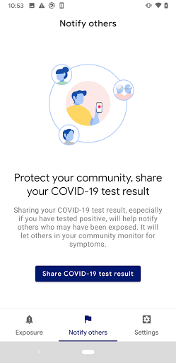
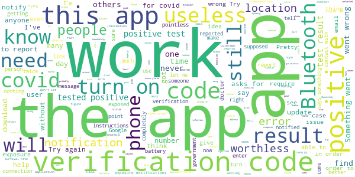

# CO Exposure Notifications
App version ``minted14014``

Analyzed with [covid-apps-observer](http://github.com/covid-apps-observer) project, version ``0.1``

## App overview
| | |
|-------------------------|-------------------------| 
| **Name**&nbsp;&nbsp;&nbsp;&nbsp;&nbsp;&nbsp;&nbsp;&nbsp;&nbsp;&nbsp;&nbsp;&nbsp;&nbsp;&nbsp;&nbsp;&nbsp;&nbsp;&nbsp;&nbsp;&nbsp;&nbsp;&nbsp;&nbsp;&nbsp;&nbsp;&nbsp;&nbsp;&nbsp;&nbsp;&nbsp;&nbsp;&nbsp;&nbsp;&nbsp;&nbsp;&nbsp;&nbsp;&nbsp;&nbsp;&nbsp;  | CO Exposure Notifications |
| **Unique identifier** | gov.co.cdphe.exposurenotifications |
| **Link to Google Play** | [https://play.google.com/store/apps/details?id=gov.co.cdphe.exposurenotifications](https://play.google.com/store/apps/details?id=gov.co.cdphe.exposurenotifications) |
| **Summary**  | Colorado&#39;s official Exposure Notification app. |
| **Privacy policy** | [https://www.colorado.gov/pacific/cdphe/exposure-notifications-privacy-policy](https://www.colorado.gov/pacific/cdphe/exposure-notifications-privacy-policy) |
| **Latest version** | minted14014 |
| **Last update** | 2020-12-07 17:47:14 |
| **Recent changes** |  Bug fixes and performance improvements |
| **Installs**  | 100,000+ |
| **Category** | Medical |
| **First release** | Oct 16, 2020 |
| **Size**  | 9.9M |
| **Supported Android version**  | 5.0 and up |

### Description
> CO Exposure Notifications is the official Exposure Notifications app of Colorado and the Colorado Department of Public Health and Environment. Exposure Notifications is a voluntary new service developed in partnership with Google and Apple to help slow the spread of COVID-19. No GPS, location information or personal identifiers will ever be collected, stored or shared by this service. 
 CO Exposure Notifications can quickly notify you if you've likely been exposed to COVID-19. Knowing about a potential exposure allows you to reduce the risk to your family, friends, neighbors and community.
 By enabling Exposure Notifications, whenever you are within 6 feet of someone for at least 10 minutes, both phones will exchange secure, anonymous tokens using Bluetooth. If another user you’ve been near tests positive for COVID-19, they can upload their result to the app which will send a push notification to you and anyone else their phone has exchanged tokens with recently, notifying you to a possible exposure. 
 If you test positive, you can easily and anonymously notify others to help stop the spread of COVID-19. 
 To learn more, please visit https://covid19.colorado.gov/Exposure-notifications

### User interface
The developers of the app provide the following screenshots in the Google play store.
| | | |
|:-------------------------:|:-------------------------:|:-------------------------:|
 |   |   |   | 
 |  

## Development team
In the following we report the main information provided by the development team in the Google play store.

| | |
|-------------------------|-------------------------|
| **Developer**  | Colorado Department of Public Health & Environment |
| **Website**  | [https://covid19.colorado.gov/Exposure-notifications](https://covid19.colorado.gov/Exposure-notifications) |
| **Email** | CO_Exposure_Notifications@state.co.us |
| **Physical address**  | - |
| **Other developed apps**  | [https://play.google.com/store/apps/developer?id=Colorado+Department+of+Public+Health+%26+Environment](https://play.google.com/store/apps/developer?id=Colorado+Department+of+Public+Health+%26+Environment) |

## Android support

| | |
|-------------------------|-------------------------|
| **Declared target Android version**  | - |
| **Effective target Android version**  | - |
| **Minimum supported Android version**  | Lollipop, version 5.0 (API level 21) |
| **Maximum target Android version**  | - |

The larger the difference between the minimum and maximum supported Android versions, the better. A larger difference means a wider audience. For example, old phones have a very low Android version, so a high minimum supported Android version means that the app cannot be used by users with old phones, thus leading to accessibility problems. 

## Requested permissions

In the following we report the complete list of the permissions requested by the app. 

| **Permission** | **Protection level** | **Description** | 
|-------------------------|-------------------------|-------------------------|
 **android.permission ACCESS_NETWORK_STATE** | Normal | Allows applications to access information about networks. 
 **android.permission BLUETOOTH** | Normal | Allows applications to connect to paired bluetooth devices. 
 **android.permission FOREGROUND_SERVICE** | Normal | Allows a regular application to use Service.startForeground. 
 **android.permission INTERNET** | Normal | Allows applications to open network sockets. 
 **android.permission RECEIVE_BOOT_COMPLETED** | Normal | Allows an application to receive the Intent.ACTION_BOOT_COMPLETED that is broadcast after the system finishes booting. 
 **android.permission WAKE_LOCK** | Normal | Allows using PowerManager WakeLocks to keep processor from sleeping or screen from dimming. 

## Mentioned servers

| **Server** | **Registrant** | **Registrant country** | **Creation date** | 
|-------------------------|-------------------------|-------------------------|-------------------------|
 | google.com | Google LLC | :us: US | 1997-09-15 04:00:00 |

## Security analysis 

Below we report the main security warnings raised by our execution of the [Androwarn](https://github.com/maaaaz/androwarn) security analysis tool.

**Telephony identifiers leakage**
> - This application reads the ISO country code equivalent of the current registered operator's MCC (Mobile Country Code) 

**Connection interfaces exfiltration**
> - This application reads details about the currently active data network 
> - This application tries to find out if the currently active data network is metered 

**Suspicious connection establishment**
> - This application opens a Socket and connects it to the remote address 'timeout' on the 'N/A' port  

**Code execution**
> - This application loads a native library: 'prioclient' 

## User ratings and reviews

Below we provide information about how end users are reacting to the app in terms of ratings and reviews in the Google Play store.

### Ratings

The CO Exposure Notifications app has been installed by more than **100000** times. At this time, **482** rated the app and its average score is **3.3529413**. Below we show the distribution of the ratings across the usual star-based rating of Google Play

:star::star::star::star::star:: 232

:star::star::star::star:: 42

:star::star::star:: 33

:star::star:: 14

:star:: 161

### Reviews 

#### 5-star reviews

> Cool yo  :date: __2020-12-25 01:47:43__

> Good  :date: __2020-12-24 10:54:23__

> It 's is good thing for you get back on the right way for think about you life you never know if it hapin to you or not i think you can look in toi like be happy to be live today but god can tell you if it is time or not from you loving friend luther mosbarger  :date: __2020-12-20 08:40:31__

> So excited to have an app to help inform about potential exposures. Thank you, CO DPHE!!  :date: __2020-12-18 04:52:08__

> I love this app I recommend it to anyone gives you an update about covid-19 faith hope love let's stay safe and stay together listen good news it's important for our lives  :date: __2020-12-08 22:15:19__

> This is a wonderful opportunity updated with anything was going on in the world covid-19  :date: __2020-12-07 06:53:53__

> Right  :date: __2020-12-01 05:36:13__

> very informative, thanks  :date: __2020-12-01 02:39:23__

> I love this app cause it is easy to use and understand, it's also a great way to stay safe from the pandemic!  :date: __2020-11-28 06:33:21__

> Very important information for all to learn! To keep an open mind and take precautions that can be life saving!!  :date: __2020-11-27 07:04:53__

#### 4-star reviews

> Not sure if it works. Haven't received any notifications after nearly three weeks. There is likely not enough people using this app, and the ones who do use it also use masks and social distancing. It's the ones that don't (use masks, social distance or use this app) you gotta watch out for.  :date: __2020-12-18 07:25:48__

> It's helpful  :date: __2020-12-07 07:54:07__

> I would like the app to have some way to tell me that I have exchanged tokens with someone, maybe giving me a total for a day. No details, just some indication that the app is doing its job.  :date: __2020-11-20 08:25:57__

> It does work for sharing a positive result! But don't go into the app because you'll get stopped at the verification code part. Instead wait for a text message from the health department - click on that link and follow the steps. It does share that way! You'll even see evidence that it was shared in the app. Would have given 5 stars but no explanation about the verification code or follow up text was given.  :date: __2020-11-19 19:19:46__

> Interesting stuff  :date: __2020-11-03 04:21:26__

> Great concept but kills my battery. I do have an old phone though so that may be the issue.  :date: __2020-10-27 15:53:56__

> I had trouble getting the notifications to work like a lot of people had posted, I uninstalled and reinstalled the app and it worked the next time. Not sure what causes this. Glad we have some form of contact tracing!  :date: __2020-10-26 03:29:29__

> The title makes it sounds like a carbon monoxide detector -why no mention of COVID-19 or "infectious disease"?  :date: __2020-10-26 02:43:35__

> This app doesn't have location access. I just checked the permissions after installing it.  :date: __2020-10-25 23:43:32__

#### 3-star reviews

> Like  :date: __2020-12-12 07:54:21__

> I guess a good app but nobody in my area seems to be using it or posting a positive result in Pueblo County or other counties that I travel to for my job delivering parts, go far as Lamar, west to the San Luis Valley and South to Walsenburg, Trinidad and into New Mexico and you're telling me that I have not been near someone with a positive test result????  :date: __2020-12-11 20:39:25__

> Haven't been able to get much info  :date: __2020-12-06 18:50:05__

> Called county health department to ask about notification & special code issue. RESULTS: 1) testing agency reports positive tests to the State 2) State notifies counties in which the positive people live 3) w/in 24 hrs, counties notify people who tested positive 4)w/in 48 hrs (cases are mounting),Contact Tracers call infected people & ask w/whom they have been in contact. NO REASON for infected people to need code. Call Labor Dept if there's a work issue. RECOMMEND: call people who know things.  :date: __2020-11-20 20:45:59__

> People have said they can't get a verification code that is needed to send an alert. I just read (11-18-20, cpr) that this code should now be sent automatically. Hopefully this improves the situation.  :date: __2020-11-19 15:15:54__

> I can't specify my area nor can I put in a result whether I'm positive or negative. Need to understand what code they want. Also if it only sense through bluetooth I don't want to be that close to someone if possible. There should be more options in Android app. Couldn't get my iPad to gain access so not sure how others are getting info even if it may be places I may go in the Metro or suburb area. Clarification needed pr more options.  :date: __2020-11-19 03:31:37__

> I was in the same house with a person who tested positive... 3 days later... Still no notification! Uninstalling!  :date: __2020-11-12 18:55:04__

> Been running into issues of it not checking for possible exposures even with location/Bluetooth being on during the day. Been working around the public and it checked 3 days ago with a hefty amount of keys but not the day after or yesterday for that matter until I found I had to delete all the keys and then it'll restart and start collecting again, all my co workers have it on also. Not a good thing incase I ran into anyone days before that and they tested positive and the keys match later on.  :date: __2020-11-07 12:54:36__

> Positive test here but can't share my result because I don't have a verification code. failed app so far🤷‍♂️ I've searched for about 15min and can only figure it's because my test was conducted out of state. However, I was around people in CO and would like to share it. Will people share if it's not easily available? I would also recommend information about privacy and how your results a reported. People might have a sense of shame or guilt but might share if there's some sense of anonymity.  :date: __2020-11-07 01:48:11__

> Won't let me allow to send notifications  :date: __2020-11-06 19:43:06__

#### 2-star reviews

> 👌  :date: __2020-12-23 09:21:28__

> My wife works with covid patience. So needless to say, she is in contact with covid positive people. Her app says "no contact". Four people I work with have it. Nothing from the app. Broken. 😠Wish it worked better . Merica, thanks  :date: __2020-12-21 04:32:43__

> Jg  :date: __2020-12-18 12:54:33__

> I don't think this app works  :date: __2020-11-28 16:58:50__

> I have to provide a "verification code" for my test result. I did not get one though, over the "negative" phone call..  :date: __2020-11-24 22:58:35__

> This app is too difficult to use for such a life threatening issue. It needs to be more intuitive before the public will actually begin using this app. It is should be easy to use by those who are not comfortable with technology, yet I am very comfortable with technology and the app took a while to figure out Please do something to make this better  :date: __2020-11-23 16:56:58__

> major power consumption issues. had to uninstall it because I couldn't use my phone normally without having to charge in the middle of the day, and I only really text on an average day. also noticed my phone was running very hot constantly when I had the app installed. this is something we definitely need, but please optimize it so it doesn't make my phone unusable.  :date: __2020-11-19 19:11:35__

> There is nothing wrong with the app persay, its just i have been using it and i have been doing alot of christmas shopping, and i got not 1 alert. You know how many people out there that have tested positive and havent reported!! So this app isnt going to work!  :date: __2020-11-09 17:38:51__

> When I try to turn on notifications, I get an error saying "something went wrong". It will not enable.  :date: __2020-11-08 21:26:50__

> My problem is I work in a facility where alot if employees had C19 and I have never been notified....HMMM  :date: __2020-11-08 20:22:31__

#### 1-star reviews

> Didn't work at all.  :date: __2020-12-27 21:59:24__

> Not only is this app so poorly used by the populous to warn you against infection, it also prevented me from warning others about my positive diagnosis. I get that the government takes off holidays, the disease did not. I did everything right, and tried to warn others through the app, however the government has not given me a code I need to warn anyone else. Another shining example of wasted money. If I have to wait a week or more for a contact tracer to give me a code, what's the point?  :date: __2020-12-27 08:20:21__

> The app appears useless. I tested + . When I try to enter the result, it asks for one time verification code. After extensive searching, I was unable to learn how to get the verification code.  :date: __2020-12-25 19:53:51__

> Asks for a verification code to share my positive test results but I don't know where I would have a verification code?  :date: __2020-12-25 19:43:12__

> It seems rather useless. It's entirely dependent upon people reporting themselves. It's never reported a possible exposure until today. There is a zero chance that I don't encounter at least one covid positive person within a hundred feet of myself on a daily basis. The possible exposure was seven days prior to the notification. It said to quarantine immediately... Seven days ago. Yikes.  :date: __2020-12-18 23:25:51__

> Deleted. It requires bluetooth on which depletes my battery. Was a good idea but unworkable.  :date: __2020-12-18 20:48:45__

> Don't get the app  :date: __2020-12-18 19:25:27__

> Cannot turn on. Says: Something went wrong. Try again. 11.30 - still getting same error. 12.18 with new OS update still the same error. The Wyoming app works for me. No response from dev email.  :date: __2020-12-18 15:49:16__

> Bluetooth is for short range connections, so why do I have to have Bluetooth on for the app to work? Just NO!  :date: __2020-12-18 13:50:27__

> I removed it.. I have been surrounded by positive cases... Nobody cooperates with it because I checked every day and it tells me no exposure! Well I knew that wasn't the case on more than 30 that I knew of  :date: __2020-12-15 03:59:17__

