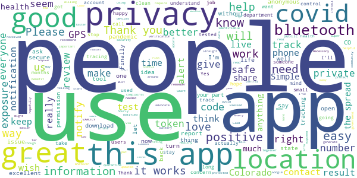
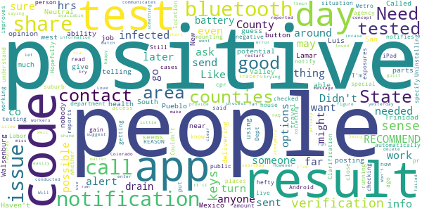
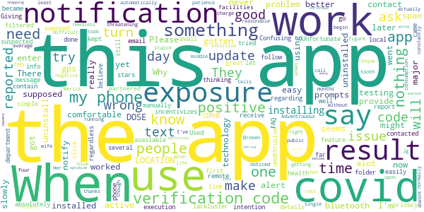

# CO Exposure Notifications
App version ``minted700002``

Analyzed with [covid-apps-observer](http://github.com/covid-apps-observer) project, version ``0.1``

## App overview
| | |
|-------------------------|-------------------------| 
| **Name**                                          | CO Exposure Notifications |
| **Unique identifier** | gov.co.cdphe.exposurenotifications |
| **Link to Google Play** | [https://play.google.com/store/apps/details?id=gov.co.cdphe.exposurenotifications](https://play.google.com/store/apps/details?id=gov.co.cdphe.exposurenotifications) |
| **Summary**  | Colorado's official Exposure Notification app. |
| **Privacy policy** | [https://www.colorado.gov/pacific/cdphe/exposure-notifications-privacy-policy](https://www.colorado.gov/pacific/cdphe/exposure-notifications-privacy-policy) |
| **Latest version** | minted700002 |
| **Last update** | 2021-04-15 21:12:24 |
| **Recent changes** |  Bug fixes and performance improvements |
| **Installs**  | 100,000+ |
| **Category** | Medical |
| **First release** | Oct 16, 2020 |
| **Size**  | 10M |
| **Supported Android version**  | 5.0 and up |

### Description
> CO Exposure Notifications is the official Exposure Notifications app of Colorado and the Colorado Department of Public Health and Environment. Exposure Notifications is a voluntary new service developed in partnership with Google and Apple to help slow the spread of COVID-19. No GPS, location information or personal identifiers will ever be collected, stored or shared by this service. 
 CO Exposure Notifications can quickly notify you if you've likely been exposed to COVID-19. Knowing about a potential exposure allows you to reduce the risk to your family, friends, neighbors and community.
 By enabling Exposure Notifications, whenever you are within 6 feet of someone for at least 10 minutes, both phones will exchange secure, anonymous tokens using Bluetooth. If another user you’ve been near tests positive for COVID-19, they can upload their result to the app which will send a push notification to you and anyone else their phone has exchanged tokens with recently, notifying you to a possible exposure. 
 If you test positive, you can easily and anonymously notify others to help stop the spread of COVID-19. 
 To learn more, please visit https://covid19.colorado.gov/Exposure-notifications

### User interface
The developers of the app provide the following screenshots in the Google play store.
| | | |
|:-------------------------:|:-------------------------:|:-------------------------:|
 |   |   |   | 
 |  

## Development team
In the following we report the main information provided by the development team in the Google play store.

| | |
|-------------------------|-------------------------|
| **Developer**  | Colorado Department of Public Health & Environment |
| **Website**  | [https://covid19.colorado.gov/Exposure-notifications](https://covid19.colorado.gov/Exposure-notifications) |
| **Email** | CO_Exposure_Notifications@state.co.us |
| **Physical address**  | - |
| **Other developed apps**  | [https://play.google.com/store/apps/developer?id=Colorado+Department+of+Public+Health+%26+Environment](https://play.google.com/store/apps/developer?id=Colorado+Department+of+Public+Health+%26+Environment) |

## Android support

| | |
|-------------------------|-------------------------|
| **Declared target Android version**  | Android10, version 10 (API level 29) |
| **Effective target Android version**  | Android10, version 10 (API level 29) |
| **Minimum supported Android version**  | Lollipop, version 5.0 (API level 21) |
| **Maximum target Android version**  | - |

The larger the difference between the minimum and maximum supported Android versions, the better. A larger difference means a wider audience. For example, old phones have a very low Android version, so a high minimum supported Android version means that the app cannot be used by users with old phones, thus leading to accessibility problems. 

## Requested permissions

In the following we report the complete list of the permissions requested by the app. 

| **Permission** | **Protection level** | **Description** | 
|-------------------------|-------------------------|-------------------------|
 **android.permission ACCESS_NETWORK_STATE** | Normal | Allows applications to access information about networks. 
 **android.permission BLUETOOTH** | Normal | Allows applications to connect to paired bluetooth devices. 
 **android.permission FOREGROUND_SERVICE** | Normal | Allows a regular application to use Service.startForeground. 
 **android.permission INTERNET** | Normal | Allows applications to open network sockets. 
 **android.permission RECEIVE_BOOT_COMPLETED** | Normal | Allows an application to receive the Intent.ACTION_BOOT_COMPLETED that is broadcast after the system finishes booting. 
 **android.permission WAKE_LOCK** | Normal | Allows using PowerManager WakeLocks to keep processor from sleeping or screen from dimming. 

## Mentioned servers

| **Server** | **Registrant** | **Registrant country** | **Creation date** | 
|-------------------------|-------------------------|-------------------------|-------------------------|
 | google.com | Google LLC | :us: US | 1997-09-15 04:00:00 |

## Security analysis 

Below we report the main security warnings raised by our execution of the [Androwarn](https://github.com/maaaaz/androwarn) security analysis tool.

**Telephony identifiers leakage**
> - This application reads the ISO country code equivalent of the current registered operator's MCC (Mobile Country Code) 

**Connection interfaces exfiltration**
> - This application reads details about the currently active data network 
> - This application tries to find out if the currently active data network is metered 

**Suspicious connection establishment**
> - This application opens a Socket and connects it to the remote address 'timeout' on the 'N/A' port  

**Code execution**
> - This application loads a native library: 'prioclient' 

## User ratings and reviews

Below we provide information about how end users are reacting to the app in terms of ratings and reviews in the Google Play store.

### Ratings

The CO Exposure Notifications app has been installed by more than **100000** times. At this time, **730** rated the app and its average score is **3.63**. Below we show the distribution of the ratings across the usual star-based rating of Google Play

:star::star::star::star::star:: 417

:star::star::star::star:: 36

:star::star::star:: 51

:star::star:: 43

:star:: 183

### Reviews 

#### 5-star reviews

> Must be workin', still ain't got the 'rona.  :date: __2021-04-18 00:36:10__

> Would help if people would use this..  :date: __2021-04-16 00:52:19__

> Great information to have with so much going on its hard to keep up! This will make it a little bit easier!😊  :date: __2021-04-14 05:15:14__

> An essential app for public health. I received an exposure alert in November and it was very helpful. The bluetooth proximity sensor is a clever way to contact trace while maintaining privacy for users. I wish I could dismiss the "unable to check for exposures" alert that appears hourly if your bluetooth is off. I only have bluetooth on/exposure alerts enabled when I am at work around other people or out grocery shopping. When I am at home, alone, not doing anything or going out because there's a global pandemic, I wish this app would stop bugging me to turn on bluetooth. This was not previously an issue. I can understand this from a public health perspective- you want to avoid people forgetting to turn the app off. But really, the hourly reminders are very annoying and actually unnecessary for a lot of users.  :date: __2021-03-30 21:08:44__

> Elpata  :date: __2021-03-06 05:27:02__

> I think  :date: __2021-03-03 20:07:33__

> I had it for months and thought it didn't work until I got a message that I was exposed on a trip! It only works if more people download it, use it and report if they test positive. It helped me to notify my job and quarantine effectively.  :date: __2021-02-28 10:33:55__

> People hack my account  :date: __2021-02-23 08:01:47__

> Great app!!!  :date: __2021-02-18 09:51:27__

> Great.  :date: __2021-02-17 19:29:50__

#### 4-star reviews

> Cool  :date: __2021-04-07 01:37:54__

> Good  :date: __2021-03-18 18:03:16__

> Thanks keep us informed?  :date: __2021-02-05 23:11:31__

> Dunno if there's anything I can reasonably say about it useful.  :date: __2021-01-28 03:03:37__

> Not sure if it works. Haven't received any notifications after nearly three weeks. There is likely not enough people using this app, and the ones who do use it also use masks and social distancing. It's the ones that don't (use masks, social distance or use this app) you gotta watch out for.  :date: __2020-12-18 07:25:48__

> It's helpful  :date: __2020-12-07 07:54:07__

> I would like the app to have some way to tell me that I have exchanged tokens with someone, maybe giving me a total for a day. No details, just some indication that the app is doing its job.  :date: __2020-11-20 08:25:57__

> It does work for sharing a positive result! But don't go into the app because you'll get stopped at the verification code part. Instead wait for a text message from the health department - click on that link and follow the steps. It does share that way! You'll even see evidence that it was shared in the app. Would have given 5 stars but no explanation about the verification code or follow up text was given.  :date: __2020-11-19 19:19:46__

> Interesting stuff  :date: __2020-11-03 04:21:26__

> Great concept but kills my battery. I do have an old phone though so that may be the issue.  :date: __2020-10-27 15:53:56__

#### 3-star reviews

> Not sure  :date: __2021-04-12 09:32:09__

> No Need  :date: __2021-04-08 22:47:34__

> Neutral opinion of this app  :date: __2021-02-26 22:31:53__

> Didn't give me the ability to alert potential contact (button didn't work)  :date: __2021-01-02 06:48:03__

> Like  :date: __2020-12-12 07:54:21__

> I guess a good app but nobody in my area seems to be using it or posting a positive result in Pueblo County or other counties that I travel to for my job delivering parts, go far as Lamar, west to the San Luis Valley and South to Walsenburg, Trinidad and into New Mexico and you're telling me that I have not been near someone with a positive test result????  :date: __2020-12-11 20:39:25__

> Haven't been able to get much info  :date: __2020-12-06 18:50:05__

> Called county health department to ask about notification & special code issue. RESULTS: 1) testing agency reports positive tests to the State 2) State notifies counties in which the positive people live 3) w/in 24 hrs, counties notify people who tested positive 4)w/in 48 hrs (cases are mounting),Contact Tracers call infected people & ask w/whom they have been in contact. NO REASON for infected people to need code. Call Labor Dept if there's a work issue. RECOMMEND: call people who know things.  :date: __2020-11-20 20:45:59__

> People have said they can't get a verification code that is needed to send an alert. I just read (11-18-20, cpr) that this code should now be sent automatically. Hopefully this improves the situation.  :date: __2020-11-19 15:15:54__

> I can't specify my area nor can I put in a result whether I'm positive or negative. Need to understand what code they want. Also if it only sense through bluetooth I don't want to be that close to someone if possible. There should be more options in Android app. Couldn't get my iPad to gain access so not sure how others are getting info even if it may be places I may go in the Metro or suburb area. Clarification needed pr more options.  :date: __2020-11-19 03:31:37__

#### 2-star reviews

> How do you get a verification code?  :date: __2021-04-13 19:46:52__

> I don't know what this app was supposed to do but so far it's done absolutely nothing regarding Covid-19 exposure. When I was exposed, it didn't alert me. When that exposure was reported to the local health department, it still didn't let me know. When I tried to manually update the app with exposure details ... well, that's not a feature so again I have to ask: what's this app supposed to do? Giving it two stars because I believe the intention was good but the execution was lackluster.  :date: __2021-04-12 00:41:30__

> Used to only notify you once about bluetooth, now does it all the time. That incentivizes me to uninstall since you cannot turn that notification off. Unfortunate.  :date: __2021-03-18 04:36:52__

> Confusing app. When you go to notify the app you have covid it prompts you to enter a notification code. But the text message you receive doesn't contain a code, but a link you click on and follow prompts. The text I got after testing positive came 2 days later and was in a spam folder (I didn't know my phone filtered suspected spam). So I kept thinking I didn't have the verification code & contacted CDPHE several times to no avail. They should email the info too & have an FAQ on the app.  :date: __2021-02-19 19:43:17__

> This app doesn't work. I installed it when it first became available. It has never once in all that time reported an exposure regardless of how remote the exposure might be.  :date: __2021-02-03 23:39:55__

> The app seems great (simple, unobtrusive, easy to use, no major privacy issues) but what good is the app if people can't easily report their covid results? Why haven't they partnered with testing facilities to provide this code automatically upon getting a positive result? I've had this app for months and haven't gotten a single notification ever  :date: __2021-01-10 00:52:39__

> Adventrouous to say the least  :date: __2021-01-08 06:45:13__

> The reasonable use of this app doesnt make sense  :date: __2021-01-08 00:14:51__

> My phone hasn't worked right since..tells my blue tooth is off when it's on..stupid  :date: __2021-01-01 08:45:40__

> 👌  :date: __2020-12-23 09:21:28__

#### 1-star reviews

> This app is capable of being better.  :date: __2021-04-02 05:35:07__

> When you actually test positive you cant report it if you open the test results to see for yourself, as the code is one time only. so this app is useless.  :date: __2021-04-02 01:16:39__

> Not installing after reading the reviews! Absolutely useless fo collecting anything if you or your programers failed to include a link! As per usual... The government completing another job... well done  :date: __2021-03-31 05:09:19__

> This app was really good at telling me when my GPS was off. Never received any other notifications in the ~6 months that it was installed.  :date: __2021-03-30 18:10:17__

> Intellgince HQ, International Confirmation Grid : to individual users / devices. Focus Efficiency foundation groud 0. Start up.  :date: __2021-03-28 22:21:40__

> Are you freaking kidding me, this just another way of controlling people grow the f up  :date: __2021-03-25 17:58:40__

> To notify somebody if I have been exposed it asks for a verification code that was never given to me....so there's no way for me to notify. It defeats the purpose of having the app.  :date: __2021-03-24 23:56:27__

> I downloaded the app the week it launched and hadn't gotten even one notification by the time I uninstalled it on 3/20. Maybe I'm just ridiculously lucky to have avoided all exposure, but between case numbers, quarantines in my workplace, people not receiving positivity codes, and codes going unused, it seems much more likely that this app doesn't work well in practice. Mostly a waste of phone space, but one star for giving a false sense of contributing to public health.  :date: __2021-03-21 21:38:06__

> I have a question.. If your app uses Bluetooth to recognize other phones and that phone's user's status, what happens if I 'always' listen to music on Bluetooth headphones when out in downtown.. Is your app useless in this situation?  :date: __2021-03-18 07:09:12__

> I was asked to install this by my boss at work but I don't think it works itself? 🤔  :date: __2021-03-18 01:50:21__

