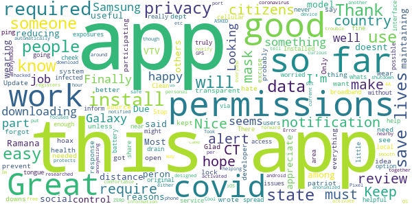

# COVID Alert CT
App version ``minted11017``

Analyzed with [covid-apps-observer](http://github.com/covid-apps-observer) project, version ``0.1``

## App overview
| | |
|-------------------------|-------------------------| 
| **Name**&nbsp;&nbsp;&nbsp;&nbsp;&nbsp;&nbsp;&nbsp;&nbsp;&nbsp;&nbsp;&nbsp;&nbsp;&nbsp;&nbsp;&nbsp;&nbsp;&nbsp;&nbsp;&nbsp;&nbsp;&nbsp;&nbsp;&nbsp;&nbsp;&nbsp;&nbsp;&nbsp;&nbsp;&nbsp;&nbsp;&nbsp;&nbsp;&nbsp;&nbsp;&nbsp;&nbsp;&nbsp;&nbsp;&nbsp;&nbsp;  | COVID Alert CT |
| **Unique identifier** | gov.ct.covid19.exposurenotifications |
| **Link to Google Play** | [https://play.google.com/store/apps/details?id=gov.ct.covid19.exposurenotifications](https://play.google.com/store/apps/details?id=gov.ct.covid19.exposurenotifications) |
| **Summary**  | The official Exposure Notification app for Connecticut |
| **Privacy policy** | [https://portal.ct.gov/coronavirus/COVIDAlertCT/PrivacyPolicy](https://portal.ct.gov/coronavirus/COVIDAlertCT/PrivacyPolicy) |
| **Latest version** | minted11017 |
| **Last update** | 2020-11-09 23:43:36 |
| **Recent changes** | Bug fixes and performance improvements |
| **Installs**  | 10,000+ |
| **Category** | Medical |
| **First release** | Nov 9, 2020 |
| **Size**  | 9.9M |
| **Supported Android version**  | 5.0 and up |

### Description
> COVID Alert CT is the official COVID-19 exposure notification app in the State of Connecticut, supported by the Connecticut Department of Public Health (CDPH). COVID Alert CT helps to contain the spread of COVID-19 by complementing the ongoing contact tracing programs carried out by the State and local health.
 Using COVID Alert CT is voluntary and free of charge. The more people who install and use the app, the more effectively the app can help us to contain the virus.
 Once you install and activate COVID Alert CT and turn on Bluetooth, the app works in the background and exchanges anonymous keys with other devices. Keys are long random strings of characters that are not tied to any personal information. Devices with the app installed will record the keys generated by other devices nearby. The app will record the signal strength, used to estimate the distance between devices, the duration and date of the exposure. To protect the users’ privacy, these keys are only kept on the user’s own device. After 14 days the keys are deleted.
 If a COVID Alert CT user tests positive for COVID-19, they will be able to obtain a verification code from a contact tracer at the State or local health department. The code allows the user to activate the notification function in the app. You must use the verification code in order to report a positive result via the app. This prevents people from falsely reporting positive results, which could generate false exposure notifications. CDPH wants all app users to feel confident that when a possible COVID-19 exposure is received via the app, that it is a real event.
 A positive report warns other app users that were near the infected person in the period close to the time when that person first experienced symptoms of the disease under certain circumstances. If the estimated distance was within six feet, the duration of exposure was at least 15 minutes cumulatively, then the other user receives a notification of a possible exposure. Anyone who receives a notification should follow the guidance in the app for next steps.
 CDPH takes your privacy and confidentiality very seriously. This is why we chose to use the Apple and Google Exposure Notification API. No personal data or location tracking occurs within this app. There is no need for CTDPH to know where or who you are for COVID Alert CT to work.
 The Connecticut COVID Notice Privacy Policy is available at https://portal.ct.gov/coronavirus/COVIDAlertCT/PrivacyPolicy. The use of the app is limited to Connecticut and is subject to Connecticut law.
 Thank you for downloading COVID Alert CT. Together, we can protect our family, friends, neighbors, and colleagues, and keep Connecticut moving forward.
 The app was developed using the Google Apple Exposure Notification API through a collaboration between Google, Apple, the Connecticut Department of Administrative Services (DAS) and CDPH.

### User interface
The developers of the app provide the following screenshots in the Google play store.
| | | |
|:-------------------------:|:-------------------------:|:-------------------------:|
 |   |  

## Development team
In the following we report the main information provided by the development team in the Google play store.

| | |
|-------------------------|-------------------------|
| **Developer**  | CT Department of Public Health |
| **Website**  | [http://ct.gov/covidalertct](http://ct.gov/covidalertct) |
| **Email** | DPH.covidalertct@ct.gov |
| **Physical address**  | [State of Connecticut Department of Public Health 410 Capital Avenue Hartford, CT,  06103](https://www.google.com/maps/search/State%20of%20Connecticut%20Department%20of%20Public%20Health%20410%20Capital%20Avenue%20Hartford,%20CT,%2006103) (Google Maps) |
| **Other developed apps**  | [https://play.google.com/store/apps/developer?id=7682186545769631479](https://play.google.com/store/apps/developer?id=7682186545769631479) |

## Android support

| | |
|-------------------------|-------------------------|
| **Declared target Android version**  | Android10, version 10 (API level 29) |
| **Effective target Android version**  | Android10, version 10 (API level 29) |
| **Minimum supported Android version**  | Lollipop, version 5.0 (API level 21) |
| **Maximum target Android version**  | - |

The larger the difference between the minimum and maximum supported Android versions, the better. A larger difference means a wider audience. For example, old phones have a very low Android version, so a high minimum supported Android version means that the app cannot be used by users with old phones, thus leading to accessibility problems. 

## Requested permissions

In the following we report the complete list of the permissions requested by the app. 

| **Permission** | **Protection level** | **Description** | 
|-------------------------|-------------------------|-------------------------|
 **android.permission ACCESS_NETWORK_STATE** | Normal | Allows applications to access information about networks. 
 **android.permission BLUETOOTH** | Normal | Allows applications to connect to paired bluetooth devices. 
 **android.permission FOREGROUND_SERVICE** | Normal | Allows a regular application to use Service.startForeground. 
 **android.permission INTERNET** | Normal | Allows applications to open network sockets. 
 **android.permission RECEIVE_BOOT_COMPLETED** | Normal | Allows an application to receive the Intent.ACTION_BOOT_COMPLETED that is broadcast after the system finishes booting. 
 **android.permission WAKE_LOCK** | Normal | Allows using PowerManager WakeLocks to keep processor from sleeping or screen from dimming. 

## Mentioned servers

| **Server** | **Registrant** | **Registrant country** | **Creation date** | 
|-------------------------|-------------------------|-------------------------|-------------------------|
 | google.com | Google LLC | :us: US | 1997-09-15 04:00:00 |

## Security analysis 

Below we report the main security warnings raised by our execution of the [Androwarn](https://github.com/maaaaz/androwarn) security analysis tool.

**Telephony identifiers leakage**
> - This application reads the ISO country code equivalent of the current registered operator's MCC (Mobile Country Code) 

**Connection interfaces exfiltration**
> - This application reads details about the currently active data network 
> - This application tries to find out if the currently active data network is metered 

**Suspicious connection establishment**
> - This application opens a Socket and connects it to the remote address 'timeout' on the 'N/A' port  

**Code execution**
> - This application loads a native library: 'prioclient' 

## User ratings and reviews

Below we provide information about how end users are reacting to the app in terms of ratings and reviews in the Google Play store.

### Ratings

The COVID Alert CT app has been installed by more than **10000** times. At this time, **83** rated the app and its average score is **4.0120482**. Below we show the distribution of the ratings across the usual star-based rating of Google Play

:star::star::star::star::star:: 56

:star::star::star::star:: 6

:star::star::star:: 2

:star::star:: 4

:star:: 15

### Reviews 

#### 5-star reviews

> This is a must have for all apps  :date: __2020-11-23 09:07:13__

> Great  :date: __2020-11-22 02:10:48__

> This app is a hoax 😉  :date: __2020-11-22 00:52:58__

> Good  :date: __2020-11-20 02:14:02__

> So far so good, I just hope enough people are downloading this app!  :date: __2020-11-19 05:10:13__

> Clean interface, and it seems to work well so far. Stop the spread!  :date: __2020-11-18 21:45:26__

> Very helpful app  :date: __2020-11-18 14:26:01__

> Its help know whats going on ct...  :date: __2020-11-15 22:15:53__

> Works fine. Hope I never get a ping about being near someone thats infected!  :date: __2020-11-15 20:53:00__

> Seems like they did a good job to make this as anonymous as possible. no permissions are required by the app, which is really nice.  :date: __2020-11-15 17:07:05__

#### 4-star reviews

> Easy to install, but I can't put a shortcut on my home screen. I have to search for it every time I want to open it. Everyone be safe.  :date: __2020-11-19 04:38:11__

> As long as it helps people and can't identify me I'm cool with it. I  :date: __2020-11-17 05:52:00__

> Great app. I was reading Wormwood a book about apocalypse in Connecticut and the app reminded me of the one the main character has in that book. Its also nice to know when its better to just stay home.  :date: __2020-11-15 03:54:15__

> Just DL'd it so i don't know how well it works but WHAT AN AMAZING idea and UTILIZATION of technology! And it's ANONYMOUS!  :date: __2020-11-14 19:01:39__

> Do your part, wear your mask, keep your distance and install the app  :date: __2020-11-13 05:39:02__

> I had no problems downloading this app on my Android phone. The more people who download this app will make this more effective. Will ask friends and family to download as well.  :date: __2020-11-12 23:18:58__

#### 3-star reviews

> Idk I live in milford  :date: __2020-11-14 17:49:59__

> You have to keep your location and Bluetooth on for it to work. That eats up battery. Otherwise it's functional. 🤷🏽‍♀️  :date: __2020-11-13 13:14:31__

#### 2-star reviews

> Can't turn on the exposure notice. Keeps saying something went wrong even Uninstaller it and that didn't work.  :date: __2020-11-17 01:45:13__

> Wont work  :date: __2020-11-16 15:35:46__

> Dont know if realy work  :date: __2020-11-15 06:05:43__

> It ONLY tells if the Bluetooth is ON ? Right... if the person tested positive and the Bluetooth is off dosen't work?  :date: __2020-11-14 18:01:30__

#### 1-star reviews

> Don't bother installing this app or anything WuFlu related because COVID-19 (i.e. WuFlu, Chinavirus) is a hoax, it DOES NOT EXIST. Trump 2020 Keep America Great And Safe!  :date: __2020-11-20 01:35:20__

> This app is worthless! Unless you input positive it will not alert you. There is no way I drive through Waterbury and not 1 alert!!!! What a scam.  :date: __2020-11-19 19:21:24__

> This app dont work at all..i downloud but no said anything at all.  :date: __2020-11-18 14:21:06__

> I got it covid... stay away from me...  :date: __2020-11-15 00:37:45__

> Overreaching, evil tracking, just so govt can get you used to "social tracking" & who you intact with  :date: __2020-11-14 19:21:56__

> Downloaded and went to turn on notifications and it immediately says something went wrong try again  :date: __2020-11-14 19:05:48__

> Cant turn on exposure notification keep getting something went wrong try again  :date: __2020-11-14 17:48:51__

> No. Evil.  :date: __2020-11-14 17:17:46__

> I can't turn on my notifications  :date: __2020-11-14 10:41:20__

> Useless. Reports "something went wrong, try again" endlessly. Thanks for nothing.  :date: __2020-11-14 02:32:50__

