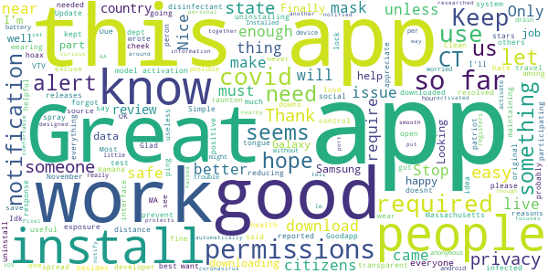
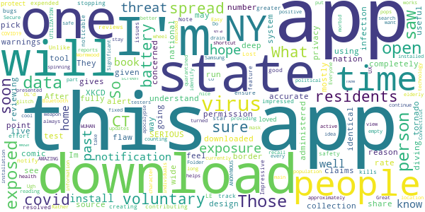
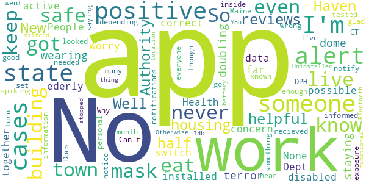
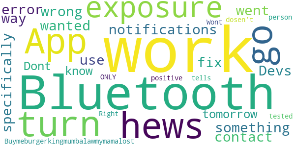
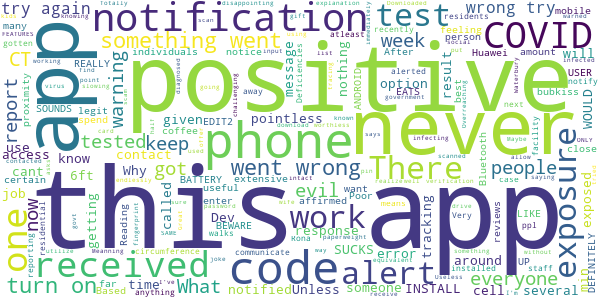

# COVID Alert CT
App version ``minted142003``

Analyzed with [covid-apps-observer](http://github.com/covid-apps-observer) project, version ``0.1``

## App overview
| | |
|-------------------------|-------------------------| 
| **Name**&nbsp;&nbsp;&nbsp;&nbsp;&nbsp;&nbsp;&nbsp;&nbsp;&nbsp;&nbsp;&nbsp;&nbsp;&nbsp;&nbsp;&nbsp;&nbsp;&nbsp;&nbsp;&nbsp;&nbsp;&nbsp;&nbsp;&nbsp;&nbsp;&nbsp;&nbsp;&nbsp;&nbsp;&nbsp;&nbsp;&nbsp;&nbsp;&nbsp;&nbsp;&nbsp;&nbsp;&nbsp;&nbsp;&nbsp;&nbsp;  | COVID Alert CT |
| **Unique identifier** | gov.ct.covid19.exposurenotifications |
| **Link to Google Play** | [https://play.google.com/store/apps/details?id=gov.ct.covid19.exposurenotifications](https://play.google.com/store/apps/details?id=gov.ct.covid19.exposurenotifications) |
| **Summary**  | The official Exposure Notification app for Connecticut |
| **Privacy policy** | [https://portal.ct.gov/coronavirus/COVIDAlertCT/PrivacyPolicy](https://portal.ct.gov/coronavirus/COVIDAlertCT/PrivacyPolicy) |
| **Latest version** | minted142003 |
| **Last update** | 2021-01-14 04:13:40 |
| **Recent changes** | Bug fixes and performance improvements |
| **Installs**  | 100,000+ |
| **Category** | Medical |
| **First release** | Nov 9, 2020 |
| **Size**  | 9.9M |
| **Supported Android version**  | 5.0 and up |

### Description
> COVID Alert CT is the official COVID-19 exposure notification app in the State of Connecticut. It is supported by the Connecticut Department of Public Health (CT-DPH). COVID Alert CT helps to contain the spread of COVID-19 by complementing the ongoing contact tracing programs carried out by the State and local health departments.
 Using COVID Alert CT is voluntary and free of charge. The more people who install and use the app, the more effectively the app can help us to contain and slow the spread of the virus.
 Once you install and activate COVID Alert CT and turn on Bluetooth, the app works in the background and exchanges anonymous keys with other devices. Keys are long random strings of characters that are not tied to any personal information. Phones will record the keys generated by other phones nearby with the app installed. The app will record the:
  -  signal strength, and use that  to estimate the distance between devices, 
  -  duration of the contact and 
  -  date of the exposure. 
 To protect the users’ privacy, these keys are only kept on the user’s own device. After 14 days the keys are deleted.
 If a COVID Alert CT user tests positive for COVID-19, they will be able to obtain a verification code from a contact tracer at the State DPH or local health department. The code allows the user to activate the notification function in the app. You must use the verification code in order to report a positive result via the app. This prevents people from falsely reporting positive results, and false exposure notifications. CT-DPH wants all app users to feel confident that when a possible COVID-19 exposure is received via the app, that it is a real event.
 A positive report warns other app users that were near the infected person in the period close to the time when that person first experienced symptoms of the disease under certain circumstances. If the estimated distance was within six feet, the duration of exposure was at least 15 minutes cumulatively, then the other user receives a notification of a possible exposure. Anyone who receives a notification should follow the guidance in the app for next steps.
 CT-DPH takes your privacy and confidentiality very seriously. This is why we chose to use the Apple and Google Exposure Notification API. No personal data or location tracking occurs within this app. There is no need for CT-DPH to know where or who you are, for COVID Alert CT to work.
 The Connecticut COVID Notice Privacy Policy is available at https://portal.ct.gov/coronavirus/COVIDAlertCT/PrivacyPolicy. The use of the app is limited to Connecticut and is subject to Connecticut law.
 Thank you for downloading COVID Alert CT. Together, we can protect our family, friends, neighbors, and colleagues, and keep Connecticut moving forward.
 The app was developed using the Google / Apple Exposure Notification API through a collaboration between Google, Apple, the Connecticut Department of Administrative Services (DAS) and CT-DPH.

### User interface
The developers of the app provide the following screenshots in the Google play store.
| | | |
|:-------------------------:|:-------------------------:|:-------------------------:|
 |   |  

## Development team
In the following we report the main information provided by the development team in the Google play store.

| | |
|-------------------------|-------------------------|
| **Developer**  | CT Department of Public Health |
| **Website**  | [http://ct.gov/covidalertct](http://ct.gov/covidalertct) |
| **Email** | DPH.covidalertct@ct.gov |
| **Physical address**  | [State of Connecticut Department of Public Health 410 Capital Avenue Hartford, CT,  06103](https://www.google.com/maps/search/State%20of%20Connecticut%20Department%20of%20Public%20Health%20410%20Capital%20Avenue%20Hartford,%20CT,%2006103) (Google Maps) |
| **Other developed apps**  | [https://play.google.com/store/apps/developer?id=7682186545769631479](https://play.google.com/store/apps/developer?id=7682186545769631479) |

## Android support

| | |
|-------------------------|-------------------------|
| **Declared target Android version**  | - |
| **Effective target Android version**  | - |
| **Minimum supported Android version**  | Lollipop, version 5.0 (API level 21) |
| **Maximum target Android version**  | - |

The larger the difference between the minimum and maximum supported Android versions, the better. A larger difference means a wider audience. For example, old phones have a very low Android version, so a high minimum supported Android version means that the app cannot be used by users with old phones, thus leading to accessibility problems. 

## Requested permissions

In the following we report the complete list of the permissions requested by the app. 

| **Permission** | **Protection level** | **Description** | 
|-------------------------|-------------------------|-------------------------|
 **android.permission ACCESS_NETWORK_STATE** | Normal | Allows applications to access information about networks. 
 **android.permission BLUETOOTH** | Normal | Allows applications to connect to paired bluetooth devices. 
 **android.permission FOREGROUND_SERVICE** | Normal | Allows a regular application to use Service.startForeground. 
 **android.permission INTERNET** | Normal | Allows applications to open network sockets. 
 **android.permission RECEIVE_BOOT_COMPLETED** | Normal | Allows an application to receive the Intent.ACTION_BOOT_COMPLETED that is broadcast after the system finishes booting. 
 **android.permission WAKE_LOCK** | Normal | Allows using PowerManager WakeLocks to keep processor from sleeping or screen from dimming. 

## Mentioned servers

| **Server** | **Registrant** | **Registrant country** | **Creation date** | 
|-------------------------|-------------------------|-------------------------|-------------------------|
 | google.com | Google LLC | :us: US | 1997-09-15 04:00:00 |

## Security analysis 

Below we report the main security warnings raised by our execution of the [Androwarn](https://github.com/maaaaz/androwarn) security analysis tool.

**Telephony identifiers leakage**
> - This application reads the ISO country code equivalent of the current registered operator's MCC (Mobile Country Code) 

**Connection interfaces exfiltration**
> - This application reads details about the currently active data network 
> - This application tries to find out if the currently active data network is metered 

**Suspicious connection establishment**
> - This application opens a Socket and connects it to the remote address 'timeout' on the 'N/A' port  

**Code execution**
> - This application loads a native library: 'prioclient' 

## User ratings and reviews

Below we provide information about how end users are reacting to the app in terms of ratings and reviews in the Google Play store.

### Ratings

The COVID Alert CT app has been installed by more than **100000** times. At this time, **195** rated the app and its average score is **3.5882354**. Below we show the distribution of the ratings across the usual star-based rating of Google Play

:star::star::star::star::star:: 100

:star::star::star::star:: 23

:star::star::star:: 13

:star::star:: 11

:star:: 48

### Reviews 

#### 5-star reviews

> Everyones  :date: __2021-01-31 12:48:10__

> Simple app. 5 stars because it works but more people need to download. Stop uninstalling because there is not enough people. Install and let it work. Only need to do something if you test positive.  :date: __2021-01-25 02:49:04__

> Great  :date: __2021-01-13 22:30:19__

> Idk what to do with the app  :date: __2020-12-23 06:42:32__

> Good.  :date: __2020-12-17 16:25:14__

> The exposure notification activation issue I reported in November seems to be resolved. Thanks!  :date: __2020-12-14 09:08:08__

> I love it  :date: __2020-12-13 06:24:14__

> Keep the people alert!  :date: __2020-12-09 19:44:17__

> Goodapp  :date: __2020-12-06 21:16:46__

> The best thing that ever came out  :date: __2020-12-03 14:20:19__

#### 4-star reviews

> The way I understand it, you only get notifications if an exposed person has downloaded this app and gives permission to share data. Those who have been exposed but saw no alert, the person may not have had this app. The app is only as accurate as the number of people using it; it's open-source data collection and completely voluntary. More residents should download this app.  :date: __2021-01-11 14:26:59__

> Just saw  :date: __2021-01-01 16:25:39__

> I'm not sure how to rate this app (see the XKCD comic on tornado warnings). I'm mostly reviewing to point out a SERIOUS flaw in the design of this app. I live on the border w/ NY. NY has it's own identical app. I can not run both apps at the same time. So I have to pick between CT or NY. What is the reason for this and why is this administered by the states at all? Why isn't there a national app?  :date: __2020-12-19 03:49:17__

> They should have a nation wide one not state by state  :date: __2020-12-19 01:29:15__

> Im not going to test this app.  :date: __2020-12-12 15:53:24__

> After deep diving the privacy claims of this app, I feel given it's a fully voluntary system that if you're concerned about covid-19 infection/spread, this app is a useful tool to protect yourself/loved ones while also contributing to the greater good by stopping the spread. Unlike other w reviews, I have had no noticable battery issues B-LE feature on my Note 9. Lost 1 star for some UX bugs I'm sure will be resolved soon.  :date: __2020-12-02 01:47:48__

> Impressive. I am impressed at the effort expended by the State of CT to ensure the safety of its residents, creating an app to track and notify exposure to the threat of a virus that kills approximately 1% of the population (not counting the elderly and those co-morbid), and at the same time continue with the virus-turned-political-weapon that is the COVID19/WUHAN virus. I recall an era when individuals whom presented a threat to the health of others were the ones quarantined. Ugh.  :date: __2020-12-01 11:16:10__

> I hope this updates with past exposures/past positive testers too since I just installed it & it's only providing new reports, of which it's currently empty. Also hope the Samsung Secure Folder installation glitch will be fixed soon.  :date: __2020-11-28 20:25:25__

> Bluetooth and location are always on. Significant battery drain. When a covid notification pops up, it does not take you to view that information. Rather you have to download the active app or you just get a spinning wheel.  :date: __2020-11-27 02:19:50__

> Easy to install, but I can't put a shortcut on my home screen. I have to search for it every time I want to open it. Everyone be safe.  :date: __2020-11-19 04:38:11__

#### 3-star reviews

> It was helpful then all the reviews got positive.Well I live in housing Authority in New Haven and half the building is not being safe not wearing mask it's a terror dome. I'm doubling up on my mask staying safe as possible. The Health Dept.should do more for the ederly and disabled. So as far as I'm concern this app just eat up my data. So No  :date: __2021-01-24 21:32:35__

> None of these apps work together. People should not have to worry if they have the correct states app installed and active, then have to switch between apps depending on what state they are in.  :date: __2021-01-06 04:18:51__

> I never recieved an alert even though I have it set up to alert me. It did notify inside the app but I would have never known if I hadn't looked.  :date: __2020-12-28 04:23:47__

> Someone in my building tested positive but I got no alert.  :date: __2020-12-18 08:41:41__

> Is this app just for CT? Does it work in Maine? I've had it for a month and no notifications as cases are spiking here.  :date: __2020-12-12 02:17:02__

> I'm glad the State is doing this, but being near someone's app isn't enough. Not everyone has the app. Why aren't we informed of cases in our town? No personal information needed. I know someone who is positive, and that would be good to know how many, if any cases are in my town w/o having to go to DPH.  :date: __2020-12-04 18:36:41__

> Can't turn on the exposure notice. Keeps saying something went wrong even Uninstaller it and that didn't work. It stopped doing that thing  :date: __2020-11-25 22:32:03__

> Idk I live in milford  :date: __2020-11-14 17:49:59__

> You have to keep your location and Bluetooth on for it to work. That eats up battery. Otherwise it's functional. 🤷🏽‍♀️  :date: __2020-11-13 13:14:31__

#### 2-star reviews

> hews  :date: __2020-12-08 00:30:36__

> App does not work! I go to turn on exposure notifications and I get the error "something went wrong" and no way to contact Devs of how to fix this. I wanted to specifically use this while out tomorrow.  :date: __2020-12-03 08:05:04__

> Dont know if it work...  :date: __2020-12-01 07:07:08__

> Buymeburgerkingmumbalawmymamalost  :date: __2020-11-28 17:27:46__

> Wont work  :date: __2020-11-16 15:35:46__

> It ONLY tells if the Bluetooth is ON ? Right... if the person tested positive and the Bluetooth is off dosen't work?  :date: __2020-11-14 18:01:30__

#### 1-star reviews

> I cant use it on my Huawei mobile...  :date: __2021-02-01 07:04:59__

> BEWARE!! EATS UP BATTERY !!  :date: __2021-01-31 08:37:46__

> No. Evil. After response: affirmed evil.  :date: __2021-01-27 14:25:57__

> What code do I have to enter? I was never given one. EDIT2: It's been more than 2 weeks since I got my test so it's pointless now. As far as "feeling" I didn't get a coffee, I was legit never given one.  :date: __2021-01-27 02:39:40__

> No, don't want it  :date: __2021-01-26 19:47:56__

> Poor, at best. I know I have been in close proximity to many individuals who have tested positive. Never once have i been notified. There is 1 person I know for certain and I spend an extensive amount of time with. I should have received a notice. I got bubkiss.  :date: __2021-01-14 18:58:55__

> IT REALLY SOUNDS LIKE THIS APP SUCKS.!!! Reading the reviews I DEFINITELY WOULD NOT INSTALL THIS ON MY PHONE. 👎 👎 👎 FROM AN ANDROID USER.  :date: __2021-01-11 21:31:10__

> Not useful at all. Based on responses by the Dev, this app uses Bluetooth to communicate with other phones that have the app and are atleast 6ft from you for 15 min...that means if someone is in my 6ft circumference and has COVID but walks away before the 15 min, the app won't notify me?  :date: __2021-01-11 17:20:45__

> It's my job to be next to people with the 'Rona and not once have I gotten an alert.  :date: __2021-01-09 03:44:53__

> This App does nothing, I have been in contact with several people who had tested positive for COVID and this app did not alert me to anything.  :date: __2021-01-07 22:50:37__

