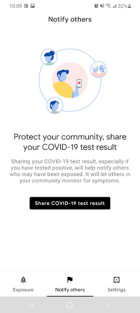
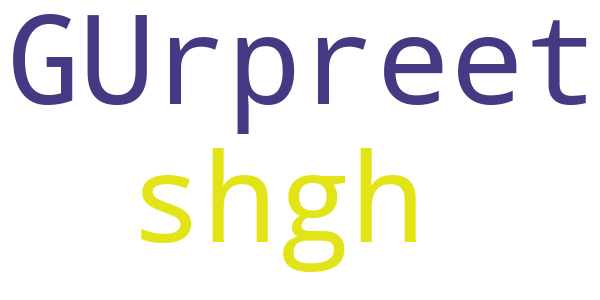
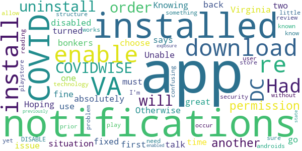

# DC CAN
App version ``minted14013``

Analyzed with [covid-apps-observer](http://github.com/covid-apps-observer) project, version ``0.1``

## App overview
| | |
|-------------------------|-------------------------| 
| **Name**&nbsp;&nbsp;&nbsp;&nbsp;&nbsp;&nbsp;&nbsp;&nbsp;&nbsp;&nbsp;&nbsp;&nbsp;&nbsp;&nbsp;&nbsp;&nbsp;&nbsp;&nbsp;&nbsp;&nbsp;&nbsp;&nbsp;&nbsp;&nbsp;&nbsp;&nbsp;&nbsp;&nbsp;&nbsp;&nbsp;&nbsp;&nbsp;&nbsp;&nbsp;&nbsp;&nbsp;&nbsp;&nbsp;&nbsp;&nbsp;  | DC CAN |
| **Unique identifier** | gov.dc.covid19.exposurenotifications |
| **Link to Google Play** | [https://play.google.com/store/apps/details?id=gov.dc.covid19.exposurenotifications](https://play.google.com/store/apps/details?id=gov.dc.covid19.exposurenotifications) |
| **Summary**  | DC CAN is the official COVID-19 exposure notification app. |
| **Privacy policy** | [https://coronavirus.dc.gov/dccan/privacy](https://coronavirus.dc.gov/dccan/privacy) |
| **Latest version** | minted14013 |
| **Last update** | 2020-11-30 20:38:40 |
| **Recent changes** | Bug fixes and performance improvements |
| **Installs**  | 10,000+ |
| **Category** | Medical |
| **First release** | Oct 15, 2020 |
| **Size**  | 9.9M |
| **Supported Android version**  | 5.0 and up |

### Description
> DC CAN is the official COVID-19 exposure-notifications software for the District of Columbia in partnership with the Department of Health (DC Health). The app is an instance of Exposure Notifications Express platform developed by Apple and Google and configured by DC Health.
 Your personal use of DC CAN will help anonymously alert DC residents who may have been near someone with a positive COVID-19 diagnosis. When you enable DC CAN, you are doing your part to efficiently and effectively help your community slow the spread of COVID-19.
 How DC CAN Works:
 When devices with DC CAN are in close contact, they exchange random identifiers using Bluetooth Low Energy (BLE). When someone tells their app that they tested positive for COVID-19, whoever received their random identifiers may receive an alert that they may have possibly been exposed to COVID-19. When a device receives random identifiers it date-stamps them and records their signal strength so that the Exposure Notification system can estimate how close the two devices were to each other and for how long. If the timeframe was at least 15 minutes and the estimated distance was within six feet, then the other user receives a notification of a possible exposure.
 Apple and Google's Exposure Notifications framework runs in the background, even when the DC CAN app is closed. It will not drain the device battery at a rate that would occur with other apps that use normal Bluetooth and/or are open and running constantly.
 How DC CAN Protects Your Privacy:
 DC Health takes your privacy and confidentiality very seriously. Apple and Google's framework is designed to avoid correlating any personal data and location information with the random identifiers that devices exchange. DC Health does not want or need to know where or who you are for DC CAN to work. If you are close enough to another app user, your device's BLE will exchange random identifiers with that user.
 Laboratory results for all persons who test positive for COVID-19 are sent to DC Health. This is not associated with the app. Our staff follows up with persons reported as positive, based on information provided within the laboratory report. As a courtesy to all app users, DC Health will verify positive tests and then provide DC CAN users with a personal identifying number (PIN). You must use that PIN in order to report a positive result to the app. This prevents people from falsely reporting positive results, which could generate false exposure notifications. DC Health wants all app users to feel confident that when a possible COVID-19 exposure is received via the app, that it is a real event.
 If you have the current Apple or Google operating system installed on your device, you may have noticed that Exposure Notifications are now included. You cannot enable this function until you have installed Washington's DC CAN app. Apple and Google will delete the exposure notification service tools from their respective operating systems once the pandemic reaches a point that public health no longer requires the use of this technology.
 Thank you for installing DC CAN! Together, we can protect our family, friends, neighbors, and colleagues, and keep DC moving forward!

### User interface
The developers of the app provide the following screenshots in the Google play store.
| | | |
|:-------------------------:|:-------------------------:|:-------------------------:|
 |   |  

## Development team
In the following we report the main information provided by the development team in the Google play store.

| | |
|-------------------------|-------------------------|
| **Developer**  | DC Exposure Notifications |
| **Website**  | - |
| **Email** | dc.exposure-notifications@dc.gov |
| **Physical address**  | - |
| **Other developed apps**  | [https://play.google.com/store/apps/developer?id=DC+Exposure+Notifications](https://play.google.com/store/apps/developer?id=DC+Exposure+Notifications) |

## Android support

| | |
|-------------------------|-------------------------|
| **Declared target Android version**  | - |
| **Effective target Android version**  | - |
| **Minimum supported Android version**  | Lollipop, version 5.0 (API level 21) |
| **Maximum target Android version**  | - |

The larger the difference between the minimum and maximum supported Android versions, the better. A larger difference means a wider audience. For example, old phones have a very low Android version, so a high minimum supported Android version means that the app cannot be used by users with old phones, thus leading to accessibility problems. 

## Requested permissions

In the following we report the complete list of the permissions requested by the app. 

| **Permission** | **Protection level** | **Description** | 
|-------------------------|-------------------------|-------------------------|
 **android.permission ACCESS_NETWORK_STATE** | Normal | Allows applications to access information about networks. 
 **android.permission BLUETOOTH** | Normal | Allows applications to connect to paired bluetooth devices. 
 **android.permission FOREGROUND_SERVICE** | Normal | Allows a regular application to use Service.startForeground. 
 **android.permission INTERNET** | Normal | Allows applications to open network sockets. 
 **android.permission RECEIVE_BOOT_COMPLETED** | Normal | Allows an application to receive the Intent.ACTION_BOOT_COMPLETED that is broadcast after the system finishes booting. 
 **android.permission WAKE_LOCK** | Normal | Allows using PowerManager WakeLocks to keep processor from sleeping or screen from dimming. 

## Mentioned servers

| **Server** | **Registrant** | **Registrant country** | **Creation date** | 
|-------------------------|-------------------------|-------------------------|-------------------------|
 | google.com | Google LLC | :us: US | 1997-09-15 04:00:00 |

## Security analysis 

Below we report the main security warnings raised by our execution of the [Androwarn](https://github.com/maaaaz/androwarn) security analysis tool.

**Telephony identifiers leakage**
> - This application reads the ISO country code equivalent of the current registered operator's MCC (Mobile Country Code) 

**Connection interfaces exfiltration**
> - This application reads details about the currently active data network 
> - This application tries to find out if the currently active data network is metered 

**Suspicious connection establishment**
> - This application opens a Socket and connects it to the remote address 'timeout' on the 'N/A' port  

**Code execution**
> - This application loads a native library: 'prioclient' 

## User ratings and reviews

Below we provide information about how end users are reacting to the app in terms of ratings and reviews in the Google Play store.

### Ratings

The DC CAN app has been installed by more than **10000** times. At this time, **61** rated the app and its average score is **4.2131147**. Below we show the distribution of the ratings across the usual star-based rating of Google Play

:star::star::star::star::star:: 44

:star::star::star::star:: 4

:star::star::star:: 2

:star::star:: 4

:star:: 7

### Reviews 

#### 5-star reviews

> Clear  :date: __2021-01-22 00:09:48__

> The app will work when you get tested by the DC run corona virus testing sites. If you go to private clinic there is no guarantee you will get a verification code if you test positive for covid. The private clinics are supposed to report results to the city health dept but if they don't do that you won't get a call from a contract tracer or a verification code to change your status in the app if you are positive. Go to DC health run testing sites and use this app, and then it works well.  :date: __2020-12-26 22:28:01__

> Grand opening of justice  :date: __2020-12-23 00:56:24__

> Good  :date: __2020-12-16 15:47:33__

> greattonow#loveallwayd 🌏🏟  :date: __2020-12-02 14:29:29__

> Trying for the first time.  :date: __2020-11-11 06:18:20__

> It's good I like it,  :date: __2020-11-03 03:08:46__

> The simplest covid notification app. Everything is set up already for you. OPEN and start using the app. 5/5 stars for this app. 👍👍  :date: __2020-10-31 05:52:58__

> Perfectly protected  :date: __2020-10-25 10:58:04__

> Super important stuff!!!  :date: __2020-10-25 02:28:05__

#### 4-star reviews

> GUrpreet shgh  :date: __2020-10-21 19:58:46__

#### 3-star reviews

No recent reviews available with 3 stars.

#### 2-star reviews

> App installed fine. I disabled notifications in Virginia app first, installed DC app, but when I go back to VA app it says I can only have notifications turned on for one at a time. ... Knowing the two don't talk to each other, this situation is absolutely bonkers.  :date: __2020-10-31 06:57:32__

> Had to uninstall VA COVIDWISE in order to download. Unable to enable notifications from both apps; must choose 1 or the other. Hoping this permissions issue will be fixed. Otherwise great use of technology!  :date: __2020-10-20 21:58:15__

> In order to get this app to download, I had to uninstall VA's COVIDWISE app and re-install after the DC CAN app was installed (and then re-enable notifications for both apps once they were both installed). I'm sure this has something to do with androids security permission structure - but it was a little confusing (and I wouldn't have known to do it without reading another user's playstore review).  :date: __2020-10-20 18:40:04__

> don't know if it works yet, but Install problem. You need to DISABLE COVID notifications prior to install or it will not allow you to download through play store. This could occur if (like me) you have previously installed another state's COVID app and have enabled COVID notifications. Once installed you can re-enable COVID exposure notifications.  :date: __2020-10-20 06:51:41__

#### 1-star reviews

> Update - My building said a worker tested positive for Covid. Booted up app. Still says NO Exposures. Clearly app does not work. App does nothing except bug me when location is off. As soon as I turn location on app says no cases. What's the point?  :date: __2021-01-05 20:49:03__

> Screw you. Screw you. Screw you.  :date: __2020-12-21 04:12:29__

> Don't understand why it needs to enable my Bluetooth. I'm not leaving my Bluetooth on. Not happening. I'm not worried about the PLANdemic / SCAMdemic.  :date: __2020-11-17 03:16:53__

> Tried enabling to help software work, continues to buffer. Any suggestions?  :date: __2020-11-07 14:13:58__

> Won't turn on, error message even after multiple updates.  :date: __2020-11-02 17:39:15__

> Can't turn on exposure notifications  :date: __2020-10-25 04:01:29__

> Dumb.  :date: __2020-10-23 04:32:03__

> Only works if I pass someone with this app who has been confirmed positive ANNND is close enough for our devices to send info...they would have to be out and about knowing they have Covid-19??? 🤔  :date: __2020-10-20 08:37:20__

