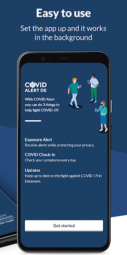
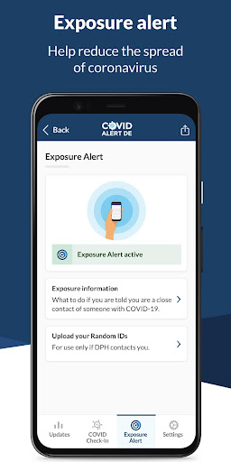
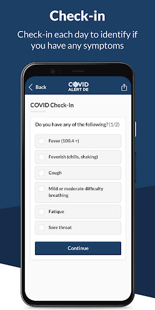
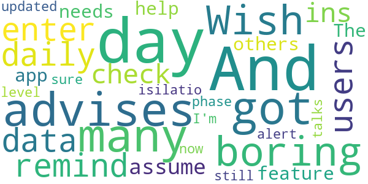

# Covid Alert DE
App version ``1.2.2``

Analyzed with [covid-apps-observer](http://github.com/covid-apps-observer) project, version ``0.1``

## App overview
| | |
|-------------------------|-------------------------| 
| **Name**&nbsp;&nbsp;&nbsp;&nbsp;&nbsp;&nbsp;&nbsp;&nbsp;&nbsp;&nbsp;&nbsp;&nbsp;&nbsp;&nbsp;&nbsp;&nbsp;&nbsp;&nbsp;&nbsp;&nbsp;&nbsp;&nbsp;&nbsp;&nbsp;&nbsp;&nbsp;&nbsp;&nbsp;&nbsp;&nbsp;&nbsp;&nbsp;&nbsp;&nbsp;&nbsp;&nbsp;&nbsp;&nbsp;&nbsp;&nbsp;  | Covid Alert DE |
| **Unique identifier** | gov.de.covidtracker |
| **Link to Google Play** | [https://play.google.com/store/apps/details?id=gov.de.covidtracker](https://play.google.com/store/apps/details?id=gov.de.covidtracker) |
| **Summary**  | COVIDAlert, Delaware Division of Public Health helps reduce the spread of COVID |
| **Privacy policy** | [https://docs.google.com/document/d/1n1xZSpCCKc5eDpuJojHcd84k46joRCIR2NysOsQX6JE/edit?usp=sharing](https://docs.google.com/document/d/1n1xZSpCCKc5eDpuJojHcd84k46joRCIR2NysOsQX6JE/edit?usp=sharing) |
| **Latest version** | 1.2.2 |
| **Last update** | 2021-03-06 12:05:26 |
| **Recent changes** | Minor bug fixes and text changes. |
| **Installs**  | 10,000+ |
| **Category** | Medical |
| **First release** | Sep 8, 2020 |
| **Size**  | 105M |
| **Supported Android version**  | 6.0 and up |

### Description
> With your help, the COVID Alert DE app can help reduce the spread of coronavirus.
 The Division of Public Health of the State of Delaware is asking everyone to help tackle coronavirus by downloading and using the COVID Alert DE app every day.
  
 If you use the app you will:
 •             Be alerted if you have been in close contact with another user who has tested positive for coronavirus.
 •             Be able to track your symptoms and get advice on what to do.
 •             Protect yourself and others as everyone begins to return to normal life.
  
 Your data and privacy are vital. The COVID Alert DE app will NOT:
 •             Publicly identify anyone with COVID-19
 •             Use your data for any reason other than alerting you that you may be a close contact of someone who is COVID-positive.
  
 Use this app for 1 minute a day to make an important contribution to the fight against coronavirus. Protect yourself, your family, your community and the most vulnerable in society. Encourage everyone you know to download and use the Covid Alert DE app where possible.

### User interface
The developers of the app provide the following screenshots in the Google play store.
| | | |
|:-------------------------:|:-------------------------:|:-------------------------:|
 |   |   |   | 
 |   |  

## Development team
In the following we report the main information provided by the development team in the Google play store.

| | |
|-------------------------|-------------------------|
| **Developer**  | Delaware Department of Health and Social Services |
| **Website**  | [https://de.gov/covidalert](https://de.gov/covidalert) |
| **Email** | DHSS_COVIDAlertDE@delaware.gov |
| **Physical address**  | - |
| **Other developed apps**  | [https://play.google.com/store/apps/developer?id=Delaware+Department+of+Health+and+Social+Services](https://play.google.com/store/apps/developer?id=Delaware+Department+of+Health+and+Social+Services) |

## Android support

| | |
|-------------------------|-------------------------|
| **Declared target Android version**  | Android10, version 10 (API level 29) |
| **Effective target Android version**  | Android10, version 10 (API level 29) |
| **Minimum supported Android version**  | Marshmallow, version 6.0 (API level 23) |
| **Maximum target Android version**  | - |

The larger the difference between the minimum and maximum supported Android versions, the better. A larger difference means a wider audience. For example, old phones have a very low Android version, so a high minimum supported Android version means that the app cannot be used by users with old phones, thus leading to accessibility problems. 

## Requested permissions

In the following we report the complete list of the permissions requested by the app. 

| **Permission** | **Protection level** | **Description** | 
|-------------------------|-------------------------|-------------------------|
 **android.permission ACCESS_NETWORK_STATE** | Normal | Allows applications to access information about networks. 
 **android.permission ACCESS_WIFI_STATE** | Normal | Allows applications to access information about Wi-Fi networks. 
 **android.permission BLUETOOTH** | Normal | Allows applications to connect to paired bluetooth devices. 
 **android.permission FOREGROUND_SERVICE** | Normal | Allows a regular application to use Service.startForeground. 
 **android.permission INTERNET** | Normal | Allows applications to open network sockets. 
 **android.permission RECEIVE_BOOT_COMPLETED** | Normal | Allows an application to receive the Intent.ACTION_BOOT_COMPLETED that is broadcast after the system finishes booting. 
 **android.permission VIBRATE** | Normal | Allows access to the vibrator. 

## Mentioned servers

| **Server** | **Registrant** | **Registrant country** | **Creation date** | 
|-------------------------|-------------------------|-------------------------|-------------------------|
 | android.com | Google LLC | :us: US | 1997-06-23 04:00:00 |
 | google.com | Google LLC | :us: US | 1997-09-15 04:00:00 |
 | expo.io | See PrivacyGuardian.org | :us: US | 2011-05-01 21:26:50 |

## Security analysis 

Below we report the main security warnings raised by our execution of the [Androwarn](https://github.com/maaaaz/androwarn) security analysis tool.

**Telephony identifiers leakage**
> - This application reads the MCC+MNC of the provider of the SIM 
> - This application reads the numeric name (MCC+MNC) of current registered operator 
> - This application reads the operator name 

**Connection interfaces exfiltration**
> - This application reads details about the currently active data network 
> - This application tries to find out if the currently active data network is metered 

**Suspicious connection establishment**
> - This application opens a Socket and connects it to the remote address ' returned no addresses for  ; port is out of range' on the 'N/A' port  
> - This application opens a Socket and connects it to the remote address '' on the 'N/A' port  
> - This application opens a Socket and connects it to the remote address 'Ljava/lang/StringBuilder;->toString()Ljava/lang/String;' on the 'N/A' port  
> - This application opens a Socket and connects it to the remote address 'Ljava/net/Proxy;->type()Ljava/net/Proxy$Type;' on the 'N/A' port  
> - This application opens a Socket and connects it to the remote address 'timeout' on the 'N/A' port  

**Pim data leakage**
> - This application accesses data stored in the clipboard 

**Code execution**
> - This application loads a native library 
> - This application executes a UNIX command 

## User ratings and reviews

Below we provide information about how end users are reacting to the app in terms of ratings and reviews in the Google Play store.

### Ratings

The Covid Alert DE app has been installed by more than **10000** times. At this time, **118** rated the app and its average score is **4.16**. Below we show the distribution of the ratings across the usual star-based rating of Google Play

:star::star::star::star::star:: 75

:star::star::star::star:: 15

:star::star::star:: 13

:star::star:: 3

:star:: 12

### Reviews 

#### 5-star reviews

> A daily check-in to display my status. I care about my own health and that of others. I need to see how many people are affected by Covid-19 in my state, county, city. I highly recommend this app. ⭐⭐⭐⭐⭐  :date: __2021-03-11 02:45:43__

> I like the fact they let us know what is going on with Covid.  :date: __2021-01-29 18:11:24__

> Health education is key. As a retired healthcare provider science must prevail.  :date: __2020-12-31 18:02:38__

> Great  :date: __2020-12-28 17:24:00__

> Works great  :date: __2020-12-14 20:31:14__

> No I dont have it to day  :date: __2020-12-11 11:06:50__

> Thank you for this app.  :date: __2020-12-10 21:34:31__

> Very helpful thanks very much...  :date: __2020-11-29 15:24:44__

> Works as described. It does not require GPS location like some people say nor does it have permission to access local data. 100% anonymous. I wish more people used the app and the ones who have it check in. At the time of me writing this, about 5% of the people who downloaded the app actually check in, so kinda defeats the purpose but that's not the app or developers fault. I'd like it to see a reminder to check in every day if possible for future updates.  :date: __2020-11-20 22:11:13__

> Informative  :date: __2020-11-15 03:25:46__

#### 4-star reviews

> Easy  :date: __2021-03-04 23:31:57__

> Very interesting  :date: __2020-12-22 02:32:40__

> It works fine but, we NEED A DAILY REMINDER TO CHECK IN!  :date: __2020-12-04 13:13:16__

> I like to help. Thinking I read directions correctly, now it is clear. . . "Use this app for 1 minute a day to make an important contribution to the fight against coronavirus." I don't know about all that, but the simple and straight forward dashboard is slick. Do your part and pray we get through this post-haste! I find it alarming that Kent County, DE is surrounded by higher infection rates, to the north and south. Software that does not suck is Cool.  :date: __2020-10-28 13:49:22__

> Looking for test sites???  :date: __2020-10-21 06:23:29__

> This is a great app but the problem is that more residents of delaware need to download the app. Also most of the time only 1000 people check in. I removed it, until more people sign up and report every day.  :date: __2020-10-12 00:38:27__

#### 3-star reviews

> its boring  :date: __2020-12-12 11:47:50__

> Wish it would remind me to enter daily data. And with 35,000 users and only 180 check-ins a day I assume that feature would help others too.  :date: __2020-10-01 12:10:51__

> The app needs to be updated as it still talks about 14 days of isilatio. I'm not sure what phase 2 is as we are now at alert level 1  :date: __2020-09-26 00:53:51__

#### 2-star reviews

> Idk what i didnt do right but this app would not work for me to save my life an i was against downloading it in the first place but i did an it bit me i guess it wouldnt scyne an give my call in i.d to talk to the rep.  :date: __2020-12-20 14:25:42__

#### 1-star reviews

> This app completely screwed up my phone  :date: __2021-03-10 03:49:08__

> I dont get it  :date: __2021-02-01 15:51:24__

> Useless. Have had positive results for 2 days and still dont have the code to put into the app to alert others. Total waste of an app.  :date: __2020-11-24 15:12:48__

> This is a tracking app so please be careful what you post  :date: __2020-11-18 00:01:30__

> Will not completely install, just hangs.  :date: __2020-10-24 21:43:07__

> Whats the use of downloading a dumb app for covid. Im not a robot that a phone thinks i have covid. I rather go to the hospital now and have a check up for me instead of downloading this app. This app can be dangerous and idk know if you guys are trying to look through my phone and seeing what i am talking about to my bf. I thought the government already have our information for a long. But Nooooo, they want to use this to be deep in our asses. I dont trust this app. Bye!  :date: __2020-10-18 22:53:52__

> Wow makes you turn on bluetooth and is a complete invasion of privacy. Stay home and hide if you are scared of COVID  :date: __2020-09-28 03:50:29__

> Would like to use the app, but the app always hangs when I get to the data page and click on Continue. I' using a Pixel 3 phone, Android 11.  :date: __2020-09-24 16:20:30__

> Perpetually stuck waiting for download from Play Store.  :date: __2020-09-16 15:17:02__

> I'm from Maryland but travel to Delaware frequently. This app only works on one of my phone, the others are too old. Please expand the API to include phones down to 4.4. Also less than 100 installs (50+) indicates no one is using it at the time of review. This makes this app useless with less than 0.009% user engagement, assuming the everyone who has installed this app is from Delaware - it is actually less. For this type of app to be meaningful, you need to have engagement > 50% of the population or >500,000% more installs.  :date: __2020-09-15 21:09:32__

