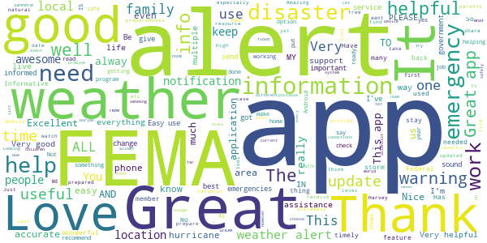
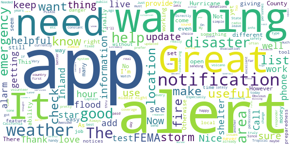
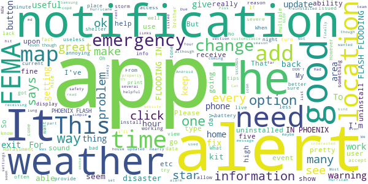
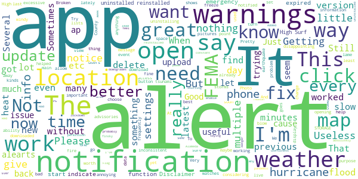
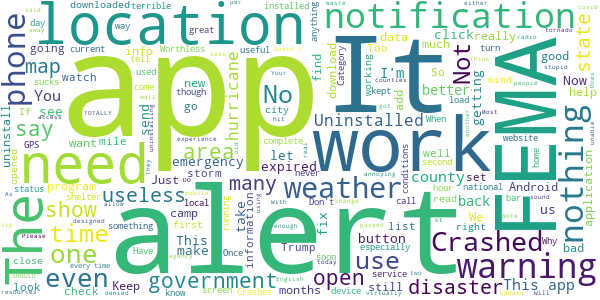

# FEMA
App version ``2.11.1``

Analyzed with [covid-apps-observer](http://github.com/covid-apps-observer) project, version ``0.1``

## App overview
| | |
|-------------------------|-------------------------| 
| **Name**&nbsp;&nbsp;&nbsp;&nbsp;&nbsp;&nbsp;&nbsp;&nbsp;&nbsp;&nbsp;&nbsp;&nbsp;&nbsp;&nbsp;&nbsp;&nbsp;&nbsp;&nbsp;&nbsp;&nbsp;&nbsp;&nbsp;&nbsp;&nbsp;&nbsp;&nbsp;&nbsp;&nbsp;&nbsp;&nbsp;&nbsp;&nbsp;&nbsp;&nbsp;&nbsp;&nbsp;&nbsp;&nbsp;&nbsp;&nbsp;  | FEMA |
| **Unique identifier** | gov.fema.mobile.android |
| **Link to Google Play** | [https://play.google.com/store/apps/details?id=gov.fema.mobile.android](https://play.google.com/store/apps/details?id=gov.fema.mobile.android) |
| **Summary**  | Weather alerts, safety tips and more to help before, during &amp; after disasters. |
| **Privacy policy** | [http://www.fema.gov/privacy-policy](http://www.fema.gov/privacy-policy) |
| **Latest version** | 2.11.1 |
| **Last update** | 2020-07-09 16:43:34 |
| **Recent changes** | - Added featured content section to home page for important information - Updated Mitigate Your Risk section with additional Do-It-Yourself categories - Section 508 Accessibility fixes - Updated mobile theme |
| **Installs**  | 1,000,000+ |
| **Category** | Weather |
| **First release** | Aug 24, 2011 |
| **Size**  | 3.3M |
| **Supported Android version**  | 4.4 and up |

### Description
> Emergency alerts, safety tips and resources to help before, during & after disasters.
 The FEMA App provides timely alerts and useful information to help you and your loved ones stay safe before, during and after disasters. Receive and share real-time notifications about disasters, severe weather, and other emergencies for up to five locations nationwide. This simple and easy-to-use resource also provides safety information, emergency preparedness tips, and disaster assistance.
 Features 
 •    Receive emergency alerts for up to five locations nationwide 
 •    Share real-time notifications with loved ones via text, email and social media
 •    Know what to do before, during, and after disasters, like earthquakes, wildfires, hurricanes, snowstorms, tornadoes, volcanoes, and more
 •    Prepare for disasters with an emergency kit checklist, emergency family plan, and reminders
 •    Locate open emergency shelters in your area
 •    Locate Disaster Recovery Centers near you where you can talk to a FEMA representative in person
 •    Connect with FEMA to apply for disaster assistance online
 •    Safety tips and disaster information available in English and Spanish (Note: alerts are only available in English)
 •    Follow the FEMA blog to learn about disaster response and recovery across the United States
 Terms of use: www.fema.gov/app.

### User interface
The developers of the app provide the following screenshots in the Google play store.
| | | |
|:-------------------------:|:-------------------------:|:-------------------------:|
 |   |   |   | 
 |   |   |   | 
 |   |   |   | 
 |   |   |   | 
 |   |   |   | 
 |   |   |   | 
 |   |   |   | 
 |  

## Development team
In the following we report the main information provided by the development team in the Google play store.

| | |
|-------------------------|-------------------------|
| **Developer**  | Federal Emergency Management Agency (FEMA) |
| **Website**  | [http://www.fema.gov](http://www.fema.gov) |
| **Email** | FEMA-New-Media@fema.dhs.gov |
| **Physical address**  | - |
| **Other developed apps**  | [https://play.google.com/store/apps/developer?id=Federal+Emergency+Management+Agency+(FEMA)](https://play.google.com/store/apps/developer?id=Federal+Emergency+Management+Agency+(FEMA)) |

## Android support

| | |
|-------------------------|-------------------------|
| **Declared target Android version**  | Pie, version 9 (API level 28) |
| **Effective target Android version**  | Pie, version 9 (API level 28) |
| **Minimum supported Android version**  | KitKat, version 4.4 - 4.4.4 (API level 19) |
| **Maximum target Android version**  | - |

The larger the difference between the minimum and maximum supported Android versions, the better. A larger difference means a wider audience. For example, old phones have a very low Android version, so a high minimum supported Android version means that the app cannot be used by users with old phones, thus leading to accessibility problems. 

## Requested permissions

In the following we report the complete list of the permissions requested by the app. 

| **Permission** | **Protection level** | **Description** | 
|-------------------------|-------------------------|-------------------------|
 **android.permission ACCESS_COARSE_LOCATION** | :warning:**Dangerous** | Allows an app to access approximate location. 
 **android.permission ACCESS_FINE_LOCATION** | :warning:**Dangerous** | Allows an app to access precise location. 
 **android.permission ACCESS_NETWORK_STATE** | Normal | Allows applications to access information about networks. 
 **android.permission INTERNET** | Normal | Allows applications to open network sockets. 
 **android.permission READ_APP_BADGE** | - | - 
 **android.permission RECEIVE_BOOT_COMPLETED** | Normal | Allows an application to receive the Intent.ACTION_BOOT_COMPLETED that is broadcast after the system finishes booting. 
 **android.permission VIBRATE** | Normal | Allows access to the vibrator. 
 **android.permission WAKE_LOCK** | Normal | Allows using PowerManager WakeLocks to keep processor from sleeping or screen from dimming. 
 **android.permission WRITE_EXTERNAL_STORAGE** | :warning:**Dangerous** | Allows an application to write to external storage. 
 **com.anddoes.launcher.permission UPDATE_COUNT** | - | - 
 **com.google.android.c2dm.permission RECEIVE** | - | - 
 **com.google.android.finsky.permission BIND_GET_INSTALL_REFERRER_SERVICE** | - | - 
 **com.htc.launcher.permission READ_SETTINGS** | - | - 
 **com.htc.launcher.permission UPDATE_SHORTCUT** | - | - 
 **com.huawei.android.launcher.permission CHANGE_BADGE** | - | - 
 **com.huawei.android.launcher.permission READ_SETTINGS** | - | - 
 **com.huawei.android.launcher.permission WRITE_SETTINGS** | - | - 
 **com.majeur.launcher.permission UPDATE_BADGE** | - | - 
 **com.oppo.launcher.permission READ_SETTINGS** | - | - 
 **com.oppo.launcher.permission WRITE_SETTINGS** | - | - 
 **com.sec.android.provider.badge.permission READ** | - | - 
 **com.sec.android.provider.badge.permission WRITE** | - | - 
 **com.sonyericsson.home.permission BROADCAST_BADGE** | - | - 
 **com.sonymobile.home.permission PROVIDER_INSERT_BADGE** | - | - 
 **me.everything.badger.permission BADGE_COUNT_READ** | - | - 
 **me.everything.badger.permission BADGE_COUNT_WRITE** | - | - 

## Mentioned servers

| **Server** | **Registrant** | **Registrant country** | **Creation date** | 
|-------------------------|-------------------------|-------------------------|-------------------------|
 | googlesyndication.com | Google LLC | :us: US | 2003-01-21 06:17:24 |
 | google.com | Google LLC | :us: US | 1997-09-15 04:00:00 |
 | google-analytics.com | Google LLC | :us: US | 2005-07-18 19:24:32 |
 | app-measurement.com | Google LLC | :us: US | 2015-06-19 20:13:31 |
 | googletagmanager.com | Google LLC | :us: US | 2011-11-11 23:39:05 |
 | gstatic.com | Google LLC | :us: US | 2008-02-11 15:31:25 |
 | whatsapp.com | Whatsapp Inc. | :us: US | 2008-09-04 12:39:12 |
 | googleapis.com | Google LLC | :us: US | 2005-01-25 17:52:26 |
 | googleadservices.com | Google LLC | :us: US | 2003-06-19 16:34:53 |

## Security analysis 

Below we report the main security warnings raised by our execution of the [Androwarn](https://github.com/maaaaz/androwarn) security analysis tool.

**Connection interfaces exfiltration**
> - This application reads details about the currently active data network 
> - This application tries to find out if the currently active data network is metered 

**Telephony services abuse**
> - This application makes phone calls 

**Code execution**
> - This application loads a native library: 'sqlc-native-driver' 
> - This application executes a UNIX command containing this argument: 'Ljava/lang/StringBuilder;->toString()Ljava/lang/String;' 

## User ratings and reviews

Below we provide information about how end users are reacting to the app in terms of ratings and reviews in the Google Play store.

### Ratings

The FEMA app has been installed by more than **1000000** times. At this time, **3292** rated the app and its average score is **4.1634617**. Below we show the distribution of the ratings across the usual star-based rating of Google Play

:star::star::star::star::star:: 2078

:star::star::star::star:: 464

:star::star::star:: 316

:star::star:: 73

:star:: 358

### Reviews 

#### 5-star reviews

> I love the sound of that!!  :date: __2020-07-26 18:18:13__

> Thanks fema helped me get the people thuer stimulus checks we wouls have gotten the sooner if my they vwasnt playing games  :date: __2020-07-26 07:50:10__

> Best for assistance for the people.  :date: __2020-07-25 19:53:10__

> 🧭🚦🧭🚨🧭🚨🚑🚑🚑🚑(￣ヘ￣;)(・–・;)ゞ  :date: __2020-07-24 16:32:48__

> Really fun app!! Would 100% recommend!!  :date: __2020-07-22 04:02:11__

> work perfect  :date: __2020-07-20 20:42:35__

> ⭐⭐⭐⭐⭐  :date: __2020-07-20 14:56:46__

> Everyone should subscribe to Fema Alerts!  :date: __2020-07-19 01:40:24__

> ItsMee..t  :date: __2020-07-17 23:22:41__

> Tells me I have an alert then when you tap it.....shows nothing. 🙁  :date: __2020-07-12 05:51:32__

#### 4-star reviews

> I took care of a FEMA worker so I thought I would check out app  :date: __2020-07-27 23:49:33__

> It's missing the alerts Snow Squall Warning, Inland Hurricane Warning, Inland Hurricane Watch, Inland Tropical Storm Warning, and Inland Tropical Storm Watch.  :date: __2020-07-27 22:57:25__

> Fast reliablie services  :date: __2020-07-09 01:04:27__

> Great app.  :date: __2020-07-01 08:50:11__

> Great at giving alerts for different areas. Live posting during storms is excellent. Just be careful you don't list to many places to avoid constant updates.  :date: __2020-06-12 03:22:06__

> Only worth downloading if you're in a disaster situation. Otherwise it's not very useful.  :date: __2020-05-23 06:10:43__

> Extremely well covers high pop centers. However, little to no coverage in rural areas. We live in Benton County, MO...no coverage ANYWHERE here.  :date: __2020-05-22 15:48:47__

> Excelente  :date: __2020-05-22 01:23:54__

> Always on top of it  :date: __2020-05-21 12:13:30__

> Weather warnings are necessary, including worse.  :date: __2020-05-17 22:09:22__

#### 3-star reviews

> where's the warnings I used to get  :date: __2020-06-24 02:29:53__

> The back button does not exit the app.  :date: __2020-06-09 16:17:55__

> Should be updated & expanded upon more but for what it is, I like it and will be keeping it.  :date: __2020-05-08 07:51:52__

> I am a Harvey Hurrican victom me an my brother. When the hurrican was over i rent a place. My brother is with liver problems high blood pressure and hepitest. I am a copd lung condition also health problems. I am on home oxegen and four times a day with breathing treatments. Also my brother has a lung problem also woth Copd. We need Fema to help eith a house on Dickinson Texas , 77539. The place we rent has md and the land lord is a ok person but a slumlord. Fema to help us better living home  :date: __2020-04-20 08:40:27__

> The app did work great. I got a Samsung A10 and for some reason the notifications stopped working properly. The weather notifications are intermittent and my reminders for emergency kit, smoke detectors, etc. don't come through at all anymore. Suggestions? I'd like to give higher marks.  :date: __2020-04-09 04:12:19__

> FLASH FLOODING IN PHOENIX FLASH FLOODING IN PHOENIX FLASH FLOODING IN PHOENIX FLASH FLOODING IN PHOENIX FLASH FLOODING IN PHOENIX. I GET IT. I DON'T NEED A NEW NOTIFICATION EVERY 30 SECONDS.  :date: __2020-03-12 22:35:27__

> Easy to read  :date: __2020-03-03 01:12:31__

> The good: Timely alerts, often well ahead of other apps. Seems lightweight and works ok on throttled cellular. The bad: Alerts seem to be only accessible from the notification? Devs please advise/patch.  :date: __2019-12-02 12:53:29__

> No notification on  :date: __2019-11-08 13:38:22__

> disappointed would be helpful if you listed citizen corps. And ways to expand and improve readiness. Most e.m.a. offices have no knowledge of getting volunteers for natural disasters in Illinois, and I have a feeling they don't care  :date: __2019-09-02 21:56:27__

#### 2-star reviews

> Getting several alerts with little or no lead time. Several other alerts just multiples of previous alerts with no changes in them at all. That's probably FEMA but still downgrades usefulness.  :date: __2020-07-19 21:22:25__

> This app did not help me.  :date: __2020-06-19 19:14:29__

> It really does do absolutely nothing. Not even sure why i have it  :date: __2020-04-28 15:16:55__

> Alerts are way too excessive.. It's a little windy in my area and I get notifications what feel like every 5 minutes. Had to delete the app because it was so annoying.  :date: __2020-04-10 21:47:54__

> It's a weather alert app. I'm getting constant weather alerts during a pandemic lockdown  :date: __2020-03-29 17:05:00__

> When I click on "Alerts," I get a message saying that I have to enable them in the app settings. But when I get into the settings, I can't find anything that does that.  :date: __2020-03-21 20:10:32__

> Ever since the update I haven't been getting the Red Flag warnings for Alameda County during the week the fire danger was so high that PG&E was shutting off power. The previous version worked better.  :date: __2019-10-13 08:02:03__

> App does not give alerts. At one time it worked.  :date: __2019-06-18 03:25:56__

> The app seems to be very inconsistent. Sometimes i get alerts, sometimes I don't. I've uninstalled and reinstalled a few times but it hasn't helped. Very disappointing.  :date: __2019-03-03 23:10:36__

> Why new permission without reason? Added finsky bind referer without statement of why or what for  :date: __2018-10-09 16:45:58__

#### 1-star reviews

> Needs to be GPS enabled. I shouldn't have to create a list of areas to monitor  :date: __2020-07-22 14:55:20__

> App should work as a REAL emergency service! No wifi or data usage! With today's technology & the dangerous times we r living in as well as facing especially with riots & illness! This app is put on by OUR GOVERNMENT!! IT SHOULD WORK FLAWLESSLY!! I think y'all r paid enough to PROTECT US! YOU SHOULD DO YOUR JOB!!! So sick n tired of the buck being passed & the excuses! YOU WANTED UR JOB SO DO IT! OR FIND ANOTHER!  :date: __2020-07-17 17:56:20__

> DENIED all my RIGHTS  :date: __2020-07-14 08:31:08__

> I would look them up and see what they are really about. We need less government in our life and lower We are Tax Enough Already.  :date: __2020-07-07 14:51:55__

> Don't trust fema  :date: __2020-06-26 20:16:46__

> Did not get it  :date: __2020-06-23 16:46:56__

> The app should work off line. I cannot use the app with cellular data. Alerts set to my location only notify me when I have Wi-Fi and completely disappear if I'm not connected. How is this convenient during a disaster?  :date: __2020-06-21 22:29:23__

> App can not be moved to external SD memory  :date: __2020-06-15 13:42:40__

> It said my location was covered by neighbors county. It didn't recognize two different counties. Maybe better for largecities.  :date: __2020-06-15 02:05:50__

> Digital contact tracing not mentioned in app  :date: __2020-06-13 19:42:11__

