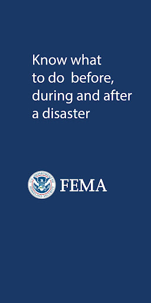

# FEMA
App version ``2.11.2``

Analyzed with [covid-apps-observer](http://github.com/covid-apps-observer) project, version ``0.1``

## App overview
| | |
|-------------------------|-------------------------| 
| **Name**&nbsp;&nbsp;&nbsp;&nbsp;&nbsp;&nbsp;&nbsp;&nbsp;&nbsp;&nbsp;&nbsp;&nbsp;&nbsp;&nbsp;&nbsp;&nbsp;&nbsp;&nbsp;&nbsp;&nbsp;&nbsp;&nbsp;&nbsp;&nbsp;&nbsp;&nbsp;&nbsp;&nbsp;&nbsp;&nbsp;&nbsp;&nbsp;&nbsp;&nbsp;&nbsp;&nbsp;&nbsp;&nbsp;&nbsp;&nbsp;  | FEMA |
| **Unique identifier** | gov.fema.mobile.android |
| **Link to Google Play** | [https://play.google.com/store/apps/details?id=gov.fema.mobile.android](https://play.google.com/store/apps/details?id=gov.fema.mobile.android) |
| **Summary**  | Weather alerts, safety tips and more to help before, during &amp; after disasters. |
| **Privacy policy** | [http://www.fema.gov/privacy-policy](http://www.fema.gov/privacy-policy) |
| **Latest version** | 2.11.2 |
| **Last update** | 2020-10-27 19:44:12 |
| **Recent changes** | - Bug fix for reminders on Android 10 |
| **Installs**  | 1,000,000+ |
| **Category** | Weather |
| **First release** | Aug 24, 2011 |
| **Size**  | 3.4M |
| **Supported Android version**  | 4.4 and up |

### Description
> Emergency alerts, safety tips and resources to help before, during & after disasters.
 The FEMA App provides timely alerts and useful information to help you and your loved ones stay safe before, during and after disasters. Receive and share real-time notifications about disasters, severe weather, and other emergencies for up to five locations nationwide. This simple and easy-to-use resource also provides safety information, emergency preparedness tips, and disaster assistance.
 Features 
 •    Receive emergency alerts for up to five locations nationwide 
 •    Share real-time notifications with loved ones via text, email and social media
 •    Know what to do before, during, and after disasters, like earthquakes, wildfires, hurricanes, snowstorms, tornadoes, volcanoes, and more
 •    Prepare for disasters with an emergency kit checklist, emergency family plan, and reminders
 •    Locate open emergency shelters in your area
 •    Locate Disaster Recovery Centers near you where you can talk to a FEMA representative in person
 •    Connect with FEMA to apply for disaster assistance online
 •    Safety tips and disaster information available in English and Spanish (Note: alerts are only available in English)
 •    Follow the FEMA blog to learn about disaster response and recovery across the United States
 Terms of use: www.fema.gov/app.

### User interface
The developers of the app provide the following screenshots in the Google play store.
| | | |
|:-------------------------:|:-------------------------:|:-------------------------:|
 |   |   |   | 
 |   |   |   | 
 |   |   |   | 
 |   |   |   | 
 |   |   |   | 
 |   |   |   | 
 |   |   |   | 
 |  

## Development team
In the following we report the main information provided by the development team in the Google play store.

| | |
|-------------------------|-------------------------|
| **Developer**  | Federal Emergency Management Agency (FEMA) |
| **Website**  | [http://www.fema.gov](http://www.fema.gov) |
| **Email** | FEMA-New-Media@fema.dhs.gov |
| **Physical address**  | - |
| **Other developed apps**  | [https://play.google.com/store/apps/developer?id=Federal+Emergency+Management+Agency+(FEMA)](https://play.google.com/store/apps/developer?id=Federal+Emergency+Management+Agency+(FEMA)) |

## Android support

| | |
|-------------------------|-------------------------|
| **Declared target Android version**  | Pie, version 9 (API level 28) |
| **Effective target Android version**  | Pie, version 9 (API level 28) |
| **Minimum supported Android version**  | KitKat, version 4.4 - 4.4.4 (API level 19) |
| **Maximum target Android version**  | - |

The larger the difference between the minimum and maximum supported Android versions, the better. A larger difference means a wider audience. For example, old phones have a very low Android version, so a high minimum supported Android version means that the app cannot be used by users with old phones, thus leading to accessibility problems. 

## Requested permissions

In the following we report the complete list of the permissions requested by the app. 

| **Permission** | **Protection level** | **Description** | 
|-------------------------|-------------------------|-------------------------|
 **android.permission ACCESS_COARSE_LOCATION** | :warning:**Dangerous** | Allows an app to access approximate location. 
 **android.permission ACCESS_FINE_LOCATION** | :warning:**Dangerous** | Allows an app to access precise location. 
 **android.permission ACCESS_NETWORK_STATE** | Normal | Allows applications to access information about networks. 
 **android.permission INTERNET** | Normal | Allows applications to open network sockets. 
 **android.permission READ_APP_BADGE** | - | - 
 **android.permission RECEIVE_BOOT_COMPLETED** | Normal | Allows an application to receive the Intent.ACTION_BOOT_COMPLETED that is broadcast after the system finishes booting. 
 **android.permission VIBRATE** | Normal | Allows access to the vibrator. 
 **android.permission WAKE_LOCK** | Normal | Allows using PowerManager WakeLocks to keep processor from sleeping or screen from dimming. 
 **com.anddoes.launcher.permission UPDATE_COUNT** | - | - 
 **com.google.android.c2dm.permission RECEIVE** | - | - 
 **com.google.android.finsky.permission BIND_GET_INSTALL_REFERRER_SERVICE** | - | - 
 **com.htc.launcher.permission READ_SETTINGS** | - | - 
 **com.htc.launcher.permission UPDATE_SHORTCUT** | - | - 
 **com.huawei.android.launcher.permission CHANGE_BADGE** | - | - 
 **com.huawei.android.launcher.permission READ_SETTINGS** | - | - 
 **com.huawei.android.launcher.permission WRITE_SETTINGS** | - | - 
 **com.majeur.launcher.permission UPDATE_BADGE** | - | - 
 **com.oppo.launcher.permission READ_SETTINGS** | - | - 
 **com.oppo.launcher.permission WRITE_SETTINGS** | - | - 
 **com.sec.android.provider.badge.permission READ** | - | - 
 **com.sec.android.provider.badge.permission WRITE** | - | - 
 **com.sonyericsson.home.permission BROADCAST_BADGE** | - | - 
 **com.sonymobile.home.permission PROVIDER_INSERT_BADGE** | - | - 
 **me.everything.badger.permission BADGE_COUNT_READ** | - | - 
 **me.everything.badger.permission BADGE_COUNT_WRITE** | - | - 

## Mentioned servers

| **Server** | **Registrant** | **Registrant country** | **Creation date** | 
|-------------------------|-------------------------|-------------------------|-------------------------|
 | googlesyndication.com | Google LLC | :us: US | 2003-01-21 06:17:24 |
 | google.com | Google LLC | :us: US | 1997-09-15 04:00:00 |
 | google-analytics.com | Google LLC | :us: US | 2005-07-18 19:24:32 |
 | app-measurement.com | Google LLC | :us: US | 2015-06-19 20:13:31 |
 | googletagmanager.com | Google LLC | :us: US | 2011-11-11 23:39:05 |
 | gstatic.com | Google LLC | :us: US | 2008-02-11 15:31:25 |
 | whatsapp.com | Whatsapp Inc. | :us: US | 2008-09-04 12:39:12 |
 | googleapis.com | Google LLC | :us: US | 2005-01-25 17:52:26 |
 | googleadservices.com | Google LLC | :us: US | 2003-06-19 16:34:53 |

## Security analysis 

Below we report the main security warnings raised by our execution of the [Androwarn](https://github.com/maaaaz/androwarn) security analysis tool.

**Connection interfaces exfiltration**
> - This application reads details about the currently active data network 
> - This application tries to find out if the currently active data network is metered 

**Telephony services abuse**
> - This application makes phone calls 

**Code execution**
> - This application loads a native library: 'sqlc-native-driver' 

## User ratings and reviews

Below we provide information about how end users are reacting to the app in terms of ratings and reviews in the Google Play store.

### Ratings

The FEMA app has been installed by more than **1000000** times. At this time, **3525** rated the app and its average score is **4.1988635**. Below we show the distribution of the ratings across the usual star-based rating of Google Play

:star::star::star::star::star:: 2305

:star::star::star::star:: 390

:star::star::star:: 390

:star::star:: 110

:star:: 330

### Reviews 

#### 5-star reviews

> Set it and forget it, until you get Emergency Notifications for where you live  :date: __2021-03-03 18:07:15__

> Excellent thanks  :date: __2021-02-26 16:19:15__

> Awesome  :date: __2021-02-21 15:38:49__

> 💙💯⚖️🕕✔️🇺🇸 To USA  :date: __2021-02-21 09:19:48__

> I always have up to date information on the weather. This App appears to be the most accurate as well.  :date: __2021-02-19 02:00:42__

> Very helpful to offer an app like this, thanks FEMA  :date: __2021-02-18 05:38:43__

> I thoroughly enjoy this app! Up to date on active warnings - unlike other local weather apps!  :date: __2021-02-16 21:39:18__

> Great app! The only thing is, I wish it had a share button to send the Alerts to family & friends. Thank you for adding the share button!  :date: __2021-02-15 15:49:44__

> Great app for weather notifications  :date: __2021-02-09 23:30:39__

> Superior great + AAAAAA  :date: __2021-02-09 03:14:12__

#### 4-star reviews

> I think that it's pretty good.  :date: __2021-03-04 04:02:31__

> This app is worth the download. You get a lot of notifications, but they are easy to mute, and might save your life.  :date: __2021-02-02 22:03:12__

> Really good weather alerts better than local tv  :date: __2021-01-26 10:34:47__

> So I love this app, but I feel as if you guys should check the reviews. There are people there with legitimate concerns, and some great recommendations that your should take look at. Such as: -Missing Alerts -A "Follow Me" option. -A priority alert mode (that fully covers your screen when you get a warning alert). I had a tornado warning in my area, and I love that I recieved it when using the app, but you should force the users to see a warning. These are the 3 options I'd love to see come.  :date: __2020-11-29 03:51:39__

> It has a lot of information anyone would ever need in this nation you could help you self and others in anything  :date: __2020-11-25 07:22:21__

> App has grown over the years and I appreciate the work that has gone into making it. My alerts are timely for the different counties that I've entered. THAT being said: The app has the potential to be so much more. Save lives. Can you please make it less time consuming to use? When I travel I need to hear *alerts in the County I'm IN.* What I would like to see in an update is the use of GPS to alert me *wherever* I am. Also.. Why isn't anyone taking advantage of the Blog section?  :date: __2020-11-06 20:45:42__

> Decent at first glance  :date: __2020-09-27 05:28:47__

> Great app !!!!!!!!  :date: __2020-09-05 02:06:16__

> Overall decent, but I don't need 17 alerts in one hour for the same storm.  :date: __2020-08-24 01:10:21__

> It's missing the alerts Snow Squall Warning, Inland Hurricane Warning, Inland Hurricane Watch, Inland Tropical Storm Warning, and Inland Tropical Storm Watch.  :date: __2020-07-27 22:57:25__

#### 3-star reviews

> Works, but it keeps announcing the same alerts over and over, almost to the point of harassment! Also, the developer evidently does not read user comments, because they have not replied to any, a lot of which contain very good suggestions.  :date: __2021-02-15 21:07:44__

> Downloaded b/c we live in the country and cant hear sirens. Ive been getting notifications of weather advisories, but not able to read what, theres nothing there  :date: __2021-02-08 19:56:35__

> Not much exposure.  :date: __2021-01-13 02:03:49__

> Not as helpful as before  :date: __2020-12-28 07:32:52__

> They did not explain what she was asking me about and was real short with me . To me she was rude but I need my house fixed not TVs or other stuff like that but thank you for what you did do.  :date: __2020-10-26 19:49:29__

> Also I build homeless shelters and I think this would be the place to add my location make it official  :date: __2020-10-06 07:13:34__

> Works but would multiply the same alerts  :date: __2020-10-03 19:46:59__

> Sends out alerts as expected, but here's the issue. If I'm in another app (Facebook, e.g.), it won't override it, and there doesn't seem to be a way to get the alert within the actual app, so if you miss it... too bad. Also tried to pull up the app while roaming, and got a "no wifi" connection error. Who the hell has wifi during an emergency??? DO BETTER.  :date: __2020-09-13 18:35:21__

> Not enough details on alerts. Not worth the space on my phone  :date: __2020-09-11 00:11:01__

> Difficult to navigate and doesn't provide info I expected  :date: __2020-09-06 08:45:22__

#### 2-star reviews

> I haven't gotten any alerts for the past week but I get plenty of them on my weather...what gives !?!?!?  :date: __2021-01-25 08:41:35__

> kk  :date: __2021-01-23 15:02:50__

> Don't know  :date: __2021-01-18 03:34:12__

> Was a great App, then started sending multiple alerts one after another. Now I get NO alerts at all. If I click on Alerts, click my city, it takes me to settings. I wrote you about it, you sent an email telling me to restart because you fixed a bug on the 4th. It is now the 14th. I've done as you said, even uninstalled and reinstalled several times. I still get no alerts and when I click my city, it still takes me to settings. I loved your App, it's a shame it no longer functions correctly.  :date: __2021-01-14 21:54:56__

> Super irregular performance and notifications. I cannot rely on this for requested information or results  :date: __2020-12-12 02:22:01__

> Need more control over types of alerts. Don't need to be woken from deep sleep at 3 am for fog warning, for instance. Fog won't harm me when safe in bed in sturdy house unless I hurt myself being startled in my sleep by loud notification.  :date: __2020-11-29 09:17:51__

> Once I sign in it then sends me a email code to sign in again.... To many steps  :date: __2020-09-19 20:23:31__

> Installed this app months ago and expected this would be the moment for it. I'm getting "red flag warnings" and "evacuation alerts" every few minutes (with no date or timestamp) that just say things like "GO NOW Eden Road" with a web link I can't click or copy. After switching back and forth between apps to type out it turns out it's a map and Eden Road is 60 miles away. You can't set alerts for regions smaller than the entire county. Evac notices also came through sooner with other services.  :date: __2020-09-12 07:56:04__

> What is it with this app. I've.been trying to download it for three days how long does it take to for it to download .we are about to be hit with a hurracain.this is messed.up  :date: __2020-08-23 03:40:24__

> This app did not help me.  :date: __2020-06-19 19:14:29__

#### 1-star reviews

> I am deleting this app. I get 6 or more notifications a day when we are getting 2-4 inches of snow. It wakes me in the middle of the night to update when I have already recieved the same notification before. It's too bad, I liked getting the bitter windchill warning. If the weather was serious it would be fine but I don't consider 4 inches of snow a blizzard.  :date: __2021-02-22 00:50:48__

> Into a busy season and it's worse (after weather alert this morning there have been at least 5 false/blank alerts). Even after clearing cache, rebooting phone, etc still getting multiples of same exact alerts and several alerts with little or no lead time and now (once again) many - almost 40% - warnings with no info at all or nothing updated in the alert information. That's probably FEMA but still seriously downgrades usefulness. So problematic that other weather apps are needed for safety.  :date: __2021-02-15 23:00:29__

> I just installed this. I hope it works as it should because my phone has been modified to stop me from receiving ANY Emergency alerts. (I believe that's illegal.) I am so desperate to receive Emergency Alerts that I'm downloading an outside app for it!  :date: __2021-02-13 17:10:52__

> Why wasn't there an alert when the POTUS called the state of emergency for DC? He even mentioned FEMA for receiving info yet crickets feo FEMA. Z Typical government restrictions. If they block adding Washington D.C. as an area then they are blocking additional information. It will only have the activity they want you to know about. New rule for citizens. See something say nothing. You'll be safer that way.  :date: __2021-01-12 21:44:55__

> Stopped working a few days ago. Started sending empty alerts. Reinstallation didn't help. Wouldn't accept location input.  :date: __2021-01-04 15:46:26__

> Can't load location for alerts or risk mitigation  :date: __2021-01-03 18:53:48__

> Dumb app. Just go outside and read the weather instead.  :date: __2020-12-04 16:24:43__

> NO ALERTS... APP IS A JOKE.  :date: __2020-11-14 18:25:33__

> Share doesn't work!!!! UNINSTALLED the junk app  :date: __2020-11-01 13:09:50__

> Zeta not an option to qualify for assistance!  :date: __2020-10-31 05:39:11__

