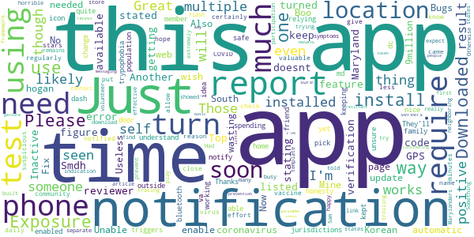
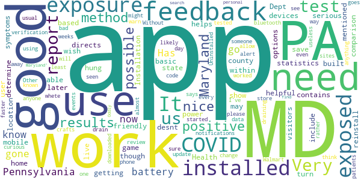

# MD COVID Alert
App version ``minted14004``

Analyzed with [covid-apps-observer](http://github.com/covid-apps-observer) project, version ``0.1``

## App overview
| | |
|-------------------------|-------------------------| 
| **Name**&nbsp;&nbsp;&nbsp;&nbsp;&nbsp;&nbsp;&nbsp;&nbsp;&nbsp;&nbsp;&nbsp;&nbsp;&nbsp;&nbsp;&nbsp;&nbsp;&nbsp;&nbsp;&nbsp;&nbsp;&nbsp;&nbsp;&nbsp;&nbsp;&nbsp;&nbsp;&nbsp;&nbsp;&nbsp;&nbsp;&nbsp;&nbsp;&nbsp;&nbsp;&nbsp;&nbsp;&nbsp;&nbsp;&nbsp;&nbsp;  | MD COVID Alert |
| **Unique identifier** | gov.md.covid19.exposurenotifications |
| **Link to Google Play** | [https://play.google.com/store/apps/details?id=gov.md.covid19.exposurenotifications](https://play.google.com/store/apps/details?id=gov.md.covid19.exposurenotifications) |
| **Summary**  | MD Contact Tracing is the official exposure notification app for Maryland |
| **Privacy policy** | [https://health.maryland.gov/Pages/ENXPrivacy.aspx](https://health.maryland.gov/Pages/ENXPrivacy.aspx) |
| **Latest version** | minted14004 |
| **Last update** | 2020-11-24 17:15:13 |
| **Recent changes** | Bug fixes and performance improvements |
| **Installs**  | 100,000+ |
| **Category** | Medical |
| **First release** | Nov 3, 2020 |
| **Size**  | 10.0M |
| **Supported Android version**  | 5.0 and up |

### Description
> MD COVID Alert is the official COVID-19 exposure-notifications software for the Maryland Department of Health. The app is an instance of Exposure Notifications Express platform developed by Apple and Google and configured by Maryland.
 Your personal use of MD COVID Alert will help anonymously alert Maryland residents who may have been near someone with a positive COVID-19 diagnosis. When you enable MD COVID Alert, you are doing your part to efficiently and effectively help your community slow the spread of COVID-19.
 How MD COVID Alert works:
 When devices with MD COVID Alert are in close contact, they exchange random identifiers using Bluetooth Low Energy (BLE). When someone tells their app that they tested positive for COVID-19, whoever received their random identifiers may receive an alert that they may have possibly been exposed to COVID-19. When a device receives random identifiers it date-stamps them and records their signal strength so that the Exposure Notification system can estimate how close the two devices were to each other and for how long. If the timeframe was at least 15 minutes and the estimated distance was within six feet, then the other user receives a notification of a possible exposure.
 Apple and Google's Exposure Notifications framework runs in the background, even when the MD COVID Alert app is closed. It will not drain the device battery at a rate that would occur with other apps that use normal Bluetooth and/or are open and running constantly.
 How MD COVID Alert Protects Your Privacy:
 Maryland takes your privacy and confidentiality very seriously. Apple and Google's framework is designed to avoid correlating any personal data and location information with the random identifiers that devices exchange. Maryland Department of Health does not want or need to know where or who you are for MD COVID Alert to work. If you are close enough to another app user, your device's BLE will exchange random identifiers with that user.
 Laboratory results for all persons who test positive for COVID-19 are sent to Maryland Department of Health. This is not associated with the app. Our staff follows up with persons reported as positive, based on information provided within the laboratory report. As a courtesy to all app users, MD COVID ALert will verify positive tests and then provide MD COVID Alert users with a personal identifying number (PIN). You must use that PIN in order to report a positive result to the app. This prevents people from falsely reporting positive results, which could generate false exposure notifications. Maryland Department of Health wants all app users to feel confident that when a possible COVID-19 exposure is received via the app, that it is a real event.
 If you have the current Apple or Google operating system installed on your device, you may have noticed that Exposure Notifications are now included. You cannot enable this function until you have installed the MD COVID Alert app. Apple and Google will delete the exposure notification service tools from their respective operating systems once the pandemic reaches a point that public health no longer requires the use of this technology.
 Thank you for installing MD COVID Alert! Together, we can protect our family, friends, neighbors, and colleagues, and keep Maryland moving forward!

### User interface
The developers of the app provide the following screenshots in the Google play store.
| | | |
|:-------------------------:|:-------------------------:|:-------------------------:|
 |   |  

## Development team
In the following we report the main information provided by the development team in the Google play store.

| | |
|-------------------------|-------------------------|
| **Developer**  | Maryland Department of Health |
| **Website**  | - |
| **Email** | MDH.MDCOVIDAlert@maryland.gov |
| **Physical address**  | - |
| **Other developed apps**  | [https://play.google.com/store/apps/developer?id=Maryland+Department+of+Health](https://play.google.com/store/apps/developer?id=Maryland+Department+of+Health) |

## Android support

| | |
|-------------------------|-------------------------|
| **Declared target Android version**  | - |
| **Effective target Android version**  | - |
| **Minimum supported Android version**  | Lollipop, version 5.0 (API level 21) |
| **Maximum target Android version**  | - |

The larger the difference between the minimum and maximum supported Android versions, the better. A larger difference means a wider audience. For example, old phones have a very low Android version, so a high minimum supported Android version means that the app cannot be used by users with old phones, thus leading to accessibility problems. 

## Requested permissions

In the following we report the complete list of the permissions requested by the app. 

| **Permission** | **Protection level** | **Description** | 
|-------------------------|-------------------------|-------------------------|
 **android.permission ACCESS_NETWORK_STATE** | Normal | Allows applications to access information about networks. 
 **android.permission BLUETOOTH** | Normal | Allows applications to connect to paired bluetooth devices. 
 **android.permission FOREGROUND_SERVICE** | Normal | Allows a regular application to use Service.startForeground. 
 **android.permission INTERNET** | Normal | Allows applications to open network sockets. 
 **android.permission RECEIVE_BOOT_COMPLETED** | Normal | Allows an application to receive the Intent.ACTION_BOOT_COMPLETED that is broadcast after the system finishes booting. 
 **android.permission WAKE_LOCK** | Normal | Allows using PowerManager WakeLocks to keep processor from sleeping or screen from dimming. 

## Mentioned servers

| **Server** | **Registrant** | **Registrant country** | **Creation date** | 
|-------------------------|-------------------------|-------------------------|-------------------------|
 | google.com | Google LLC | :us: US | 1997-09-15 04:00:00 |

## Security analysis 

Below we report the main security warnings raised by our execution of the [Androwarn](https://github.com/maaaaz/androwarn) security analysis tool.

**Telephony identifiers leakage**
> - This application reads the ISO country code equivalent of the current registered operator's MCC (Mobile Country Code) 

**Connection interfaces exfiltration**
> - This application reads details about the currently active data network 
> - This application tries to find out if the currently active data network is metered 

**Suspicious connection establishment**
> - This application opens a Socket and connects it to the remote address 'timeout' on the 'N/A' port  

**Code execution**
> - This application loads a native library: 'prioclient' 

## User ratings and reviews

Below we provide information about how end users are reacting to the app in terms of ratings and reviews in the Google Play store.

### Ratings

The MD COVID Alert app has been installed by more than **100000** times. At this time, **158** rated the app and its average score is **3.6826923**. Below we show the distribution of the ratings across the usual star-based rating of Google Play

:star::star::star::star::star:: 89

:star::star::star::star:: 12

:star::star::star:: 12

:star::star:: 10

:star:: 35

### Reviews 

#### 5-star reviews

> Glad it's on here  :date: __2020-12-26 02:31:39__

> The app is ok good if used properly & commonly and frequently  :date: __2020-12-24 09:59:58__

> Thanks MD Dept of Health! I'll take all the layers I can get.  :date: __2020-12-21 19:21:28__

> Good idea. I wish more would enroll  :date: __2020-12-16 04:42:57__

> I am very glad to have this app available. Thank you very much 😊  :date: __2020-12-13 20:14:18__

> Haven't had any alerts as of yet  :date: __2020-12-10 21:03:17__

> Easy to use  :date: __2020-12-10 01:40:11__

> Awesome Experience!!!!  :date: __2020-12-07 23:09:23__

> Great app. Does not kill battery or face location. Please don't listen to the dumb conspiracy people. Everyone in MD should have this on their phone so we can get a control over the now uncontrolled virus.  :date: __2020-12-06 13:55:00__

> EXCELLENT!  :date: __2020-12-06 08:01:07__

#### 4-star reviews

> So far so good  :date: __2020-12-08 00:43:02__

> Yeah I think this is going to be helpful for me I try to make sure to always follow the CDC and take care of my health and also my wife and family.  :date: __2020-12-02 01:20:51__

> It would be a good idea to add the current state guidelines.  :date: __2020-11-15 17:21:15__

> Just downloaded this app. We'll see how it works.  :date: __2020-11-11 23:40:36__

> I have android 5 samsung note phone and I could install it. Read the info about the app which explains how it works (without IDg person or phone) and that made it clear that location setting doesnt have to be on. Bluetooth was activated by app; assume i need to have it active when outside the house. Haven't been anywhere yet, so can't really evaluate app properly. But happy to have this app and plenty of free and nearby testing where I live. We can use all the help we can get!  :date: __2020-11-11 17:15:01__

> Glad MD was able to get this going. A nationwide alert system would of course be preferable, but the US is obviously not ready for that. Trivial to setup, unobtrusive, and the privacy/security framework seems sound.  :date: __2020-11-10 18:15:46__

#### 3-star reviews

> Requires GPS to be on all the time. Another reviewer stated the phone's location doesnt need to be turned on, but as soon as I turn it off I get a notification stating "Exposure Notifications Inactive To use this feature, turn on location".  :date: __2020-12-17 06:31:55__

> I can't figure out where to get my one time verification code so I can use this app.  :date: __2020-12-12 19:08:23__

> I keep getting a error on install. Smdh  :date: __2020-12-08 12:22:49__

> Needs to be listed and available at the Top of your Maryland coronavirus web page! Also how to update it! Mine needed that...why not automatic? Boo! Like hogan wasting $9million on South Korean tests!  :date: __2020-12-06 14:49:17__

> Just Downloaded But Unable To Turn On Notifications. Now It's Just Useless. And No It's Not My Phone. Please Fix Bugs.  :date: __2020-11-20 15:15:26__

> I wish there was a way to enable exposure notifications from multiple jurisdictions. As someone that works in dc/md/va it would be nice to have all 3 apps on and able to notify you, but you can only have one app enabled at a time.  :date: __2020-11-18 12:26:15__

> I would have kept this app if it didn't require my bluetooth be on all the time. Great idea, though. Thanks for working this, though.  :date: __2020-11-17 02:32:20__

> Just downloaded the app so I'm unsure of how great it works just yet, however please change the icon as it triggers my trypophobia!  :date: __2020-11-15 13:16:23__

> I don't quite understand how this is keeping me safe. It's relying on the honesty of the population. Those that self report using this app most likely won't be spending much outside their home. They'll be using door dash or have a family member or friend pick up what they need. Those that are positive and out in the community regularly will less likely self report on this app, if they even have the app installed.  :date: __2020-11-15 02:29:05__

> The virus will have a vaccine soon, so I hope you didn't put too much effort into this app.  :date: __2020-11-14 23:00:47__

#### 2-star reviews

> Very basic and not helpful, not as good as the PA state app. MD needs to up their game and show they're serious about getting us to use the app. The app directs us to the MD Dept of Health app which is not very user friendly on mobile devices. In comparison the PA app contains statistics by county, helps you determine if you need a test based on your symptoms, and how to report positive results. MD needs to include the same options.  :date: __2020-12-25 17:57:58__

> Installation hung, had to reinstall. though feedback is mentioned, no feedback method built into app. to save power would be nice to be able to turn off when at home location where no visitors or exposure is possible. just installed so may be more feedback later, but no method within app.  :date: __2020-12-17 15:31:22__

> desnt work  :date: __2020-12-17 08:29:56__

> I wish I could use both Maryland and Pennsylvania COVID apps because I live in Maryland and work in Pennsylvania. But I can only get notifications from one of them. I am more likely to get exposed to COVID in PA then MD. Other then that it is nice.  :date: __2020-12-11 18:19:42__

> I am not sure whete to get the verification code to use in the app.?.?.?  :date: __2020-12-10 04:46:27__

> Good to know about possible exposure but using bluetooth is almost as bad, please change this?  :date: __2020-11-29 16:04:37__

> It says I have not been exposed to someone who tested positive but I might have been  :date: __2020-11-29 00:23:36__

> Has anyone even seen this app warn you you've been exposed? Just curious 🤔  :date: __2020-11-26 22:14:21__

> I don't think this works. I've worked with covid patients since I installed this app and not once did this app alert me to anything.  :date: __2020-11-22 00:08:49__

> I had this downloaded for about 2 weeks and this phone has not gone off , I go out to work every day, go to Walmart and crafts store, now I know this should have at least gone off by now.  :date: __2020-11-21 16:47:11__

#### 1-star reviews

> Doesn't work.  :date: __2020-12-26 14:50:18__

> I've been exposed on two occasions. It never notified me. The covid contact tracers also called 3 days late. It's pointless.  :date: __2020-12-23 16:07:34__

> Power hog  :date: __2020-12-22 23:21:05__

> Arrogant and ignorant for each state to release their own app, as if people can't travel or even commute daily over state borders. You can only run one of these apps at a time. Even if you switch between apps, the contacts are only registered for people who run the same app.  :date: __2020-12-19 16:37:42__

> ☆WARNING☆ THIS APP HAS A CHANCE TO CAUSE YOUR DEVICE LIKE MINE TO STOP FREEZE AND DIE DON'T DOWNLOAD AS ITS ALL FAKE AND POSABILITY VIRUS, YOU'LL DIE IN AN HOSPITAL WITH RANDOM CHEMICALS BEING POURED INTO YOU!!!!!!  :date: __2020-12-17 17:58:22__

> Great concept, however, doesn't work if you can't report a positive test! It's requires MD health department to give you a code. Contact tracer had no clue that they we able to give a code and couldn't figure it out. My efforts to help the community were squandered by a poor system.  :date: __2020-12-17 17:43:39__

> I came in contact with someone who tested positive and it didn't alert me about anything  :date: __2020-12-15 12:54:56__

> Broken Process. Useless app. My husband tested positive. The process: your health care provider reports your positive result to the MD Depth of Health and THEY text you a code to enter into the app to report your status. It took 4 days to get that code. Even after entering it, I still haven't received an exposure notification and we're together constantly. Verified all settings are correct. It actually has to work & QUICKLY to benefit individual users & public health. Extremely disappointed.  :date: __2020-12-15 03:22:41__

> It is taking so long for me to get my test results that by the time I get them this app will have forgotten everyone I came in contact with.  :date: __2020-12-11 18:13:18__

> I tested positive for covid and I can't get the alert to activate in the app. It asks for a one time verification code but there is no information on where I get this code. I am finding this app useless.  :date: __2020-12-06 19:20:45__

