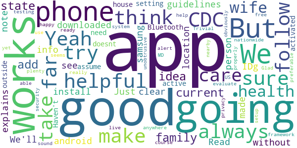

# MD COVID Alert
App version ``minted14004``

Analyzed with [covid-apps-observer](http://github.com/covid-apps-observer) project, version ``0.1``

## App overview
| | |
|-------------------------|-------------------------| 
| **Name**&nbsp;&nbsp;&nbsp;&nbsp;&nbsp;&nbsp;&nbsp;&nbsp;&nbsp;&nbsp;&nbsp;&nbsp;&nbsp;&nbsp;&nbsp;&nbsp;&nbsp;&nbsp;&nbsp;&nbsp;&nbsp;&nbsp;&nbsp;&nbsp;&nbsp;&nbsp;&nbsp;&nbsp;&nbsp;&nbsp;&nbsp;&nbsp;&nbsp;&nbsp;&nbsp;&nbsp;&nbsp;&nbsp;&nbsp;&nbsp;  | MD COVID Alert |
| **Unique identifier** | gov.md.covid19.exposurenotifications |
| **Link to Google Play** | [https://play.google.com/store/apps/details?id=gov.md.covid19.exposurenotifications](https://play.google.com/store/apps/details?id=gov.md.covid19.exposurenotifications) |
| **Summary**  | MD Contact Tracing is the official exposure notification app for Maryland |
| **Privacy policy** | [https://health.maryland.gov/Pages/ENXPrivacy.aspx](https://health.maryland.gov/Pages/ENXPrivacy.aspx) |
| **Latest version** | minted14004 |
| **Last update** | 2020-11-24 17:15:13 |
| **Recent changes** | Bug fixes and performance improvements |
| **Installs**  | 100,000+ |
| **Category** | Medical |
| **First release** | Nov 3, 2020 |
| **Size**  | 10.0M |
| **Supported Android version**  | 5.0 and up |

### Description
> MD COVID Alert is the official COVID-19 exposure-notifications software for the Maryland Department of Health. The app is an instance of Exposure Notifications Express platform developed by Apple and Google and configured by Maryland.
 Your personal use of MD COVID Alert will help anonymously alert Maryland residents who may have been near someone with a positive COVID-19 diagnosis. When you enable MD COVID Alert, you are doing your part to efficiently and effectively help your community slow the spread of COVID-19.
 How MD COVID Alert works:
 When devices with MD COVID Alert are in close contact, they exchange random identifiers using Bluetooth Low Energy (BLE). When someone tells their app that they tested positive for COVID-19, whoever received their random identifiers may receive an alert that they may have possibly been exposed to COVID-19. When a device receives random identifiers it date-stamps them and records their signal strength so that the Exposure Notification system can estimate how close the two devices were to each other and for how long. If the timeframe was at least 15 minutes and the estimated distance was within six feet, then the other user receives a notification of a possible exposure.
 Apple and Google's Exposure Notifications framework runs in the background, even when the MD COVID Alert app is closed. It will not drain the device battery at a rate that would occur with other apps that use normal Bluetooth and/or are open and running constantly.
 How MD COVID Alert Protects Your Privacy:
 Maryland takes your privacy and confidentiality very seriously. Apple and Google's framework is designed to avoid correlating any personal data and location information with the random identifiers that devices exchange. Maryland Department of Health does not want or need to know where or who you are for MD COVID Alert to work. If you are close enough to another app user, your device's BLE will exchange random identifiers with that user.
 Laboratory results for all persons who test positive for COVID-19 are sent to Maryland Department of Health. This is not associated with the app. Our staff follows up with persons reported as positive, based on information provided within the laboratory report. As a courtesy to all app users, MD COVID ALert will verify positive tests and then provide MD COVID Alert users with a personal identifying number (PIN). You must use that PIN in order to report a positive result to the app. This prevents people from falsely reporting positive results, which could generate false exposure notifications. Maryland Department of Health wants all app users to feel confident that when a possible COVID-19 exposure is received via the app, that it is a real event.
 If you have the current Apple or Google operating system installed on your device, you may have noticed that Exposure Notifications are now included. You cannot enable this function until you have installed the MD COVID Alert app. Apple and Google will delete the exposure notification service tools from their respective operating systems once the pandemic reaches a point that public health no longer requires the use of this technology.
 Thank you for installing MD COVID Alert! Together, we can protect our family, friends, neighbors, and colleagues, and keep Maryland moving forward!

### User interface
The developers of the app provide the following screenshots in the Google play store.
| | | |
|:-------------------------:|:-------------------------:|:-------------------------:|
 |   |  

## Development team
In the following we report the main information provided by the development team in the Google play store.

| | |
|-------------------------|-------------------------|
| **Developer**  | Maryland Department of Health |
| **Website**  | - |
| **Email** | MDH.MDCOVIDAlert@maryland.gov |
| **Physical address**  | - |
| **Other developed apps**  | [https://play.google.com/store/apps/developer?id=Maryland+Department+of+Health](https://play.google.com/store/apps/developer?id=Maryland+Department+of+Health) |

## Android support

| | |
|-------------------------|-------------------------|
| **Declared target Android version**  | - |
| **Effective target Android version**  | - |
| **Minimum supported Android version**  | Lollipop, version 5.0 (API level 21) |
| **Maximum target Android version**  | - |

The larger the difference between the minimum and maximum supported Android versions, the better. A larger difference means a wider audience. For example, old phones have a very low Android version, so a high minimum supported Android version means that the app cannot be used by users with old phones, thus leading to accessibility problems. 

## Requested permissions

In the following we report the complete list of the permissions requested by the app. 

| **Permission** | **Protection level** | **Description** | 
|-------------------------|-------------------------|-------------------------|
 **android.permission ACCESS_NETWORK_STATE** | Normal | Allows applications to access information about networks. 
 **android.permission BLUETOOTH** | Normal | Allows applications to connect to paired bluetooth devices. 
 **android.permission FOREGROUND_SERVICE** | Normal | Allows a regular application to use Service.startForeground. 
 **android.permission INTERNET** | Normal | Allows applications to open network sockets. 
 **android.permission RECEIVE_BOOT_COMPLETED** | Normal | Allows an application to receive the Intent.ACTION_BOOT_COMPLETED that is broadcast after the system finishes booting. 
 **android.permission WAKE_LOCK** | Normal | Allows using PowerManager WakeLocks to keep processor from sleeping or screen from dimming. 

## Mentioned servers

| **Server** | **Registrant** | **Registrant country** | **Creation date** | 
|-------------------------|-------------------------|-------------------------|-------------------------|
 | google.com | Google LLC | :us: US | 1997-09-15 04:00:00 |

## Security analysis 

Below we report the main security warnings raised by our execution of the [Androwarn](https://github.com/maaaaz/androwarn) security analysis tool.

**Telephony identifiers leakage**
> - This application reads the ISO country code equivalent of the current registered operator's MCC (Mobile Country Code) 

**Connection interfaces exfiltration**
> - This application reads details about the currently active data network 
> - This application tries to find out if the currently active data network is metered 

**Suspicious connection establishment**
> - This application opens a Socket and connects it to the remote address 'timeout' on the 'N/A' port  

**Code execution**
> - This application loads a native library: 'prioclient' 

## User ratings and reviews

Below we provide information about how end users are reacting to the app in terms of ratings and reviews in the Google Play store.

### Ratings

The MD COVID Alert app has been installed by more than **100000** times. At this time, **158** rated the app and its average score is **3.6826923**. Below we show the distribution of the ratings across the usual star-based rating of Google Play

:star::star::star::star::star:: 89

:star::star::star::star:: 12

:star::star::star:: 12

:star::star:: 10

:star:: 35

### Reviews 

#### 5-star reviews

> Apps like these save lives. I am blessed to live in Maryland.  :date: __2020-11-28 23:35:26__

> Very easy to use, nice privacy guarantee  :date: __2020-11-28 17:30:51__

> A good app for a good idea :chevere:!  :date: __2020-11-28 04:43:03__

> Alls well so far.  :date: __2020-11-25 19:38:04__

> Great app and genius idea. Easy install and easy instructions. Could be a life saver!  :date: __2020-11-22 12:32:38__

> Answer other's review: cannot turn on this app. Samsung S20, All the Android phone is automatic turn on the COVID notification. Go to setting and go Google set. will see the COVID 19 Notification turn on. Finally the MD launch the COVID 19 app. Thanks.  :date: __2020-11-22 00:18:12__

> Thank you for this app. My grandparents have covid-19. This is very serious. Bluetooth does take up a lot of battery so I basically just turn it on before I leave to go to the store or out and shut it off while I'm safe at home. Please wear your masks and continue to social distance.  :date: __2020-11-21 17:36:27__

> Hopefully this app keeps me safe so far what I have read about it seems safe for my phone privacy I'm giving it five stars for now I wonder if it will protect me and notify me in a safe distance from a infected person before they get within 6 feet with me I don't want to be talking to that person we're walking by somebody or around anybody and they are infected what about the people who are infected and don't even know that they are so many questions not enough words hope everybody's safe.  :date: __2020-11-17 03:32:27__

> Great app. Does not kill battery or face location. Please don't listen to the dumb conspiracy people. Everyone in MD should have this on their phone so we can get a control over the no uncontrolled virus.  :date: __2020-11-15 17:29:10__

> BETTER Than nothing! At least they are trying SOMETHING! Unlike our current "Commander And Tweet"!!  :date: __2020-11-15 06:56:32__

#### 4-star reviews

> Yeah I think this is going to be helpful for me I try to make sure to always follow the CDC and take care of my health and also my wife and family.  :date: __2020-12-02 01:20:51__

> It would be a good idea to add the current state guidelines.  :date: __2020-11-15 17:21:15__

> Just downloaded this app. We'll see how it works.  :date: __2020-11-11 23:40:36__

> I have android 5 samsung note phone and I could install it. Read the info about the app which explains how it works (without IDg person or phone) and that made it clear that location setting doesnt have to be on. Bluetooth was activated by app; assume i need to have it active when outside the house. Haven't been anywhere yet, so can't really evaluate app properly. But happy to have this app and plenty of free and nearby testing where I live. We can use all the help we can get!  :date: __2020-11-11 17:15:01__

> Glad MD was able to get this going. A nationwide alert system would of course be preferable, but the US is obviously not ready for that. Trivial to setup, unobtrusive, and the privacy/security framework seems sound.  :date: __2020-11-10 18:15:46__

#### 3-star reviews

> Requires GPS to be on all the time, which drains the battery faster. (Not to mention allows all the other nosy apps on your phone to know where you are.) Another reviewer expressed a concern I shared: If you are near two or more states, do you need to install each state's notification app? I came across a news article announcing the apps which stated you only need one, and other states notify thru that one. Better documentation in the app would make that clearer.  :date: __2020-12-02 05:54:43__

> Just Downloaded But Unable To Turn On Notifications. Now It's Just Useless. And No It's Not My Phone. Please Fix Bugs.  :date: __2020-11-20 15:15:26__

> I wish there was a way to enable exposure notifications from multiple jurisdictions. As someone that works in dc/md/va it would be nice to have all 3 apps on and able to notify you, but you can only have one app enabled at a time.  :date: __2020-11-18 12:26:15__

> I would have kept this app if it didn't require my bluetooth be on all the time. Great idea, though. Thanks for working this, though.  :date: __2020-11-17 02:32:20__

> Just downloaded the app so I'm unsure of how great it works just yet, however please change the icon as it triggers my trypophobia!  :date: __2020-11-15 13:16:23__

> I don't quite understand how this is keeping me safe. It's relying on the honesty of the population. Those that self report using this app most likely won't be spending much outside their home. They'll be using door dash or have a family member or friend pick up what they need. Those that are positive and out in the community regularly will less likely self report on this app, if they even have the app installed.  :date: __2020-11-15 02:29:05__

> The virus will have a vaccine soon, so I hope you didn't put too much effort into this app.  :date: __2020-11-14 23:00:47__

> It's certainly valuable to have a way of being notified if I was close to someone for 15 minutes who didn't know my name and who came down with COVID-19. The reason I didn't give the app 5 stars is that it doesn't allow me to check in daily and report suspicious symptoms. The only thing I can report is a test result. The other thing I don't like is that there are separate apps for neighboring states. That means that I have to have multiple contact tracing apps on my phone.  :date: __2020-11-12 16:38:08__

> It was horrible trying to download and install this app at first. Something told me to try again at 5am. It was installed in a flash. If this is an indication that servers were busy, then I am extremely happy that Marylanders are using it.  :date: __2020-11-12 11:18:10__

> Had to find a link from an article because it never showed up in the play store. Otherwise, I assume it's built on the same framework/template as many other states' apps and it remains to be seen how effective it is.If it really requires you to volunteer a positive test result, I'm not sure how they can expect much participation (or prevent trolling).Considering how little messaging I've seen and how resistant people are to even the most basic prevention, it seems like it may be a token gesture.  :date: __2020-11-12 02:18:22__

#### 2-star reviews

> Good to know about possible exposure but using bluetooth is almost as bad, please change this?  :date: __2020-11-29 16:04:37__

> It says I have not been exposed to someone who tested positive but I might have been  :date: __2020-11-29 00:23:36__

> Has anyone even seen this app warn you you've been exposed? Just curious 🤔  :date: __2020-11-26 22:14:21__

> I don't think this works. I've worked with covid patients since I installed this app and not once did this app alert me to anything.  :date: __2020-11-22 00:08:49__

> I had this downloaded for about 2 weeks and this phone has not gone off , I go out to work every day, go to Walmart and crafts store, now I know this should have at least gone off by now.  :date: __2020-11-21 16:47:11__

> Installed. Then my battery started draining way faster than usual. Uninstalled. I will update my review when I see if the battery drain goes away or not.  :date: __2020-11-17 22:37:58__

> Without good data, useless. It should allow you to report known exposure sites and events rather than just personal test results. Oddly, a search for 'Maryland' does not find this app.  :date: __2020-11-11 21:55:31__

#### 1-star reviews

> Cannot turn on exposure notifications  :date: __2020-12-05 14:52:20__

> Won't allow user to turn on exposure notification. Just receive error messages  :date: __2020-11-29 05:31:35__

> I am tired of Google trying to force this app down my throat so review bomb.  :date: __2020-11-28 23:16:57__

> The app literally doesn't work. There's not much else to say. When you open the app, and press "Turn on exposure notifications", all you get is an error saying "Something went wrong. Try again". I've had it installed for several weeks. It happened when I first downloaded it, and still continues. I'm going to uninstall it. It's pointless.  :date: __2020-11-25 04:53:32__

> Can't turn on exposure notifications. I have uninstalled and reinstalled the app. It still doesn't work.  :date: __2020-11-24 08:37:14__

> Doesn't seem accurate. I work in a hospital with 40+ covid positive patients everyday but the app always tells me I havent been near anyone with covid....  :date: __2020-11-23 20:45:16__

> It is asking for an access code from my test. I DON'T HAVE ONE! Where is this code!? So frustrating 😫  :date: __2020-11-23 12:16:49__

> App not turn on. Sends an error message each time. I've installed an uninstalled three times with no success. Google Pixel 3 XL running newest version of Android. Please fix the bugs.  :date: __2020-11-19 00:12:48__

> Doesn't Work installed try to turn on says something went wrong. Un installed re installed. Same thing. Doesn't Work  :date: __2020-11-18 21:44:56__

> If you are old and sick stay in the house. Everyone else, stop worrying about the Chinese sniffles 🥢🇨🇳👲🐉🏮🈲️. Lockdown Larry will have us all living off of government before you know it..🤦🏽‍♂️  :date: __2020-11-17 09:48:34__

