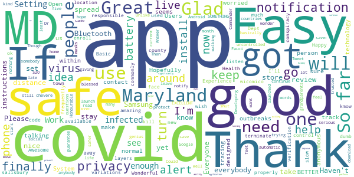
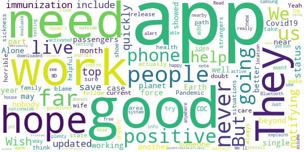
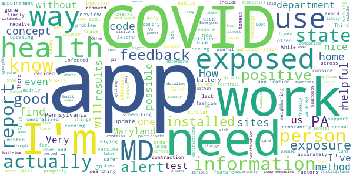
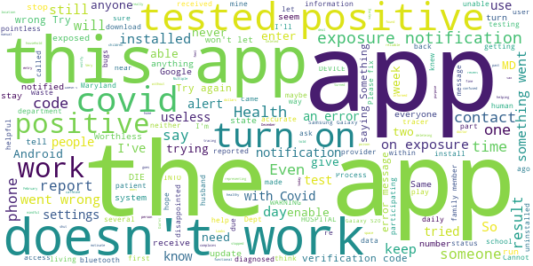

# MD COVID Alert
App version ``minted151008``

Analyzed with [covid-apps-observer](http://github.com/covid-apps-observer) project, version ``0.1``

## App overview
| | |
|-------------------------|-------------------------| 
| **Name**&nbsp;&nbsp;&nbsp;&nbsp;&nbsp;&nbsp;&nbsp;&nbsp;&nbsp;&nbsp;&nbsp;&nbsp;&nbsp;&nbsp;&nbsp;&nbsp;&nbsp;&nbsp;&nbsp;&nbsp;&nbsp;&nbsp;&nbsp;&nbsp;&nbsp;&nbsp;&nbsp;&nbsp;&nbsp;&nbsp;&nbsp;&nbsp;&nbsp;&nbsp;&nbsp;&nbsp;&nbsp;&nbsp;&nbsp;&nbsp;  | MD COVID Alert |
| **Unique identifier** | gov.md.covid19.exposurenotifications |
| **Link to Google Play** | [https://play.google.com/store/apps/details?id=gov.md.covid19.exposurenotifications](https://play.google.com/store/apps/details?id=gov.md.covid19.exposurenotifications) |
| **Summary**  | MD Contact Tracing is the official exposure notification app for Maryland |
| **Privacy policy** | [https://health.maryland.gov/Pages/ENXPrivacy.aspx](https://health.maryland.gov/Pages/ENXPrivacy.aspx) |
| **Latest version** | minted151008 |
| **Last update** | 2021-02-26 16:04:34 |
| **Recent changes** | Bug fixes and performance improvements |
| **Installs**  | 100,000+ |
| **Category** | Medical |
| **First release** | Nov 3, 2020 |
| **Size**  | 10M |
| **Supported Android version**  | 5.0 and up |

### Description
> MD COVID Alert is the official COVID-19 exposure-notifications software for the Maryland Department of Health. The app is an instance of Exposure Notifications Express platform developed by Apple and Google and configured by Maryland.
 Your personal use of MD COVID Alert will help anonymously alert Maryland residents who may have been near someone with a positive COVID-19 diagnosis. When you enable MD COVID Alert, you are doing your part to efficiently and effectively help your community slow the spread of COVID-19.
 How MD COVID Alert works:
 When devices with MD COVID Alert are in close contact, they exchange random identifiers using Bluetooth Low Energy (BLE). When someone tells their app that they tested positive for COVID-19, whoever received their random identifiers may receive an alert that they may have possibly been exposed to COVID-19. When a device receives random identifiers it date-stamps them and records their signal strength so that the Exposure Notification system can estimate how close the two devices were to each other and for how long. If the timeframe was at least 15 minutes and the estimated distance was within six feet, then the other user receives a notification of a possible exposure.
 Apple and Google's Exposure Notifications framework runs in the background, even when the MD COVID Alert app is closed. It will not drain the device battery at a rate that would occur with other apps that use normal Bluetooth and/or are open and running constantly.
 How MD COVID Alert Protects Your Privacy:
 Maryland takes your privacy and confidentiality very seriously. Apple and Google's framework is designed to avoid correlating any personal data and location information with the random identifiers that devices exchange. Maryland Department of Health does not want or need to know where or who you are for MD COVID Alert to work. If you are close enough to another app user, your device's BLE will exchange random identifiers with that user.
 Laboratory results for all persons who test positive for COVID-19 are sent to Maryland Department of Health. This is not associated with the app. Our staff follows up with persons reported as positive, based on information provided within the laboratory report. As a courtesy to all app users, MD COVID ALert will verify positive tests and then provide MD COVID Alert users with a personal identifying number (PIN). You must use that PIN in order to report a positive result to the app. This prevents people from falsely reporting positive results, which could generate false exposure notifications. Maryland Department of Health wants all app users to feel confident that when a possible COVID-19 exposure is received via the app, that it is a real event.
 If you have the current Apple or Google operating system installed on your device, you may have noticed that Exposure Notifications are now included. You cannot enable this function until you have installed the MD COVID Alert app. Apple and Google will delete the exposure notification service tools from their respective operating systems once the pandemic reaches a point that public health no longer requires the use of this technology.
 Thank you for installing MD COVID Alert! Together, we can protect our family, friends, neighbors, and colleagues, and keep Maryland moving forward!

### User interface
The developers of the app provide the following screenshots in the Google play store.
| | | |
|:-------------------------:|:-------------------------:|:-------------------------:|
 |   |  

## Development team
In the following we report the main information provided by the development team in the Google play store.

| | |
|-------------------------|-------------------------|
| **Developer**  | Maryland Department of Health |
| **Website**  | - |
| **Email** | MDH.MDCOVIDAlert@maryland.gov |
| **Physical address**  | - |
| **Other developed apps**  | [https://play.google.com/store/apps/developer?id=Maryland+Department+of+Health](https://play.google.com/store/apps/developer?id=Maryland+Department+of+Health) |

## Android support

| | |
|-------------------------|-------------------------|
| **Declared target Android version**  | - |
| **Effective target Android version**  | - |
| **Minimum supported Android version**  | Lollipop, version 5.0 (API level 21) |
| **Maximum target Android version**  | - |

The larger the difference between the minimum and maximum supported Android versions, the better. A larger difference means a wider audience. For example, old phones have a very low Android version, so a high minimum supported Android version means that the app cannot be used by users with old phones, thus leading to accessibility problems. 

## Requested permissions

In the following we report the complete list of the permissions requested by the app. 

| **Permission** | **Protection level** | **Description** | 
|-------------------------|-------------------------|-------------------------|
 **android.permission ACCESS_NETWORK_STATE** | Normal | Allows applications to access information about networks. 
 **android.permission BLUETOOTH** | Normal | Allows applications to connect to paired bluetooth devices. 
 **android.permission FOREGROUND_SERVICE** | Normal | Allows a regular application to use Service.startForeground. 
 **android.permission INTERNET** | Normal | Allows applications to open network sockets. 
 **android.permission RECEIVE_BOOT_COMPLETED** | Normal | Allows an application to receive the Intent.ACTION_BOOT_COMPLETED that is broadcast after the system finishes booting. 
 **android.permission WAKE_LOCK** | Normal | Allows using PowerManager WakeLocks to keep processor from sleeping or screen from dimming. 

## Mentioned servers

| **Server** | **Registrant** | **Registrant country** | **Creation date** | 
|-------------------------|-------------------------|-------------------------|-------------------------|
 | google.com | Google LLC | :us: US | 1997-09-15 04:00:00 |

## Security analysis 

Below we report the main security warnings raised by our execution of the [Androwarn](https://github.com/maaaaz/androwarn) security analysis tool.

**Telephony identifiers leakage**
> - This application reads the ISO country code equivalent of the current registered operator's MCC (Mobile Country Code) 

**Connection interfaces exfiltration**
> - This application reads details about the currently active data network 
> - This application tries to find out if the currently active data network is metered 

**Suspicious connection establishment**
> - This application opens a Socket and connects it to the remote address 'timeout' on the 'N/A' port  

**Code execution**
> - This application loads a native library: 'prioclient' 

## User ratings and reviews

Below we provide information about how end users are reacting to the app in terms of ratings and reviews in the Google Play store.

### Ratings

The MD COVID Alert app has been installed by more than **100000** times. At this time, **328** rated the app and its average score is **3.55**. Below we show the distribution of the ratings across the usual star-based rating of Google Play

:star::star::star::star::star:: 155

:star::star::star::star:: 46

:star::star::star:: 29

:star::star:: 23

:star:: 75

### Reviews 

#### 5-star reviews

> So far so good  :date: __2021-04-02 01:55:38__

> Wonderful  :date: __2021-03-29 03:08:51__

> You need a verification code but how does one get one!  :date: __2021-03-17 16:37:58__

> Happy to help app is great  :date: __2021-03-15 23:02:28__

> So far so good everybody should have this  :date: __2021-03-08 21:52:20__

> If this app helps slow or terminate the spread of covid 19 or any of its variations I'm all for it!  :date: __2021-02-08 07:27:53__

> Basic, responsible.  :date: __2021-01-29 16:37:08__

> Works great just need to get more people to use it.  :date: __2021-01-24 01:49:16__

> Its amazing to kmow who has covid around u so u know to stay away  :date: __2021-01-03 02:45:56__

> Glad it's on here  :date: __2020-12-26 02:31:39__

#### 4-star reviews

> They are on top of notifying as quickly as they can.  :date: __2021-03-07 20:03:13__

> Wish it was updated to include immunization status.  :date: __2021-02-07 16:37:41__

> I hope this app helps save the lives of the people who are passengers on the planet Earth in the year 2021 and beyond.may the force be with you.😷👽💫💪💀🙏  :date: __2021-02-05 02:28:29__

> So far no good because after more than a month of having the app it never showed me a single case of someone near by being positive for Covid19 so this app needs work or be part of another better app...Alone is not working well or is there nobody actually positive for this Pandemic in my area, which I doubt. People do not want to show strangers about their situations, do not blame them, needs a new path and way to release this to us who do not, hope to never get such a horrible sickness...  :date: __2021-01-09 23:41:56__

> Good  :date: __2021-01-02 15:41:38__

> So far so good  :date: __2020-12-08 00:43:02__

> Yeah I think this is going to be helpful for me I try to make sure to always follow the CDC and take care of my health and also my wife and family.  :date: __2020-12-02 01:20:51__

> It would be a good idea to add the current state guidelines.  :date: __2020-11-15 17:21:15__

> Just downloaded this app. We'll see how it works.  :date: __2020-11-11 23:40:36__

> I have android 5 samsung note phone and I could install it. Read the info about the app which explains how it works (without IDg person or phone) and that made it clear that location setting doesnt have to be on. Bluetooth was activated by app; assume i need to have it active when outside the house. Haven't been anywhere yet, so can't really evaluate app properly. But happy to have this app and plenty of free and nearby testing where I live. We can use all the help we can get!  :date: __2020-11-11 17:15:01__

#### 3-star reviews

> Optional Use.. Would be great if this was Mandatory for everyone to download. Also, would everyone be honest about their Covid test results??. This app is a great blue print starter. But cant be relied upon.  :date: __2021-03-30 23:41:00__

> Conceptually the app is great. Practically it is of little utility. Make your own judgment. Consider how it operates and whether people not using the app or failing to report their health condition is an Achilles Heel. With that said, when I leave my house I turn on Bluetooth to active this app.  :date: __2021-03-06 18:32:30__

> I have to "assume" it works - haven't received an alert, and I have no idea if I've actually been near anyone with the disease. I've had a couple of negative tests and the first vaccine dose so I'm cautiously optimistic.  :date: __2021-02-26 14:22:12__

> Okay  :date: __2021-01-25 15:36:44__

> Finally Maryland is aboard with this Alert system.  :date: __2021-01-18 17:03:51__

> text  :date: __2021-01-15 05:40:42__

> Works well I guess. My biggest gripe is no feedback on the number of contacts made. It would be good to know how many people I have passed by that use or do not use the app in a given day. Why trust the app if I have no idea if it is registering or missing the people I pass by? There aren't even numbers on how effective this app is for me or everyone in general.  :date: __2021-01-06 10:32:39__

> I very much like the ideal that my state has this app with covid being so bad  :date: __2021-01-05 23:47:55__

> Ok  :date: __2021-01-01 19:27:09__

> Interferes with bluetooth devices  :date: __2020-12-30 00:11:14__

#### 2-star reviews

> The problem is, it only checks in the evening, when I'm home, not at the times when I'm at work and could actually be exposed.  :date: __2021-03-08 11:53:32__

> While I like this concept. I find this mainly a concept. There too many factors to consider before actually relying on this. First, is the person I'm walking pass have a similar application. Second, is the app properly set up. Third, has the person accurately and honest inputted their information. Fourth, is the app constantly working. And Sixth, will I receive information in a timely fashion in order to avoid contraction of COVID. If these things could be addressed then I would feel safer.  :date: __2021-03-07 20:14:24__

> This app would be way more useful as a public health tool if it centralized vaccine appointment scheduling across all the administration sites. How often do COVID-infected persons actually report their cases here?  :date: __2021-03-02 15:44:05__

> I wanted to download to support but seeing the reviews and the lack of actual care in updating this app to be on par with neighboring state apps which are way more helpful... I used to use citizen to enable the covid alerts but they removed that feature from the app and decided to try the state app before searching for their tracer app. Way more comprehensive information and you don't need some code from the health department that apparently even the health department can't figure out.  :date: __2021-02-06 00:19:57__

> Updates without proper detailed changelogs.  :date: __2021-01-27 07:35:20__

> Was in same building where covid had been and said none. Everyone needs to participate or it doesnt work!  :date: __2021-01-23 18:37:05__

> I know I've been near several Covid positive people, so far I'm Ok ,, but not one alert . Yet  :date: __2021-01-12 20:39:18__

> Very basic and not helpful, not as good as the PA state app. MD needs to up their game and show they're serious about getting us to use the app. The app directs us to the MD Dept of Health app which is not very user friendly on mobile devices. In comparison the PA app contains statistics by county, helps you determine if you need a test based on your symptoms, and how to report positive results. MD needs to include the same options.  :date: __2020-12-25 17:57:58__

> Installation hung, had to reinstall. though feedback is mentioned, no feedback method built into app. to save power would be nice to be able to turn off when at home location where no visitors or exposure is possible. just installed so may be more feedback later, but no method within app.  :date: __2020-12-17 15:31:22__

> desnt work  :date: __2020-12-17 08:29:56__

#### 1-star reviews

> Did'nt do anything  :date: __2021-03-29 15:45:21__

> Doesn't work  :date: __2021-03-08 10:59:01__

> I haven't been able to motivate or be really mindful since my test. I feel like there was some poison on it. I'm not confused just not being healthy and caffeine isn't helping. It's like before I was fine but after I just shut down and stopped being functional.  :date: __2021-03-07 15:52:06__

> App does not work 😒  :date: __2021-02-14 20:46:44__

> It says it will use bluetooth then it complains that it needs location turned on. So what is the deal ?  :date: __2021-02-10 21:13:28__

> Wont stay off my phone i keep deleteing it  :date: __2021-02-10 01:23:56__

> Waste of space on my phone. I had covid before I knew it and without any warnings from this app. Deleted.  :date: __2021-02-07 02:16:13__

> Doesn't work. Multiple people at my work have it and it keeps saying no recent exposures. What a waste of tax dollars!  :date: __2021-02-04 20:10:05__

> Does not work! Two weeks ago, two people in my home were diagnosed with Covid-19 and I was neither notified by this app nor the Health Dept (maybe the Health Dept knew I would be informed?). I found out today, February 3, 2021 that someone from our school system that myself and my children have daily contact with was diagnosed with Covid-19 in December and we were notified by neither this app, or anyone representing the school system.  :date: __2021-02-04 01:11:59__

> I was exposed to someone positive. I did not receive an alert. I do not know what the purpose of this app will be, but to report COVID exposure, it is not.  :date: __2021-02-03 06:29:16__

