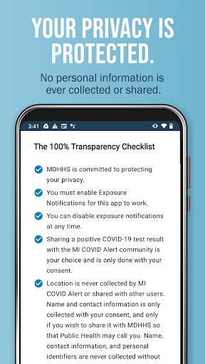
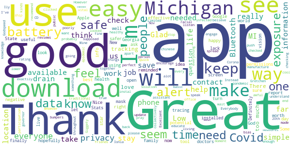
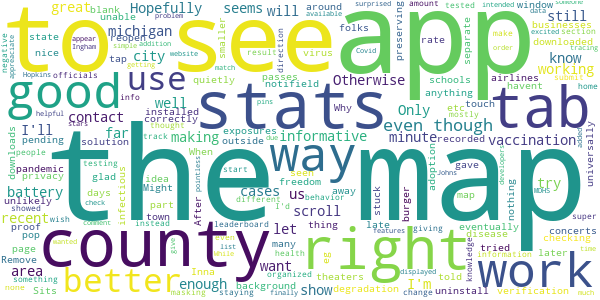

# MI COVID Alert
App version ``1.0``

Analyzed with [covid-apps-observer](http://github.com/covid-apps-observer) project, version ``0.1``

## App overview
| | |
|-------------------------|-------------------------| 
| **Name**&nbsp;&nbsp;&nbsp;&nbsp;&nbsp;&nbsp;&nbsp;&nbsp;&nbsp;&nbsp;&nbsp;&nbsp;&nbsp;&nbsp;&nbsp;&nbsp;&nbsp;&nbsp;&nbsp;&nbsp;&nbsp;&nbsp;&nbsp;&nbsp;&nbsp;&nbsp;&nbsp;&nbsp;&nbsp;&nbsp;&nbsp;&nbsp;&nbsp;&nbsp;&nbsp;&nbsp;&nbsp;&nbsp;&nbsp;&nbsp;  | MI COVID Alert |
| **Unique identifier** | gov.michigan.MiCovidExposure |
| **Link to Google Play** | [https://play.google.com/store/apps/details?id=gov.michigan.MiCovidExposure](https://play.google.com/store/apps/details?id=gov.michigan.MiCovidExposure) |
| **Summary**  | Michigan&#39;s COVID-19 Exposure Notification App |
| **Privacy policy** | [http://michigan.gov/micovidalertprivacy](http://michigan.gov/micovidalertprivacy) |
| **Latest version** | 1.0 |
| **Last update** | 2020-10-13 19:20:41 |
| **Recent changes** | Initial release of MI COVID Alert, the Michigan Department of Health and Human Services Exposure Notifications app. |
| **Installs**  | 1,000+ |
| **Category** | Health & Fitness |
| **First release** | Oct 9, 2020 |
| **Size**  | 2.9M |
| **Supported Android version**  | 6.0 and up |

### Description
> MI COVID Alert is the COVID-19 exposure notification app supported by the Michigan Department of Health and Human Services (MDHHS), in partnership with SpringML, Google, and Apple. This app uses Bluetooth Low Energy (BLE) API framework created through a unique collaboration between Apple and Google.
 Your personal use of MI COVID Alert helps inform others of possible exposure to COVID-19 if they are suspected of having been within close proximity to someone who has tested positive. When you download MI COVID Alert, you are helping your community stay ahead of any potential surge in COVID-19 cases. 
 How MI COVID Alert Works:
 Once downloaded, users of the app who have enabled it will exchange anonymous Bluetooth “keys” (random alpha-numeric codes that represent a Bluetooth signal) with other MI COVID Alert users.
 If someone reports that they tested positive for COVID-19, the app will search for other users who shared the Bluetooth Low Energy (BLE) signal. The BLE signals are date-stamped and MI COVID Alert estimates how close the two devices were based on signal strength. If the timeframe was at least 15 minutes and the estimated distance was within six feet, then the other user receives a notification of a possible exposure. Names of users and locations of possible exposure are never tracked and never shared.
 The BLE framework within MI COVID Alert will run in the background, even if the exposure notification app is closed. It will not drain the device battery at a rate faster than other apps that use normal Bluetooth and/or are open and running continuously.
 How MI COVID Alert Protects Your Privacy:
 MDHHS takes your privacy very seriously. This is why we chose to use the Apple and Google BLE framework. No personal data or location tracking occurs within MI COVID Alert. 
 MDHHS and local public health staff follow up with persons who have a positive COVID-19 laboratory report. Public health will provide MI COVID Alert users with a validation pin. That validation pin must be entered into the app to report a notification of possible exposure to other users. This prevents people from falsely reporting positive results, which could generate false exposure notifications. 
 If you have the current Apple or Google operating system installed on your device, you may have noticed that Exposure Notifications are now included. You cannot enable this function until you have downloaded MI COVID Alert. Apple and Google will delete the exposure notification service tools from their respective operating systems once the pandemic reaches a point that public health no longer requires the use of this technology.
 Thank you for downloading MI COVID Alert! Together, we can protect our family, friends, and communities.

### User interface
The developers of the app provide the following screenshots in the Google play store.
| | | |
|:-------------------------:|:-------------------------:|:-------------------------:|
 |   |   |   | 
 |  

## Development team
In the following we report the main information provided by the development team in the Google play store.

| | |
|-------------------------|-------------------------|
| **Developer**  | State of Michigan |
| **Website**  | [http://www.michigan.gov/micovidalert](http://www.michigan.gov/micovidalert) |
| **Email** | mdhhs-micovidalert@michigan.gov |
| **Physical address**  | - |
| **Other developed apps**  | [https://play.google.com/store/apps/developer?id=State+of+Michigan](https://play.google.com/store/apps/developer?id=State+of+Michigan) |

## Android support

| | |
|-------------------------|-------------------------|
| **Declared target Android version**  | Android10, version 10 (API level 29) |
| **Effective target Android version**  | Android10, version 10 (API level 29) |
| **Minimum supported Android version**  | Marshmallow, version 6.0 (API level 23) |
| **Maximum target Android version**  | - |

The larger the difference between the minimum and maximum supported Android versions, the better. A larger difference means a wider audience. For example, old phones have a very low Android version, so a high minimum supported Android version means that the app cannot be used by users with old phones, thus leading to accessibility problems. 

## Requested permissions

In the following we report the complete list of the permissions requested by the app. 

| **Permission** | **Protection level** | **Description** | 
|-------------------------|-------------------------|-------------------------|
 **android.permission ACCESS_NETWORK_STATE** | Normal | Allows applications to access information about networks. 
 **android.permission BLUETOOTH** | Normal | Allows applications to connect to paired bluetooth devices. 
 **android.permission FOREGROUND_SERVICE** | Normal | Allows a regular application to use Service.startForeground. 
 **android.permission INTERNET** | Normal | Allows applications to open network sockets. 
 **android.permission RECEIVE_BOOT_COMPLETED** | Normal | Allows an application to receive the Intent.ACTION_BOOT_COMPLETED that is broadcast after the system finishes booting. 
 **android.permission WAKE_LOCK** | Normal | Allows using PowerManager WakeLocks to keep processor from sleeping or screen from dimming. 

## Mentioned servers

| **Server** | **Registrant** | **Registrant country** | **Creation date** | 
|-------------------------|-------------------------|-------------------------|-------------------------|
 | google.com | Google LLC | :us: US | 1997-09-15 04:00:00 |
 | jhu.edu | Johns Hopkins University | - | 1987-03-19 00:00:00 |

## Security analysis 

Below we report the main security warnings raised by our execution of the [Androwarn](https://github.com/maaaaz/androwarn) security analysis tool.

**Telephony identifiers leakage**
> - This application reads the ISO country code equivalent of the current registered operator's MCC (Mobile Country Code) 

**Connection interfaces exfiltration**
> - This application reads details about the currently active data network 
> - This application tries to find out if the currently active data network is metered 

## User ratings and reviews

Below we provide information about how end users are reacting to the app in terms of ratings and reviews in the Google Play store.

### Ratings

The MI COVID Alert app has been installed by more than **1000** times. At this time, **24** rated the app and its average score is **4.5833335**. Below we show the distribution of the ratings across the usual star-based rating of Google Play

:star::star::star::star::star:: 20

:star::star::star::star:: 2

:star::star::star:: 0

:star::star:: 0

:star:: 2

### Reviews 

#### 5-star reviews

> thank you! seems like a smart and simple way to anonymously keep people safer!  :date: __2020-10-16 19:50:24__

> Did not load  :date: __2020-10-16 14:29:57__

> Simple and unobtrusive. When you install it doesn't make any requests for your GPS data so you know it's not tracking your location or anything. There's a chat interface to ask questions to someone at the health department.  :date: __2020-10-16 04:08:40__

> 😷 it or ⚰️  :date: __2020-10-16 03:50:17__

> Good app for Michigan  :date: __2020-10-16 00:00:20__

#### 4-star reviews

> I like the app and was surprised to see it had helpful features other than the contact tracing. Even though that is what it is intended for. It doesn't appear to use much battery, even though it hopefully is working all the time. Otherwise it would be pointless. My only problem is the stats displayed don't match the most recent data on the website. That seems simple enough for the developers to get working right.  :date: __2020-10-17 17:47:48__

> I am excited to see an app for Michigan finally available and even though I am not in the Ingham County area I wanted to check it out. I like the addition of the stats from Johns Hopkins and the added use of pins with MDHS in order for someone to list themselves as having Covid. While I did not give it 5 stars (due to just getting the app) I did want to comment and let you know that I appreaciate it.  :date: __2020-10-16 04:03:51__

#### 3-star reviews

No recent reviews available with 3 stars.

#### 2-star reviews

No recent reviews available with 2 stars.

#### 1-star reviews

No recent reviews available with 1 stars.
