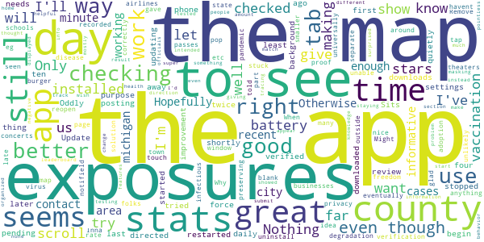

# MI COVID Alert
App version ``1.0``

Analyzed with [covid-apps-observer](http://github.com/covid-apps-observer) project, version ``0.1``

## App overview
| | |
|-------------------------|-------------------------| 
| **Name**&nbsp;&nbsp;&nbsp;&nbsp;&nbsp;&nbsp;&nbsp;&nbsp;&nbsp;&nbsp;&nbsp;&nbsp;&nbsp;&nbsp;&nbsp;&nbsp;&nbsp;&nbsp;&nbsp;&nbsp;&nbsp;&nbsp;&nbsp;&nbsp;&nbsp;&nbsp;&nbsp;&nbsp;&nbsp;&nbsp;&nbsp;&nbsp;&nbsp;&nbsp;&nbsp;&nbsp;&nbsp;&nbsp;&nbsp;&nbsp;  | MI COVID Alert |
| **Unique identifier** | gov.michigan.MiCovidExposure |
| **Link to Google Play** | [https://play.google.com/store/apps/details?id=gov.michigan.MiCovidExposure](https://play.google.com/store/apps/details?id=gov.michigan.MiCovidExposure) |
| **Summary**  | Michigan&#39;s COVID-19 Exposure Notification App |
| **Privacy policy** | [http://michigan.gov/micovidalertprivacy](http://michigan.gov/micovidalertprivacy) |
| **Latest version** | 1.0 |
| **Last update** | 2020-10-13 19:20:41 |
| **Recent changes** | Initial release of MI COVID Alert, the Michigan Department of Health and Human Services Exposure Notifications app. |
| **Installs**  | 1,000+ |
| **Category** | Health & Fitness |
| **First release** | Oct 9, 2020 |
| **Size**  | 2.9M |
| **Supported Android version**  | 6.0 and up |

### Description
> MI COVID Alert is the COVID-19 exposure notification app supported by the Michigan Department of Health and Human Services (MDHHS), in partnership with SpringML, Google, and Apple. This app uses Bluetooth Low Energy (BLE) API framework created through a unique collaboration between Apple and Google.
 Your personal use of MI COVID Alert helps inform others of possible exposure to COVID-19 if they are suspected of having been within close proximity to someone who has tested positive. When you download MI COVID Alert, you are helping your community stay ahead of any potential surge in COVID-19 cases. 
 How MI COVID Alert Works:
 Once downloaded, users of the app who have enabled it will exchange anonymous Bluetooth “keys” (random alpha-numeric codes that represent a Bluetooth signal) with other MI COVID Alert users.
 If someone reports that they tested positive for COVID-19, the app will search for other users who shared the Bluetooth Low Energy (BLE) signal. The BLE signals are date-stamped and MI COVID Alert estimates how close the two devices were based on signal strength. If the timeframe was at least 15 minutes and the estimated distance was within six feet, then the other user receives a notification of a possible exposure. Names of users and locations of possible exposure are never tracked and never shared.
 The BLE framework within MI COVID Alert will run in the background, even if the exposure notification app is closed. It will not drain the device battery at a rate faster than other apps that use normal Bluetooth and/or are open and running continuously.
 How MI COVID Alert Protects Your Privacy:
 MDHHS takes your privacy very seriously. This is why we chose to use the Apple and Google BLE framework. No personal data or location tracking occurs within MI COVID Alert. 
 MDHHS and local public health staff follow up with persons who have a positive COVID-19 laboratory report. Public health will provide MI COVID Alert users with a validation pin. That validation pin must be entered into the app to report a notification of possible exposure to other users. This prevents people from falsely reporting positive results, which could generate false exposure notifications. 
 If you have the current Apple or Google operating system installed on your device, you may have noticed that Exposure Notifications are now included. You cannot enable this function until you have downloaded MI COVID Alert. Apple and Google will delete the exposure notification service tools from their respective operating systems once the pandemic reaches a point that public health no longer requires the use of this technology.
 Thank you for downloading MI COVID Alert! Together, we can protect our family, friends, and communities.

### User interface
The developers of the app provide the following screenshots in the Google play store.
| | | |
|:-------------------------:|:-------------------------:|:-------------------------:|
 |   |   |   | 
 |  

## Development team
In the following we report the main information provided by the development team in the Google play store.

| | |
|-------------------------|-------------------------|
| **Developer**  | State of Michigan |
| **Website**  | [http://www.michigan.gov/micovidalert](http://www.michigan.gov/micovidalert) |
| **Email** | mdhhs-micovidalert@michigan.gov |
| **Physical address**  | - |
| **Other developed apps**  | [https://play.google.com/store/apps/developer?id=State+of+Michigan](https://play.google.com/store/apps/developer?id=State+of+Michigan) |

## Android support

| | |
|-------------------------|-------------------------|
| **Declared target Android version**  | Android10, version 10 (API level 29) |
| **Effective target Android version**  | Android10, version 10 (API level 29) |
| **Minimum supported Android version**  | Marshmallow, version 6.0 (API level 23) |
| **Maximum target Android version**  | - |

The larger the difference between the minimum and maximum supported Android versions, the better. A larger difference means a wider audience. For example, old phones have a very low Android version, so a high minimum supported Android version means that the app cannot be used by users with old phones, thus leading to accessibility problems. 

## Requested permissions

In the following we report the complete list of the permissions requested by the app. 

| **Permission** | **Protection level** | **Description** | 
|-------------------------|-------------------------|-------------------------|
 **android.permission ACCESS_NETWORK_STATE** | Normal | Allows applications to access information about networks. 
 **android.permission BLUETOOTH** | Normal | Allows applications to connect to paired bluetooth devices. 
 **android.permission FOREGROUND_SERVICE** | Normal | Allows a regular application to use Service.startForeground. 
 **android.permission INTERNET** | Normal | Allows applications to open network sockets. 
 **android.permission RECEIVE_BOOT_COMPLETED** | Normal | Allows an application to receive the Intent.ACTION_BOOT_COMPLETED that is broadcast after the system finishes booting. 
 **android.permission WAKE_LOCK** | Normal | Allows using PowerManager WakeLocks to keep processor from sleeping or screen from dimming. 

## Mentioned servers

| **Server** | **Registrant** | **Registrant country** | **Creation date** | 
|-------------------------|-------------------------|-------------------------|-------------------------|
 | google.com | Google LLC | :us: US | 1997-09-15 04:00:00 |
 | jhu.edu | Johns Hopkins University | - | 1987-03-19 00:00:00 |

## Security analysis 

Below we report the main security warnings raised by our execution of the [Androwarn](https://github.com/maaaaz/androwarn) security analysis tool.

**Telephony identifiers leakage**
> - This application reads the ISO country code equivalent of the current registered operator's MCC (Mobile Country Code) 

**Connection interfaces exfiltration**
> - This application reads details about the currently active data network 
> - This application tries to find out if the currently active data network is metered 

## User ratings and reviews

Below we provide information about how end users are reacting to the app in terms of ratings and reviews in the Google Play store.

### Ratings

The MI COVID Alert app has been installed by more than **1000** times. At this time, **24** rated the app and its average score is **4.5833335**. Below we show the distribution of the ratings across the usual star-based rating of Google Play

:star::star::star::star::star:: 20

:star::star::star::star:: 2

:star::star::star:: 0

:star::star:: 0

:star:: 2

### Reviews 

#### 5-star reviews

> New to it but could be a life savior!  :date: __2020-11-15 21:27:57__

> Great app. It's private and low impact to my phone. The one downside is it relies and others installing and using it. It does provide some good statistical and links to general information  :date: __2020-11-15 14:17:04__

> Easy, and I like that it reminded me that it wouldn't work with my Bluetooth turned off (which reminded me to turn Bluetooth on!).  :date: __2020-11-14 23:09:39__

> I really am sick of conspiracy theorists.  :date: __2020-11-14 14:51:24__

> Great info, easy to use. My only suggestion is to reduce the size of the text box on the Stats page regarding Johns Hopkins along with the logo. It takes up too much of the screen on my Android mobile device. I can only use 40% of the screen for scrolling the stats.  :date: __2020-11-14 01:45:27__

> Great that I can be notified of potential exposure to covid-19!!  :date: __2020-11-14 00:40:01__

> Awesome  :date: __2020-11-13 23:35:40__

> Great idea! Definitely necessary during these crazy times! Hope everyone downloads it!  :date: __2020-11-13 22:26:55__

> Glad to see we finally have this in Michigan. This looks like a good noninvasive app to help keep us safe  :date: __2020-11-13 21:52:18__

> Great to keep safe  :date: __2020-11-13 20:28:39__

#### 4-star reviews

> Its a good way to b notifield about the virus  :date: __2020-11-14 23:32:03__

> Information is powerful for health and wellbeing.  :date: __2020-11-14 22:56:37__

> Remove stats tab. Why isn't this for any infectious disease.  :date: __2020-11-14 00:37:30__

> In the stats tab if you scroll to the map you get stuck unable to scroll outside of the map. Only solution seems to be to reopen the app. Might try making the map a touch smaller or making it a separate pop out window or something.  :date: __2020-11-13 21:25:25__

> This app is great, but it would be even better if we could submit a result that tested negative so that health officials can track this as well.  :date: __2020-11-13 19:36:09__

> Hopefully enough people use it to make it work!  :date: __2020-11-13 17:03:29__

> I wish the information was more well organized and the map was more informative. It would be great if the map showed the amount of cases by city instead of county, more recent info, and the map on a different section of the app because I thought for a minute that there was no map, there is its just not super informative. I'd also like to see a leaderboard of what city's have the most cases and have testing areas on the map. Otherwise it's a good start in the right direction for michigan :)  :date: __2020-11-12 14:36:48__

> I'm giving it a try because any knowledge is better than none. It won't change my behavior. I'll still be masking and mostly staying home.  :date: __2020-11-10 00:18:04__

> I like the app and was surprised to see it had helpful features other than the contact tracing. Even though that is what it is intended for. It doesn't appear to use much battery, even though it hopefully is working all the time. Otherwise it would be pointless. My only problem is the stats displayed don't match the most recent data on the website. That seems simple enough for the developers to get working right.  :date: __2020-10-17 17:47:48__

> I am excited to see an app for Michigan finally available and even though I am not in the Ingham County area I wanted to check it out. I like the addition of the stats from Johns Hopkins and the added use of pins with MDHS in order for someone to list themselves as having Covid. While I did not give it 5 stars (due to just getting the app) I did want to comment and let you know that I appreaciate it.  :date: __2020-10-16 04:03:51__

#### 3-star reviews

> Nice start, but it's deceptive giving static statistics. Need to do update stats daily or remove them!  :date: __2020-11-15 17:48:11__

> The county health department is so overwhelmed I likely won't be contacted to get the pin # to put in my positive test. I can have no clear idea of how effective the app is, but it's better than nothing  :date: __2020-11-15 14:33:26__

> Great idea  :date: __2020-11-15 00:39:09__

> I think the concept of this app is a step in flattening the curve but unless all Michiganders are downloading and using this how is its effectivenes Therefore, I think requirement of the app by all with smart phones or access might make it more successful, not only Michigan but throughout the United States. Matter of fact Everywhere this is a "Global Pandemic". Pre-installment (as other widely used apps are already installed on new phones) is a good idea as well. Please Consider  :date: __2020-11-14 19:46:35__

> Being able to see a how many people in your area have downloaded the app would be helpful. Its far more accurate if my city has 5k+ downloads than if it only has 500.  :date: __2020-11-14 17:53:39__

> I am a nurse and have tested positive in April. No pin given. Won't let me submit my result  :date: __2020-11-14 09:22:03__

> I will it ever download, still pending After 5 Minutes  :date: __2020-11-14 04:23:42__

> We live in a weird ass world, ive been inside for months  :date: __2020-11-13 20:05:32__

> Too much text, especially when you try to look at John Hopkins pages. The notice about that fills half the page, the bottom icons take more, so you get very little info on the screen and cant even see that it is michigan on the map. Next topic: I also worry very much about being tracked and my privacy.  :date: __2020-11-12 16:00:48__

#### 2-star reviews

> You only have 1" to view info. Needs work.  :date: __2020-11-15 17:34:28__

> I wish this Covid-MI was more like the COVID -NJ APP it actually let you know if been exposed . Has a feature that circles They need to improve the Covid-19 app for MI Whomever developed should look at the Covid-NJ app asap  :date: __2020-11-15 08:12:50__

> Seems like a good idea, I'm not in a major city and don't work around large amounts of people so not sure how effective it will be for me. One thing it did I don't get since it says it uses bluetooth and won't ask for GPS, is it required me to have my GPS on to receive notifications! Everything I read about the app says it shouldn't and won't do this and it's not listed as part of the app permissions. If the app really needs GPS on they need to make sure it's known and listed in the permissions!  :date: __2020-11-14 13:59:23__

> The design makes it impossible to read the info in stats.  :date: __2020-11-14 03:17:19__

> Don't delete my review again because you don't like it. Oh look, a 'FEAR' spreading tool to manipulate the mob.  :date: __2020-11-13 19:46:56__

#### 1-star reviews

> This app is worthless. Srop feeding the fear  :date: __2020-11-16 06:17:15__

> Covid 19 has a 99.98% survival rate , no need for this app.  :date: __2020-11-15 21:00:14__

> Don't bother, your battery will die before it has any time to do anything useful. Downloaded had to charge my phone every 3 hours.  :date: __2020-11-15 06:39:46__

> Big brother  :date: __2020-11-15 03:46:39__

> Doesn't work. Just tells you to update Google play services but it's already up to date.  :date: __2020-11-15 03:32:49__

> Tyrannical government app  :date: __2020-11-14 19:09:40__

> I don't have blue tooth do this app will not help me at all.  :date: __2020-11-14 00:19:45__

> How can I give a review when I just opened it up  :date: __2020-11-13 23:27:23__

> Absolutely horrible!  :date: __2020-11-13 23:19:36__

> Stupid  :date: __2020-11-13 23:09:15__

