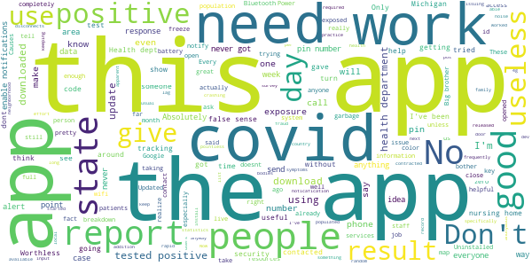

# MI COVID Alert
App version ``1.0``

Analyzed with [covid-apps-observer](http://github.com/covid-apps-observer) project, version ``0.1``

## App overview
| | |
|-------------------------|-------------------------| 
| **Name**&nbsp;&nbsp;&nbsp;&nbsp;&nbsp;&nbsp;&nbsp;&nbsp;&nbsp;&nbsp;&nbsp;&nbsp;&nbsp;&nbsp;&nbsp;&nbsp;&nbsp;&nbsp;&nbsp;&nbsp;&nbsp;&nbsp;&nbsp;&nbsp;&nbsp;&nbsp;&nbsp;&nbsp;&nbsp;&nbsp;&nbsp;&nbsp;&nbsp;&nbsp;&nbsp;&nbsp;&nbsp;&nbsp;&nbsp;&nbsp;  | MI COVID Alert |
| **Unique identifier** | gov.michigan.MiCovidExposure |
| **Link to Google Play** | [https://play.google.com/store/apps/details?id=gov.michigan.MiCovidExposure](https://play.google.com/store/apps/details?id=gov.michigan.MiCovidExposure) |
| **Summary**  | Michigan&#39;s COVID-19 Exposure Notification App |
| **Privacy policy** | [http://michigan.gov/micovidalertprivacy](http://michigan.gov/micovidalertprivacy) |
| **Latest version** | 1.0 |
| **Last update** | 2020-10-13 19:20:41 |
| **Recent changes** | Initial release of MI COVID Alert, the Michigan Department of Health and Human Services Exposure Notifications app. |
| **Installs**  | 1,000+ |
| **Category** | Health & Fitness |
| **First release** | Oct 9, 2020 |
| **Size**  | 2.9M |
| **Supported Android version**  | 6.0 and up |

### Description
> MI COVID Alert is the COVID-19 exposure notification app supported by the Michigan Department of Health and Human Services (MDHHS), in partnership with SpringML, Google, and Apple. This app uses Bluetooth Low Energy (BLE) API framework created through a unique collaboration between Apple and Google.
 Your personal use of MI COVID Alert helps inform others of possible exposure to COVID-19 if they are suspected of having been within close proximity to someone who has tested positive. When you download MI COVID Alert, you are helping your community stay ahead of any potential surge in COVID-19 cases. 
 How MI COVID Alert Works:
 Once downloaded, users of the app who have enabled it will exchange anonymous Bluetooth “keys” (random alpha-numeric codes that represent a Bluetooth signal) with other MI COVID Alert users.
 If someone reports that they tested positive for COVID-19, the app will search for other users who shared the Bluetooth Low Energy (BLE) signal. The BLE signals are date-stamped and MI COVID Alert estimates how close the two devices were based on signal strength. If the timeframe was at least 15 minutes and the estimated distance was within six feet, then the other user receives a notification of a possible exposure. Names of users and locations of possible exposure are never tracked and never shared.
 The BLE framework within MI COVID Alert will run in the background, even if the exposure notification app is closed. It will not drain the device battery at a rate faster than other apps that use normal Bluetooth and/or are open and running continuously.
 How MI COVID Alert Protects Your Privacy:
 MDHHS takes your privacy very seriously. This is why we chose to use the Apple and Google BLE framework. No personal data or location tracking occurs within MI COVID Alert. 
 MDHHS and local public health staff follow up with persons who have a positive COVID-19 laboratory report. Public health will provide MI COVID Alert users with a validation pin. That validation pin must be entered into the app to report a notification of possible exposure to other users. This prevents people from falsely reporting positive results, which could generate false exposure notifications. 
 If you have the current Apple or Google operating system installed on your device, you may have noticed that Exposure Notifications are now included. You cannot enable this function until you have downloaded MI COVID Alert. Apple and Google will delete the exposure notification service tools from their respective operating systems once the pandemic reaches a point that public health no longer requires the use of this technology.
 Thank you for downloading MI COVID Alert! Together, we can protect our family, friends, and communities.

### User interface
The developers of the app provide the following screenshots in the Google play store.
| | | |
|:-------------------------:|:-------------------------:|:-------------------------:|
 |   |   |   | 
 |  

## Development team
In the following we report the main information provided by the development team in the Google play store.

| | |
|-------------------------|-------------------------|
| **Developer**  | State of Michigan |
| **Website**  | [http://www.michigan.gov/micovidalert](http://www.michigan.gov/micovidalert) |
| **Email** | mdhhs-micovidalert@michigan.gov |
| **Physical address**  | - |
| **Other developed apps**  | [https://play.google.com/store/apps/developer?id=State+of+Michigan](https://play.google.com/store/apps/developer?id=State+of+Michigan) |

## Android support

| | |
|-------------------------|-------------------------|
| **Declared target Android version**  | Android10, version 10 (API level 29) |
| **Effective target Android version**  | Android10, version 10 (API level 29) |
| **Minimum supported Android version**  | Marshmallow, version 6.0 (API level 23) |
| **Maximum target Android version**  | - |

The larger the difference between the minimum and maximum supported Android versions, the better. A larger difference means a wider audience. For example, old phones have a very low Android version, so a high minimum supported Android version means that the app cannot be used by users with old phones, thus leading to accessibility problems. 

## Requested permissions

In the following we report the complete list of the permissions requested by the app. 

| **Permission** | **Protection level** | **Description** | 
|-------------------------|-------------------------|-------------------------|
 **android.permission ACCESS_NETWORK_STATE** | Normal | Allows applications to access information about networks. 
 **android.permission BLUETOOTH** | Normal | Allows applications to connect to paired bluetooth devices. 
 **android.permission FOREGROUND_SERVICE** | Normal | Allows a regular application to use Service.startForeground. 
 **android.permission INTERNET** | Normal | Allows applications to open network sockets. 
 **android.permission RECEIVE_BOOT_COMPLETED** | Normal | Allows an application to receive the Intent.ACTION_BOOT_COMPLETED that is broadcast after the system finishes booting. 
 **android.permission WAKE_LOCK** | Normal | Allows using PowerManager WakeLocks to keep processor from sleeping or screen from dimming. 

## Mentioned servers

| **Server** | **Registrant** | **Registrant country** | **Creation date** | 
|-------------------------|-------------------------|-------------------------|-------------------------|
 | google.com | Google LLC | :us: US | 1997-09-15 04:00:00 |
 | jhu.edu | Johns Hopkins University | - | 1987-03-19 00:00:00 |

## Security analysis 

Below we report the main security warnings raised by our execution of the [Androwarn](https://github.com/maaaaz/androwarn) security analysis tool.

**Telephony identifiers leakage**
> - This application reads the ISO country code equivalent of the current registered operator's MCC (Mobile Country Code) 

**Connection interfaces exfiltration**
> - This application reads details about the currently active data network 
> - This application tries to find out if the currently active data network is metered 

## User ratings and reviews

Below we provide information about how end users are reacting to the app in terms of ratings and reviews in the Google Play store.

### Ratings

The MI COVID Alert app has been installed by more than **1000** times. At this time, **24** rated the app and its average score is **4.5833335**. Below we show the distribution of the ratings across the usual star-based rating of Google Play

:star::star::star::star::star:: 20

:star::star::star::star:: 2

:star::star::star:: 0

:star::star:: 0

:star:: 2

### Reviews 

#### 5-star reviews

> This is very vital to me because I need to know what's going on out in the world because of what I do for a living. I help manufacture bumpers and ship them out all throughout the world here in Ionia Michigan. Thank you again. Godspeed  :date: __2020-11-29 20:48:25__

> This is what MI needs. However, it will only be as effective as we collectively make it. Get others to download the app and to report when they are infected.  :date: __2020-11-27 19:41:14__

> i like keep update in michigan covid 19 alert y  :date: __2020-11-27 12:27:49__

> Great assistant to traditional contact tracing measures. Limited permissions needed.  :date: __2020-11-27 06:26:50__

> Quick and easy to instal!!! Lets work together to end this pandemic.  :date: __2020-11-27 02:18:10__

> I believe it true?  :date: __2020-11-25 22:46:24__

> Great app! More people need to have it, that's the only way it will be the best app for this awful time in our lives!  :date: __2020-11-25 17:36:32__

> I haven't looked at this app at all. I just want to thank whoever made this. Some people have great visions but lack knowledge to see the vision through. Giggety. Ily  :date: __2020-11-24 18:07:30__

> Need this in my life  :date: __2020-11-24 16:34:43__

> Mine was checking 4 times a day.. hasn't checked for exposure since Nov 20th. How can I push the app to check for exposures? I'm not sure if I clicked on something to stop the checks? Thanks!!  :date: __2020-11-24 16:19:49__

#### 4-star reviews

> I will if it ever downloads, still pending After 5 Minutes, tried again a few days later and it downloaded right away  :date: __2020-12-04 05:11:59__

> Sits quietly in the background doing it's thing with no battery degradation. Like to see a tab to show vaccination verification because eventually schools, businesses, concerts, theaters, airlines, etc will want to see proof of vaccination.  :date: __2020-12-02 02:55:30__

> So far I havent seen anything about exposures. It would be good if they told me how my county and town is doing.  :date: __2020-11-26 16:31:22__

> I installed it to do my part. I'll uninstall it once this pandemic passes. That's freedom.  :date: __2020-11-21 18:55:35__

> I'm glad to have this, but the map doesn't work correctly. When I tap on a county, it just shows a blank page.  :date: __2020-11-21 16:50:48__

> Just checking it out  :date: __2020-11-20 08:58:10__

> Way to late and unlikely to work universally (eg. with folks from out of state) but it's better than the nothing burger we've had so far. Would be nice if it gave you an idea of how many contacts it recorded (Inna privacy preserving way) to let us know the adoption rate around us.  :date: __2020-11-17 03:59:58__

> Its a good way to b notifield about the virus  :date: __2020-11-14 23:32:03__

> Information is powerful for health and wellbeing.  :date: __2020-11-14 22:56:37__

> Remove stats tab. Why isn't this for any infectious disease.  :date: __2020-11-14 00:37:30__

#### 3-star reviews

> Very confusing.......  :date: __2020-11-29 00:19:29__

> On the page "Michigan Coronavirus Stats" 2/3 of the page is covered with text about John Hopkins. To scroll the important information there is only a 1 inch window.  :date: __2020-11-19 14:59:18__

> Nice start, but it's deceptive giving static statistics. Need to do update stats daily or remove them!  :date: __2020-11-15 17:48:11__

> The county health department is so overwhelmed I likely won't be contacted to get the pin # to put in my positive test. I can have no clear idea of how effective the app is, but it's better than nothing  :date: __2020-11-15 14:33:26__

> Great idea  :date: __2020-11-15 00:39:09__

> I think the concept of this app is a step in flattening the curve but unless all Michiganders are downloading and using this how is its effectivenes Therefore, I think requirement of the app by all with smart phones or access might make it more successful, not only Michigan but throughout the United States. Matter of fact Everywhere this is a "Global Pandemic". Pre-installment (as other widely used apps are already installed on new phones) is a good idea as well. Please Consider  :date: __2020-11-14 19:46:35__

> Being able to see a how many people in your area have downloaded the app would be helpful. Its far more accurate if my city has 5k+ downloads than if it only has 500.  :date: __2020-11-14 17:53:39__

> I am a nurse and have tested positive in April. No pin given. Won't let me submit my result  :date: __2020-11-14 09:22:03__

> We live in a weird ass world, ive been inside for months  :date: __2020-11-13 20:05:32__

> Too much text, especially when you try to look at John Hopkins pages. The notice about that fills half the page, the bottom icons take more, so you get very little info on the screen and cant even see that it is michigan on the map. Next topic: I also worry very much about being tracked and my privacy.  :date: __2020-11-12 16:00:48__

#### 2-star reviews

> Seems like a good idea, I'm not in a major city and don't work around large amounts of people so not sure how effective it will be for me. One thing it did I don't get since it says it uses bluetooth and won't ask for GPS, is it required me to have my GPS on to receive notifications! "Exposure notification inactive" this is what it tells me unless my GPS is on. "To use turn on location."  :date: __2020-12-04 23:34:03__

> This has not checked for 4days  :date: __2020-11-24 22:28:57__

> Great idea & much needed. However... requires keeping your Location & Bluetooth ON constantly, in order to function. And that's a MASSIVE suck for the battery power on most phones. Devs need to change that, somehow! Until then, I'm uninstalling this app.  :date: __2020-11-23 00:53:19__

> Why are only 3 ethnic groups shown in the Statewide Racial Breakdown? The groups shown are Black/African American, Hispanic/Latino, and Native American/Alaskan Native. What about Asians? Middle Eastern? Michigan is made up of more than 3 ethnic groups and whites.  :date: __2020-11-22 15:22:42__

> Would be nice if the Stats screen wasn't 80% ad for John Hopkins. Would like to see better view of the stats.  :date: __2020-11-19 15:35:54__

> Would not come in kept trying  :date: __2020-11-19 00:24:18__

> The main page with the stats has half the screen taken up with a banner crediting John Hopkins for the work. You can't minimize it and it hinders the usability of the app  :date: __2020-11-18 22:44:08__

> You only have 1" to view info. Needs work.  :date: __2020-11-15 17:34:28__

> I wish this Covid-MI was more like the COVID -NJ APP it actually let you know if been exposed . Has a feature that circles They need to improve the Covid-19 app for MI Whomever developed should look at the Covid-NJ app asap  :date: __2020-11-15 08:12:50__

> The design makes it impossible to read the info in stats.  :date: __2020-11-14 03:17:19__

#### 1-star reviews

> They can't even update the false numbers 🤣🤣  :date: __2020-12-04 13:15:19__

> Gubermint printing dollars, forcing small businesses to close, impoverishing the middle class, covid19 is their excuse for taking our rights as well as our livelihoods away. Don't let this app help them divide and conquer We The People.  :date: __2020-12-04 03:48:50__

> Absolutely useless. Doesn't do anything but sit there. It has never shown me in close contact (because not enough people use it) and when I did contract COVID, I could not notify through the app because the state never contacted me with a special code. I would not trust this at all. Uninstalling!  :date: __2020-12-02 04:09:31__

> No one uses it. Only works if people report they had it on the app.  :date: __2020-12-01 13:14:06__

> Doesnt open, doesn't work at all  :date: __2020-12-01 07:59:08__

> Absolutely not useful everyone knows the numbers are lies so what's the point  :date: __2020-12-01 06:43:55__

> So far so good I suppose, what to do when your job obscures exposure data to prevent absence? I know I've been exposed, apparently no one at my job has this app, so that is less than helpful.  :date: __2020-12-01 04:05:36__

> The app is useless unless everyone who has a positive test submits their result. It's very unrealistic to expect compliance to that level. Interesting concept but completely irrelevant based on inconsistencies in reporting. If someone didn't realize these flaws it also could create a false sense of security. State of Michigan- In response to your answer, that is exactly the point I was trying to make. If everyone is not using the app what information are you really going to get from it?  :date: __2020-11-30 22:15:52__

> If the Health Dept doesn't get you a pin number for so far 7 days since I tested positive, how the hell is that doing any body any good. You need a pin to show you tested positive. This is totally useless.  :date: __2020-11-30 18:00:24__

> This seems like a pretty massive Hippo violation  :date: __2020-11-27 21:10:11__

