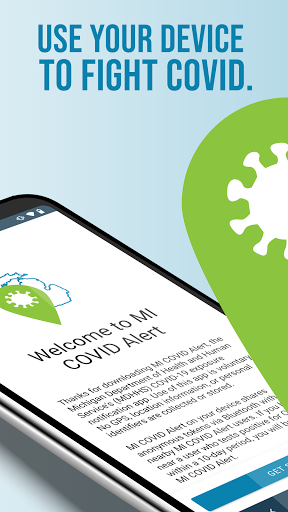
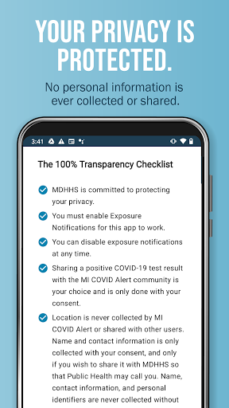
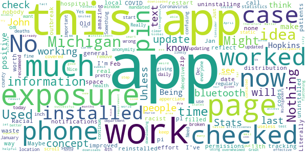
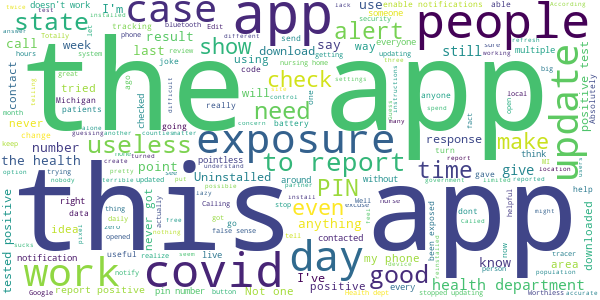

# MI COVID Alert
App version ``1.2``

Analyzed with [covid-apps-observer](http://github.com/covid-apps-observer) project, version ``0.1``

## App overview
| | |
|-------------------------|-------------------------| 
| **Name**&nbsp;&nbsp;&nbsp;&nbsp;&nbsp;&nbsp;&nbsp;&nbsp;&nbsp;&nbsp;&nbsp;&nbsp;&nbsp;&nbsp;&nbsp;&nbsp;&nbsp;&nbsp;&nbsp;&nbsp;&nbsp;&nbsp;&nbsp;&nbsp;&nbsp;&nbsp;&nbsp;&nbsp;&nbsp;&nbsp;&nbsp;&nbsp;&nbsp;&nbsp;&nbsp;&nbsp;&nbsp;&nbsp;&nbsp;&nbsp;  | MI COVID Alert |
| **Unique identifier** | gov.michigan.MiCovidExposure |
| **Link to Google Play** | [https://play.google.com/store/apps/details?id=gov.michigan.MiCovidExposure](https://play.google.com/store/apps/details?id=gov.michigan.MiCovidExposure) |
| **Summary**  | Michigan&#39;s COVID-19 Exposure Notification App |
| **Privacy policy** | [http://michigan.gov/micovidalertprivacy](http://michigan.gov/micovidalertprivacy) |
| **Latest version** | 1.2 |
| **Last update** | 2020-12-24 18:18:37 |
| **Recent changes** | Minor fixes |
| **Installs**  | 100,000+ |
| **Category** | Health & Fitness |
| **First release** | Oct 9, 2020 |
| **Size**  | 3.1M |
| **Supported Android version**  | 6.0 and up |

### Description
> MI COVID Alert is the COVID-19 exposure notification app supported by the Michigan Department of Health and Human Services (MDHHS), in partnership with SpringML, Google, and Apple. This app uses Bluetooth Low Energy (BLE) API framework created through a unique collaboration between Apple and Google.
 Your personal use of MI COVID Alert helps inform others of possible exposure to COVID-19 if they are suspected of having been within close proximity to someone who has tested positive. When you download MI COVID Alert, you are helping your community stay ahead of any potential surge in COVID-19 cases. 
 How MI COVID Alert Works:
 Once downloaded, users of the app who have enabled it will exchange anonymous Bluetooth “keys” (random alpha-numeric codes that represent a Bluetooth signal) with other MI COVID Alert users.
 If someone reports that they tested positive for COVID-19, the app will search for other users who shared the Bluetooth Low Energy (BLE) signal. The BLE signals are date-stamped and MI COVID Alert estimates how close the two devices were based on signal strength. If the timeframe was at least 15 minutes and the estimated distance was within six feet, then the other user receives a notification of a possible exposure. Names of users and locations of possible exposure are never tracked and never shared.
 The BLE framework within MI COVID Alert will run in the background, even if the exposure notification app is closed. It will not drain the device battery at a rate faster than other apps that use normal Bluetooth and/or are open and running continuously.
 How MI COVID Alert Protects Your Privacy:
 MDHHS takes your privacy very seriously. This is why we chose to use the Apple and Google BLE framework. No personal data or location tracking occurs within MI COVID Alert. 
 MDHHS and local public health staff follow up with persons who have a positive COVID-19 laboratory report. Public health will provide MI COVID Alert users with a validation pin. That validation pin must be entered into the app to report a notification of possible exposure to other users. This prevents people from falsely reporting positive results, which could generate false exposure notifications. 
 If you have the current Apple or Google operating system installed on your device, you may have noticed that Exposure Notifications are now included. You cannot enable this function until you have downloaded MI COVID Alert. Apple and Google will delete the exposure notification service tools from their respective operating systems once the pandemic reaches a point that public health no longer requires the use of this technology.
 Thank you for downloading MI COVID Alert! Together, we can protect our family, friends, and communities.

### User interface
The developers of the app provide the following screenshots in the Google play store.
| | | |
|:-------------------------:|:-------------------------:|:-------------------------:|
 |   |   |   | 
 |  

## Development team
In the following we report the main information provided by the development team in the Google play store.

| | |
|-------------------------|-------------------------|
| **Developer**  | State of Michigan |
| **Website**  | [http://www.michigan.gov/micovidalert](http://www.michigan.gov/micovidalert) |
| **Email** | mdhhs-micovidalert@michigan.gov |
| **Physical address**  | - |
| **Other developed apps**  | [https://play.google.com/store/apps/developer?id=State+of+Michigan](https://play.google.com/store/apps/developer?id=State+of+Michigan) |

## Android support

| | |
|-------------------------|-------------------------|
| **Declared target Android version**  | Android10, version 10 (API level 29) |
| **Effective target Android version**  | Android10, version 10 (API level 29) |
| **Minimum supported Android version**  | Marshmallow, version 6.0 (API level 23) |
| **Maximum target Android version**  | - |

The larger the difference between the minimum and maximum supported Android versions, the better. A larger difference means a wider audience. For example, old phones have a very low Android version, so a high minimum supported Android version means that the app cannot be used by users with old phones, thus leading to accessibility problems. 

## Requested permissions

In the following we report the complete list of the permissions requested by the app. 

| **Permission** | **Protection level** | **Description** | 
|-------------------------|-------------------------|-------------------------|
 **android.permission ACCESS_NETWORK_STATE** | Normal | Allows applications to access information about networks. 
 **android.permission BLUETOOTH** | Normal | Allows applications to connect to paired bluetooth devices. 
 **android.permission FOREGROUND_SERVICE** | Normal | Allows a regular application to use Service.startForeground. 
 **android.permission INTERNET** | Normal | Allows applications to open network sockets. 
 **android.permission RECEIVE_BOOT_COMPLETED** | Normal | Allows an application to receive the Intent.ACTION_BOOT_COMPLETED that is broadcast after the system finishes booting. 
 **android.permission WAKE_LOCK** | Normal | Allows using PowerManager WakeLocks to keep processor from sleeping or screen from dimming. 

## Mentioned servers

| **Server** | **Registrant** | **Registrant country** | **Creation date** | 
|-------------------------|-------------------------|-------------------------|-------------------------|
 | google.com | Google LLC | :us: US | 1997-09-15 04:00:00 |
 | jhu.edu | Johns Hopkins University | - | 1987-03-19 00:00:00 |

## Security analysis 

Below we report the main security warnings raised by our execution of the [Androwarn](https://github.com/maaaaz/androwarn) security analysis tool.

**Telephony identifiers leakage**
> - This application reads the ISO country code equivalent of the current registered operator's MCC (Mobile Country Code) 

**Connection interfaces exfiltration**
> - This application reads details about the currently active data network 
> - This application tries to find out if the currently active data network is metered 

## User ratings and reviews

Below we provide information about how end users are reacting to the app in terms of ratings and reviews in the Google Play store.

### Ratings

The MI COVID Alert app has been installed by more than **100000** times. At this time, **392** rated the app and its average score is **3.2380953**. Below we show the distribution of the ratings across the usual star-based rating of Google Play

:star::star::star::star::star:: 176

:star::star::star::star:: 41

:star::star::star:: 15

:star::star:: 22

:star:: 138

### Reviews 

#### 5-star reviews

> Free  :date: __2021-01-04 16:26:34__

> A little piece of mind for these times we live in  :date: __2020-12-29 13:49:56__

> Everybody should get this app so all of us can be safe and healthy so please use the app  :date: __2020-12-26 00:59:02__

> Just use the app  :date: __2020-12-24 07:21:40__

> Excellent app, easy to understand, I recommend it. I think it is a good idea. (By the way, no Covid-19 here).  :date: __2020-12-24 02:27:46__

> GREAT!!!!!!!  :date: __2020-12-21 19:27:07__

> Seems to do the basic job it's supposed to do.  :date: __2020-12-19 21:35:16__

> They let YOU KNOW exactily what is what about this chinese epidemic-19.  :date: __2020-12-13 02:49:59__

> Feel safer  :date: __2020-12-11 04:10:05__

> Nice to know of the Corona  :date: __2020-12-10 20:00:17__

#### 4-star reviews

> I give it 4 stars needs improvement . but still great app.  :date: __2020-12-22 15:38:23__

> For the first ten days I had this installed Exposures were checked 2 - 3 times each day. As of this review, the last time Exposures were checked was four days ago. I've verified all settings on the phone as directed by the app. I've force stopped and restarted the app. Nothing seems to get it to begin checking exposures again. If not checking for exposures, what is the purpose of the app? Update:. Oddly shortly after posting the above, the app started updating exposures at least twice daily.  :date: __2020-12-16 23:05:53__

> I will if it ever downloads, still pending After 5 Minutes, tried again a few days later and it downloaded right away  :date: __2020-12-04 05:11:59__

> Sits quietly in the background doing it's thing with no battery degradation. Like to see a tab to show vaccination verification because eventually schools, businesses, concerts, theaters, airlines, etc will want to see proof of vaccination.  :date: __2020-12-02 02:55:30__

> So far I havent seen anything about exposures. It would be good if they told me how my county and town is doing.  :date: __2020-11-26 16:31:22__

> I installed it to do my part. I'll uninstall it once this pandemic passes. That's freedom.  :date: __2020-11-21 18:55:35__

> I'm glad to have this, but the map doesn't work correctly. When I tap on a county, it just shows a blank page.  :date: __2020-11-21 16:50:48__

> Just checking it out  :date: __2020-11-20 08:58:10__

> Way to late and unlikely to work universally (eg. with folks from out of state) but it's better than the nothing burger we've had so far. Would be nice if it gave you an idea of how many contacts it recorded (Inna privacy preserving way) to let us know the adoption rate around us.  :date: __2020-11-17 03:59:58__

> Its a good way to b notifield about the virus  :date: __2020-11-14 23:32:03__

#### 3-star reviews

> No notifications??? I worked in a hospital filled with COVID patients during an outbreak. Maybe none of them had this app installed. This app is an amazing concept. I apperciate the anonymity. I will continue to recommend this app to others!  :date: __2021-01-14 13:15:04__

> It was working fine updating regularly. Now it hasn't updated my exposure or the cases and deaths since January 4th. I don't know what is wrong. Yes my bluetooth is on. I don't know what to do with it.  :date: __2021-01-13 17:51:43__

> My app last exposure check was Dec 30 2020. I have my location and Bluetooth on. Not working..  :date: __2021-01-09 12:23:32__

> It only works if everyone has the app installed, and most do not. Unless this is mandated the app is pretty much useless. I will keep it for now in case more people use it.  :date: __2020-12-10 11:42:53__

> Just checked into this app today (12/9). Last exposure check was 11/18. Something is broken it seems. Really want this to work.  :date: __2020-12-09 13:35:36__

> Very confusing.......  :date: __2020-11-29 00:19:29__

> On the page "Michigan Coronavirus Stats" 2/3 of the page is covered with text about John Hopkins. To scroll the important information there is only a 1 inch window.  :date: __2020-11-19 14:59:18__

> Nice start, but it's deceptive giving static statistics. Need to do update stats daily or remove them!  :date: __2020-11-15 17:48:11__

> The county health department is so overwhelmed I likely won't be contacted to get the pin # to put in my positive test. I can have no clear idea of how effective the app is, but it's better than nothing  :date: __2020-11-15 14:33:26__

> Great idea  :date: __2020-11-15 00:39:09__

#### 2-star reviews

> Haven't had a logged exposure check since Dec 27 with no way to refresh.  :date: __2021-01-07 15:37:22__

> Why isn't there a Caucasian stat on the racial breakdown...?  :date: __2020-12-18 23:00:36__

> This app is general , can be improved to reflect local zip codes with real time case tracking. Racial distribution makes this app racist.  :date: __2020-12-16 16:58:27__

> I've been in direct contact with 3 people who have tested positive. This app didn't notify me if a single thing. Seems pointless.  :date: __2020-12-05 19:14:18__

> Seems like a good idea, I'm not in a major city and don't work around large amounts of people so not sure how effective it will be for me. One thing it did I don't get since it says it uses bluetooth and won't ask for GPS, is it required me to have my GPS on to receive notifications! "Exposure notification inactive" this is what it tells me unless my GPS is on. "To use turn on location."  :date: __2020-12-04 23:34:03__

> This has not checked for 4days  :date: __2020-11-24 22:28:57__

> Great idea & much needed. However... requires keeping your Location & Bluetooth ON constantly, in order to function. And that's a MASSIVE suck for the battery power on most phones. Devs need to change that, somehow! Until then, I'm uninstalling this app.  :date: __2020-11-23 00:53:19__

> Why are only 3 ethnic groups shown in the Statewide Racial Breakdown? The groups shown are Black/African American, Hispanic/Latino, and Native American/Alaskan Native. What about Asians? Middle Eastern? Michigan is made up of more than 3 ethnic groups and whites.  :date: __2020-11-22 15:22:42__

> Would be nice if the Stats screen wasn't 80% ad for John Hopkins. Would like to see better view of the stats.  :date: __2020-11-19 15:35:54__

> Would not come in kept trying  :date: __2020-11-19 00:24:18__

#### 1-star reviews

> After a positive test, my partner contacted local health department and notified them, they didn't know anything MI COVID or a PIN. 3 days later a contact tracer called my partner to report a positive test, this tracer also claimed no knowledge of a PIN or the MI COVID app. It took another 68 hours for contact tracers to call me and let me know that I had been exposed (someone I share a bed with), I had been quarantining for 6 days at this point, app is good - MDHHS utilization terrible.  :date: __2021-01-15 17:35:16__

> Pointless app as it relies on a PIN number to report a positive status, but you can't get this PIN without calling the hotline, which is limited to business hours. When they finally do open, you'll spend more than 20 minutes trying to navigate the automated attendant system, only to spend more time on hold waiting for a representative. I never managed to get through, uninstalled the app.  :date: __2021-01-14 23:06:58__

> It stopped checking for exposures on 1/3/21. My notifications are turned on and the app isn't affected by my phone's background app battery saver.  :date: __2021-01-14 14:24:16__

> Not one alert not clear if it on  :date: __2021-01-13 19:47:42__

> Same as others. Cannot report positive case. Makes it hard to help people if we can't report to give people a heads up.  :date: __2021-01-13 13:37:18__

> Terrible design. I opened it, shows the last time it was checked was November 24th. Uninstalled and reinstalled still the same thing this time no last check showing. Find no way to check stats or anything.  :date: __2021-01-11 23:51:29__

> Stopped updating.  :date: __2021-01-11 16:48:23__

> Has not checked for exposures in 2 weeks.  :date: __2021-01-10 18:42:10__

> Big brother Spyware. Biggest joke over a 99.99% survival flu. Huge power trip and over reach by authoritarian government allowed by weak people who do not value freedoms and have never experienced hardship in their lives. Creeping normality of tyrannical control. End the lockdown. No more masks. No more tyrannical control.  :date: __2021-01-10 08:37:12__

> What a F\*\**ing Joke  :date: __2021-01-09 04:28:07__

