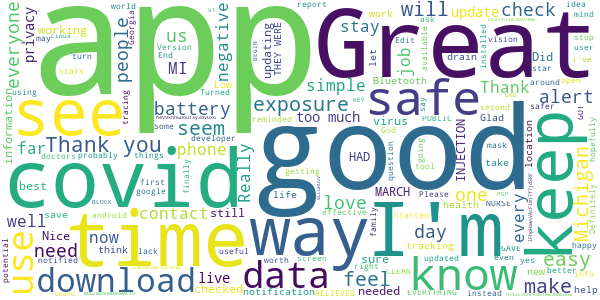
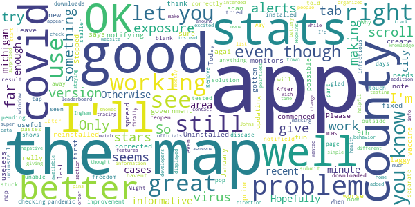
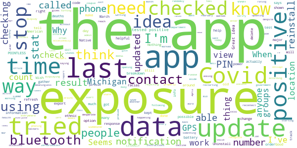
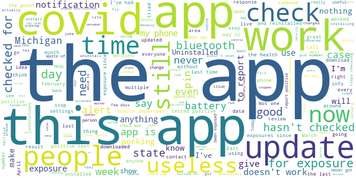

# MI COVID Alert
App version ``1.3``

Analyzed with [covid-apps-observer](http://github.com/covid-apps-observer) project, version ``0.1``

## App overview
| | |
|-------------------------|-------------------------| 
| **Name**&nbsp;&nbsp;&nbsp;&nbsp;&nbsp;&nbsp;&nbsp;&nbsp;&nbsp;&nbsp;&nbsp;&nbsp;&nbsp;&nbsp;&nbsp;&nbsp;&nbsp;&nbsp;&nbsp;&nbsp;&nbsp;&nbsp;&nbsp;&nbsp;&nbsp;&nbsp;&nbsp;&nbsp;&nbsp;&nbsp;&nbsp;&nbsp;&nbsp;&nbsp;&nbsp;&nbsp;&nbsp;&nbsp;&nbsp;&nbsp;  | MI COVID Alert |
| **Unique identifier** | gov.michigan.MiCovidExposure |
| **Link to Google Play** | [https://play.google.com/store/apps/details?id=gov.michigan.MiCovidExposure](https://play.google.com/store/apps/details?id=gov.michigan.MiCovidExposure) |
| **Summary**  | Michigan&#39;s COVID-19 Exposure Notification App |
| **Privacy policy** | [http://michigan.gov/micovidalertprivacy](http://michigan.gov/micovidalertprivacy) |
| **Latest version** | 1.3 |
| **Last update** | 2021-03-04 23:10:08 |
| **Recent changes** | Slow the spread of COVID-19 and protect your family, friends and community while still protecting your privacy – simply by using the MI COVID Alert app on your phone. Our latest version of MI COVID Alert includes minor bug fixes. |
| **Installs**  | 100,000+ |
| **Category** | Health & Fitness |
| **First release** | Oct 9, 2020 |
| **Size**  | 3.1M |
| **Supported Android version**  | 6.0 and up |

### Description
> MI COVID Alert is the COVID-19 exposure notification app supported by the Michigan Department of Health and Human Services (MDHHS), in partnership with SpringML, Google, and Apple. This app uses Bluetooth Low Energy (BLE) API framework created through a unique collaboration between Apple and Google.
 Your personal use of MI COVID Alert helps inform others of possible exposure to COVID-19 if they are suspected of having been within close proximity to someone who has tested positive. When you download MI COVID Alert, you are helping your community stay ahead of any potential surge in COVID-19 cases. 
 How MI COVID Alert Works:
 Once downloaded, users of the app who have enabled it will exchange anonymous Bluetooth “keys” (random alpha-numeric codes that represent a Bluetooth signal) with other MI COVID Alert users.
 If someone reports that they tested positive for COVID-19, the app will search for other users who shared the Bluetooth Low Energy (BLE) signal. The BLE signals are date-stamped and MI COVID Alert estimates how close the two devices were based on signal strength. If the timeframe was at least 15 minutes and the estimated distance was within six feet, then the other user receives a notification of a possible exposure. Names of users and locations of possible exposure are never tracked and never shared.
 The BLE framework within MI COVID Alert will run in the background, even if the exposure notification app is closed. It will not drain the device battery at a rate faster than other apps that use normal Bluetooth and/or are open and running continuously.
 How MI COVID Alert Protects Your Privacy:
 MDHHS takes your privacy very seriously. This is why we chose to use the Apple and Google BLE framework. No personal data or location tracking occurs within MI COVID Alert. 
 MDHHS and local public health staff follow up with persons who have a positive COVID-19 laboratory report. Public health will provide MI COVID Alert users with a validation pin. That validation pin must be entered into the app to report a notification of possible exposure to other users. This prevents people from falsely reporting positive results, which could generate false exposure notifications. 
 If you have the current Apple or Google operating system installed on your device, you may have noticed that Exposure Notifications are now included. You cannot enable this function until you have downloaded MI COVID Alert. Apple and Google will delete the exposure notification service tools from their respective operating systems once the pandemic reaches a point that public health no longer requires the use of this technology.
 Thank you for downloading MI COVID Alert! Together, we can protect our family, friends, and communities.

### User interface
The developers of the app provide the following screenshots in the Google play store.
| | | |
|:-------------------------:|:-------------------------:|:-------------------------:|
 |   |   |   | 
 |  

## Development team
In the following we report the main information provided by the development team in the Google play store.

| | |
|-------------------------|-------------------------|
| **Developer**  | State of Michigan |
| **Website**  | [http://www.michigan.gov/micovidalert](http://www.michigan.gov/micovidalert) |
| **Email** | mdhhs-micovidalert@michigan.gov |
| **Physical address**  | - |
| **Other developed apps**  | [https://play.google.com/store/apps/developer?id=State+of+Michigan](https://play.google.com/store/apps/developer?id=State+of+Michigan) |

## Android support

| | |
|-------------------------|-------------------------|
| **Declared target Android version**  | Android10, version 10 (API level 29) |
| **Effective target Android version**  | Android10, version 10 (API level 29) |
| **Minimum supported Android version**  | Marshmallow, version 6.0 (API level 23) |
| **Maximum target Android version**  | - |

The larger the difference between the minimum and maximum supported Android versions, the better. A larger difference means a wider audience. For example, old phones have a very low Android version, so a high minimum supported Android version means that the app cannot be used by users with old phones, thus leading to accessibility problems. 

## Requested permissions

In the following we report the complete list of the permissions requested by the app. 

| **Permission** | **Protection level** | **Description** | 
|-------------------------|-------------------------|-------------------------|
 **android.permission ACCESS_NETWORK_STATE** | Normal | Allows applications to access information about networks. 
 **android.permission BLUETOOTH** | Normal | Allows applications to connect to paired bluetooth devices. 
 **android.permission FOREGROUND_SERVICE** | Normal | Allows a regular application to use Service.startForeground. 
 **android.permission INTERNET** | Normal | Allows applications to open network sockets. 
 **android.permission RECEIVE_BOOT_COMPLETED** | Normal | Allows an application to receive the Intent.ACTION_BOOT_COMPLETED that is broadcast after the system finishes booting. 
 **android.permission WAKE_LOCK** | Normal | Allows using PowerManager WakeLocks to keep processor from sleeping or screen from dimming. 

## Mentioned servers

| **Server** | **Registrant** | **Registrant country** | **Creation date** | 
|-------------------------|-------------------------|-------------------------|-------------------------|
 | google.com | Google LLC | :us: US | 1997-09-15 04:00:00 |
 | jhu.edu | Johns Hopkins University | - | 1987-03-19 00:00:00 |

## Security analysis 

Below we report the main security warnings raised by our execution of the [Androwarn](https://github.com/maaaaz/androwarn) security analysis tool.

**Telephony identifiers leakage**
> - This application reads the ISO country code equivalent of the current registered operator's MCC (Mobile Country Code) 

**Connection interfaces exfiltration**
> - This application reads details about the currently active data network 
> - This application tries to find out if the currently active data network is metered 

## User ratings and reviews

Below we provide information about how end users are reacting to the app in terms of ratings and reviews in the Google Play store.

### Ratings

The MI COVID Alert app has been installed by more than **100000** times. At this time, **508** rated the app and its average score is **3.04**. Below we show the distribution of the ratings across the usual star-based rating of Google Play

:star::star::star::star::star:: 199

:star::star::star::star:: 40

:star::star::star:: 40

:star::star:: 40

:star:: 189

### Reviews 

#### 5-star reviews

> Very good 👍 love it  :date: __2021-04-11 16:43:36__

> Good to know  :date: __2021-04-04 05:01:49__

> GREAT!!!!!!! GOT MY FIRST INJECTION FROM TWO BEAUTIFUL NURSE'S AT BLUEWATER CONVENTION CENTER MARCH 2, 2021. HAD A COVID TEST MARCH 9, 2021 AND IT WAS NEGATIVE. I HAD THE SECOND INJECTION MARCH 30, 2021. NURSE'S FROM SCCHD GAVE ME THE INJECTIONS AND THEY WERE ABSOLUTELY WONDERFUL!!! THEY WERE CLEAN, THE PLACE CLEAN, A LADY WAS CONSTANTLY CLEANING, THEY WERE EXTREMELY KNOWLEDGEABLE ABOUT EVERYTHING. I WAS SO RELIEVED AND GRATEFUL TO THEM!!!!!!!!  :date: __2021-04-03 00:42:20__

> Feeling more confident & safe!! Thank You!!!  :date: __2021-04-01 03:55:10__

> I have android version 11 and am getting notifications.  :date: __2021-03-30 12:41:06__

> Good  :date: __2021-03-23 22:25:39__

> I love it  :date: __2021-03-19 03:12:34__

> I have had no issues and no interruption of updates. This is simple data recording, even if on your phone it doesn't say it has updated the data has been transmitted. End result you would still get notified.  :date: __2021-03-09 11:43:09__

> Too much covid news they need to get the cure out there and stop this garbage and it lets me know every time somebody blows Bobby if they got a sniffle or fart!!!  :date: __2021-03-07 22:56:02__

> Liability  :date: __2021-02-28 19:43:56__

#### 4-star reviews

> I am not sure how useful this app is. It does what is says it does - monitors for possible exposure to covid-19 virus. Please note that the new version corrected the problems with the prior version.  :date: __2021-03-24 15:44:26__

> Ok  :date: __2021-02-03 15:23:08__

> Stopped notifying me/updating alerts. Uninstalled app then reinstalled it. Alerts commenced once agai Have had first vaccine on 9th of January.  :date: __2021-01-22 19:08:14__

> I give it 4 stars needs improvement . but still great app.  :date: __2020-12-22 15:38:23__

> I will if it ever downloads, still pending After 5 Minutes, tried again a few days later and it downloaded right away  :date: __2020-12-04 05:11:59__

> Sits quietly in the background doing it's thing with no battery degradation. Like to see a tab to show vaccination verification because eventually schools, businesses, concerts, theaters, airlines, etc will want to see proof of vaccination.  :date: __2020-12-02 02:55:30__

> So far I havent seen anything about exposures. It would be good if they told me how my county and town is doing.  :date: __2020-11-26 16:31:22__

> I installed it to do my part. I'll uninstall it once this pandemic passes. That's freedom.  :date: __2020-11-21 18:55:35__

> I'm glad to have this, but the map doesn't work correctly. When I tap on a county, it just shows a blank page.  :date: __2020-11-21 16:50:48__

> Just checking it out  :date: __2020-11-20 08:58:10__

#### 3-star reviews

> I have the current version 1.3 but never updates checks for covid exposure after install Edit: I changed the settings that stopped app from running in background (Samsung). Hope that works.  :date: __2021-03-12 20:32:48__

> You have to keep Bluetooth on to recieve alerts?! No thank you, I'm uninstalling this Edit In response to the reply below: I still dont want to walk around with my bluetooth on all day. Thats not good for my battery or privacy.  :date: __2021-03-10 20:01:37__

> Used to work but now it hasn't checked for exposure since Feb 13th. It's up to date, I've uninstalled and reinstalled, phone restart, checked permissions. Nothing has worked. I'm uninstalling because it's not worth the waste of space.  :date: __2021-02-27 02:06:51__

> This app is general , can be improved to reflect local zip codes with real time case tracking. Racial distribution makes this app racist.  :date: __2021-02-09 03:41:17__

> L pi pl om 0  :date: __2021-02-03 15:23:00__

> Old information  :date: __2021-01-26 12:54:59__

> Might work but having to call in to get a PIN is way too much effort. Literally nobody has time for that  :date: __2021-01-21 17:15:25__

> How do you update?..hasn't worked since the 17 Jan 2021.  :date: __2021-01-21 13:03:49__

> No notifications??? I worked in a hospital filled with COVID patients during an outbreak. Maybe none of them had this app installed. This app is an amazing concept. I apperciate the anonymity. I will continue to recommend this app to others!  :date: __2021-01-14 13:15:04__

> It was working fine updating regularly. Now it hasn't updated my exposure or the cases and deaths since January 4th. I don't know what is wrong. Yes my bluetooth is on. I don't know what to do with it.  :date: __2021-01-13 17:51:43__

#### 2-star reviews

> The last time the Exposure Notification updated was on March 31, it should update more often.  :date: __2021-04-12 05:38:38__

> I tried the app but have to uninstall and re install every couple of days because it stops working.  :date: __2021-04-06 22:46:51__

> The app is ON but has not done an exposure check since Jan 24. Today is Mar 18.  :date: __2021-03-19 16:34:13__

> Good idea, but app stops updating/checking from time to time and won't refresh or reconnect. Tried turning bluetooth off/on, restarting phone, but couldn't make it active again. Last check was over a month ago. Is COVID over?  :date: __2021-03-19 01:17:23__

> I've had to reinstall this app on a few occasions. No it is still displaying last checked March 08, 2021.  :date: __2021-03-17 15:11:09__

> The app stopped scanning so I redownloaded it and it still doesn't update. Also, not sure how effective it really is since sharing if you've trsted positive for covid is by choice and I'm pretty sure most people in my area haven't even heard about the app and if they have, probably wouldn't choose to share.  :date: __2021-03-16 20:50:17__

> My app hasn't checked for any exposures since Feb 6th. I don't have an update option, and all permissions are granted. Frustrating. - I tried to export and nothing happens on my end. I clicked "export" and I didn't have the option to view or email anything over.  :date: __2021-03-13 16:14:37__

> This app is a great idea, but seems that it could be a bit more transparent. I appreciate that the app does not track me in any identifiable way, but I think it would be helpful to have more personalized statistics. Right now, the only thing we know is when the app last checked for exposures. I think it would be helpful to know how many unique IDs were gather over the last day. That way we can determine if the people around us are using the app and that the app is actually gather data fromothers  :date: __2021-03-10 18:59:41__

> Data is old and hasn't been updated. I dont trust that this would help keep me safe at ALL ETA: Added star because of the response from the developer, but data is still wrong. Michigan covid deaths specifically. When the average person can get accurate data by using a quick Google search, I would much rather be able to open my app and get all data available as ACCURATELY as possible.  :date: __2021-03-01 16:56:29__

> Doesn't update cases counts and deaths data  :date: __2021-02-22 19:53:15__

#### 1-star reviews

> It is now April. The app says it hasn't checked for exposures since Feb. 11. When I tried to export exposure notifications as outlined in other replies there were no notifications listed, and the info text says that the log only includes data for the last 14 days. When I click export I don't see that anything has happened, and the "last checked" date is still Feb. 11.  :date: __2021-04-12 14:25:38__

> This app hasn't checked or updated since January 4, 2021. How are we supposed to rely on something that sucks this bad.  :date: __2021-04-09 18:28:32__

> Works for a few days then stops. It says it's on but no readings for two weeks. Reloaded twice. Still don't work right. Reloaded as you said to. Still no readings since the 23rd. Installed and Uninstaller 6 times. Still not working right. Last exposure check was on the 13th. The app is an excellent idea just wish it would work. Had reinstalled a 7th time. Last notification was April 1st. It is now the 9th. Unistalling permanently. Sorry. Nice try.  :date: __2021-04-09 17:19:54__

> Had it for a while now, doesn't even work. Word of mouth works better.  :date: __2021-04-09 16:52:55__

> It hasn't checked for exposure since March 20th. I've followed the instructions regarding battery management and nothing has changed. I can't email you the exposure file because when I click on export exposure checks nothing happens.  :date: __2021-04-09 12:59:21__

> Does not work. It last check for exposure 3 months ago when it was installed. My location service is turned on, and exposure notifications are on in the app.  :date: __2021-04-09 02:47:34__

> It hasn't checked for exposures in nearly a month. I changed battery optimization and no change. I don't like having bluetooth constantly enabled solely for this app so I don't see the point in keeping it. EDIT: YES, I know that bluetooth is required. Which is why I'm complaining about this app not working properly. I've had bluetooth on all the time all this time, and it hasn't even checked for exposures, which means, all that I've done in the past month is compromise the security of my phone for apparently no reason. If there is no benefit to using this app, I'm certainly not going to keep using it and keep bluetooth on.  :date: __2021-04-05 22:04:02__

> Has not checked exposure since last update. Edit: after update still not checking.  :date: __2021-04-05 15:12:02__

> They force you to use a mystical pin that is next to impossible to find the person to give it to you after calling both local and state health departments who are not open over the weekend.  :date: __2021-04-05 14:52:23__

> Downloaded and like everyone else it stopped working. I uninstalled..reinstalled and checked settings as was suggested by the individuals who interact with the reviews. It hasnt worked in weeks and I had a close contact within that time, that wasnt caught. Wow. I wont be reinstalling .  :date: __2021-04-03 22:50:39__

