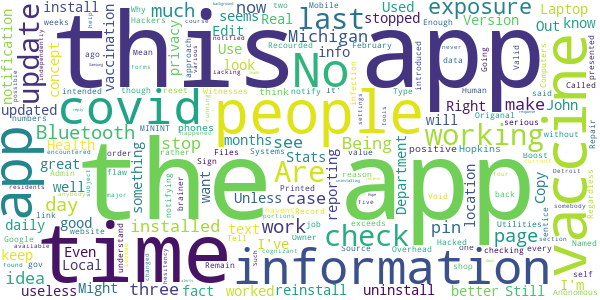

# MI COVID Alert
App version ``1.3``

Analyzed with [covid-apps-observer](http://github.com/covid-apps-observer) project, version ``0.1``

## App overview
| | |
|-------------------------|-------------------------| 
| **Name**&nbsp;&nbsp;&nbsp;&nbsp;&nbsp;&nbsp;&nbsp;&nbsp;&nbsp;&nbsp;&nbsp;&nbsp;&nbsp;&nbsp;&nbsp;&nbsp;&nbsp;&nbsp;&nbsp;&nbsp;&nbsp;&nbsp;&nbsp;&nbsp;&nbsp;&nbsp;&nbsp;&nbsp;&nbsp;&nbsp;&nbsp;&nbsp;&nbsp;&nbsp;&nbsp;&nbsp;&nbsp;&nbsp;&nbsp;&nbsp;  | MI COVID Alert |
| **Unique identifier** | gov.michigan.MiCovidExposure |
| **Link to Google Play** | [https://play.google.com/store/apps/details?id=gov.michigan.MiCovidExposure](https://play.google.com/store/apps/details?id=gov.michigan.MiCovidExposure) |
| **Summary**  | Michigan&#39;s COVID-19 Exposure Notification App |
| **Privacy policy** | [http://michigan.gov/micovidalertprivacy](http://michigan.gov/micovidalertprivacy) |
| **Latest version** | 1.3 |
| **Last update** | 2021-03-04 23:10:08 |
| **Recent changes** | Slow the spread of COVID-19 and protect your family, friends and community while still protecting your privacy – simply by using the MI COVID Alert app on your phone. Our latest version of MI COVID Alert includes minor bug fixes. |
| **Installs**  | 100,000+ |
| **Category** | Health & Fitness |
| **First release** | Oct 9, 2020 |
| **Size**  | 3.1M |
| **Supported Android version**  | 6.0 and up |

### Description
> MI COVID Alert is the COVID-19 exposure notification app supported by the Michigan Department of Health and Human Services (MDHHS), in partnership with SpringML, Google, and Apple. This app uses Bluetooth Low Energy (BLE) API framework created through a unique collaboration between Apple and Google.
 Your personal use of MI COVID Alert helps inform others of possible exposure to COVID-19 if they are suspected of having been within close proximity to someone who has tested positive. When you download MI COVID Alert, you are helping your community stay ahead of any potential surge in COVID-19 cases. 
 How MI COVID Alert Works:
 Once downloaded, users of the app who have enabled it will exchange anonymous Bluetooth “keys” (random alpha-numeric codes that represent a Bluetooth signal) with other MI COVID Alert users.
 If someone reports that they tested positive for COVID-19, the app will search for other users who shared the Bluetooth Low Energy (BLE) signal. The BLE signals are date-stamped and MI COVID Alert estimates how close the two devices were based on signal strength. If the timeframe was at least 15 minutes and the estimated distance was within six feet, then the other user receives a notification of a possible exposure. Names of users and locations of possible exposure are never tracked and never shared.
 The BLE framework within MI COVID Alert will run in the background, even if the exposure notification app is closed. It will not drain the device battery at a rate faster than other apps that use normal Bluetooth and/or are open and running continuously.
 How MI COVID Alert Protects Your Privacy:
 MDHHS takes your privacy very seriously. This is why we chose to use the Apple and Google BLE framework. No personal data or location tracking occurs within MI COVID Alert. 
 MDHHS and local public health staff follow up with persons who have a positive COVID-19 laboratory report. Public health will provide MI COVID Alert users with a validation pin. That validation pin must be entered into the app to report a notification of possible exposure to other users. This prevents people from falsely reporting positive results, which could generate false exposure notifications. 
 If you have the current Apple or Google operating system installed on your device, you may have noticed that Exposure Notifications are now included. You cannot enable this function until you have downloaded MI COVID Alert. Apple and Google will delete the exposure notification service tools from their respective operating systems once the pandemic reaches a point that public health no longer requires the use of this technology.
 Thank you for downloading MI COVID Alert! Together, we can protect our family, friends, and communities.

### User interface
The developers of the app provide the following screenshots in the Google play store.
| | | |
|:-------------------------:|:-------------------------:|:-------------------------:|
 |   |   |   | 
 |  

## Development team
In the following we report the main information provided by the development team in the Google play store.

| | |
|-------------------------|-------------------------|
| **Developer**  | State of Michigan |
| **Website**  | [http://www.michigan.gov/micovidalert](http://www.michigan.gov/micovidalert) |
| **Email** | mdhhs-micovidalert@michigan.gov |
| **Physical address**  | - |
| **Other developed apps**  | [https://play.google.com/store/apps/developer?id=State+of+Michigan](https://play.google.com/store/apps/developer?id=State+of+Michigan) |

## Android support

| | |
|-------------------------|-------------------------|
| **Declared target Android version**  | Android10, version 10 (API level 29) |
| **Effective target Android version**  | Android10, version 10 (API level 29) |
| **Minimum supported Android version**  | Marshmallow, version 6.0 (API level 23) |
| **Maximum target Android version**  | - |

The larger the difference between the minimum and maximum supported Android versions, the better. A larger difference means a wider audience. For example, old phones have a very low Android version, so a high minimum supported Android version means that the app cannot be used by users with old phones, thus leading to accessibility problems. 

## Requested permissions

In the following we report the complete list of the permissions requested by the app. 

| **Permission** | **Protection level** | **Description** | 
|-------------------------|-------------------------|-------------------------|
 **android.permission ACCESS_NETWORK_STATE** | Normal | Allows applications to access information about networks. 
 **android.permission BLUETOOTH** | Normal | Allows applications to connect to paired bluetooth devices. 
 **android.permission FOREGROUND_SERVICE** | Normal | Allows a regular application to use Service.startForeground. 
 **android.permission INTERNET** | Normal | Allows applications to open network sockets. 
 **android.permission RECEIVE_BOOT_COMPLETED** | Normal | Allows an application to receive the Intent.ACTION_BOOT_COMPLETED that is broadcast after the system finishes booting. 
 **android.permission WAKE_LOCK** | Normal | Allows using PowerManager WakeLocks to keep processor from sleeping or screen from dimming. 

## Mentioned servers

| **Server** | **Registrant** | **Registrant country** | **Creation date** | 
|-------------------------|-------------------------|-------------------------|-------------------------|
 | google.com | Google LLC | :us: US | 1997-09-15 04:00:00 |
 | jhu.edu | Johns Hopkins University | - | 1987-03-19 00:00:00 |

## Security analysis 

Below we report the main security warnings raised by our execution of the [Androwarn](https://github.com/maaaaz/androwarn) security analysis tool.

**Telephony identifiers leakage**
> - This application reads the ISO country code equivalent of the current registered operator's MCC (Mobile Country Code) 

**Connection interfaces exfiltration**
> - This application reads details about the currently active data network 
> - This application tries to find out if the currently active data network is metered 

## User ratings and reviews

Below we provide information about how end users are reacting to the app in terms of ratings and reviews in the Google Play store.

### Ratings

The MI COVID Alert app has been installed by more than **100000** times. At this time, **508** rated the app and its average score is **3.04**. Below we show the distribution of the ratings across the usual star-based rating of Google Play

:star::star::star::star::star:: 199

:star::star::star::star:: 40

:star::star::star:: 40

:star::star:: 40

:star:: 189

### Reviews 

#### 5-star reviews

> So far it's good.  :date: __2021-05-01 08:13:57__

> It hasn't up dated sentence Feb. ?  :date: __2021-04-29 18:52:27__

> I check everytime I go out. It makes me feel safe and secure.  :date: __2021-04-28 15:30:42__

> This is benifica  :date: __2021-04-25 14:17:17__

> This is probably the best way to get information on whether you may have been exposed to the 22nd century plague - Sars COVID - 19. A must for all in this day and age. I applaud the creators of this app.  :date: __2021-04-22 14:25:16__

> I like better than first one.  :date: __2021-04-18 14:29:40__

> Very good 👍 love it  :date: __2021-04-11 16:43:36__

> Good to know  :date: __2021-04-04 05:01:49__

> GREAT!!!!!!! GOT MY FIRST INJECTION FROM TWO BEAUTIFUL NURSE'S AT BLUEWATER CONVENTION CENTER MARCH 2, 2021. HAD A COVID TEST MARCH 9, 2021 AND IT WAS NEGATIVE. I HAD THE SECOND INJECTION MARCH 30, 2021. NURSE'S FROM SCCHD GAVE ME THE INJECTIONS AND THEY WERE ABSOLUTELY WONDERFUL!!! THEY WERE CLEAN, THE PLACE CLEAN, A LADY WAS CONSTANTLY CLEANING, THEY WERE EXTREMELY KNOWLEDGEABLE ABOUT EVERYTHING. I WAS SO RELIEVED AND GRATEFUL TO THEM!!!!!!!!  :date: __2021-04-03 00:42:20__

> Feeling more confident & safe!! Thank You!!!  :date: __2021-04-01 03:55:10__

#### 4-star reviews

> Today is 2/24, the last scan was on 1/24. Leave it to the government to create a useless app. Once the problem was fixed, it's working good now!  :date: __2021-04-28 22:16:18__

> I am not sure how useful this app is. It does what is says it does - monitors for possible exposure to covid-19 virus. Please note that the new version corrected the problems with the prior version.  :date: __2021-03-24 15:44:26__

> Ok  :date: __2021-02-03 15:23:08__

> Stopped notifying me/updating alerts. Uninstalled app then reinstalled it. Alerts commenced once agai Have had first vaccine on 9th of January.  :date: __2021-01-22 19:08:14__

> I give it 4 stars needs improvement . but still great app.  :date: __2020-12-22 15:38:23__

> I will if it ever downloads, still pending After 5 Minutes, tried again a few days later and it downloaded right away  :date: __2020-12-04 05:11:59__

> So far I havent seen anything about exposures. It would be good if they told me how my county and town is doing.  :date: __2020-11-26 16:31:22__

> I installed it to do my part. I'll uninstall it once this pandemic passes. That's freedom.  :date: __2020-11-21 18:55:35__

> I'm glad to have this, but the map doesn't work correctly. When I tap on a county, it just shows a blank page.  :date: __2020-11-21 16:50:48__

> Just checking it out  :date: __2020-11-20 08:58:10__

#### 3-star reviews

> More tools for the Vaccine! The app is great but is lacking major portions that should be on the subject of "Vaccinations". Such as locations for Detroit residents. Information on the various vaccines available & where. A Q & A section on possible vaccine info to help stop forms of "vaccine hesitency"  :date: __2021-05-02 22:22:13__

> I have the current version 1.3 but never updates checks for covid exposure after install Edit: I changed the settings that stopped app from running in background (Samsung). Hope that works.  :date: __2021-03-12 20:32:48__

> You have to keep Bluetooth on to recieve alerts?! No thank you, I'm uninstalling this Edit In response to the reply below: I still dont want to walk around with my bluetooth on all day. Thats not good for my battery or privacy.  :date: __2021-03-10 20:01:37__

> This app is general , can be improved to reflect local zip codes with real time case tracking. Racial distribution makes this app racist.  :date: __2021-02-09 03:41:17__

> L pi pl om 0  :date: __2021-02-03 15:23:00__

> Old information  :date: __2021-01-26 12:54:59__

> Might work but having to call in to get a PIN is way too much effort. Literally nobody has time for that  :date: __2021-01-21 17:15:25__

> How do you update?..hasn't worked since the 17 Jan 2021.  :date: __2021-01-21 13:03:49__

> No notifications??? I worked in a hospital filled with COVID patients during an outbreak. Maybe none of them had this app installed. This app is an amazing concept. I apperciate the anonymity. I will continue to recommend this app to others!  :date: __2021-01-14 13:15:04__

> It was working fine updating regularly. Now it hasn't updated my exposure or the cases and deaths since January 4th. I don't know what is wrong. Yes my bluetooth is on. I don't know what to do with it.  :date: __2021-01-13 17:51:43__

#### 2-star reviews

> The last time the Exposure Notification updated was on April 18, it should update more often.  :date: __2021-05-01 06:13:25__

> You need a pin number to report a positive Covid result. I called and left a message, but they never called me back. So... that renders this app useless, aside from Covid news & numbers.  :date: __2021-04-30 07:10:17__

> I have to Uninstall the app and reinstall it because it randomly stops checking for exposures. EDIT: UPDATE: after following the instructions above about battery power it got WORSE. It not only stops checking for exposures but drains my phone . I would change the rating to Zero if I was able. Lots of other States got it right, did Michigan order their App from Wish?  :date: __2021-04-29 17:26:38__

> Great idea but the last time it checked says March 18. Needs a way to display our vaccine information.  :date: __2021-04-27 17:21:30__

> Exposures was last checked mid-February despite having bluetooth on all the time and occasionally opening the app.  :date: __2021-04-25 16:38:55__

> I haven't had any positive exposures according to the app, but how do I even know if anyone else is using it? I wish there was a way to tell if I've even come into contact with anyone who is actually USING the app. Just a count. I'm not asking for names or any other personal data. Without this count the results are meaningless.  :date: __2021-04-18 17:03:53__

> I tested positive for COVID-19. I wanted to share it in the app so I could alert others. When you test positive, the DoH gives you a PIN that you then enter into the app to verify your positive test result, which should broadcast it on the app. But here's the major problem: it didn't recognize the TWO PINs they sent me. I tried phoning someone, but had no idea who to contact. I was desperate to get the word out, because I work in a busy location. Nothing worked. I tried the codes again and again, but the app kept rejecting them, saying that it wasn't a valid code. I called the admin office-- I think???-- of the local health department, because I had no idea who else to contact to help me. All I did was call the number the app gave me. No responses from anyone. I'm starting to think this is happening with other positive testers as well, and that's why exposures aren't properly updated. Because of this, this app is LITERALLY. POINTLESS. Please do something about this. I tried to inform as many people as possible, but I can't reach out to everyone.  :date: __2021-04-18 15:45:58__

> I tried the app but have to uninstall and re install every couple of days because it stops working.  :date: __2021-04-06 22:46:51__

> The app is ON but has not done an exposure check since Jan 24. Today is Mar 18.  :date: __2021-03-19 16:34:13__

> Good idea, but app stops updating/checking from time to time and won't refresh or reconnect. Tried turning bluetooth off/on, restarting phone, but couldn't make it active again. Last check was over a month ago. Is COVID over?  :date: __2021-03-19 01:17:23__

#### 1-star reviews

> I checked the app and the last update was 12 days ago. What good is that? I did make sure that the app is not sleeping in settings. Update: removed and reinstalled app, worked for a few days. Last update was 4 days ago. Total waste of our tax money. These people should feel guilty talking public money for this trash. FYI, I have version 1.3 UPDATE, FYI it's now been 25 days and still no update. I did everything they asked. GIVE THE MONEY BACK!! 5/7/21 update. STILL DOESN'T UPDATE, TRASH!  :date: __2021-05-07 17:22:54__

> Last checked for exposures back in March and it is now May. I see absolutely no point in having my phone put out info if it's not going to work.  :date: __2021-05-04 20:05:21__

> App hasn't checked for exposures since middle of March. No way to even manually force a check.  :date: __2021-05-04 03:31:49__

> I've never gotten an alert but I known multiple times I was in contact with COVID. I live behind the covid testing center and not a single alert Pathetic  :date: __2021-04-30 21:08:51__

> The app has not checked anything since april 15th, its now april 26th, in my opinion its useless. Its April 30th. Im deleting your app.  :date: __2021-04-30 19:17:20__

> Updated review: The app still stops functioning if I dont check it for a day. Also, it looks like people are unwilling to or unable to notify through the app. I've had 2 coworkers in the past 2 weeks test positive and I've heard nothing through this app. Completely useless.  :date: __2021-04-30 17:04:24__

> it was a good idea if it worked...  :date: __2021-04-29 21:16:35__

> It just keeps saying I last checked on February 10th. I've tried checking several times since then and it never updates  :date: __2021-04-29 13:24:41__

> It stopped checking back in February. Uninstalled and reinstalled, but it doesn't say it stopped checking unless you go into the app every day and see the last time it did run a check. Also does not inform you if you have been exposed after it stops checking. Reinstall starts it fresh with no history data. Yes bluetooth is on, so don't ask.  :date: __2021-04-27 17:53:37__

> The app only updates its check when you open it which defeats the purpose.  :date: __2021-04-27 16:37:45__

