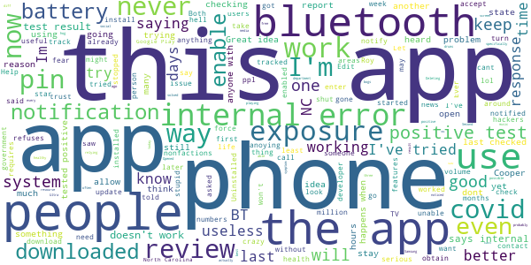

# SlowCOVIDNC
App version ``1.2``

Analyzed with [covid-apps-observer](http://github.com/covid-apps-observer) project, version ``0.1``

## App overview
| | |
|-------------------------|-------------------------| 
| **Name**&nbsp;&nbsp;&nbsp;&nbsp;&nbsp;&nbsp;&nbsp;&nbsp;&nbsp;&nbsp;&nbsp;&nbsp;&nbsp;&nbsp;&nbsp;&nbsp;&nbsp;&nbsp;&nbsp;&nbsp;&nbsp;&nbsp;&nbsp;&nbsp;&nbsp;&nbsp;&nbsp;&nbsp;&nbsp;&nbsp;&nbsp;&nbsp;&nbsp;&nbsp;&nbsp;&nbsp;&nbsp;&nbsp;&nbsp;&nbsp;  | SlowCOVIDNC |
| **Unique identifier** | gov.nc.dhhs.exposurenotification |
| **Link to Google Play** | [https://play.google.com/store/apps/details?id=gov.nc.dhhs.exposurenotification](https://play.google.com/store/apps/details?id=gov.nc.dhhs.exposurenotification) |
| **Summary**  | Official COVID-19 exposure notification app to help protect North Carolinians! |
| **Privacy policy** | [https://covid19.ncdhhs.gov/slowcovidnc-privacy-policy](https://covid19.ncdhhs.gov/slowcovidnc-privacy-policy) |
| **Latest version** | 1.2 |
| **Last update** | 2020-11-05 19:27:00 |
| **Recent changes** | Slow the spread of COVID-19 and protect your family, friends and community while still protecting your privacy – simply by using the SlowCOVIDNC app on your phone.   Our latest version of SlowCOVIDNC includes enhancements like “Share the App” feature, a new YouTube video link and bug fixes. |
| **Installs**  | 100,000+ |
| **Category** | Health & Fitness |
| **First release** | Sep 15, 2020 |
| **Size**  | 3.0M |
| **Supported Android version**  | 6.0 and up |

### Description
> SlowCOVIDNC is the official COVID-19 Exposure Notification app for the North Carolina Department of Health and Human Services (NCDHHS). It allows users to know if they may have been in close contact with someone who has shared a positive COVID-19 test result through the app. Users can anonymously share a positive COVID-19 test result to help slow the spread of COVID-19. 
 NCDHHS created this app so that North Carolinians can do their part to protect their community and slow the spread of the virus.
 HOW SLOWCOVIDNC WORKS?
 Step 1: Download the SlowCOVIDNC Exposure Notification app. Enable Bluetooth and Exposure notifications.
 Step 2: After opting-in to receive notifications, the app will generate an anonymous token for your device. A token is a string of random letters and numbers that is used to represent a phone for a short period of time. This ensures your privacy and security are protected. These individual tokens change every 10-20 minutes and are never linked to your identity or location. 
 Step 3: Through Bluetooth, your phone and the phones around you with the SlowCOVIDNC app are working in the background (without draining your battery or data) to exchange these anonymous tokens every few minutes. As a result, devices can remember how long they are near each other. Phones also record the Bluetooth signal strength of their exchanges in order to estimate how far apart they are.
 Step 4: SlowCOVIDNC periodically downloads tokens from the server that have been uploaded from the devices of users who have tested positive. Your phone then uses its records of the signal strength and duration of exposures with those tokens to conduct a risk calculation and determine if you have met a threshold for notification. 
 Step 5: If you have tested positive for COVID-19, you may obtain your PIN from your local public health department and submit that into the app. This voluntary and anonymous reporting notifies others who have downloaded the app and may have been in close contact with you in the last 14 days that they might be at risk.
 HOW SLOWCOVIDNC PROTECTS YOUR PRIVACY?
 Using SlowCOVIDNC is entirely voluntary, and you can enable or disable it at any time. When using SlowCOVIDNC, your privacy will be protected. Tokens will collect and share date, time, signal strength and duration of proximity. No location data or personally identifiable data will ever be collected or stored.
 By enabling Bluetooth and Exposure Notifications, you can anonymously share a positive COVID-19 test result to help slow the spread of COVID-19. You may also be notified if you have been in close contact with someone who has shared a positive COVID-19 test result.
 Learn more about how your privacy is protected and our privacy policy on the NCDHHS website. 
 Thank you for downloading SlowCOVIDNC. Together, we can slow the spread of COVID-19!

### User interface
The developers of the app provide the following screenshots in the Google play store.
| | | |
|:-------------------------:|:-------------------------:|:-------------------------:|
 |   |   |   | 
 |  

## Development team
In the following we report the main information provided by the development team in the Google play store.

| | |
|-------------------------|-------------------------|
| **Developer**  | NC Department of Health and Human Services |
| **Website**  | [https://covid19.ncdhhs.gov/SlowCOVIDNC](https://covid19.ncdhhs.gov/SlowCOVIDNC) |
| **Email** | NCHealthIT@dhhs.nc.gov |
| **Physical address**  | - |
| **Other developed apps**  | [https://play.google.com/store/apps/developer?id=NC+Department+of+Health+and+Human+Services](https://play.google.com/store/apps/developer?id=NC+Department+of+Health+and+Human+Services) |

## Android support

| | |
|-------------------------|-------------------------|
| **Declared target Android version**  | Android10, version 10 (API level 29) |
| **Effective target Android version**  | Android10, version 10 (API level 29) |
| **Minimum supported Android version**  | Marshmallow, version 6.0 (API level 23) |
| **Maximum target Android version**  | - |

The larger the difference between the minimum and maximum supported Android versions, the better. A larger difference means a wider audience. For example, old phones have a very low Android version, so a high minimum supported Android version means that the app cannot be used by users with old phones, thus leading to accessibility problems. 

## Requested permissions

In the following we report the complete list of the permissions requested by the app. 

| **Permission** | **Protection level** | **Description** | 
|-------------------------|-------------------------|-------------------------|
 **android.permission ACCESS_NETWORK_STATE** | Normal | Allows applications to access information about networks. 
 **android.permission BLUETOOTH** | Normal | Allows applications to connect to paired bluetooth devices. 
 **android.permission FOREGROUND_SERVICE** | Normal | Allows a regular application to use Service.startForeground. 
 **android.permission INTERNET** | Normal | Allows applications to open network sockets. 
 **android.permission RECEIVE_BOOT_COMPLETED** | Normal | Allows an application to receive the Intent.ACTION_BOOT_COMPLETED that is broadcast after the system finishes booting. 
 **android.permission WAKE_LOCK** | Normal | Allows using PowerManager WakeLocks to keep processor from sleeping or screen from dimming. 

## Mentioned servers

| **Server** | **Registrant** | **Registrant country** | **Creation date** | 
|-------------------------|-------------------------|-------------------------|-------------------------|
 | google.com | Google LLC | :us: US | 1997-09-15 04:00:00 |
 | ncpublichealth.com | State of North Carolina, Division of Public Health | :us: US | 2002-03-14 19:22:33 |

## Security analysis 

Below we report the main security warnings raised by our execution of the [Androwarn](https://github.com/maaaaz/androwarn) security analysis tool.

**Telephony identifiers leakage**
> - This application reads the ISO country code equivalent of the current registered operator's MCC (Mobile Country Code) 

**Connection interfaces exfiltration**
> - This application reads details about the currently active data network 
> - This application tries to find out if the currently active data network is metered 

## User ratings and reviews

Below we provide information about how end users are reacting to the app in terms of ratings and reviews in the Google Play store.

### Ratings

The SlowCOVIDNC app has been installed by more than **100000** times. At this time, **428** rated the app and its average score is **4.0094337**. Below we show the distribution of the ratings across the usual star-based rating of Google Play

:star::star::star::star::star:: 268

:star::star::star::star:: 44

:star::star::star:: 28

:star::star:: 32

:star:: 56

### Reviews 

#### 5-star reviews

> Good ☺️  :date: __2020-11-20 18:55:30__

> Installed because my job is front line and I thought it would be helpful since I have so many contacts each day. A little disappointed that it really only exchanges the signal after 15 minutes, since 90% of my interactions are pretty short. But it's important to slow COVID so I will do all I can.  :date: __2020-11-20 04:44:26__

> Worked In Hospital. 21 yrs. Follow CDC to stop the spread. Gudelines  :date: __2020-11-20 02:43:32__

> App is great idea however sometimes it will go up to 10 days without a check.  :date: __2020-11-18 12:21:17__

> It will be very useful if you can see with how many devices your phone exchanged tokens. This way you can see that is working without waiting for a close notification.  :date: __2020-11-17 20:48:47__

> I think it's incredible and so freaking helpful. This is wonderful  :date: __2020-11-17 18:41:34__

> Helps in letting u know about disasters in your. Area.  :date: __2020-11-14 01:35:32__

> Bermuda State Island Rikers JAIL islans-Sinaloa state .Coconut(water/milk).Colombia,Isla-Vista Civilian 1%.Covid S19-911-221-19(china).W.Jerudalemn.Dr.èl Chepe Nick.DuraCell_NLP-(-5_i).Luxor REHAB for relapse en patient's.  :date: __2020-11-14 01:01:33__

> I have not used it yet.  :date: __2020-11-11 21:26:37__

> This is a very necessary tool. Thanks.  :date: __2020-11-11 01:05:54__

#### 4-star reviews

> Fantastic updates on demand, Locally, Globally. Recommended for All  :date: __2020-11-07 05:08:48__

> So I got the notification to install the app and I live in Ohio.. Does it still work? It's not geo locked is it?  :date: __2020-11-07 01:12:30__

> This app is a great concept; unfortunately with my Motorola G7 Power, I can't leave my Bluetooth on all the time, as due to a manufacturer error in this model, having bluetooth activated interferes with WiFi connections. So I can't utilize this app, but certainly will when I replace my phone.  :date: __2020-10-20 22:12:17__

> Idk I didn't go out in public yet  :date: __2020-10-16 16:25:13__

> Good  :date: __2020-10-13 07:44:21__

> Neat idea, but living in Asheville makes me think I need every state's app. Is there any way to make the state apps work with each other? We've had many tourists test positive during their visit and even if they report their result to their state's app, the tokens would never be shared with my app.  :date: __2020-10-11 05:39:23__

> I gave it 4 stars for a great effort! Why do people have to complain about things that will help! Thank u for trying something! Share option will be great! I have alot of people I can tell about this app!  :date: __2020-10-11 03:37:10__

> I found this by chance.. it should be pinging on folks TVs and Phones like the hurricane or missing person alerts. Other than that, the app looks pretty good... \*\*Needs users using\*\*  :date: __2020-10-08 17:05:54__

> Hindsight is 20/20 The concept of every cellphone having this app is amazing! I gave SlowCOVIDNC 4⭐ because of the possibilities! We'll see if it helps in another 90days. The NFL teams that are using something similar have had great outcomes & information shared.  :date: __2020-09-29 22:15:16__

> It does exactly as it should. A sharing feature is the only missing option. With this app being dependant on community involvement I'm surprised there's no share option already.  :date: __2020-09-28 05:14:40__

#### 3-star reviews

> The app is a great concept and was checking when initially installed. On my Samsung S6, it was a power drain. Also, it hasn't checked for exposures since 10/23/20. Today is 11/20/20 so its been almost a month. As COVID case rates are accelerating again, it seems this app would be more pertinent than ever. I'm looking forward to any suggestions that may be offered to resolve these two issues.  :date: __2020-11-20 10:47:56__

> Stopped updating 3 weeks ago. I checked the settings. It said all was good but app would not update. Prior to last update it did so at least once a day. So I wonder how accurate it is???  :date: __2020-11-10 22:30:16__

> I downloaded this app when it first came out. It checked often for exposure. Today, October 26, it says that the last time it checked was October 13. Almost 2 weeks ago! What's up??? Bluetooth is enabled.  :date: __2020-10-26 19:09:52__

> I installed it on my Samsung S5 (6.0.1 Marshmallow). I guess it's working, but it has a big flaw: it's a power hog. Until I installed SowCOVIDNC, my phone battery easily lasted a full day. Now I have to recharge by late-afternoon. That's a big problem. Can you please fix it? I'm not going to uninstall it, because it is important. I can live with the power drain, if I have to. But it sure would be a lot better if it didn't drain the battery so rapidly.  :date: __2020-10-23 22:36:25__

> I have been so fortunate so far to have been able to help families and my family, by running errands. I wear my masks I wash my hands. I use bottles of sanitizer even if they the store just did. Why? The lack of seeing how much folks dont know PPE training by hospital staff, how folks will grabs carts(walk pass wipes stands) and proceed to then grab spray bottles to spray the carts. And then use paper towels to wipe them down? Now, quiz time what was wrong? 😳  :date: __2020-10-21 18:10:18__

> I downloaded the app the first week of was made public. It doesn't seem to check for exposure unless I open the app. When I opened it today it seems it last checked 10/8. Then the date changed to today after being opened.  :date: __2020-10-20 15:04:39__

> Well there you go another tracking app to watch where you go, better get it now people, before president Harris demands it and makes it law, oh it might actually work if everybody had it I had it and nobody else in my shop had it, my supervisor got it and two coworkerscweluves had it and one indirect coworker that comes over all the time had it and the damn app didn't work because nobody else had it  :date: __2020-10-18 13:56:57__

> App works well but needs to allow bluetooth to be turned off and remove the persistent notification. You don't the app running inside your house. In response, I know you can turn bluetooth off, the issue is the notification to turn bluetooth back on will keep coming up even if you dismiss it. Thx.  :date: __2020-10-12 17:12:44__

#### 2-star reviews

> Installed it. Had 100% battery life, 6 hrs later it is down to 39%. I did this overnight so it is when nothing else is on or working. I have other apps restricted so they cannot be an energy vampire. I have uninstalled the app. Samsung S10  :date: __2020-11-11 14:23:49__

> App is completely based on a user uploading their data to contact others. I'm in a county where people can't spell app, let alone upload any data to help others. This app needs to have the state, county or testing facilitators uploading this information so someone who does have COVID cannot chose to NOT share those who were around them.  :date: __2020-11-09 17:10:45__

> While the app is easy to use and read, the app prevents use of bluetooth keyboards and controllers for more than a few minutes. After that, this app forcibly disconnects your accessories, and you need to manually reconnect.  :date: __2020-11-08 02:26:22__

> If it weren't so disturbing that something like this is just being touted by DHHS to slow Covid, I'd be jumping for joy. But, now,, all i can muster is too little too late for 100s of 1000s.Apple cranks out a new iPhone with world-wide ads faster than this. I'd say I can't believe it but, this is a red state and the "Red Pres" is pulling out all stops to pull a victory out of his red, you know what, like he did last time. Meadows did say they weren't going to try to control the virus. Shameful!  :date: __2020-11-02 12:23:28__

> Such a small percentage of people are downloading this for Android (can't speak for iOS), and such a small percentage of people are actually tested daily in this state. It's more like a gimmick app unless everyone downloads and everyone gets weekly testing. So no way to know if this approach to contact tracing is working at all.  :date: __2020-11-01 13:23:16__

> After installing this app, 2 of my other apps disappeared from my phone. Also another day my flashlight randomly turned on and I want even touching my phone. I've uninstalled the app since.  :date: __2020-10-28 18:01:57__

> Great idea, problematic execution. Gives a false sense of security. With so few people in this state getting tested, so few wearing masks, it's unlikely that most of your covid exposure will be captured & recorded by this app. And you must leave Bluetooth on for it to work? I understand why, but it's a battery drain, & constant EMF radiation exposure is an unwelcome side effect. If the app was automatically on everyone's phone, testing was widespread, & positives were autologged, then maybe.  :date: __2020-10-20 05:53:33__

> Edited review: after download, I cannot access any of my connected Bluetooth apratutus. Now my car Bluetooth, 3 different air pods and 2 earpieces will not connect at all but I was told they'd work in conjunction. That's not true for "MY" phone operating system. Thought it was the perfect app but now I have doubts because 2 Bluetooth apps CANNOT be used at same time, so please don't tell downloaders or be sure to share correct information.  :date: __2020-10-19 21:36:12__

> Meh...  :date: __2020-10-16 13:18:34__

#### 1-star reviews

> Doesn't do anything and yet covid is raising in numbers around nc. It would be better to know where it is so I can stay away from those areas.  :date: __2020-11-21 12:30:13__

> Useless! Couldn't get a pin to share my positive test. Cumbersome. Pointless!  :date: __2020-11-20 04:00:49__

> Useless app! But great idea if it worked. I've tried for days to enter that I tested positive for covid-19 and it refuses to allow me to notify the system. If others are experiencing this then it renders the entire system useless. And secondly you have to voluntarily disclose that you tested positive. I've tried for days to enter my positive test result, but it refuses to issue a PIN necessary to upload. 11/17 update :finally got a pin, and still will not accept alpha-num entry. S9 phone.  :date: __2020-11-17 23:17:45__

> Not very useful if people don't participate.  :date: __2020-11-16 05:04:06__

> I can't get it to check for exposures! It hasn't checked since Nov 1 (it's now the 15th)  :date: __2020-11-15 22:11:33__

> Anyone I have asked either never heard of this app or may have heard about it once and forgot about it. If Roy Cooper and his "science-based" health policy staff were serious about containing the virus and encouraging proper contact tracing, the airwaves and newsprint would be flooded with ads about this app. They are not. It does no good (and drains battery according to some of the other reviews) if only a relative handful of people use the app & broadcast their Bluetooth signals into the ether  :date: __2020-11-07 22:37:51__

> Downloaded this app to review it, I didnt even verifiably open this app so NC and Roy Cooper cant track me. Its amazing at how so many pawns in NC has downloaded this trackable app lol  :date: __2020-11-02 18:21:01__

> Im not scared of my own shadow..i dont need my stufg tracked more than it already is..i only DL to leave a review..now stick it where sun dont shine  :date: __2020-11-02 16:37:51__

> Won't enable. Internal error. Bluetooth is on so I'm not sure why it won't work. Google Play is up to date. App still will not work after installing again.  :date: __2020-11-02 04:16:50__

> Just downloaded the app, I Don't not know anyone with covid in North Carolina or out. Im in Charolette. I use it on my tablet. High risk. Halloween night, Oct 2020, I dont know anyone with covid I keep myself safe. I have no clue if the app works so Im uninstalling it. Now.  :date: __2020-11-01 08:03:02__

