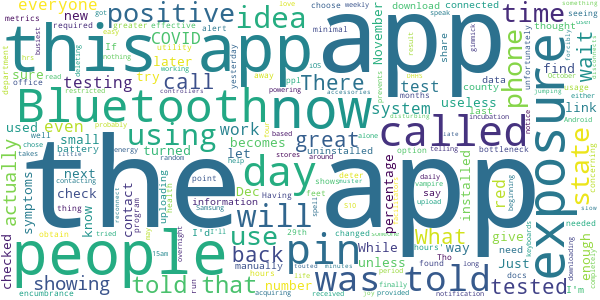

# SlowCOVIDNC
App version ``1.4``

Analyzed with [covid-apps-observer](http://github.com/covid-apps-observer) project, version ``0.1``

## App overview
| | |
|-------------------------|-------------------------| 
| **Name**&nbsp;&nbsp;&nbsp;&nbsp;&nbsp;&nbsp;&nbsp;&nbsp;&nbsp;&nbsp;&nbsp;&nbsp;&nbsp;&nbsp;&nbsp;&nbsp;&nbsp;&nbsp;&nbsp;&nbsp;&nbsp;&nbsp;&nbsp;&nbsp;&nbsp;&nbsp;&nbsp;&nbsp;&nbsp;&nbsp;&nbsp;&nbsp;&nbsp;&nbsp;&nbsp;&nbsp;&nbsp;&nbsp;&nbsp;&nbsp;  | SlowCOVIDNC |
| **Unique identifier** | gov.nc.dhhs.exposurenotification |
| **Link to Google Play** | [https://play.google.com/store/apps/details?id=gov.nc.dhhs.exposurenotification](https://play.google.com/store/apps/details?id=gov.nc.dhhs.exposurenotification) |
| **Summary**  | Official COVID-19 exposure notification app to help protect North Carolinians! |
| **Privacy policy** | [https://covid19.ncdhhs.gov/slowcovidnc-privacy-policy](https://covid19.ncdhhs.gov/slowcovidnc-privacy-policy) |
| **Latest version** | 1.4 |
| **Last update** | 2021-01-07 16:57:33 |
| **Recent changes** | Slow the spread of COVID-19 and protect your family, friends and community while still protecting your privacy – simply by using the SlowCOVIDNC app on your phone. Our latest version of SlowCOVIDNC includes minor bug fixes. |
| **Installs**  | 100,000+ |
| **Category** | Health & Fitness |
| **First release** | Sep 15, 2020 |
| **Size**  | 3.1M |
| **Supported Android version**  | 6.0 and up |

### Description
> SlowCOVIDNC is the official COVID-19 Exposure Notification app for the North Carolina Department of Health and Human Services (NCDHHS). It allows users to know if they may have been in close contact with someone who has shared a positive COVID-19 test result through the app. Users can anonymously share a positive COVID-19 test result to help slow the spread of COVID-19. 
 NCDHHS created this app so that North Carolinians can do their part to protect their community and slow the spread of the virus.
 HOW SLOWCOVIDNC WORKS?
 Step 1: Download the SlowCOVIDNC Exposure Notification app. Enable Bluetooth and Exposure notifications.
 Step 2: After opting-in to receive notifications, the app will generate an anonymous token for your device. A token is a string of random letters and numbers that is used to represent a phone for a short period of time. This ensures your privacy and security are protected. These individual tokens change every 10-20 minutes and are never linked to your identity or location. 
 Step 3: Through Bluetooth, your phone and the phones around you with the SlowCOVIDNC app are working in the background (without draining your battery or data) to exchange these anonymous tokens every few minutes. As a result, devices can remember how long they are near each other. Phones also record the Bluetooth signal strength of their exchanges in order to estimate how far apart they are.
 Step 4: SlowCOVIDNC periodically downloads tokens from the server that have been uploaded from the devices of users who have tested positive. Your phone then uses its records of the signal strength and duration of exposures with those tokens to conduct a risk calculation and determine if you have met a threshold for notification. 
 Step 5: If you have tested positive for COVID-19, you may obtain your PIN from your local public health department and submit that into the app. This voluntary and anonymous reporting notifies others who have downloaded the app and may have been in close contact with you in the last 14 days that they might be at risk.
 HOW SLOWCOVIDNC PROTECTS YOUR PRIVACY?
 Using SlowCOVIDNC is entirely voluntary, and you can enable or disable it at any time. When using SlowCOVIDNC, your privacy will be protected. Tokens will collect and share date, time, signal strength and duration of proximity. No location data or personally identifiable data will ever be collected or stored.
 By enabling Bluetooth and Exposure Notifications, you can anonymously share a positive COVID-19 test result to help slow the spread of COVID-19. You may also be notified if you have been in close contact with someone who has shared a positive COVID-19 test result.
 Learn more about how your privacy is protected and our privacy policy on the NCDHHS website. 
 Thank you for downloading SlowCOVIDNC. Together, we can slow the spread of COVID-19!

### User interface
The developers of the app provide the following screenshots in the Google play store.
| | | |
|:-------------------------:|:-------------------------:|:-------------------------:|
 |   |   |   | 
 |  

## Development team
In the following we report the main information provided by the development team in the Google play store.

| | |
|-------------------------|-------------------------|
| **Developer**  | NC Department of Health and Human Services |
| **Website**  | [https://covid19.ncdhhs.gov/SlowCOVIDNC](https://covid19.ncdhhs.gov/SlowCOVIDNC) |
| **Email** | NCHealthIT@dhhs.nc.gov |
| **Physical address**  | - |
| **Other developed apps**  | [https://play.google.com/store/apps/developer?id=NC+Department+of+Health+and+Human+Services](https://play.google.com/store/apps/developer?id=NC+Department+of+Health+and+Human+Services) |

## Android support

| | |
|-------------------------|-------------------------|
| **Declared target Android version**  | Android10, version 10 (API level 29) |
| **Effective target Android version**  | Android10, version 10 (API level 29) |
| **Minimum supported Android version**  | Marshmallow, version 6.0 (API level 23) |
| **Maximum target Android version**  | - |

The larger the difference between the minimum and maximum supported Android versions, the better. A larger difference means a wider audience. For example, old phones have a very low Android version, so a high minimum supported Android version means that the app cannot be used by users with old phones, thus leading to accessibility problems. 

## Requested permissions

In the following we report the complete list of the permissions requested by the app. 

| **Permission** | **Protection level** | **Description** | 
|-------------------------|-------------------------|-------------------------|
 **android.permission ACCESS_NETWORK_STATE** | Normal | Allows applications to access information about networks. 
 **android.permission BLUETOOTH** | Normal | Allows applications to connect to paired bluetooth devices. 
 **android.permission FOREGROUND_SERVICE** | Normal | Allows a regular application to use Service.startForeground. 
 **android.permission INTERNET** | Normal | Allows applications to open network sockets. 
 **android.permission RECEIVE_BOOT_COMPLETED** | Normal | Allows an application to receive the Intent.ACTION_BOOT_COMPLETED that is broadcast after the system finishes booting. 
 **android.permission WAKE_LOCK** | Normal | Allows using PowerManager WakeLocks to keep processor from sleeping or screen from dimming. 

## Mentioned servers

| **Server** | **Registrant** | **Registrant country** | **Creation date** | 
|-------------------------|-------------------------|-------------------------|-------------------------|
 | google.com | Google LLC | :us: US | 1997-09-15 04:00:00 |
 | ncpublichealth.com | State of North Carolina, Division of Public Health | :us: US | 2002-03-14 19:22:33 |

## Security analysis 

Below we report the main security warnings raised by our execution of the [Androwarn](https://github.com/maaaaz/androwarn) security analysis tool.

**Telephony identifiers leakage**
> - This application reads the ISO country code equivalent of the current registered operator's MCC (Mobile Country Code) 

**Connection interfaces exfiltration**
> - This application reads details about the currently active data network 
> - This application tries to find out if the currently active data network is metered 

**Suspicious connection establishment**
> - This application opens a Socket and connects it to the remote address 'Read timeout' on the 'N/A' port  

## User ratings and reviews

Below we provide information about how end users are reacting to the app in terms of ratings and reviews in the Google Play store.

### Ratings

The SlowCOVIDNC app has been installed by more than **100000** times. At this time, **749** rated the app and its average score is **4.02**. Below we show the distribution of the ratings across the usual star-based rating of Google Play

:star::star::star::star::star:: 450

:star::star::star::star:: 105

:star::star::star:: 52

:star::star:: 45

:star:: 97

### Reviews 

#### 5-star reviews

> Very informative 👏  :date: __2021-01-09 16:04:26__

> Thanks to this app to protect myself from other covid people. I have not experienced any exposure yet.  :date: __2021-01-08 23:54:40__

> I practice all the guidelines that is set .I stay home and have had no signs or symptoms of Covid-19 . A good move , heard about states that have this in place , everyone need to participate to help stop the spread of this disease , should have been done sooner .What is real or not, to update and not know why is useless .  :date: __2021-01-08 23:27:40__

> Although I am being very careful, and have not gotten notified of exposure, I am glad to have this out there.  :date: __2021-01-08 23:21:29__

> The app runs - so far, no notifications.  :date: __2021-01-08 22:50:50__

> Superb statistics by Tableau...high quality app design. Hope I never experience the notification process! Strongly recommend all to install this free app!  :date: __2021-01-08 21:34:45__

> Saving lives. Much love NC ❤️  :date: __2021-01-08 19:47:29__

> So far so good. The more people that get this the better. Haven't noticed a battery drain.  :date: __2021-01-08 19:33:54__

> Unobtrusive, please download and help protect your neighbors and yourself.  :date: __2021-01-08 18:32:02__

> Happy to help  :date: __2021-01-08 18:22:12__

#### 4-star reviews

> Who cares! Get it! Use it!  :date: __2021-01-08 23:45:03__

> Very good  :date: __2021-01-08 19:37:31__

> My SlowCOVIDNC app is working great now. Thank you Governor Cooper, Dr. Mandy Cohen, and everyone working to slow COVID in NC!  :date: __2021-01-08 19:13:14__

> Good app.  :date: __2021-01-08 18:26:37__

> Was great,since update I don't get updates  :date: __2021-01-08 12:14:42__

> If I get paid.  :date: __2020-12-28 01:31:19__

> Relaxing, enjoyable, and fun !!!  :date: __2020-12-11 21:11:09__

> Now, if only NC citizens would simply be honest about their exposing others to their positive Covid test as soon as notified. Instead, so many are carelessly waiting until they get negative result. Meanwhile the positives are spreading Covid in neighborhoods, stores, churches, and other public places... WITH NO MASKS! Just because you didn't need ICU, doesn't mean others you exposed will be as fortunate. Get Behind THE Mask! 🙏😷🙏  :date: __2020-12-07 04:22:22__

> Great idea!  :date: __2020-11-30 00:06:31__

> Has stopped checking for exposure. Last checked for exposure 11/20 on my pixel 3. I cleared app data and it checked in today.  :date: __2020-11-25 11:17:59__

#### 3-star reviews

> Just need more people to use it.  :date: __2021-01-08 17:20:33__

> Exposures haven't updated for a week... Your reply didn't address my concern.  :date: __2021-01-06 03:03:52__

> Does not work  :date: __2021-01-04 17:01:24__

> I uninstalled. App is only as good as everyone uses it. No one I work with has the app. Point less if no one else downloads.  :date: __2021-01-02 00:38:26__

> Great idea if everyone used it and tested frequently. I had Covid in July before getting the app. No notifications of exposure for me even after shopping at a mall for Christmas.  :date: __2020-12-31 15:31:21__

> Kk😤😭😭👌🏿👌🏿👌🏿👌🏿👌🏿👌🏿👌🏿😭👌🏿😭😭😭ⓂⓂⓂⓂ🚮🚮Ⓜ👌🏿🚮😭🙂🚮😭😤🚮ⓂⓂⓂ😭ⓂⓂⓂⓂⓂⓂⓂⓂⓂⓂ  :date: __2020-12-30 06:55:12__

> A few bugs, especially in the Data (last) option page. Give the option to search specific areas like zip code, but won't let you type in anything.  :date: __2020-12-29 23:56:26__

> I loved this app until it was updated; since then it has not worked at all. It automatically turned notifications off and wont allow them to be turned on again, and since I deleted it and tried to reinstall it, it has been stuck in a loop for the past 2 hours.  :date: __2020-12-25 03:13:49__

> I check every so often & I last checked it this evening (12/13 ~8:20pm) & it says it last checked exposures at 6:33pm, so that's fine. But what I'm worried about is if other people are actually using the app. I try to stay home as much as possible, but I have gone out recently and I'm concerned that the app hasn't picked up on exposures. Not that I want to be exposed, but it sure would be nice to know if I had, esp given the rate that covid is rising in the state...Samsung galaxy S10 user.  :date: __2020-12-14 02:29:38__

> If there were only a way to make cell carriers (companies) make this mandatory. I mean, right now it just feels like everyone who is trying to be compliant and healthy is just walking around bouncing off cell phone vibes off each other. The rest of these idiots aren't using this app anyway. Apparently, over the last two weeks I have been close to three separate people who claim to be positive. I wasn't near them unmasked or for a prolonged period, and 6 ft. apart. But how do we know?  :date: __2020-12-13 15:58:46__

#### 2-star reviews

> Not sure how effective this is unless there's greater usage than we are seeing now. I was at my docs office yesterday, and was 6 feet away from 2 people with positive tests. Not a thing's showing up on this program.  :date: __2021-01-08 20:43:07__

> Not enough people using the app  :date: __2021-01-08 16:21:42__

> There hasn't been any check since Dec 25, 2020. This is concerning. The exposure notification is turned on.  :date: __2021-01-05 18:44:02__

> A small percentage of people are downloading this for Android (can't speak for iOS), and such a small percentage of people are actually tested daily in this state. It's more like a gimmick app unless everyone downloads and everyone gets weekly testing.  :date: __2020-12-31 16:28:03__

> While I love the idea powering this app actually acquiring a pin takes so long that the app becomes useless. I finally received my positive test result four days after showing symptoms and when I called in to get my pin, I was told that I would have to wait a few days and call in again. By the time I actually get my pin the incubation period for the people I may have had contact with will be over and they'll probably have symptoms before they even get any notice from the app.  :date: __2020-12-30 17:23:48__

> There's not enough people using the app for it to work. Like, even in the busiest stores, the app doesn't find any exposures.  :date: __2020-12-24 23:35:16__

> Just got app I'll let you know later!  :date: __2020-12-19 17:56:23__

> I tried contacting them, and my test was not showing up in their system so they could not give me a PIN. I used the link your provided and I also called when the link was telling me I wasn't in the system.  :date: __2020-12-14 14:54:23__

> I installed this app at the beginning of November, and that was the only time it checked for exposures. What use is that? I could not find a way to manually check either.  :date: __2020-11-27 04:56:58__

> Exposure last checked: October 31, 2020 8:15am. It's November 23 now. I thought this app was a great idea. But now I have some random app that is connected to my Bluetooth 24/7 and I'm deleting it.  :date: __2020-11-23 16:41:06__

#### 1-star reviews

> I am a nurse and work in an emergency department. I have been exposed to covid multiple times per shift. This app says I've never been exposed. So it doesn't even deserve one star.  :date: __2021-01-09 14:08:31__

> This was a good idea with a big flaw. Getting a pin is not straight forward. Someone sick with Covid will not take the time to bother getting a pin. It should have been done like this... Sign up with the app with your cell phone number, you get Covid and the county health department should notify DHHS to send the exposure. This would have been easy to do using the cell phone number of the infected person. My wife had Covid and this app. She thought it updated using health department records.  :date: __2021-01-09 00:48:36__

> Really gives no information  :date: __2021-01-08 23:34:27__

> An absolutely useless app. I tested positive for covid nearly a week ago but have yet to be able to get my PIN. Every time I call in they tell me it's going to be a few days. If you look at the reviews this seems to be the case, that they won't provide you the pin until weeks afterwards. So all in all, this app serves no purpose. What an absolute waste of taxpayer money.  :date: __2021-01-08 20:33:44__

> Good idea, bad execution. It turns itself off all the time until I open the app so it basically never works or is on when I need it to be.  :date: __2021-01-08 20:04:10__

> Covid in my family Didn't work.. Then I try to update it and tell of my POS outcome. Says can't find me in system...  :date: __2021-01-08 18:59:42__

> I had Covid19 and people I kniw that have this app told me they never got notified  :date: __2021-01-08 18:56:04__

> Can't give it anything but a 1.. I just reloaded it yesterday. Had for a while but Uninstalled because it never showed exposure and I knew I had been exposed. Several times. Thought I'd give it one more try. I've got a feeling people aren't going to be honest. So this app may be a dud because of that. I'd give them 6 stars for good intentions but people still run around shopping and everything else. They don't quarantine like they're supposed to. Sad but true.  :date: __2021-01-08 15:57:55__

> It's taking weeks to obtain a confirmation pin to share results which defeats the purpose of this whole thing. By the time people get their pins it's been over a week or longer in some cases, which at that point is too late. It's pointless to alert people if it's not immediate. Deleting the app because I'm not ok with tracking me for no purpose.  :date: __2021-01-08 02:28:39__

> Unable to obtain a Pin using the form due to always failing the CAPTCHA. I've tried being case sensitive and not case sensitive. It fails every time. I've tried this on Chrome and Firefox browsers  :date: __2021-01-02 09:04:24__

