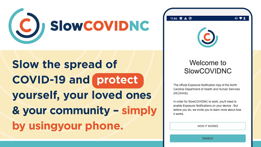
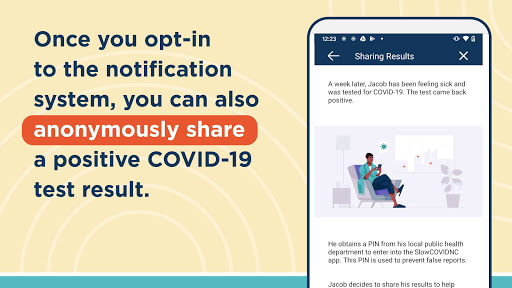
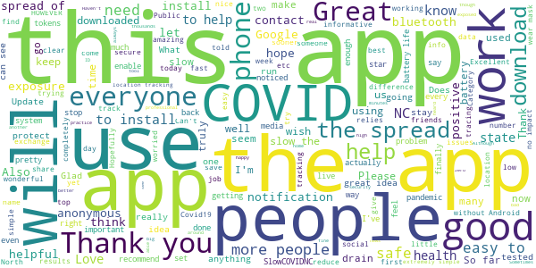
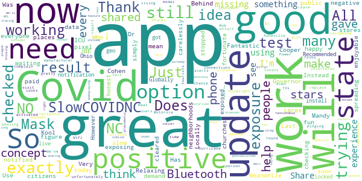
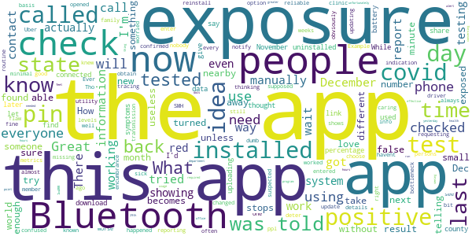
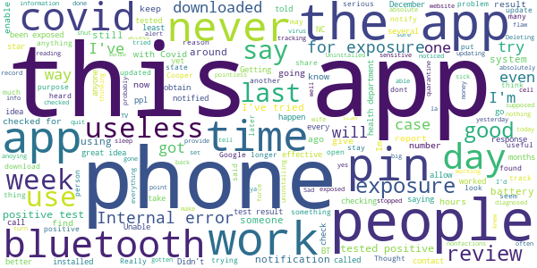

# SlowCOVIDNC
App version ``1.5``

Analyzed with [covid-apps-observer](http://github.com/covid-apps-observer) project, version ``0.1``

## App overview
| | |
|-------------------------|-------------------------| 
| **Name**&nbsp;&nbsp;&nbsp;&nbsp;&nbsp;&nbsp;&nbsp;&nbsp;&nbsp;&nbsp;&nbsp;&nbsp;&nbsp;&nbsp;&nbsp;&nbsp;&nbsp;&nbsp;&nbsp;&nbsp;&nbsp;&nbsp;&nbsp;&nbsp;&nbsp;&nbsp;&nbsp;&nbsp;&nbsp;&nbsp;&nbsp;&nbsp;&nbsp;&nbsp;&nbsp;&nbsp;&nbsp;&nbsp;&nbsp;&nbsp;  | SlowCOVIDNC |
| **Unique identifier** | gov.nc.dhhs.exposurenotification |
| **Link to Google Play** | [https://play.google.com/store/apps/details?id=gov.nc.dhhs.exposurenotification](https://play.google.com/store/apps/details?id=gov.nc.dhhs.exposurenotification) |
| **Summary**  | Official COVID-19 exposure notification app to help protect North Carolinians! |
| **Privacy policy** | [https://covid19.ncdhhs.gov/slowcovidnc-privacy-policy](https://covid19.ncdhhs.gov/slowcovidnc-privacy-policy) |
| **Latest version** | 1.5 |
| **Last update** | 2021-01-15 16:35:49 |
| **Recent changes** | Slow the spread of COVID-19 and protect your family, friends and community while still protecting your privacy – simply by using the SlowCOVIDNC app on your phone. Our latest version of SlowCOVIDNC includes minor bug fixes. |
| **Installs**  | 100,000+ |
| **Category** | Health & Fitness |
| **First release** | Sep 15, 2020 |
| **Size**  | 3.1M |
| **Supported Android version**  | 6.0 and up |

### Description
> SlowCOVIDNC is the official COVID-19 Exposure Notification app for the North Carolina Department of Health and Human Services (NCDHHS). It allows users to know if they may have been in close contact with someone who has shared a positive COVID-19 test result through the app. Users can anonymously share a positive COVID-19 test result to help slow the spread of COVID-19. 
 NCDHHS created this app so that North Carolinians can do their part to protect their community and slow the spread of the virus.
 HOW SLOWCOVIDNC WORKS?
 Step 1: Download the SlowCOVIDNC Exposure Notification app. Enable Bluetooth and Exposure notifications.
 Step 2: After opting-in to receive notifications, the app will generate an anonymous token for your device. A token is a string of random letters and numbers that is used to represent a phone for a short period of time. This ensures your privacy and security are protected. These individual tokens change every 10-20 minutes and are never linked to your identity or location. 
 Step 3: Through Bluetooth, your phone and the phones around you with the SlowCOVIDNC app are working in the background (without draining your battery or data) to exchange these anonymous tokens every few minutes. As a result, devices can remember how long they are near each other. Phones also record the Bluetooth signal strength of their exchanges in order to estimate how far apart they are.
 Step 4: SlowCOVIDNC periodically downloads tokens from the server that have been uploaded from the devices of users who have tested positive. Your phone then uses its records of the signal strength and duration of exposures with those tokens to conduct a risk calculation and determine if you have met a threshold for notification. 
 Step 5: If you have tested positive for COVID-19, you may obtain your PIN from your local public health department and submit that into the app. This voluntary and anonymous reporting notifies others who have downloaded the app and may have been in close contact with you in the last 14 days that they might be at risk.
 HOW SLOWCOVIDNC PROTECTS YOUR PRIVACY?
 Using SlowCOVIDNC is entirely voluntary, and you can enable or disable it at any time. When using SlowCOVIDNC, your privacy will be protected. Tokens will collect and share date, time, signal strength and duration of proximity. No location data or personally identifiable data will ever be collected or stored.
 By enabling Bluetooth and Exposure Notifications, you can anonymously share a positive COVID-19 test result to help slow the spread of COVID-19. You may also be notified if you have been in close contact with someone who has shared a positive COVID-19 test result.
 Learn more about how your privacy is protected and our privacy policy on the NCDHHS website. 
 Thank you for downloading SlowCOVIDNC. Together, we can slow the spread of COVID-19!

### User interface
The developers of the app provide the following screenshots in the Google play store.
| | | |
|:-------------------------:|:-------------------------:|:-------------------------:|
 |   |   |   | 
 |  

## Development team
In the following we report the main information provided by the development team in the Google play store.

| | |
|-------------------------|-------------------------|
| **Developer**  | NC Department of Health and Human Services |
| **Website**  | [https://covid19.ncdhhs.gov/SlowCOVIDNC](https://covid19.ncdhhs.gov/SlowCOVIDNC) |
| **Email** | NCHealthIT@dhhs.nc.gov |
| **Physical address**  | - |
| **Other developed apps**  | [https://play.google.com/store/apps/developer?id=NC+Department+of+Health+and+Human+Services](https://play.google.com/store/apps/developer?id=NC+Department+of+Health+and+Human+Services) |

## Android support

| | |
|-------------------------|-------------------------|
| **Declared target Android version**  | Android10, version 10 (API level 29) |
| **Effective target Android version**  | Android10, version 10 (API level 29) |
| **Minimum supported Android version**  | Marshmallow, version 6.0 (API level 23) |
| **Maximum target Android version**  | - |

The larger the difference between the minimum and maximum supported Android versions, the better. A larger difference means a wider audience. For example, old phones have a very low Android version, so a high minimum supported Android version means that the app cannot be used by users with old phones, thus leading to accessibility problems. 

## Requested permissions

In the following we report the complete list of the permissions requested by the app. 

| **Permission** | **Protection level** | **Description** | 
|-------------------------|-------------------------|-------------------------|
 **android.permission ACCESS_NETWORK_STATE** | Normal | Allows applications to access information about networks. 
 **android.permission BLUETOOTH** | Normal | Allows applications to connect to paired bluetooth devices. 
 **android.permission FOREGROUND_SERVICE** | Normal | Allows a regular application to use Service.startForeground. 
 **android.permission INTERNET** | Normal | Allows applications to open network sockets. 
 **android.permission RECEIVE_BOOT_COMPLETED** | Normal | Allows an application to receive the Intent.ACTION_BOOT_COMPLETED that is broadcast after the system finishes booting. 
 **android.permission WAKE_LOCK** | Normal | Allows using PowerManager WakeLocks to keep processor from sleeping or screen from dimming. 

## Mentioned servers

| **Server** | **Registrant** | **Registrant country** | **Creation date** | 
|-------------------------|-------------------------|-------------------------|-------------------------|
 | google.com | Google LLC | :us: US | 1997-09-15 04:00:00 |
 | ncpublichealth.com | State of North Carolina, Division of Public Health | :us: US | 2002-03-14 19:22:33 |

## Security analysis 

Below we report the main security warnings raised by our execution of the [Androwarn](https://github.com/maaaaz/androwarn) security analysis tool.

**Telephony identifiers leakage**
> - This application reads the ISO country code equivalent of the current registered operator's MCC (Mobile Country Code) 

**Connection interfaces exfiltration**
> - This application reads details about the currently active data network 
> - This application tries to find out if the currently active data network is metered 

**Suspicious connection establishment**
> - This application opens a Socket and connects it to the remote address 'Read timeout' on the 'N/A' port  

## User ratings and reviews

Below we provide information about how end users are reacting to the app in terms of ratings and reviews in the Google Play store.

### Ratings

The SlowCOVIDNC app has been installed by more than **100000** times. At this time, **877** rated the app and its average score is **3.871287**. Below we show the distribution of the ratings across the usual star-based rating of Google Play

:star::star::star::star::star:: 504

:star::star::star::star:: 87

:star::star::star:: 87

:star::star:: 69

:star:: 130

### Reviews 

#### 5-star reviews

> Thank you  :date: __2021-01-22 05:29:25__

> Wonderful Help  :date: __2021-01-20 11:56:37__

> I've been using this app since October. and I am very happy to not have heard any bad news... HOWEVER, I find it IMPOSSIBLE to beieve that with this huge outbreak and how contagious COVID is, and how I've been around tens of thousands of people, a I have had zero contacts? Seems odd.  :date: __2021-01-20 02:26:09__

> This app is intended to help us know when we're exposed to Covoid so we can see a health professional.  :date: __2021-01-19 21:32:30__

> I avoid as much contact as I can, but having the tool to keep track is another layer of security in this plague/pandemic time.  :date: __2021-01-19 21:08:03__

> Well done from a security standpoint - completely anonymous, only uses randomized tokens for ID (big numbers that change every 15 minutes - no names, etc.). Completely secure and safe. (professional computer geek here)  :date: __2021-01-14 02:00:32__

> I hope everyone uses this app. Wear a mask, stay safe, practice social distance, and vaccinate.  :date: __2021-01-10 16:07:31__

> Very informative 👏  :date: __2021-01-09 16:04:26__

> Thanks to this app to protect myself from other covid people. I have not experienced any exposure yet.  :date: __2021-01-08 23:54:40__

> I practice all the guidelines that is set .I stay home and have had no signs or symptoms of Covid-19 . A good move , heard about states that have this in place , everyone need to participate to help stop the spread of this disease , should have been done sooner .What is real or not, to update and not know why is useless .  :date: __2021-01-08 23:27:40__

#### 4-star reviews

> I am happy with it  :date: __2021-01-14 03:17:24__

> Kool app! However, still trying to figure out how it exactly works 🤔  :date: __2021-01-09 18:28:55__

> Who cares! Get it! Use it!  :date: __2021-01-08 23:45:03__

> Very good  :date: __2021-01-08 19:37:31__

> My SlowCOVIDNC app is working great now. Thank you Governor Cooper, Dr. Mandy Cohen, and everyone working to slow COVID in NC!  :date: __2021-01-08 19:13:14__

> Good app.  :date: __2021-01-08 18:26:37__

> Was great,since update I don't get updates  :date: __2021-01-08 12:14:42__

> If I get paid.  :date: __2020-12-28 01:31:19__

> Relaxing, enjoyable, and fun !!!  :date: __2020-12-11 21:11:09__

> Now, if only NC citizens would simply be honest about their exposing others to their positive Covid test as soon as notified. Instead, so many are carelessly waiting until they get negative result. Meanwhile the positives are spreading Covid in neighborhoods, stores, churches, and other public places... WITH NO MASKS! Just because you didn't need ICU, doesn't mean others you exposed will be as fortunate. Get Behind THE Mask! 🙏😷🙏  :date: __2020-12-07 04:22:22__

#### 3-star reviews

> None  :date: __2021-01-19 22:29:47__

> Would love to tell people I've tested positive. app requires jumping through hoops my sick brain doesn't feel up to. Not useful. State already knows, plug the damned info in.  :date: __2021-01-19 20:53:15__

> I decided to update this review. I haven't changed the rating as of yet but probably will have to after I get some kind of answers. On January 10th, 2021 my app stopped reporting. On the 11th I had to call off from work due to a fever and symptom scare. I did test negative for Covid, but the timing of it all couldn't be worse. I mean, three days, during my wait for answers. How is that helping anyone? I work at a high traffic State facility and thought I could rely on this to help.  :date: __2021-01-14 02:34:00__

> Dont know if it really works  :date: __2021-01-11 15:02:14__

> Just need more people to use it.  :date: __2021-01-08 17:20:33__

> Exposures haven't updated for a week... Your reply didn't address my concern.  :date: __2021-01-06 03:03:52__

> Does not work  :date: __2021-01-04 17:01:24__

> I uninstalled. App is only as good as everyone uses it. No one I work with has the app. Point less if no one else downloads.  :date: __2021-01-02 00:38:26__

> Great idea if everyone used it and tested frequently. I had Covid in July before getting the app. No notifications of exposure for me even after shopping at a mall for Christmas.  :date: __2020-12-31 15:31:21__

> Kk😤😭😭👌🏿👌🏿👌🏿👌🏿👌🏿👌🏿👌🏿😭👌🏿😭😭😭ⓂⓂⓂⓂ🚮🚮Ⓜ👌🏿🚮😭🙂🚮😭😤🚮ⓂⓂⓂ😭ⓂⓂⓂⓂⓂⓂⓂⓂⓂⓂ  :date: __2020-12-30 06:55:12__

#### 2-star reviews

> I am confused. I was thinking this app would check for exposures on a routine basis but my last check was back in December and I see no way of manually requesting a check. Am I missing something??  :date: __2021-01-21 04:03:05__

> I havent had an update since December 26, 2020. What has happened to this app  :date: __2021-01-21 03:02:27__

> I tested positive at a minute clinic. When I tried to enter my positive result it didn't have my information. I called and got a PIN, but when I entered it, the app still wouldn't take it. I was able to notify everyone I was in contact with that I knew, but I was out in the world a good bit.  :date: __2021-01-19 22:28:39__

> I love the idea, I installed the app and it worked right away telling me I have not been exposed. I have found one flaw...Ever since i installed the app on 12/27/20 the app states "Exposure last checked on December 27" (the day I installed it). So I don't know if the app is working or not? How often is it supposed to check for exposures of nearby persons? Or worse, Is the app working fine, but an indication that nobody nearby me has the app installed? Need more details? I'm an Uber driver.  :date: __2021-01-19 21:03:06__

> You should be able to report if you have been exposed to someone with covid or if you know that you had it without having a test. Example, if a family member had it and you are caring for them and you got sick, you don't need to test the know that it was from covid. That could be different levels of reporting from suspected covid to confirmed if you're worried about false reports. SMH tried to report a known exposure but can't without a test = dumb  :date: __2021-01-19 19:04:29__

> I just opened the app and saw that the last time it checked my exposure was 12/26. That's almost a month ago!  :date: __2021-01-18 21:20:02__

> I have to reinstall it every 2 weeks because it stops updating info. Bluetooth is always on. Great idea for tracing transmission, but obviously not reliable.  :date: __2021-01-17 17:28:35__

> Tho it shows option to choose metrics, they cannot be changed. Having to obtain (& wait for) a pin is an encumbrance & bottleneck as well. Will deter ppl from using the app. Have found this app to be of minimal utility, unfortunately.  :date: __2021-01-09 21:43:28__

> The idea of this app is great, but because of the way it's run it becomes useless. I have had the app for 2-3 months. I tested positive on Dec 29th, so I called to get the required number to alert the app. I was told that I would have to wait 48 hours, I called back and was told that I needed to call my health department and then call back the next day, I called back the next day and was told that my number was 'too new to use try again in 48 hours'. What's the point of using it now?  :date: __2021-01-09 21:11:34__

> Not sure how effective this is unless there's greater usage than we are seeing now. I was at my docs office yesterday, and was 6 feet away from 2 people with positive tests. Not a thing's showing up on this program.  :date: __2021-01-08 20:43:07__

#### 1-star reviews

> Worked as described from the day I installed it on September 29th to December 30th; it has not updated contact tokens since that day and, as a result, no longer provides meaningful indications as to whether I've been exposed.  :date: __2021-01-21 13:35:46__

> ITested+Around TGvingWithA medFacilityThatWasWorkingwithThisAppSupposedly.ITookTheStepsOfReachingOutAndTryingToObtainA pinNumberToReportMy +case.Contacting slowcovidnc, they looked my info up and couldn't find me at all.They told me sometimes it takes 48 to 72 hours.So I called back at 48 hours.They had nothing.Called the place that did my results to confirm I tested +, after 72 hrs. They said yes.Called the app again around 4 days later and still couldn't find me.I never got report ever.  :date: __2021-01-21 05:42:53__

> I don't like the set up. It should be automatically updated when someone test positive by the providers or health department that report the COVID cases. I was living with someone with the virus and noticed my phone never went off to alert me. After reading you as the COVID patient have to up the app yourself. This will probably never happen who has time for that. Which makes this app useless.  :date: __2021-01-20 00:06:46__

> My wife was diagnosed a week ago ive not been notified about it  :date: __2021-01-19 23:27:14__

> I haven't gotten the message on this belt since I downloaded it over 6 months ago and I know I've been around somebody it had the coop and they had the app installed on their phone as well  :date: __2021-01-19 23:18:07__

> Didn't seem to work  :date: __2021-01-19 21:03:46__

> Found out I was exposed from a coworker who tested positive. I got tested and also found out I was positive. Unable to get a pin to share my results and the app never knew that I was exposed. Its honestly kind of useless at slowing covid. I did find out where to go get tested, but otherwise this app sucks and its no wonder we have all time record deaths and hospitalizations. Time is of the essence with Covid and this app doesn't have any sense of urgency. Im thinking of uninstalling it.  :date: __2021-01-17 17:32:25__

> Track me... Uhh no thanks  :date: __2021-01-17 06:27:26__

> So it hasn't checked for contact since December 27th. That's almost 3 weeks ago, how is that useful??m  :date: __2021-01-15 19:47:46__

> It was a great idea but the pin access on the website didn't work.  :date: __2021-01-15 16:10:37__

