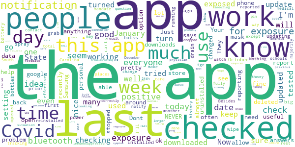

# SlowCOVIDNC
App version ``1.6``

Analyzed with [covid-apps-observer](http://github.com/covid-apps-observer) project, version ``0.1``

## App overview
| | |
|-------------------------|-------------------------| 
| **Name**&nbsp;&nbsp;&nbsp;&nbsp;&nbsp;&nbsp;&nbsp;&nbsp;&nbsp;&nbsp;&nbsp;&nbsp;&nbsp;&nbsp;&nbsp;&nbsp;&nbsp;&nbsp;&nbsp;&nbsp;&nbsp;&nbsp;&nbsp;&nbsp;&nbsp;&nbsp;&nbsp;&nbsp;&nbsp;&nbsp;&nbsp;&nbsp;&nbsp;&nbsp;&nbsp;&nbsp;&nbsp;&nbsp;&nbsp;&nbsp;  | SlowCOVIDNC |
| **Unique identifier** | gov.nc.dhhs.exposurenotification |
| **Link to Google Play** | [https://play.google.com/store/apps/details?id=gov.nc.dhhs.exposurenotification](https://play.google.com/store/apps/details?id=gov.nc.dhhs.exposurenotification) |
| **Summary**  | Official COVID-19 exposure notification app to help protect North Carolinians! |
| **Privacy policy** | [https://covid19.ncdhhs.gov/slowcovidnc-privacy-policy](https://covid19.ncdhhs.gov/slowcovidnc-privacy-policy) |
| **Latest version** | 1.6 |
| **Last update** | 2021-01-22 21:53:20 |
| **Recent changes** | Slow the spread of COVID-19 and protect your family, friends and community while still protecting your privacy – simply by using the SlowCOVIDNC app on your phone. Our latest version of SlowCOVIDNC includes minor bug fixes. |
| **Installs**  | 100,000+ |
| **Category** | Health & Fitness |
| **First release** | Sep 15, 2020 |
| **Size**  | 3.1M |
| **Supported Android version**  | 6.0 and up |

### Description
> SlowCOVIDNC is the official COVID-19 Exposure Notification app for the North Carolina Department of Health and Human Services (NCDHHS). It allows users to know if they may have been in close contact with someone who has shared a positive COVID-19 test result through the app. Users can anonymously share a positive COVID-19 test result to help slow the spread of COVID-19. 
 NCDHHS created this app so that North Carolinians can do their part to protect their community and slow the spread of the virus.
 HOW SLOWCOVIDNC WORKS?
 Step 1: Download the SlowCOVIDNC Exposure Notification app. Enable Bluetooth and Exposure notifications.
 Step 2: After opting-in to receive notifications, the app will generate an anonymous token for your device. A token is a string of random letters and numbers that is used to represent a phone for a short period of time. This ensures your privacy and security are protected. These individual tokens change every 10-20 minutes and are never linked to your identity or location. 
 Step 3: Through Bluetooth, your phone and the phones around you with the SlowCOVIDNC app are working in the background (without draining your battery or data) to exchange these anonymous tokens every few minutes. As a result, devices can remember how long they are near each other. Phones also record the Bluetooth signal strength of their exchanges in order to estimate how far apart they are.
 Step 4: SlowCOVIDNC periodically downloads tokens from the server that have been uploaded from the devices of users who have tested positive. Your phone then uses its records of the signal strength and duration of exposures with those tokens to conduct a risk calculation and determine if you have met a threshold for notification. 
 Step 5: If you have tested positive for COVID-19, you may obtain your PIN from your local public health department and submit that into the app. This voluntary and anonymous reporting notifies others who have downloaded the app and may have been in close contact with you in the last 14 days that they might be at risk.
 HOW SLOWCOVIDNC PROTECTS YOUR PRIVACY?
 Using SlowCOVIDNC is entirely voluntary, and you can enable or disable it at any time. When using SlowCOVIDNC, your privacy will be protected. Tokens will collect and share date, time, signal strength and duration of proximity. No location data or personally identifiable data will ever be collected or stored.
 By enabling Bluetooth and Exposure Notifications, you can anonymously share a positive COVID-19 test result to help slow the spread of COVID-19. You may also be notified if you have been in close contact with someone who has shared a positive COVID-19 test result.
 Learn more about how your privacy is protected and our privacy policy on the NCDHHS website. 
 Thank you for downloading SlowCOVIDNC. Together, we can slow the spread of COVID-19!

### User interface
The developers of the app provide the following screenshots in the Google play store.
| | | |
|:-------------------------:|:-------------------------:|:-------------------------:|
 |   |   |   | 
 |  

## Development team
In the following we report the main information provided by the development team in the Google play store.

| | |
|-------------------------|-------------------------|
| **Developer**  | NC Department of Health and Human Services |
| **Website**  | [https://covid19.ncdhhs.gov/SlowCOVIDNC](https://covid19.ncdhhs.gov/SlowCOVIDNC) |
| **Email** | NCHealthIT@dhhs.nc.gov |
| **Physical address**  | - |
| **Other developed apps**  | [https://play.google.com/store/apps/developer?id=NC+Department+of+Health+and+Human+Services](https://play.google.com/store/apps/developer?id=NC+Department+of+Health+and+Human+Services) |

## Android support

| | |
|-------------------------|-------------------------|
| **Declared target Android version**  | Android10, version 10 (API level 29) |
| **Effective target Android version**  | Android10, version 10 (API level 29) |
| **Minimum supported Android version**  | Marshmallow, version 6.0 (API level 23) |
| **Maximum target Android version**  | - |

The larger the difference between the minimum and maximum supported Android versions, the better. A larger difference means a wider audience. For example, old phones have a very low Android version, so a high minimum supported Android version means that the app cannot be used by users with old phones, thus leading to accessibility problems. 

## Requested permissions

In the following we report the complete list of the permissions requested by the app. 

| **Permission** | **Protection level** | **Description** | 
|-------------------------|-------------------------|-------------------------|
 **android.permission ACCESS_NETWORK_STATE** | Normal | Allows applications to access information about networks. 
 **android.permission BLUETOOTH** | Normal | Allows applications to connect to paired bluetooth devices. 
 **android.permission FOREGROUND_SERVICE** | Normal | Allows a regular application to use Service.startForeground. 
 **android.permission INTERNET** | Normal | Allows applications to open network sockets. 
 **android.permission RECEIVE_BOOT_COMPLETED** | Normal | Allows an application to receive the Intent.ACTION_BOOT_COMPLETED that is broadcast after the system finishes booting. 
 **android.permission WAKE_LOCK** | Normal | Allows using PowerManager WakeLocks to keep processor from sleeping or screen from dimming. 

## Mentioned servers

| **Server** | **Registrant** | **Registrant country** | **Creation date** | 
|-------------------------|-------------------------|-------------------------|-------------------------|
 | google.com | Google LLC | :us: US | 1997-09-15 04:00:00 |
 | ncpublichealth.com | State of North Carolina, Division of Public Health | :us: US | 2002-03-14 19:22:33 |

## Security analysis 

Below we report the main security warnings raised by our execution of the [Androwarn](https://github.com/maaaaz/androwarn) security analysis tool.

**Telephony identifiers leakage**
> - This application reads the ISO country code equivalent of the current registered operator's MCC (Mobile Country Code) 

**Connection interfaces exfiltration**
> - This application reads details about the currently active data network 
> - This application tries to find out if the currently active data network is metered 

**Suspicious connection establishment**
> - This application opens a Socket and connects it to the remote address 'Read timeout' on the 'N/A' port  

## User ratings and reviews

Below we provide information about how end users are reacting to the app in terms of ratings and reviews in the Google Play store.

### Ratings

The SlowCOVIDNC app has been installed by more than **100000** times. At this time, **955** rated the app and its average score is **3.904348**. Below we show the distribution of the ratings across the usual star-based rating of Google Play

:star::star::star::star::star:: 574

:star::star::star::star:: 108

:star::star::star:: 58

:star::star:: 41

:star:: 174

### Reviews 

#### 5-star reviews

> Love it awesome app  :date: __2021-07-01 11:28:55__

> c c. . z n ?./ 5. ,. 83 . P" 5 .. . . 《 1 os? l , k,E , [ 1k.  :date: __2021-06-30 01:43:51__

> I have had this app on my phone for 8 months. So far it has given me no warnings of COVID-19 exposure. I truly think that is a godsend. Or a blessing. Great app.  :date: __2021-06-21 17:44:03__

> Love this app keeps me updated daily without any effort from me  :date: __2021-05-18 02:07:36__

> Keep me everybody else safe 🙂 💓♥️♥️♥️♥️♥️♥️♥️♥️  :date: __2021-05-02 14:15:56__

> Great app  :date: __2021-04-14 04:23:25__

> I for one think it's a great idea; yes, it is a bit of a battery drain, but, c'mon people... Can we get our priorities in line please?  :date: __2021-04-09 14:16:14__

> Now this app is SO smart!  :date: __2021-03-21 19:16:45__

> This comes in handy when it comes to finding out where to go and where not to go to catch covid-19  :date: __2021-03-21 11:58:48__

> Awesome  :date: __2021-03-16 10:27:16__

#### 4-star reviews

> We are going to be in the same room  :date: __2021-06-09 19:55:27__

> Hope that helps to minimize Covid.  :date: __2021-02-27 01:30:59__

> New to this so far.  :date: __2021-02-18 18:16:51__

> I think its wonderful but many people will not self report. That makes this useless  :date: __2021-02-01 01:00:57__

> Glad to have it to protect me  :date: __2021-01-25 18:53:14__

> I love the concept for this app, and usually have no problems with it. However I checked it today and the app says that it has not checked for exposure in over 20 days. I don't know how to fix this issue.  :date: __2021-01-23 21:50:23__

> I am happy with it  :date: __2021-01-14 03:17:24__

> Who cares! Get it! Use it!  :date: __2021-01-08 23:45:03__

> Very good  :date: __2021-01-08 19:37:31__

> My SlowCOVIDNC app is working great now. Thank you Governor Cooper, Dr. Mandy Cohen, and everyone working to slow COVID in NC!  :date: __2021-01-08 19:13:14__

#### 3-star reviews

> Nothing reported and I know people that had the Covid that I was in contact with. They had the app and it didn't notify them. Not useful.  :date: __2021-06-25 20:42:14__

> Well there you go another tracking app to watch where you go, I'll get this app when I get tge vac.... NEVER!!!!!!!!!!!!!!  :date: __2021-06-05 03:25:45__

> It's ok, but if people don't report anything, the rest of us don't know. Besides, South Carolina, as of today, is almost fully open and the mask mandate is pretty much history, except places like medical and schools.  :date: __2021-05-23 21:57:27__

> Haven't used it very much.  :date: __2021-04-24 16:29:23__

> Nice idea, but way too few total downloads to make the app effective.  :date: __2021-03-29 22:56:49__

> Have recently uninstalled and then reinstalled this app. Seems to be working since I can see the date change from last check, but one problem, if this app has been downloaded by so many how is it that when I go to the store around a lot of people, there's no show that I may have been exposed. I'm pretty sure that majority of these people have the app, and care for others to turn it on correctly?.  :date: __2021-03-02 14:35:51__

> It's a good idea if that it would keep up to date. The last time mine checked in was back on December 24th 2020. My app is up to date also..  :date: __2021-02-26 16:30:10__

> App works well in theory. Tested positive and never was able to get my pin to report positive result. Now app no longer checking for notifications. Hasn't checked for any since January 2, 2021  :date: __2021-02-08 03:18:18__

> It was ok until the non-covid, personal question was dropped on me. I deleted the app.  :date: __2021-01-31 05:11:06__

> It isn't being used by everyone. So I was exposed by a nurse who was positive. I am immunosuppressed. I am a physician. I am around most of the time  :date: __2021-01-26 05:50:29__

#### 2-star reviews

> Not sure what this is but never used it.  :date: __2021-06-25 12:17:18__

> The last time my app worked was 12/27/20, with no exposure detected, it'll be a really good app if it worked.  :date: __2021-03-21 19:24:07__

> Slowcovidnc app need remove take down at this time not good  :date: __2021-02-26 15:10:22__

> Works fine. However, the last check was on January 14, 2021, which was six weeks ago.  :date: __2021-02-25 18:35:16__

> It would be cool if it actually checked. I've updated every time in hopes it would work, but it doesn't. Its a good idea, just not very well executed. Deleting now. After months and months of use and waiting for it to work right, it just doesn't.  :date: __2021-02-20 16:10:44__

> I am becoming increasingly disappointed with this app. It hasn't checked exposure since January 5th 2021, that's over 5 weeks ago. Seems a pointless app. I have been opening the app almost daily. And yes, it is the latest update according to the app store and it is on the do not sleep list. Even today, Feb 15th, the last exposure check was Jan 5th.  :date: __2021-02-15 14:25:51__

> This app used to update daily to show potential exposures. Here we are on Feb 1 and app last updated exposures on Jan 17. Perhaps funding ran out. I will be deleting this app. Update: Ultimately had to uninstall and reinstall. Will see if it updates regularly.  :date: __2021-02-02 15:24:09__

> I had the app for a few months, but I never got a notification. Either COVID didn't exist where I was, or people are not using the app properly. Looking at the other reviews I'm going to go with people aren't using the app properly with no fault of their own. If it's difficult to get a pin on the app then people will be less likely to log their positive results.  :date: __2021-01-27 17:45:33__

> Looked like it was working until last update. Now it says the last time it checked for exposure was December 26th, a month ago?  :date: __2021-01-25 13:31:44__

> I am confused. I was thinking this app would check for exposures on a routine basis but my last check was back in December and I see no way of manually requesting a check. Am I missing something??  :date: __2021-01-21 04:03:05__

#### 1-star reviews

> Propogandas  :date: __2021-07-02 09:49:41__

> I've come into contact with tens of thousands possibly hundreds of thousands of people in crowded bars and restaurants without masks on in a densely populated major metropolitan City, yet have gotten no covid exposure warnings in an entire year using the app. I doubt it works. Even if it does this app is a violation of your privacy. Big Tech spies on you and turns your data over to the police without your consent. We are becoming a police state. Soon the government will have all your health data  :date: __2021-06-24 02:11:41__

> Now that song that app was showed up on the other phone and then you showed up on this phone I don't know if they going by my namethey are hacking me and they are really getting on my nerves and I'm trying to buy a house and a car whoever is doing this they have my credit score below 600 I need help with this situation could you please help  :date: __2021-06-17 04:58:35__

> No use!.I had covid and couldn't even get a PIN when I talked to the trackers! Total waste of time and space.  :date: __2021-06-04 13:53:15__

> When I found myself getting less than 99 Push Notifications an hour to my cellphone, this app came in and saved the day by getting those useless push notifications up enough to display (99+) notifications. Since my sense of self worth is directly tied to the number of notifications I receive per hour, it immediately became an invaluable tool for increasing tMood, we ent ckkhat number by 1. It may actually have had another function, but whatever that function was- IT matters less than a of a hor  :date: __2021-06-04 06:38:17__

> Seems pretty useless...  :date: __2021-05-31 09:41:00__

> We already past a year of when the virus posed a threat.  :date: __2021-05-30 22:49:25__

> In a place where people think freedom and masks are related, do we expect people to use this and honestly report? Now with the mask mandate lifted for those who vaccinate, those who do not now have an excuse. In concept this app is fantastic, but I doubt any actual results.  :date: __2021-05-28 00:54:50__

> Why would anyone submit their private medical information to these corrupt government bureaucrats makes no sense. This app allows all your information to be collected and stored. Also, it's pathetic that you lemmings think downloading this dysfunctional app will protect you from being exposed. All of you that were exposed in the comments are probably 100% recovered by now  :date: __2021-05-17 16:46:18__

> 5/15/21 My wife was tested positive a week ago, my whole family has the app running, no notifications. Tried to "notify others" but it has so many steps and is intentionally difficult to prevent misinformation to the point that when you're sick you give up. In the end, this app is worthless.  :date: __2021-05-16 14:35:55__

