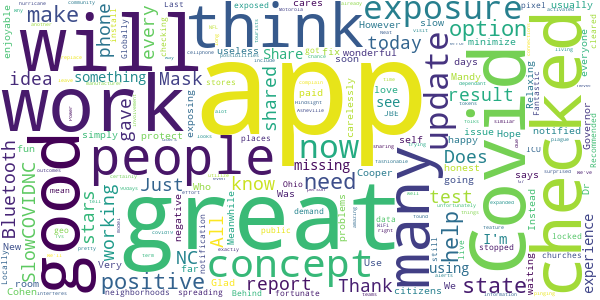

# SlowCOVIDNC
App version ``1.6``

Analyzed with [covid-apps-observer](http://github.com/covid-apps-observer) project, version ``0.1``

## App overview
| | |
|-------------------------|-------------------------| 
| **Name**                                          | SlowCOVIDNC |
| **Unique identifier** | gov.nc.dhhs.exposurenotification |
| **Link to Google Play** | [https://play.google.com/store/apps/details?id=gov.nc.dhhs.exposurenotification](https://play.google.com/store/apps/details?id=gov.nc.dhhs.exposurenotification) |
| **Summary**  | Official COVID-19 exposure notification app to help protect North Carolinians! |
| **Privacy policy** | [https://covid19.ncdhhs.gov/slowcovidnc-privacy-policy](https://covid19.ncdhhs.gov/slowcovidnc-privacy-policy) |
| **Latest version** | 1.6 |
| **Last update** | 2021-01-22 21:53:20 |
| **Recent changes** | Slow the spread of COVID-19 and protect your family, friends and community while still protecting your privacy – simply by using the SlowCOVIDNC app on your phone. Our latest version of SlowCOVIDNC includes minor bug fixes. |
| **Installs**  | 100,000+ |
| **Category** | Health & Fitness |
| **First release** | Sep 15, 2020 |
| **Size**  | 3.1M |
| **Supported Android version**  | 6.0 and up |

### Description
> SlowCOVIDNC is the official COVID-19 Exposure Notification app for the North Carolina Department of Health and Human Services (NCDHHS). It allows users to know if they may have been in close contact with someone who has shared a positive COVID-19 test result through the app. Users can anonymously share a positive COVID-19 test result to help slow the spread of COVID-19. 
 NCDHHS created this app so that North Carolinians can do their part to protect their community and slow the spread of the virus.
 HOW SLOWCOVIDNC WORKS?
 Step 1: Download the SlowCOVIDNC Exposure Notification app. Enable Bluetooth and Exposure notifications.
 Step 2: After opting-in to receive notifications, the app will generate an anonymous token for your device. A token is a string of random letters and numbers that is used to represent a phone for a short period of time. This ensures your privacy and security are protected. These individual tokens change every 10-20 minutes and are never linked to your identity or location. 
 Step 3: Through Bluetooth, your phone and the phones around you with the SlowCOVIDNC app are working in the background (without draining your battery or data) to exchange these anonymous tokens every few minutes. As a result, devices can remember how long they are near each other. Phones also record the Bluetooth signal strength of their exchanges in order to estimate how far apart they are.
 Step 4: SlowCOVIDNC periodically downloads tokens from the server that have been uploaded from the devices of users who have tested positive. Your phone then uses its records of the signal strength and duration of exposures with those tokens to conduct a risk calculation and determine if you have met a threshold for notification. 
 Step 5: If you have tested positive for COVID-19, you may obtain your PIN from your local public health department and submit that into the app. This voluntary and anonymous reporting notifies others who have downloaded the app and may have been in close contact with you in the last 14 days that they might be at risk.
 HOW SLOWCOVIDNC PROTECTS YOUR PRIVACY?
 Using SlowCOVIDNC is entirely voluntary, and you can enable or disable it at any time. When using SlowCOVIDNC, your privacy will be protected. Tokens will collect and share date, time, signal strength and duration of proximity. No location data or personally identifiable data will ever be collected or stored.
 By enabling Bluetooth and Exposure Notifications, you can anonymously share a positive COVID-19 test result to help slow the spread of COVID-19. You may also be notified if you have been in close contact with someone who has shared a positive COVID-19 test result.
 Learn more about how your privacy is protected and our privacy policy on the NCDHHS website. 
 Thank you for downloading SlowCOVIDNC. Together, we can slow the spread of COVID-19!

### User interface
The developers of the app provide the following screenshots in the Google play store.
| | | |
|:-------------------------:|:-------------------------:|:-------------------------:|
 |   |   |   | 
 |  

## Development team
In the following we report the main information provided by the development team in the Google play store.

| | |
|-------------------------|-------------------------|
| **Developer**  | NC Department of Health and Human Services |
| **Website**  | [https://covid19.ncdhhs.gov/SlowCOVIDNC](https://covid19.ncdhhs.gov/SlowCOVIDNC) |
| **Email** | NCHealthIT@dhhs.nc.gov |
| **Physical address**  | - |
| **Other developed apps**  | [https://play.google.com/store/apps/developer?id=NC+Department+of+Health+and+Human+Services](https://play.google.com/store/apps/developer?id=NC+Department+of+Health+and+Human+Services) |

## Android support

| | |
|-------------------------|-------------------------|
| **Declared target Android version**  | Android10, version 10 (API level 29) |
| **Effective target Android version**  | Android10, version 10 (API level 29) |
| **Minimum supported Android version**  | Marshmallow, version 6.0 (API level 23) |
| **Maximum target Android version**  | - |

The larger the difference between the minimum and maximum supported Android versions, the better. A larger difference means a wider audience. For example, old phones have a very low Android version, so a high minimum supported Android version means that the app cannot be used by users with old phones, thus leading to accessibility problems. 

## Requested permissions

In the following we report the complete list of the permissions requested by the app. 

| **Permission** | **Protection level** | **Description** | 
|-------------------------|-------------------------|-------------------------|
 **android.permission ACCESS_NETWORK_STATE** | Normal | Allows applications to access information about networks. 
 **android.permission BLUETOOTH** | Normal | Allows applications to connect to paired bluetooth devices. 
 **android.permission FOREGROUND_SERVICE** | Normal | Allows a regular application to use Service.startForeground. 
 **android.permission INTERNET** | Normal | Allows applications to open network sockets. 
 **android.permission RECEIVE_BOOT_COMPLETED** | Normal | Allows an application to receive the Intent.ACTION_BOOT_COMPLETED that is broadcast after the system finishes booting. 
 **android.permission WAKE_LOCK** | Normal | Allows using PowerManager WakeLocks to keep processor from sleeping or screen from dimming. 

## Mentioned servers

| **Server** | **Registrant** | **Registrant country** | **Creation date** | 
|-------------------------|-------------------------|-------------------------|-------------------------|
 | google.com | Google LLC | :us: US | 1997-09-15 04:00:00 |
 | ncpublichealth.com | State of North Carolina, Division of Public Health | :us: US | 2002-03-14 19:22:33 |

## Security analysis 

Below we report the main security warnings raised by our execution of the [Androwarn](https://github.com/maaaaz/androwarn) security analysis tool.

**Telephony identifiers leakage**
> - This application reads the ISO country code equivalent of the current registered operator's MCC (Mobile Country Code) 

**Connection interfaces exfiltration**
> - This application reads details about the currently active data network 
> - This application tries to find out if the currently active data network is metered 

**Suspicious connection establishment**
> - This application opens a Socket and connects it to the remote address 'Read timeout' on the 'N/A' port  

## User ratings and reviews

Below we provide information about how end users are reacting to the app in terms of ratings and reviews in the Google Play store.

### Ratings

The SlowCOVIDNC app has been installed by more than **100000** times. At this time, **955** rated the app and its average score is **3.904348**. Below we show the distribution of the ratings across the usual star-based rating of Google Play

:star::star::star::star::star:: 574

:star::star::star::star:: 108

:star::star::star:: 58

:star::star:: 41

:star:: 174

### Reviews 

#### 5-star reviews

> After i re-installed the app on 1/27/21, the app is working great! No exposures as of today at 3:42am! Thanks to developers who suggested this fix!!  :date: __2021-01-29 13:54:29__

> Kool app! However, still trying to figure out how it exactly works 🤔. After careful review........ Now I see all 🇺🇲 States whom reported their results......TOTALLY AWESOME APP. LOVE 💘 IT!!!  :date: __2021-01-26 06:44:02__

> I've no trouble with the app, so far  :date: __2021-01-26 02:49:23__

> If it takes giving this app 5 stars to convince you to download it, well here you go  :date: __2021-01-25 21:03:33__

> No alert so far, but the Idea is a good one!  :date: __2021-01-25 20:10:33__

> Anonymous and works.  :date: __2021-01-25 19:20:00__

> Its just nice to know that this app is there when you need it. Its gives you a sense of security.  :date: __2021-01-25 17:36:17__

> Easy app is a little more sensitive security  :date: __2021-01-24 20:29:12__

> Thank you  :date: __2021-01-22 05:29:25__

> Wonderful Help  :date: __2021-01-20 11:56:37__

#### 4-star reviews

> Glad to have it to protect me  :date: __2021-01-25 18:53:14__

> I love the concept for this app, and usually have no problems with it. However I checked it today and the app says that it has not checked for exposure in over 20 days. I don't know how to fix this issue.  :date: __2021-01-23 21:50:23__

> I am happy with it  :date: __2021-01-14 03:17:24__

> Who cares! Get it! Use it!  :date: __2021-01-08 23:45:03__

> Very good  :date: __2021-01-08 19:37:31__

> My SlowCOVIDNC app is working great now. Thank you Governor Cooper, Dr. Mandy Cohen, and everyone working to slow COVID in NC!  :date: __2021-01-08 19:13:14__

> Good app.  :date: __2021-01-08 18:26:37__

> Was great,since update I don't get updates  :date: __2021-01-08 12:14:42__

> If I get paid.  :date: __2020-12-28 01:31:19__

> Relaxing, enjoyable, and fun !!!  :date: __2020-12-11 21:11:09__

#### 3-star reviews

> It isn't being used by everyone. So I was exposed by a nurse who was positive. I am immunosuppressed. I am a physician. I am around most of the time  :date: __2021-01-26 05:50:29__

> I have a situation much like the previous commenter. My last check was January 12 and I have a google phone, I tried looking into the android setting to avoid snoozing but no luck. It would also be nice to have an in app feedback troubleshooting resource. Overall it's a good idea and keeps personal data safe  :date: __2021-01-23 18:46:57__

> None  :date: __2021-01-19 22:29:47__

> Would love to tell people I've tested positive. app requires jumping through hoops my sick brain doesn't feel up to. Not useful. State already knows, plug the damned info in.  :date: __2021-01-19 20:53:15__

> I decided to update this review. I haven't changed the rating as of yet but probably will have to after I get some kind of answers. On January 10th, 2021 my app stopped reporting. On the 11th I had to call off from work due to a fever and symptom scare. I did test negative for Covid, but the timing of it all couldn't be worse. I mean, three days, during my wait for answers. How is that helping anyone? I work at a high traffic State facility and thought I could rely on this to help.  :date: __2021-01-14 02:34:00__

> Dont know if it really works  :date: __2021-01-11 15:02:14__

> Just need more people to use it.  :date: __2021-01-08 17:20:33__

> Exposures haven't updated for a week... Your reply didn't address my concern.  :date: __2021-01-06 03:03:52__

> Does not work  :date: __2021-01-04 17:01:24__

> I uninstalled. App is only as good as everyone uses it. No one I work with has the app. Point less if no one else downloads.  :date: __2021-01-02 00:38:26__

#### 2-star reviews

> I had the app for a few months, but I never got a notification. Either COVID didn't exist where I was, or people are not using the app properly. Looking at the other reviews I'm going to go with people aren't using the app properly with no fault of their own. If it's difficult to get a pin on the app then people will be less likely to log their positive results.  :date: __2021-01-27 17:45:33__

> Looked like it was working until last update. Now it says the last time it checked for exposure was December 26th, a month ago?  :date: __2021-01-25 13:31:44__

> I am confused. I was thinking this app would check for exposures on a routine basis but my last check was back in December and I see no way of manually requesting a check. Am I missing something??  :date: __2021-01-21 04:03:05__

> I havent had an update since December 26, 2020. What has happened to this app  :date: __2021-01-21 03:02:27__

> I tested positive at a minute clinic. When I tried to enter my positive result it didn't have my information. I called and got a PIN, but when I entered it, the app still wouldn't take it. I was able to notify everyone I was in contact with that I knew, but I was out in the world a good bit.  :date: __2021-01-19 22:28:39__

> You should be able to report if you have been exposed to someone with covid or if you know that you had it without having a test. Example, if a family member had it and you are caring for them and you got sick, you don't need to test the know that it was from covid. That could be different levels of reporting from suspected covid to confirmed if you're worried about false reports. SMH tried to report a known exposure but can't without a test = dumb  :date: __2021-01-19 19:04:29__

> I just opened the app and saw that the last time it checked my exposure was 12/26. That's almost a month ago!  :date: __2021-01-18 21:20:02__

> I have to reinstall it every 2 weeks because it stops updating info. Bluetooth is always on. Great idea for tracing transmission, but obviously not reliable.  :date: __2021-01-17 17:28:35__

> Tho it shows option to choose metrics, they cannot be changed. Having to obtain (& wait for) a pin is an encumbrance & bottleneck as well. Will deter ppl from using the app. Have found this app to be of minimal utility, unfortunately.  :date: __2021-01-09 21:43:28__

> The idea of this app is great, but because of the way it's run it becomes useless. I have had the app for 2-3 months. I tested positive on Dec 29th, so I called to get the required number to alert the app. I was told that I would have to wait 48 hours, I called back and was told that I needed to call my health department and then call back the next day, I called back the next day and was told that my number was 'too new to use try again in 48 hours'. What's the point of using it now?  :date: __2021-01-09 21:11:34__

#### 1-star reviews

> Don't trust this. I called my local health department to get tested, so I can have an official documentation of my clear infection. I was told that the test is supposed to be free, but that later charges aren't excluded from the realm of possibility. They said the test is just for jobs, and satisfying personal interest or fears. So no pin, and no way of alerting others I may have come in contact with. Way to go NC, you screw poor people again. What a surprise.  :date: __2021-01-29 19:32:35__

> It would be nice if I could update I've had an Exposure.  :date: __2021-01-29 16:28:54__

> Bluetooth requires the user to validate the authenticate the process between devices. Apps can't do that automatically because it would bypass bluetooth security/encryption. If you paired it to a device it would remember it and reconnect when near or on like bluetooth in a car that you allowed too.  :date: __2021-01-28 18:20:35__

> My app has not updated since January 15th at 7:04 a.m. so if I've been in contact with anyone that has notified the system then I'm just SOL.... in addition to the pins being so hard to get and to administer while you're sick...this was a good idea but has a lot of flaws... but I still wish mine would update... it worked fine for several several weeks and now no updates  :date: __2021-01-28 05:10:46__

> Not effective. I was knowingly around several people that tested positive (my husband, for example) and the app never picked up on any of it or notified me. And yes...they all reported their positives to the app.  :date: __2021-01-28 01:48:53__

> I found that the process to obtain and use a PIN was too much effort to put forth while I was sick with COVID. I notified people verbally instead - via mass text.. much less time involved. When ill with COVID, people are spending their precious time sleeping and NOT going through social media promopts to set up a PIN - very ineffective! I am also a nurse and mother of 2 - I've had the app since the beginning and have had NO notifications - again, ineffective.....  :date: __2021-01-26 08:10:49__

> Not effective. I downloaded the app 2 months before I was exposed. Didn't get any notifications. Everyone around me has the app. Once I tested positive it was a 10 day ordeal just to get a pin. I agree with others that there needs to be a better way for the pin to be given but not by tracking phone numbers. Maybe everyone gets a special code when they're tested that they can put into the app and their results will automatically update once they come in. Less hassle, more secure.  :date: __2021-01-26 06:53:33__

> Deleting the app, I got covid, tried to do the right thing and alert others through it. I'd rather take the time to post this review then call and get a pin. And based on other reviews attempting to get a pin isn't always successful so I'm not wasting another second on this. And I don't need a developer reply thanks.  :date: __2021-01-26 05:33:38__

> My daughter tested positive, lives at home, has the Slow-covid app but it always said I had not had contact. When she reported her positive test to the health department she was not given a pin to report her test. I have also had some co-workers test positive and not been notified through the app.  :date: __2021-01-25 23:29:10__

> Worthless  :date: __2021-01-25 22:45:04__

