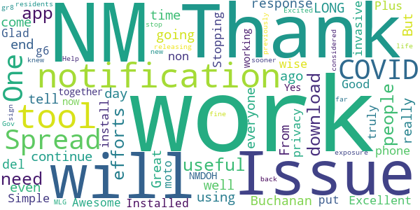
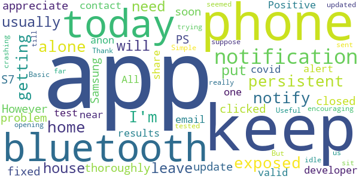
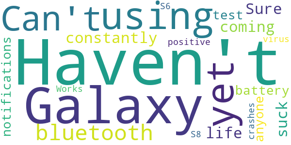

# NM Notify
App version ``minted160003``

Analyzed with [covid-apps-observer](http://github.com/covid-apps-observer) project, version ``0.1``

## App overview
| | |
|-------------------------|-------------------------| 
| **Name**&nbsp;&nbsp;&nbsp;&nbsp;&nbsp;&nbsp;&nbsp;&nbsp;&nbsp;&nbsp;&nbsp;&nbsp;&nbsp;&nbsp;&nbsp;&nbsp;&nbsp;&nbsp;&nbsp;&nbsp;&nbsp;&nbsp;&nbsp;&nbsp;&nbsp;&nbsp;&nbsp;&nbsp;&nbsp;&nbsp;&nbsp;&nbsp;&nbsp;&nbsp;&nbsp;&nbsp;&nbsp;&nbsp;&nbsp;&nbsp;  | NM Notify |
| **Unique identifier** | gov.nm.covid19.exposurenotifications |
| **Link to Google Play** | [https://play.google.com/store/apps/details?id=gov.nm.covid19.exposurenotifications](https://play.google.com/store/apps/details?id=gov.nm.covid19.exposurenotifications) |
| **Summary**  | New Mexico COVID-19 Exposure Notification App |
| **Privacy policy** | [https://nmnotify.com/privacy-policy/](https://nmnotify.com/privacy-policy/) |
| **Latest version** | minted160003 |
| **Last update** | 2021-03-24 21:08:23 |
| **Recent changes** | Bug fixes and performance improvements |
| **Installs**  | 10,000+ |
| **Category** | Medical |
| **First release** | Mar 19, 2021 |
| **Size**  | 10M |
| **Supported Android version**  | 5.0 and up |

### Description
> NM Notify is the official Notification App of New Mexico and the New Mexico Department of Health. It uses Bluetooth technology to alert you when you have been in contact or close proximity to someone that has tested positive for COVID-19. The app uses the Bluetooth technology on your phone to exchange anonymous codes with anyone in your proximity with the same app. If one of those people should become infected within 14 days of your contact, you will be alerted. You'll be told that you have been in contact with someone that has tested positive for COVID-19. Then it will advise you on what steps to take to keep you and others around you safe. Likewise, if you test positive for COVID-19 you can upload your "positive" code and anyone that you have been in contact with will receive an alert. It's completely anonymous, you won't know and others won't know who exposed who.

### User interface
The developers of the app provide the following screenshots in the Google play store.
| | | |
|:-------------------------:|:-------------------------:|:-------------------------:|
 |   |  

## Development team
In the following we report the main information provided by the development team in the Google play store.

| | |
|-------------------------|-------------------------|
| **Developer**  | NM DOH |
| **Website**  | - |
| **Email** | nmnotify@nm.gov |
| **Physical address**  | - |
| **Other developed apps**  | [https://play.google.com/store/apps/developer?id=NM+DOH](https://play.google.com/store/apps/developer?id=NM+DOH) |

## Android support

| | |
|-------------------------|-------------------------|
| **Declared target Android version**  | - |
| **Effective target Android version**  | - |
| **Minimum supported Android version**  | Lollipop, version 5.0 (API level 21) |
| **Maximum target Android version**  | - |

The larger the difference between the minimum and maximum supported Android versions, the better. A larger difference means a wider audience. For example, old phones have a very low Android version, so a high minimum supported Android version means that the app cannot be used by users with old phones, thus leading to accessibility problems. 

## Requested permissions

In the following we report the complete list of the permissions requested by the app. 

| **Permission** | **Protection level** | **Description** | 
|-------------------------|-------------------------|-------------------------|
 **android.permission ACCESS_NETWORK_STATE** | Normal | Allows applications to access information about networks. 
 **android.permission BLUETOOTH** | Normal | Allows applications to connect to paired bluetooth devices. 
 **android.permission FOREGROUND_SERVICE** | Normal | Allows a regular application to use Service.startForeground. 
 **android.permission INTERNET** | Normal | Allows applications to open network sockets. 
 **android.permission RECEIVE_BOOT_COMPLETED** | Normal | Allows an application to receive the Intent.ACTION_BOOT_COMPLETED that is broadcast after the system finishes booting. 
 **android.permission WAKE_LOCK** | Normal | Allows using PowerManager WakeLocks to keep processor from sleeping or screen from dimming. 

## Mentioned servers

| **Server** | **Registrant** | **Registrant country** | **Creation date** | 
|-------------------------|-------------------------|-------------------------|-------------------------|
 | google.com | Google LLC | :us: US | 1997-09-15 04:00:00 |

## Security analysis 

Below we report the main security warnings raised by our execution of the [Androwarn](https://github.com/maaaaz/androwarn) security analysis tool.

**Telephony identifiers leakage**
> - This application reads the ISO country code equivalent of the current registered operator's MCC (Mobile Country Code) 

**Connection interfaces exfiltration**
> - This application reads details about the currently active data network 
> - This application tries to find out if the currently active data network is metered 

**Suspicious connection establishment**
> - This application opens a Socket and connects it to the remote address 'timeout' on the 'N/A' port  

**Code execution**
> - This application loads a native library: 'prioclient' 

## User ratings and reviews

Below we provide information about how end users are reacting to the app in terms of ratings and reviews in the Google Play store.

### Ratings

The NM Notify app has been installed by more than **10000** times. At this time, **50** rated the app and its average score is **2.92**. Below we show the distribution of the ratings across the usual star-based rating of Google Play

:star::star::star::star::star:: 18

:star::star::star::star:: 5

:star::star::star:: 4

:star::star:: 1

:star:: 22

### Reviews 

#### 5-star reviews

> We are going to have the end of the day I can  :date: __2021-04-28 19:59:17__

> From what I can tell, it works well. Issue being this should have come out a LONG time ago... And even then it doesn't really work if not everyone is using it. But I will continue to do so.  :date: __2021-04-27 19:08:25__

> Great notification response  :date: __2021-04-23 01:06:41__

> Buchanan's del 18  :date: __2021-04-20 14:09:54__

> Excellent tool for Stopping the Spread of COVID-19!  :date: __2021-04-19 00:31:20__

> Good  :date: __2021-04-16 15:30:07__

> Simple, non-invasive (privacy-wise), and works on my One Plus 6 phone. To be truly useful, more people would need to install it.  :date: __2021-04-13 00:37:48__

> Awesome  :date: __2021-03-29 19:20:18__

> Installed with no issues on moto g6. Glad NM put one of these together!  :date: __2021-03-27 02:29:27__

> It is working now thank you  :date: __2021-03-25 21:48:47__

#### 4-star reviews

> It's persistent. I keep getting notifications my bluetooth isn't on so they can't notify me if I'm exposed. When I am home alone which I usually am I don't need the bluetooth on. I will put it on when I leave my house.  :date: __2021-04-12 04:10:41__

> I thoroughly appreciate this app. I have a Samsung S7 and the app closed as soon as I clicked it. However, 3/25/21 the update fixed the problem. PS the developer contact email is not valid.  :date: __2021-03-25 21:04:42__

> All the app does is share anon covid test results from one phone, (If Positive) alert phones that have been near by that phone, encouraging them to get tested. Simple, Basic, But really Useful.  :date: __2021-03-23 20:50:16__

> Thank you for trying to keep us updated. The app keeps crashing when opening.  :date: __2021-03-23 19:02:50__

> The app seemed to just sit idle till today. Today it sent a notification. So far it is doing what it's suppose to do.  :date: __2021-03-23 15:33:37__

#### 3-star reviews

> Haven't been using it yet  :date: __2021-04-09 08:24:37__

> Can't have bluetooth constantly coming on.  :date: __2021-04-06 04:39:23__

> Sure does suck the life out of your battery. Haven't had any notifications for anyone who's test positive for the virus.  :date: __2021-03-25 01:53:55__

> Works on my Galaxy S8 but crashes on Galaxy S6.  :date: __2021-03-23 19:30:52__

#### 2-star reviews

> It down loaded on Android but all my Apple devices 🍏 it can't locate the App in the App store.  :date: __2021-03-24 05:23:44__

#### 1-star reviews

> Didn't notify me of anything and nagged at me to turn on my Bluetooth. It doesn't do anything.  :date: __2021-04-26 23:08:36__

> What is the point in having this installed if it only works not even a fraction of the time?? Half the time I get an error notification about being "unable to check for exposures at this time" and thats with my bluetooth on 24/7 or get timestamps when I'm not around anyone.  :date: __2021-04-21 00:17:47__

> Using for 1 week how would I know if it's working? It's creepy. I don't like it. I don't want to be forced to use these things or get vaccinated. When did America turn into a prison camp?  :date: __2021-04-02 05:06:30__

> The app does not work like it should work. For starters, the installation!  :date: __2021-03-30 22:48:33__

> This app berates my phone twice a day asking to gather and share my information and keep tabs on me. Well Big Brother, while I can still say this... Fornicate thyself and the steed upon which thou didst ride in upon. Death is a preferable alternative to Communism. Long live Donald John Trump, the true winner of the election.  :date: __2021-03-26 09:21:16__

> Downloads but immediately fails on a Samsung Galaxy S7. Have uninstalled it.  :date: __2021-03-26 03:48:20__

> Barely downloaded it and it crashed on my first time opening it.  :date: __2021-03-25 15:17:44__

> Currently cannot get the app to work. Installed & tried opening, but kept quitting. Sent feedback. Deinsed, then reinstalled, but same problem. Sent feedback again. Have no idea if this is a good app since it's not working for me. Although in theory, it's a good idea. I've been vaccinated, but it's still good to know. Wish it worked.  :date: __2021-03-25 01:35:58__

> Does not work. It won't even open.  :date: __2021-03-24 18:45:43__

> Can't open on galaxy j7  :date: __2021-03-24 15:26:25__

