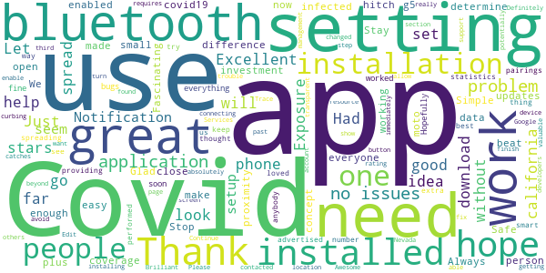
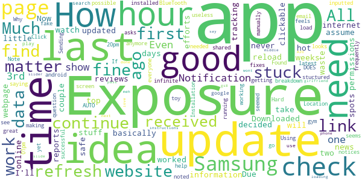

# Covid Trace Nevada
App version ``1.2.11``

Analyzed with [covid-apps-observer](http://github.com/covid-apps-observer) project, version ``0.1``

## App overview
| | |
|-------------------------|-------------------------| 
| **Name**                                          | Covid Trace Nevada |
| **Unique identifier** | gov.nv.dhhs.en |
| **Link to Google Play** | [https://play.google.com/store/apps/details?id=gov.nv.dhhs.en](https://play.google.com/store/apps/details?id=gov.nv.dhhs.en) |
| **Summary**  | Stay safe. Protect each other. Stay private. |
| **Privacy policy** | [https://covidtrace.com/nct_privacy_policy.pdf](https://covidtrace.com/nct_privacy_policy.pdf) |
| **Latest version** | 1.2.11 |
| **Last update** | 2020-10-02 23:40:20 |
| **Recent changes** | - Minor bug fixes and improvements |
| **Installs**  | 10,000+ |
| **Category** | Medical |
| **First release** | Aug 22, 2020 |
| **Size**  | 51M |
| **Supported Android version**  | 7.0 and up |

### Description
> Nevada's Department of Health and Human Services (DHHS) COVID Trace app helps reduce the spread of coronavirus in Nevada helping everyone stay safe. COVID Trace doesn’t require personal information helping protect your privacy.

### User interface
The developers of the app provide the following screenshots in the Google play store.
| | | |
|:-------------------------:|:-------------------------:|:-------------------------:|
 |   |   |   | 
 |   |  

## Development team
In the following we report the main information provided by the development team in the Google play store.

| | |
|-------------------------|-------------------------|
| **Developer**  | Nevada Division of Public and Behavioral Health |
| **Website**  | [http://dpbh.nv.gov/](http://dpbh.nv.gov/) |
| **Email** | help@covidtrace.com |
| **Physical address**  | - |
| **Other developed apps**  | [https://play.google.com/store/apps/developer?id=Nevada+Division+of+Public+and+Behavioral+Health](https://play.google.com/store/apps/developer?id=Nevada+Division+of+Public+and+Behavioral+Health) |

## Android support

| | |
|-------------------------|-------------------------|
| **Declared target Android version**  | Pie, version 9 (API level 28) |
| **Effective target Android version**  | Pie, version 9 (API level 28) |
| **Minimum supported Android version**  | Nougat, version 7.0 (API level 24) |
| **Maximum target Android version**  | - |

The larger the difference between the minimum and maximum supported Android versions, the better. A larger difference means a wider audience. For example, old phones have a very low Android version, so a high minimum supported Android version means that the app cannot be used by users with old phones, thus leading to accessibility problems. 

## Requested permissions

In the following we report the complete list of the permissions requested by the app. 

| **Permission** | **Protection level** | **Description** | 
|-------------------------|-------------------------|-------------------------|
 **android.permission ACCESS_NETWORK_STATE** | Normal | Allows applications to access information about networks. 
 **android.permission BLUETOOTH** | Normal | Allows applications to connect to paired bluetooth devices. 
 **android.permission GET_TASKS** | Deprecated | This constant was deprecated in API level 21. No longer enforced. 
 **android.permission INTERNET** | Normal | Allows applications to open network sockets. 
 **android.permission RECEIVE_BOOT_COMPLETED** | Normal | Allows an application to receive the Intent.ACTION_BOOT_COMPLETED that is broadcast after the system finishes booting. 
 **android.permission WAKE_LOCK** | Normal | Allows using PowerManager WakeLocks to keep processor from sleeping or screen from dimming. 

## Mentioned servers

| **Server** | **Registrant** | **Registrant country** | **Creation date** | 
|-------------------------|-------------------------|-------------------------|-------------------------|
 | google.com | Google LLC | :us: US | 1997-09-15 04:00:00 |
 | xmlpull.org | WhoisGuard, Inc. | PA | 2001-11-26 20:33:08 |
 | w3.org | W3C | :us: US | 1994-07-06 04:00:00 |
 | googleapis.com | Google LLC | :us: US | 2005-01-25 17:52:26 |

## Security analysis 

Below we report the main security warnings raised by our execution of the [Androwarn](https://github.com/maaaaz/androwarn) security analysis tool.

**Connection interfaces exfiltration**
> - This application reads details about the currently active data network 
> - This application tries to find out if the currently active data network is metered 

**Pim data leakage**
> - This application accesses data stored in the clipboard 

**Code execution**
> - This application loads a native library: 'flutter' 

## User ratings and reviews

Below we provide information about how end users are reacting to the app in terms of ratings and reviews in the Google Play store.

### Ratings

The Covid Trace Nevada app has been installed by more than **10000** times. At this time, **66** rated the app and its average score is **3.530303**. Below we show the distribution of the ratings across the usual star-based rating of Google Play

:star::star::star::star::star:: 36

:star::star::star::star:: 1

:star::star::star:: 6

:star::star:: 8

:star:: 15

### Reviews 

#### 5-star reviews

> We need everyone to get this to beat Covid.  :date: __2020-10-31 09:29:23__

> Thank you Stay Safe  :date: __2020-10-31 05:22:45__

> Excellent coverage  :date: __2020-10-16 08:32:35__

> Seems to be working now. Fascinating concept. It uses bluetooth data to determine if you have been in close proximity to an infected person.  :date: __2020-10-16 00:05:20__

> Just installed it without a hitch. Let's hope that enough people use it to make a difference.  :date: __2020-10-14 19:33:22__

> good  :date: __2020-10-14 02:27:36__

> works great so far  :date: __2020-10-12 18:18:49__

> It enabled my covid19 settings, hope people in california use this since there is no app for california  :date: __2020-09-27 11:01:37__

> Get the App help Stop the spread of Covid  :date: __2020-09-16 20:12:13__

> Great app  :date: __2020-09-02 00:45:54__

#### 4-star reviews

> Very slow in signing on. Confusing too.  :date: __2020-08-26 18:50:32__

#### 3-star reviews

> Sadly, most of the cases in Nevada originate from tourists. That's why there were so few cases before the casinos opened back up. They won't have this app so it's only able to account for the people who come in contact with people who caught it working in tourist areas. Sadly, people keep coming here as opposed to going into quarantine when they test positive.  :date: __2020-10-30 20:17:35__

> Update: Its fixed. I hope people use this as a great tool to assist 7s in fighting COVID-19. The app will not let me go beyond the 3rd page. It doesnt work. My bluetooth and location are on. The "exposure notification" will not let me turn it on as it says "I need to finish setting up the app" others instructions say the "exposure notification" must be on to finish the app. ????? I am stuck in a loop.  :date: __2020-10-25 18:30:48__

> Requires having Bluetooth on at all times which drains my battery. It also keeps giving me drop down notifications even though I disabled notifications. I have an android.  :date: __2020-10-22 17:34:36__

> No exp. yet- just wondering- if u really want to PREVENT the spread of covid, wouldn't it be better to come up with an app that tracks actual outbreaks/cases, then alert ppl? Or, if I'm going into a high risk area. Let me kno? I'm pretty much buggered if I've already been exposed. Jus sayin  :date: __2020-10-14 05:27:02__

> the only reason im downloading this is because it wont let me download some other games  :date: __2020-10-02 23:20:13__

> Won't even get past the 3rd setup page....I hope Nevada did not actually pay somebody to build this. Tried again after update ..still will not set up....3rd update did the trick. set up OK ..upped to 3 stars. We will see.  :date: __2020-09-30 11:15:50__

> Drains your battery! I dont like to have my bluetooth on all day. I am in the medical field and am exposed to know's what, so oy would be interesting to see if i am exposed at work. Just wished it didn't drain my battery  :date: __2020-08-31 17:45:38__

> This app is such an awesome start. It has never updated exposure on it's own. I have to refresh it every time. I have gone a day with no auto updates like it said it would, so I just refresh at least once a day. I wish it showed how many ids you have encountered or something cause it feels like the app isn't doing anything. It would be nice to know that it has read # nearby users and is now checking that many every refresh. It kinda feels like just an info about covid app, not a tracker.  :date: __2020-08-30 19:31:12__

> So the app is working dled at 5am you swipe to reload the screached 0 encounters so i think this use app is very low at this point all change review as data is available im using a stylo 5  :date: __2020-08-25 16:10:50__

#### 2-star reviews

> Won't refresh anymore making it useless  :date: __2020-10-30 02:53:20__

> Hard to find what i need  :date: __2020-10-29 01:58:43__

> Have the latest updates, yet asks me to update further. Click the link to do so > infinite load screen. Much needed app, needs some fixes.  :date: __2020-09-24 08:51:36__

> Needs work, won't refresh!  :date: __2020-09-18 02:17:18__

> DOES NOT AUTO UPDATE.  :date: __2020-09-07 14:37:16__

> I installed this app on 8/30/2020. Location and BlueTooth are on. Exposure notifications are on. I received on Exposure Notification on 8/30/2020 at 12:20pm saying No Exposure Found in the last hour. As of 8/31/2020, 12:01pm I have not received any other exposure notices. Even after one hour in the gym. 1) Why isn't this running/working? and 2)How do I manually check for exposures? 3)How frequently should I get exposures? Using a Samsung Note 8, android. Installation seemed to go just fine. Sending question to help email noted below. I very much would like to see this app be successful!  :date: __2020-08-31 21:09:02__

> This doesn't work, the app itself looks/seems/feels like a toy or fake, won't even show in the google play search, I had to find the website first then use the link to get to the app and in my girlfriend phone wont pass from the 3rd page "next" Samsung A20, and in my Samsung gs8 the loading update it's "meh".  :date: __2020-08-27 04:14:38__

> I love this idea! But... It only shows that the last check was 15 hours ago. One check is all it has done. What good is that? For those stuck on 3rd page, slide the slider in middle of the page as instructions say.  :date: __2020-08-25 16:09:15__

#### 1-star reviews

> Horrible idea. Let's give up our privacy to the government in the name of public safety. Do not give up your freedoms for a virus that has a 99.99% survival rate...  :date: __2020-10-31 02:35:05__

> Bad  :date: __2020-10-30 20:53:42__

> Ineffective. Good idea but it does not update. Says last updated 2:19pm (at 11:30am) and won't do anything when I hit the refresh icon, does not even show the date that it updated, only the time. Not helpful if it does not trace anything or update at all. Uninstalling.  :date: __2020-10-30 19:58:00__

> It doesn't refresh and is stuck at 4pm 3 days ago... this won't help anyone if it doesn't work properly.  :date: __2020-10-30 12:57:14__

> If the app would ever update, it might be a useful tool. But mine forever sa I s, "Last updated at 11:34 a.m."  :date: __2020-10-29 17:55:46__

> It won't refresh. It's been stuck on last recheck at 10:25, for weeks.  :date: __2020-10-27 23:08:27__

> Requires bluetooth to be on to work correctly. Not bad, but not great either. Also has not updated since 10:54pm which is when I downloaded the app 2days ago. So did it work while I was out shopping? Can't tell. Good concept but the final product seems to be glitched.  :date: __2020-10-24 06:19:16__

> Does not update or refresh. I have to clear the storage and restart the App for it to update and refresh  :date: __2020-10-23 04:03:23__

> Only time it has ever updated was on initial install. Since then, nothing. Junk app.  :date: __2020-10-19 00:30:07__

> App installed and loaded fine. It now refuses to refresh from the time it was downloaded and installed. If this app refuses to refresh as it is supposed to, what good does it do me??  :date: __2020-10-16 20:09:29__

