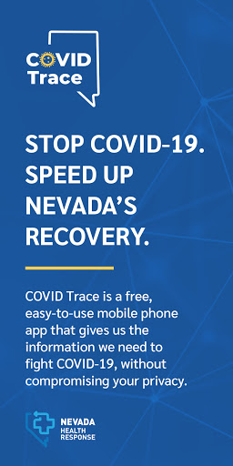
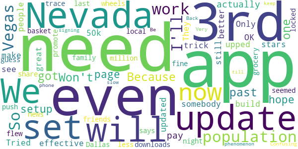
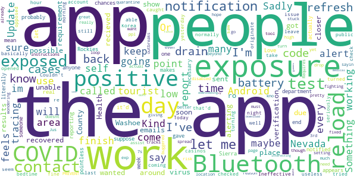

# Covid Trace Nevada
App version ``1.2.13``

Analyzed with [covid-apps-observer](http://github.com/covid-apps-observer) project, version ``0.1``

## App overview
| | |
|-------------------------|-------------------------| 
| **Name**                                          | Covid Trace Nevada |
| **Unique identifier** | gov.nv.dhhs.en |
| **Link to Google Play** | [https://play.google.com/store/apps/details?id=gov.nv.dhhs.en](https://play.google.com/store/apps/details?id=gov.nv.dhhs.en) |
| **Summary**  | Stay safe. Protect each other. Stay private. |
| **Privacy policy** | [https://covidtrace.com/nct_privacy_policy.pdf](https://covidtrace.com/nct_privacy_policy.pdf) |
| **Latest version** | 1.2.13 |
| **Last update** | 2020-11-15 03:56:47 |
| **Recent changes** | - Better detection of settings that would prevent exposure notifications - Bug fixes |
| **Installs**  | 50,000+ |
| **Category** | Medical |
| **First release** | Aug 22, 2020 |
| **Size**  | 52M |
| **Supported Android version**  | 7.0 and up |

### Description
> Nevada's Department of Health and Human Services (DHHS) COVID Trace app helps reduce the spread of coronavirus in Nevada helping everyone stay safe. COVID Trace doesn’t require personal information helping protect your privacy.

### User interface
The developers of the app provide the following screenshots in the Google play store.
| | | |
|:-------------------------:|:-------------------------:|:-------------------------:|
 |   |   |   | 
 |   |  

## Development team
In the following we report the main information provided by the development team in the Google play store.

| | |
|-------------------------|-------------------------|
| **Developer**  | Nevada Division of Public and Behavioral Health |
| **Website**  | [http://dpbh.nv.gov/](http://dpbh.nv.gov/) |
| **Email** | help@covidtrace.com |
| **Physical address**  | - |
| **Other developed apps**  | [https://play.google.com/store/apps/developer?id=Nevada+Division+of+Public+and+Behavioral+Health](https://play.google.com/store/apps/developer?id=Nevada+Division+of+Public+and+Behavioral+Health) |

## Android support

| | |
|-------------------------|-------------------------|
| **Declared target Android version**  | Pie, version 9 (API level 28) |
| **Effective target Android version**  | Pie, version 9 (API level 28) |
| **Minimum supported Android version**  | Nougat, version 7.0 (API level 24) |
| **Maximum target Android version**  | - |

The larger the difference between the minimum and maximum supported Android versions, the better. A larger difference means a wider audience. For example, old phones have a very low Android version, so a high minimum supported Android version means that the app cannot be used by users with old phones, thus leading to accessibility problems. 

## Requested permissions

In the following we report the complete list of the permissions requested by the app. 

| **Permission** | **Protection level** | **Description** | 
|-------------------------|-------------------------|-------------------------|
 **android.permission ACCESS_NETWORK_STATE** | Normal | Allows applications to access information about networks. 
 **android.permission BLUETOOTH** | Normal | Allows applications to connect to paired bluetooth devices. 
 **android.permission GET_TASKS** | Deprecated | This constant was deprecated in API level 21. No longer enforced. 
 **android.permission INTERNET** | Normal | Allows applications to open network sockets. 
 **android.permission RECEIVE_BOOT_COMPLETED** | Normal | Allows an application to receive the Intent.ACTION_BOOT_COMPLETED that is broadcast after the system finishes booting. 
 **android.permission WAKE_LOCK** | Normal | Allows using PowerManager WakeLocks to keep processor from sleeping or screen from dimming. 

## Mentioned servers

| **Server** | **Registrant** | **Registrant country** | **Creation date** | 
|-------------------------|-------------------------|-------------------------|-------------------------|
 | google.com | Google LLC | :us: US | 1997-09-15 04:00:00 |
 | xmlpull.org | WhoisGuard, Inc. | PA | 2001-11-26 20:33:08 |
 | w3.org | W3C | :us: US | 1994-07-06 04:00:00 |
 | googleapis.com | Google LLC | :us: US | 2005-01-25 17:52:26 |

## Security analysis 

Below we report the main security warnings raised by our execution of the [Androwarn](https://github.com/maaaaz/androwarn) security analysis tool.

**Connection interfaces exfiltration**
> - This application reads details about the currently active data network 
> - This application tries to find out if the currently active data network is metered 

**Pim data leakage**
> - This application accesses data stored in the clipboard 

**Code execution**
> - This application loads a native library: 'flutter' 

## User ratings and reviews

Below we provide information about how end users are reacting to the app in terms of ratings and reviews in the Google Play store.

### Ratings

The Covid Trace Nevada app has been installed by more than **50000** times. At this time, **163** rated the app and its average score is **3.19**. Below we show the distribution of the ratings across the usual star-based rating of Google Play

:star::star::star::star::star:: 66

:star::star::star::star:: 18

:star::star::star:: 16

:star::star:: 9

:star:: 54

### Reviews 

#### 5-star reviews

> Excellent.  :date: __2021-01-28 19:14:09__

> It work good tho  :date: __2021-01-17 09:05:15__

> Safe and fast good for elderly And frontliners protections  :date: __2021-01-09 20:29:53__

> So far, not a problem.  :date: __2021-01-09 07:05:36__

> Yayyy am NEGATIVE  :date: __2021-01-06 05:55:39__

> Good morning, is good for me to protect myself. Thank you  :date: __2020-12-24 09:27:50__

> I love the idea. It doesn't interfere with anything on my device, either.  :date: __2020-12-19 19:47:28__

> Works great as long as you have your Bluetooth is on.  :date: __2020-12-02 01:00:52__

> Wish more people would add this app  :date: __2020-12-01 01:40:43__

> Kool app to have...We must keep track of the Zombie Apocalypse Virus... Thanks  :date: __2020-11-25 20:47:00__

#### 4-star reviews

> It's great, just more people need to get the app to make it even better and more effective. Only 50k downloads. Nevada as a population of over 3 million. So less than 2% of the population have the app... We need to share it with family & friends, and our local news needs to promote it.  :date: __2020-12-17 11:00:41__

> It seemed to work fine while I was in Vegas but I flew to Dallas last night and now it says the trace app is off and I can't push the grocery basket any further! The wheels locked up so I guess it's just a Vegas phenomenon? "I'll Be Back!" I'll keep it on my phone till then.  :date: __2020-12-02 23:17:41__

> Very slow in signing on. Confusing too.  :date: __2020-08-26 18:50:32__

#### 3-star reviews

> I wanted to alert people about possible exposure to Covid as soon as I recieved my positive results but was unable to due to the verification code requirement. I called all over the place and sent out emails and got no closer ro alerting people until 6 days after my positive test when the Washoe County Health department called for contact tracing and gave me the code. So it appears that the app works but you probably won't be notified about exposures for about a week after someone tests positive  :date: __2021-01-06 19:15:25__

> Love this app  :date: __2020-12-07 12:52:21__

> Kind of a pointless app when after your test positive literally no one that contacts you knows the code necessary to self report.  :date: __2020-11-28 05:05:47__

> I mean, sure, I suppose it'd work, but let's be real. The chances of anyone between the Sierra Nevada and the Rockies actually self-reporting is kind of on the low end. This makes the app basically useless. Something like it in Korea, that'd work fine, since they take contact tracing seriously  :date: __2020-11-27 00:02:59__

> Couldn't reload app to get time and day to reload.  :date: __2020-11-22 19:27:23__

> "Reload" Ineffective It's 08:00, and I have been out in public for an hour, but it last checked exposures at 3:15 yesterday. I do not normally leave Bluetooth on, so I have been turning off my Bluetooth at bedtime at night, and back on in the morning. Today I turned it back on before 06:00, and have tried to "reload" but it still won't re-check. I saw some others with the same issue; maybe it's Android, maybe it's Bluetooth but doesn't seem to work well.  :date: __2020-11-13 17:08:05__

> Sadly, most of the cases in Nevada originate from tourists. That's why there were so few cases before the casinos opened back up. They won't have this app so it's only able to account for the people who come in contact with people who caught it working in tourist areas. Sadly, people keep coming here as opposed to going into quarantine when they test positive.  :date: __2020-10-30 20:17:35__

> Update: Its fixed. I hope people use this as a great tool to assist 7s in fighting COVID-19. The app will not let me go beyond the 3rd page. It doesnt work. My bluetooth and location are on. The "exposure notification" will not let me turn it on as it says "I need to finish setting up the app" others instructions say the "exposure notification" must be on to finish the app. ????? I am stuck in a loop.  :date: __2020-10-25 18:30:48__

> Requires having Bluetooth on at all times which drains my battery. It also keeps giving me drop down notifications even though I disabled notifications. I have an android.  :date: __2020-10-22 17:34:36__

> No exp. yet- just wondering- if u really want to PREVENT the spread of covid, wouldn't it be better to come up with an app that tracks actual outbreaks/cases, then alert ppl? Or, if I'm going into a high risk area. Let me kno? I'm pretty much buggered if I've already been exposed. Jus sayin  :date: __2020-10-14 05:27:02__

#### 2-star reviews

> Absolutely useless if you don't have a specific 8 digit code to confirm the test results. The lab my husband got tested at used code numbers longer than 8 digits. When his test came back positive, there was no way to report it to this app. I don't know if this app is limited to NV Health dept tests or what.  :date: __2020-12-26 06:15:07__

> I now understand why I never got an alert even though I live in a hotspot. I tested positive and tried to notify, but it requires a diagnosis code that is never given. There is no workaround, so no way it can be activated.  :date: __2020-12-24 20:14:33__

> Don't know whether this thing really works or not  :date: __2020-12-12 04:51:42__

> I feel this is just to make profit when you download this app, i downloaded few weeks back a week later some one closed to me came out positive to the virus and i didn't get the alert i have known people that have use this app but seems noone gets an alert  :date: __2020-12-02 06:58:48__

> You state to download the DHHS tracing app but when pne opens the google store, there are dozens of apps listed, none of which say DHHS, so what good is that if I cant be traced?  :date: __2020-12-01 21:13:57__

> Good idea poorly executed  :date: __2020-11-25 23:37:24__

> Downloaded the app about two weeks ago worked fine, I assume the first couple days. Now it will never reload information (it has a little time last updated at the top) it's been stuck at the same time no matter what I do. I like the idea of this but it's basically an app that is a website with tracking permissions. All the clickable stuff in the app just take you to a webpage through your internet app.  :date: __2020-11-16 04:27:04__

> Due to the reviews, I have decided to not waste my time and efforts on this app. I'll continue to watch the news reports online of where the hot spots are and continue to be safe as possible. The idea of this app was good; however, it is only as good as the data that is inputted and shared to others. If there's a breakdown in getting the data into the app and out to everyone else, then it doesn't matter how great your app was stuctured.  :date: __2020-11-10 22:58:00__

> Won't refresh anymore making it useless  :date: __2020-10-30 02:53:20__

> Hard to find what i need  :date: __2020-10-29 01:58:43__

#### 1-star reviews

> Covid is the biggest scam ever perpetuated against the human race. It's being used as an excuse to usher in an era of complete and total government control where the rich own everything and you own nothing and have no rights. WAKE UP BEFORE IT'S TOO LATE!!!  :date: __2021-01-29 02:51:23__

> App is totally worthless  :date: __2021-01-13 18:46:30__

> Says no exposure even though I was exposed. App is pointless.  :date: __2021-01-10 16:25:27__

> I thought this app would help keep me and my family safe. It was a lie. I hate you Google because now my grandmother is dying from Covid-19 and you never alerted any of us about exposure to anyone! How many alerts did you even send out? Let's see them change your name from Google to grandmother and grandpa killer  :date: __2021-01-06 08:18:41__

> User cannot report a positive result without a magic code that nobody can find. Useless.  :date: __2020-12-30 19:28:55__

> My roommate tested positive and I never received an alert even when he gave my phone number so I could be officially notified. Even now as I tested positive the app still swears I haven't been near any infected person.  :date: __2020-12-29 19:26:24__

> Downloaded this app immediately when it became available. It was a great concept, if it worked. But it never did. Never got one report of proximity to infected person (even though I was), doesn't refresh most of the time, and drains the battery because you have to keep the Bluetooth on. I'm uninstalling it because it's just taking up valuable storage space and battery usage. So disappointed.  :date: __2020-12-28 02:50:14__

> When I downloaded the App I assumed it would notify me of exposures. It never did. The App does not update and no matter where I go store, mall, movies, etc it doesn't connect or work. There is a serious flaw.  :date: __2020-12-26 09:43:12__

> Rated dead last in best coronavirus detection app in america. Ironic since nevada has the 2nd highest cases (infected & death) in the nation. 🤔 You'd think we'd take this more seriously.  :date: __2020-12-21 23:56:23__

> It requires a Verification Code to report you are Positive. The UMCconnect has no idea how to give me a Verification code after they told me I am positive. The app is useless, you can't report you have Covid. It was another huge Democrat money wasting pork belly project  :date: __2020-12-18 20:49:57__

