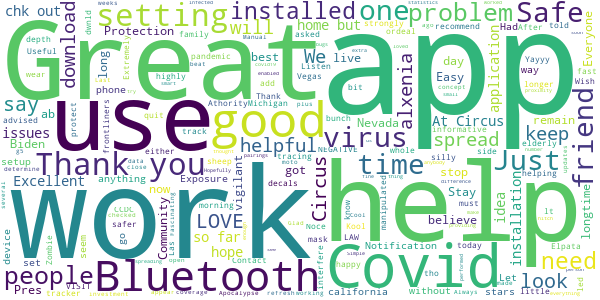

# Covid Trace Nevada
App version ``1.2.13``

Analyzed with [covid-apps-observer](http://github.com/covid-apps-observer) project, version ``0.1``

## App overview
| | |
|-------------------------|-------------------------| 
| **Name**                                          | Covid Trace Nevada |
| **Unique identifier** | gov.nv.dhhs.en |
| **Link to Google Play** | [https://play.google.com/store/apps/details?id=gov.nv.dhhs.en](https://play.google.com/store/apps/details?id=gov.nv.dhhs.en) |
| **Summary**  | Stay safe. Protect each other. Stay private. |
| **Privacy policy** | [https://covidtrace.com/nct_privacy_policy.pdf](https://covidtrace.com/nct_privacy_policy.pdf) |
| **Latest version** | 1.2.13 |
| **Last update** | 2020-11-15 03:56:47 |
| **Recent changes** | - Better detection of settings that would prevent exposure notifications - Bug fixes |
| **Installs**  | 50,000+ |
| **Category** | Medical |
| **First release** | Aug 22, 2020 |
| **Size**  | 52M |
| **Supported Android version**  | 7.0 and up |

### Description
> Nevada's Department of Health and Human Services (DHHS) COVID Trace app helps reduce the spread of coronavirus in Nevada helping everyone stay safe. COVID Trace doesn’t require personal information helping protect your privacy.

### User interface
The developers of the app provide the following screenshots in the Google play store.
| | | |
|:-------------------------:|:-------------------------:|:-------------------------:|
 |   |   |   | 
 |   |  

## Development team
In the following we report the main information provided by the development team in the Google play store.

| | |
|-------------------------|-------------------------|
| **Developer**  | Nevada Division of Public and Behavioral Health |
| **Website**  | [http://dpbh.nv.gov/](http://dpbh.nv.gov/) |
| **Email** | help@covidtrace.com |
| **Physical address**  | - |
| **Other developed apps**  | [https://play.google.com/store/apps/developer?id=Nevada+Division+of+Public+and+Behavioral+Health](https://play.google.com/store/apps/developer?id=Nevada+Division+of+Public+and+Behavioral+Health) |

## Android support

| | |
|-------------------------|-------------------------|
| **Declared target Android version**  | Pie, version 9 (API level 28) |
| **Effective target Android version**  | Pie, version 9 (API level 28) |
| **Minimum supported Android version**  | Nougat, version 7.0 (API level 24) |
| **Maximum target Android version**  | - |

The larger the difference between the minimum and maximum supported Android versions, the better. A larger difference means a wider audience. For example, old phones have a very low Android version, so a high minimum supported Android version means that the app cannot be used by users with old phones, thus leading to accessibility problems. 

## Requested permissions

In the following we report the complete list of the permissions requested by the app. 

| **Permission** | **Protection level** | **Description** | 
|-------------------------|-------------------------|-------------------------|
 **android.permission ACCESS_NETWORK_STATE** | Normal | Allows applications to access information about networks. 
 **android.permission BLUETOOTH** | Normal | Allows applications to connect to paired bluetooth devices. 
 **android.permission GET_TASKS** | Deprecated | This constant was deprecated in API level 21. No longer enforced. 
 **android.permission INTERNET** | Normal | Allows applications to open network sockets. 
 **android.permission RECEIVE_BOOT_COMPLETED** | Normal | Allows an application to receive the Intent.ACTION_BOOT_COMPLETED that is broadcast after the system finishes booting. 
 **android.permission WAKE_LOCK** | Normal | Allows using PowerManager WakeLocks to keep processor from sleeping or screen from dimming. 

## Mentioned servers

| **Server** | **Registrant** | **Registrant country** | **Creation date** | 
|-------------------------|-------------------------|-------------------------|-------------------------|
 | google.com | Google LLC | :us: US | 1997-09-15 04:00:00 |
 | xmlpull.org | WhoisGuard, Inc. | PA | 2001-11-26 20:33:08 |
 | w3.org | W3C | :us: US | 1994-07-06 04:00:00 |
 | googleapis.com | Google LLC | :us: US | 2005-01-25 17:52:26 |

## Security analysis 

Below we report the main security warnings raised by our execution of the [Androwarn](https://github.com/maaaaz/androwarn) security analysis tool.

**Connection interfaces exfiltration**
> - This application reads details about the currently active data network 
> - This application tries to find out if the currently active data network is metered 

**Pim data leakage**
> - This application accesses data stored in the clipboard 

**Code execution**
> - This application loads a native library: 'flutter' 

## User ratings and reviews

Below we provide information about how end users are reacting to the app in terms of ratings and reviews in the Google Play store.

### Ratings

The Covid Trace Nevada app has been installed by more than **50000** times. At this time, **163** rated the app and its average score is **3.19**. Below we show the distribution of the ratings across the usual star-based rating of Google Play

:star::star::star::star::star:: 66

:star::star::star::star:: 18

:star::star::star:: 16

:star::star:: 9

:star:: 54

### Reviews 

#### 5-star reviews

> Doesn't appear to work. Last checked time is the time of day of when I installed it several weeks ago. Manual refresh doesn't do anything.  :date: __2020-11-20 15:23:25__

> Cool  :date: __2020-11-18 08:06:02__

> Works as it should for moto g5 plus. Glad the investment was made for this  :date: __2020-11-11 00:26:27__

> Always updates when open, no issues.  :date: __2020-11-06 06:12:51__

> We need everyone to get this to beat Covid.  :date: __2020-10-31 09:29:23__

> Thank you Stay Safe  :date: __2020-10-31 05:22:45__

> Excellent coverage  :date: __2020-10-16 08:32:35__

> Seems to be working now. Fascinating concept. It uses bluetooth data to determine if you have been in close proximity to an infected person.  :date: __2020-10-16 00:05:20__

> Just installed it without a hitch. Let's hope that enough people use it to make a difference.  :date: __2020-10-14 19:33:22__

> good  :date: __2020-10-14 02:27:36__

#### 4-star reviews

> Very slow in signing on. Confusing too.  :date: __2020-08-26 18:50:32__

#### 3-star reviews

> Couldn't reload app to get time and day to reload.  :date: __2020-11-22 19:27:23__

> "Reload" Ineffective It's 08:00, and I have been out in public for an hour, but it last checked exposures at 3:15 yesterday. I do not normally leave Bluetooth on, so I have been turning off my Bluetooth at bedtime at night, and back on in the morning. Today I turned it back on before 06:00, and have tried to "reload" but it still won't re-check. I saw some others with the same issue; maybe it's Android, maybe it's Bluetooth but doesn't seem to work well.  :date: __2020-11-13 17:08:05__

> Sadly, most of the cases in Nevada originate from tourists. That's why there were so few cases before the casinos opened back up. They won't have this app so it's only able to account for the people who come in contact with people who caught it working in tourist areas. Sadly, people keep coming here as opposed to going into quarantine when they test positive.  :date: __2020-10-30 20:17:35__

> Update: Its fixed. I hope people use this as a great tool to assist 7s in fighting COVID-19. The app will not let me go beyond the 3rd page. It doesnt work. My bluetooth and location are on. The "exposure notification" will not let me turn it on as it says "I need to finish setting up the app" others instructions say the "exposure notification" must be on to finish the app. ????? I am stuck in a loop.  :date: __2020-10-25 18:30:48__

> Requires having Bluetooth on at all times which drains my battery. It also keeps giving me drop down notifications even though I disabled notifications. I have an android.  :date: __2020-10-22 17:34:36__

> No exp. yet- just wondering- if u really want to PREVENT the spread of covid, wouldn't it be better to come up with an app that tracks actual outbreaks/cases, then alert ppl? Or, if I'm going into a high risk area. Let me kno? I'm pretty much buggered if I've already been exposed. Jus sayin  :date: __2020-10-14 05:27:02__

> the only reason im downloading this is because it wont let me download some other games  :date: __2020-10-02 23:20:13__

> Won't even get past the 3rd setup page....I hope Nevada did not actually pay somebody to build this. Tried again after update ..still will not set up....3rd update did the trick. set up OK ..upped to 3 stars. We will see.  :date: __2020-09-30 11:15:50__

> Drains your battery! I dont like to have my bluetooth on all day. I am in the medical field and am exposed to know's what, so oy would be interesting to see if i am exposed at work. Just wished it didn't drain my battery  :date: __2020-08-31 17:45:38__

> This app is such an awesome start. It has never updated exposure on it's own. I have to refresh it every time. I have gone a day with no auto updates like it said it would, so I just refresh at least once a day. I wish it showed how many ids you have encountered or something cause it feels like the app isn't doing anything. It would be nice to know that it has read # nearby users and is now checking that many every refresh. It kinda feels like just an info about covid app, not a tracker.  :date: __2020-08-30 19:31:12__

#### 2-star reviews

> Downloaded the app about two weeks ago worked fine, I assume the first couple days. Now it will never reload information (it has a little time last updated at the top) it's been stuck at the same time no matter what I do. I like the idea of this but it's basically an app that is a website with tracking permissions. All the clickable stuff in the app just take you to a webpage through your internet app.  :date: __2020-11-16 04:27:04__

> Due to the reviews, I have decided to not waste my time and efforts on this app. I'll continue to watch the news reports online of where the hot spots are and continue to be safe as possible. The idea of this app was good; however, it is only as good as the data that is inputted and shared to others. If there's a breakdown in getting the data into the app and out to everyone else, then it doesn't matter how great your app was stuctured.  :date: __2020-11-10 22:58:00__

> Won't refresh anymore making it useless  :date: __2020-10-30 02:53:20__

> Hard to find what i need  :date: __2020-10-29 01:58:43__

> Have the latest updates, yet asks me to update further. Click the link to do so > infinite load screen. Much needed app, needs some fixes.  :date: __2020-09-24 08:51:36__

> Needs work, won't refresh!  :date: __2020-09-18 02:17:18__

> DOES NOT AUTO UPDATE.  :date: __2020-09-07 14:37:16__

> I installed this app on 8/30/2020. Location and BlueTooth are on. Exposure notifications are on. I received on Exposure Notification on 8/30/2020 at 12:20pm saying No Exposure Found in the last hour. As of 8/31/2020, 12:01pm I have not received any other exposure notices. Even after one hour in the gym. 1) Why isn't this running/working? and 2)How do I manually check for exposures? 3)How frequently should I get exposures? Using a Samsung Note 8, android. Installation seemed to go just fine. Sending question to help email noted below. I very much would like to see this app be successful!  :date: __2020-08-31 21:09:02__

> This doesn't work, the app itself looks/seems/feels like a toy or fake, won't even show in the google play search, I had to find the website first then use the link to get to the app and in my girlfriend phone wont pass from the 3rd page "next" Samsung A20, and in my Samsung gs8 the loading update it's "meh".  :date: __2020-08-27 04:14:38__

> I love this idea! But... It only shows that the last check was 15 hours ago. One check is all it has done. What good is that? For those stuck on 3rd page, slide the slider in middle of the page as instructions say.  :date: __2020-08-25 16:09:15__

#### 1-star reviews

> "Those who would give up essential Liberty, to purchase a little temporary Safety, deserve neither Liberty nor Safety." -Benjamin Franklin  :date: __2020-11-21 14:57:41__

> I tested positive for coronavirus 2 minutes after downloading. Stay far away.  :date: __2020-11-18 01:21:06__

> You should improving this app it doesn't refresh I need Uninstaller and install every time:(  :date: __2020-11-17 03:15:22__

> Tracking app... Is someone marks as being exposed they can find u. I already had it. No thank you.  :date: __2020-11-16 21:47:22__

> "it's just an app", they said. "Just turn on your Bluetooth", they said. "It's just to help the public be proactive", they said. Let's just give the government the easy access to more areas of our lives. "No cash here, only credit or debit", they said. No anonymity anymore. Before you know it, we will all have barcodes printed on our foreheads you mindless dweebs.  :date: __2020-11-16 10:11:49__

> Great idea but won't reload.  :date: __2020-11-15 10:43:17__

> Tells me it's installed but doesn't open. Doesn't show in my phone  :date: __2020-11-14 16:46:45__

> This app is a joke. Doesn't update, have never received a notification. Blue tooth is on, etc. Etc. App is worthless. Was hoping it would be great but highly disappointed.  :date: __2020-11-13 16:22:36__

> App doesn't work. I went around 2 people today that I KNOW FOR A FACT both tested positive and this app did not notify me at all and says I'm still not at risk. Uninstalling this fakeness.  :date: __2020-11-13 06:07:29__

> F\*\*king stupid app. Like I'm going to download something the government approved. All you sheep are morons  :date: __2020-11-12 21:22:02__

