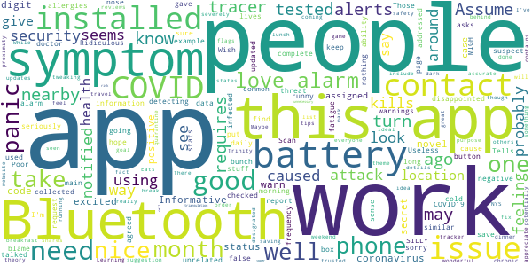

# COVID Alert NY
App version ``1.0.2``

Analyzed with [covid-apps-observer](http://github.com/covid-apps-observer) project, version ``0.1``

## App overview
| | |
|-------------------------|-------------------------| 
| **Name**                                          | COVID Alert NY |
| **Unique identifier** | gov.ny.health.proximity |
| **Link to Google Play** | [https://play.google.com/store/apps/details?id=gov.ny.health.proximity](https://play.google.com/store/apps/details?id=gov.ny.health.proximity) |
| **Summary**  | Stop COVID Spread in NY |
| **Privacy policy** | [https://apps.health.ny.gov/public/covidsmartprivacy.html](https://apps.health.ny.gov/public/covidsmartprivacy.html) |
| **Latest version** | 1.0.2 |
| **Last update** | 2020-10-05 18:58:36 |
| **Recent changes** | Help protect your fellow NYers from COVID-19! In complete privacy and without knowing who you are, this app warns you if someone near you tested positive for COVID-19. |
| **Installs**  | 100,000+ |
| **Category** | Health & Fitness |
| **First release** | Sep 24, 2020 |
| **Size**  | 108M |
| **Supported Android version**  | 6.0 and up |

### Description
> This is the official app of New York State, run by the NYS Department of Health as part of New York State’s comprehensive COVID-19 testing and contact tracing effort. The ultimate goal is to help reduce the spread of COVID-19 by:
 1. Alerting you if a sick person spends 10 mins or more within 6 feet of you, because this puts you at a higher risk of SARS CoV-2 infection, which causes COVID-19. 
 2. Encouraging you to contribute to the health and safety of your friends, family and community by alerting others if you test positive, WITHOUT REVEALING YOUR IDENTITY TO ANYONE!
 3. Getting you important resources and help if you are exposed or test positive. You can call the COVID Alert NY Hotline or find helpful links to resources on next steps to protect your loved ones.
 4. Keep a private log of your own symptoms which can help your health care provider and public health representatives determine next steps.
 The app leverages a completely private and secure Bluetooth-based technology that Apple and Google developed. The app’s source code is available to the public and has been vetted extensively by privacy and security experts. We never see your location or identity, and no information on the use of this app can be traced back to you. 
 Help us Stop the Spread of COVID-19 in New York.. Share this app with your friends and family so we can all be safer, together.

### User interface
The developers of the app provide the following screenshots in the Google play store.
| | | |
|:-------------------------:|:-------------------------:|:-------------------------:|
 |   |   |   | 
 |   |  

## Development team
In the following we report the main information provided by the development team in the Google play store.

| | |
|-------------------------|-------------------------|
| **Developer**  | New York State Department of Health |
| **Website**  | [https://covidalertny.health.ny.gov/](https://covidalertny.health.ny.gov/) |
| **Email** | covidalertny@health.ny.gov |
| **Physical address**  | - |
| **Other developed apps**  | [https://play.google.com/store/apps/developer?id=New+York+State+Department+of+Health](https://play.google.com/store/apps/developer?id=New+York+State+Department+of+Health) |

## Android support

| | |
|-------------------------|-------------------------|
| **Declared target Android version**  | Android10, version 10 (API level 29) |
| **Effective target Android version**  | Android10, version 10 (API level 29) |
| **Minimum supported Android version**  | Marshmallow, version 6.0 (API level 23) |
| **Maximum target Android version**  | - |

The larger the difference between the minimum and maximum supported Android versions, the better. A larger difference means a wider audience. For example, old phones have a very low Android version, so a high minimum supported Android version means that the app cannot be used by users with old phones, thus leading to accessibility problems. 

## Requested permissions

In the following we report the complete list of the permissions requested by the app. 

| **Permission** | **Protection level** | **Description** | 
|-------------------------|-------------------------|-------------------------|
 **android.permission ACCESS_NETWORK_STATE** | Normal | Allows applications to access information about networks. 
 **android.permission ACCESS_WIFI_STATE** | Normal | Allows applications to access information about Wi-Fi networks. 
 **android.permission BLUETOOTH** | Normal | Allows applications to connect to paired bluetooth devices. 
 **android.permission INTERNET** | Normal | Allows applications to open network sockets. 
 **android.permission RECEIVE_BOOT_COMPLETED** | Normal | Allows an application to receive the Intent.ACTION_BOOT_COMPLETED that is broadcast after the system finishes booting. 
 **com.google.android.finsky.permission BIND_GET_INSTALL_REFERRER_SERVICE** | - | - 

## Mentioned servers

| **Server** | **Registrant** | **Registrant country** | **Creation date** | 
|-------------------------|-------------------------|-------------------------|-------------------------|
 | android.com | Google LLC | :us: US | 1997-06-23 04:00:00 |
 | google.com | Google LLC | :us: US | 1997-09-15 04:00:00 |
 | app-measurement.com | Google LLC | :us: US | 2015-06-19 20:13:31 |
 | googlesyndication.com | Google LLC | :us: US | 2003-01-21 06:17:24 |
 | expo.io | See PrivacyGuardian.org | :us: US | 2011-05-01 21:26:50 |
 | crashlytics.com | Google LLC | :us: US | 2011-01-21 15:30:40 |
 | googleapis.com | Google LLC | :us: US | 2005-01-25 17:52:26 |
 | googleadservices.com | Google LLC | :us: US | 2003-06-19 16:34:53 |

## Security analysis 

Below we report the main security warnings raised by our execution of the [Androwarn](https://github.com/maaaaz/androwarn) security analysis tool.

**Telephony identifiers leakage**
> - This application reads the numeric name (MCC+MNC) of current registered operator 
> - This application reads the operator name 
> - This application reads the phone number string for line 1, for example, the MSISDN for a GSM phone 

**Location lookup**
> - This application reads location information from all available providers (WiFi, GPS etc.) 

**Connection interfaces exfiltration**
> - This application reads details about the currently active data network 
> - This application tries to find out if the currently active data network is metered 

**Suspicious connection establishment**
> - This application opens a Socket and connects it to the remote address ' returned no addresses for  ; port is out of range' on the 'N/A' port  
> - This application opens a Socket and connects it to the remote address '' on the 'N/A' port  
> - This application opens a Socket and connects it to the remote address 'Ljava/lang/StringBuilder;->toString()Ljava/lang/String;' on the 'N/A' port  
> - This application opens a Socket and connects it to the remote address 'Ljava/net/Proxy;->type()Ljava/net/Proxy$Type;' on the 'N/A' port  
> - This application opens a Socket and connects it to the remote address 'timeout' on the 'N/A' port  

**Pim data leakage**
> - This application accesses data stored in the clipboard 

**Code execution**
> - This application loads a native library 
> - This application loads a native library: 'crashlytics' 
> - This application executes a UNIX command 

## User ratings and reviews

Below we provide information about how end users are reacting to the app in terms of ratings and reviews in the Google Play store.

### Ratings

The COVID Alert NY app has been installed by more than **100000** times. At this time, **952** rated the app and its average score is **4.2843137**. Below we show the distribution of the ratings across the usual star-based rating of Google Play

:star::star::star::star::star:: 636

:star::star::star::star:: 149

:star::star::star:: 65

:star::star:: 9

:star:: 93

### Reviews 

#### 5-star reviews

> IF YOU WANT PEACE OF MIND INSTALL THIS APP ASAP !!!  :date: __2020-11-29 03:49:08__

> I love this app this is goku sama#0329 on discord  :date: __2020-11-28 23:20:34__

> Noninvasive and there if I need reference.  :date: __2020-11-26 22:36:07__

> I just downloaded this out very interesting. which is app does it will tell you if you've been in contact with somebody with covid-19 through a certain type of code they won't identify you but they will let you know they won't Mark you but they'll let you know period why is it that our system can't just test everybody and eliminate all this in between nonsense. You're wasting your time people are not going to be truthful. And touch base with the health department. I found you very interesting  :date: __2020-11-26 12:47:14__

> Cuomo Family. It's time love  :date: __2020-11-23 05:21:36__

> Simple, Easy, and Fast. The "Covid Alert NY" app is simply fantastic. I've been using the app for over 2 months now and I don't have any complaints with the app. This app will notify me if I come into contact with anyone who has tested positive for Coronavirus. Another great aspect of the app is it gives me up-to-date information on all positve and negtive Covid-19 test in New York State. The app breaks down the data for the whole state and also shows you your Local County data too. 5 Star app.  :date: __2020-11-21 22:42:53__

> Exellent information goes to the point  :date: __2020-11-19 01:34:11__

> gode  :date: __2020-11-16 18:26:35__

> The tech is solid. The protocol is solid. The privacy and security is hardened. Now we just need adoption. Install and share. Now's the time.  :date: __2020-11-15 15:57:25__

> There is no reason why you shouldn't have this app. It's the least you could do  :date: __2020-11-15 13:43:55__

#### 4-star reviews

> Greatest  :date: __2020-11-26 16:58:01__

> Sounds like a good idea but I really don't know how it works, haven't been getting out much, so I haven't had no alert yet! thank God  :date: __2020-11-25 21:36:48__

> It's alright. But it kills my battery quickly in I have the bluetooth enabled, and ot begs you to have it enabled.  :date: __2020-11-21 05:01:19__

> Dont no what its doing but cases are getting worse 🙃  :date: __2020-11-19 23:13:03__

> Not yet. Just installed the apps.  :date: __2020-11-19 11:18:17__

> So sad  :date: __2020-11-17 03:04:54__

> Good  :date: __2020-11-10 06:11:29__

> Good so far  :date: __2020-11-09 16:24:50__

> A very important App for information on COVID-19 in Westchester, NY. Whenever local statics is added to the App, it will earn 5 stars  :date: __2020-11-08 22:05:11__

> Great app i just turn on bluetooth in crowded areas ,car and when I meet people battery life saver  :date: __2020-11-02 16:07:59__

#### 3-star reviews

> Informative  :date: __2020-11-29 13:29:52__

> I installed this app 3 months ago and tested positive for the novel coronavirus 1 month ago. I was excited to warn nearby contacts of my status from the app, but doing so requires a secret 6-digit code and the contact tracer who was assigned to my case did not know what it was. I was so disappointed. My phone had collected 2 months of data about nearby contacts, but this information could not be used to save lives. I don't blame the contact tracer, but I hope this issue can be addressed.  :date: __2020-11-17 21:19:31__

> Assume this app works, but haven't had any alerts. Also the symptoms are similar to common cold and allergies so that may cause alarm to people.  :date: __2020-11-15 16:15:08__

> It's not detecting my Bluetooth.  :date: __2020-11-12 20:43:55__

> Wish this had an "I tested negative" button for people with symptoms that turn out to be unrelated. Also, I suspect this gives a false sense of security--the main threat is people who don't take this seriously. Those people aren't using this app.  :date: __2020-11-05 06:37:55__

> Tells you that you may have covid if you report one symptom. Useless.  :date: __2020-11-05 05:28:25__

> Not sure it works  :date: __2020-11-01 14:37:14__

> Good probably, but SILLY. it asks how you're feeling, and when I checked the box for a runny nose it gave me a "sorry you're not feeling well" page, complete with "could be COVID19" warnings. Ridiculous.  :date: __2020-10-31 00:45:24__

> I assume it does what it says it does, but it's also caused panic in a bunch of people I know because for example I put in fatigue this morning and it was like YOU MIGHT HAVE COVID. And that caused a panic attack. I'm going to keep it installed so that I can be notified and stuff, but I talked to my doctor and he agreed that I shouldn't look at it so that I don't have daily panic attacks over what's probably nothing.  :date: __2020-10-25 15:02:09__

> Poor updated stats. No ability to request or to see Scan frequency.  :date: __2020-10-23 21:19:09__

#### 2-star reviews

> Two stars because: It is a shame that only just over 100k people have downloaded this app in a city of 8.4 million and a state of 12 million. Given zero privacy issues detected or reported, this app should be suggested via text messages all the time. This is a public health problem everyone should help in all possible ways.  :date: __2020-11-22 18:32:18__

> Does not give accurate numbers if total infected in some counties. Numbers are often misleading.  :date: __2020-11-08 22:56:07__

> More work on the app is needed. Despite enabling Bluetooth, the app still ask for you to do so; then it hangs. Keep work on it.  :date: __2020-11-08 13:41:49__

> concept is good. alas even with bluetooth on it didn't work. then again most of the people in my neighborhood refuse to get tested (I get tested) and/or aren't tech savvy so this app isn't useful for my neighborhood  :date: __2020-11-07 14:18:38__

> I loved this app, until yesterday when it stopped updating. The person info I have is now for 2 days ago. It's now worthless.  :date: __2020-11-05 12:29:55__

> This app in no way lets u know if you have been in contact with covid  :date: __2020-10-30 18:24:06__

> IMO, this is something which should be done on a national platform, and incorporated into Google, so all smartphone users have this information. Instead, this app is quite large, not moveable to the SD card, and forces you to use Bluetooth more often than is wise... not only for battery life, but vulnerability issues. Also, the "questionnaire" of daily symptoms blows quite the dog whistle, flipping out over a stuffy nose, practically equating it with a positive COVID diagnosis. Too many bugs to be worked out for my liking... sorry. Uninstalled.  :date: __2020-10-20 07:43:45__

> I like the idea of an app like this a lot. It's not that I go out in public often, and being notified of a possible exposure is good. However, on my Pixel 3XL, performance went into the toilet, and the battery drain was insane. Normally, I could listen to YouTube music while working out in my basement and only go down to 85-90% from a full charge. With this installed, it drops to 25-30% in an hour. It also caused recharge times to increase dramatically. Fix that issue, and I will reinstall.  :date: __2020-10-18 13:24:54__

> I would like to keep this app installed but I think it was causing my phone a lot of issues. My phone kept forgetting bluetooth devices until I uninstalled this.  :date: __2020-10-13 14:37:11__

> I'm worried as to its accuracy. I'm still waiting for my COVID-19 results, which I'm expecting since around September 24. I haven't felt sick, but given the high amount of asymptomatic carriers idk how reliable this app would be with so many people out on the streets without any knowledge of being infected due to irresponsible testing measures in the city. And yes, I've tried to call several times. No answer and they keep hanging up the phone.  :date: __2020-10-11 20:07:30__

#### 1-star reviews

> No good you click on your county and shows rate but the rate is not true the news you watch reports other numbers what is the true numbers nobody knows hope by next year after vaccines come out we be back by summer or winter  :date: __2020-11-29 20:03:10__

> 1.No one anywhere around me has this app installed rendering it useless in an orange zone. 2. Seasonal sinus drip reporting and the app says you have covid 19. RUBISH  :date: __2020-11-27 18:33:45__

> I'm abit confused!! 2 Totally different Reviews!! 1 gets 1 Star, The 2nd gets 5 Stars!!  :date: __2020-11-27 13:16:17__

> I like the idea but I says some people test positive for the virus but that got tested and did not test positive see if maby this is a glich I would be nice to be fixed cus I love this thix for making it possible for us all  :date: __2020-11-27 04:09:44__

> Dosen't Work, No Support. I click turn on & nothing happens. Bluetooth is on. NFC on. Uninstalled/reinstalled. Updated my phone. Installed again same problem. I wrote the developer over 4 days ago no response. Only an automated message: thanks for doing your part to stop the spread. SGS9.  :date: __2020-11-27 00:12:16__

> Never worked  :date: __2020-11-26 20:22:04__

> The app seems like it'd be useful, and I really wish I could use it. Unfortunately, it won't let me turn on alerts. No matter how many times I tap the button to turn on alerts, absolutely nothing happens. Disappointing.  :date: __2020-11-26 15:33:36__

> Doea not alert you as advertised. It is useless in preventing or warning  :date: __2020-11-26 00:42:02__

> Cant really use it for now. Bluetooth on and when I try to set it up ,the button for closeness alert won't work. I even uninstalled the app and reinstalled same thing. I really would like to be alerted. Please help. I have emailed also. I will change my rating once the app works for me. Thank you.  :date: __2020-11-25 00:56:57__

> Covid is hoax. This isnt about a virus, this is about control. RESIST BEFORE ITS TOO LATE!!!  :date: __2020-11-21 18:42:01__

