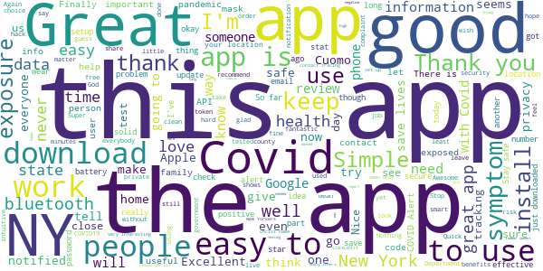
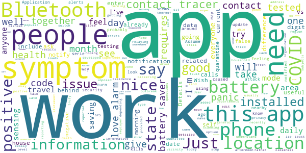
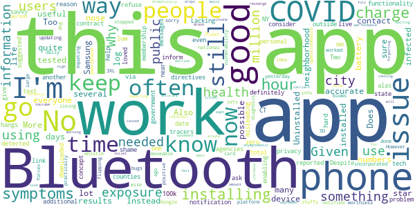

# COVID Alert NY
App version ``1.1.0``

Analyzed with [covid-apps-observer](http://github.com/covid-apps-observer) project, version ``0.1``

## App overview
| | |
|-------------------------|-------------------------| 
| **Name**                                          | COVID Alert NY |
| **Unique identifier** | gov.ny.health.proximity |
| **Link to Google Play** | [https://play.google.com/store/apps/details?id=gov.ny.health.proximity](https://play.google.com/store/apps/details?id=gov.ny.health.proximity) |
| **Summary**  | Stop COVID Spread in NY |
| **Privacy policy** | [https://apps.health.ny.gov/public/covidsmartprivacy.html](https://apps.health.ny.gov/public/covidsmartprivacy.html) |
| **Latest version** | 1.1.0 |
| **Last update** | 2020-11-30 16:21:37 |
| **Recent changes** | Help protect your fellow NYers from COVID-19! In complete privacy and without knowing who you are, this app warns you if someone near you tested positive for COVID-19. |
| **Installs**  | 500,000+ |
| **Category** | Health & Fitness |
| **First release** | Sep 24, 2020 |
| **Size**  | 108M |
| **Supported Android version**  | 6.0 and up |

### Description
> This is the official app of New York State, run by the NYS Department of Health as part of New York State’s comprehensive COVID-19 testing and contact tracing effort. The ultimate goal is to help reduce the spread of COVID-19 by:
 1. Alerting you if a sick person spends 10 mins or more within 6 feet of you, because this puts you at a higher risk of SARS CoV-2 infection, which causes COVID-19. 
 2. Encouraging you to contribute to the health and safety of your friends, family and community by alerting others if you test positive, WITHOUT REVEALING YOUR IDENTITY TO ANYONE!
 3. Getting you important resources and help if you are exposed or test positive. You can call the COVID Alert NY Hotline or find helpful links to resources on next steps to protect your loved ones.
 4. Keep a private log of your own symptoms which can help your health care provider and public health representatives determine next steps.
 The app leverages a completely private and secure Bluetooth-based technology that Apple and Google developed. The app’s source code is available to the public and has been vetted extensively by privacy and security experts. We never see your location or identity, and no information on the use of this app can be traced back to you. 
 Help us Stop the Spread of COVID-19 in New York.. Share this app with your friends and family so we can all be safer, together.

### User interface
The developers of the app provide the following screenshots in the Google play store.
| | | |
|:-------------------------:|:-------------------------:|:-------------------------:|
 |   |   |   | 
 |   |  

## Development team
In the following we report the main information provided by the development team in the Google play store.

| | |
|-------------------------|-------------------------|
| **Developer**  | New York State Department of Health |
| **Website**  | [https://covidalertny.health.ny.gov/](https://covidalertny.health.ny.gov/) |
| **Email** | covidalertny@health.ny.gov |
| **Physical address**  | - |
| **Other developed apps**  | [https://play.google.com/store/apps/developer?id=New+York+State+Department+of+Health](https://play.google.com/store/apps/developer?id=New+York+State+Department+of+Health) |

## Android support

| | |
|-------------------------|-------------------------|
| **Declared target Android version**  | Android10, version 10 (API level 29) |
| **Effective target Android version**  | Android10, version 10 (API level 29) |
| **Minimum supported Android version**  | Marshmallow, version 6.0 (API level 23) |
| **Maximum target Android version**  | - |

The larger the difference between the minimum and maximum supported Android versions, the better. A larger difference means a wider audience. For example, old phones have a very low Android version, so a high minimum supported Android version means that the app cannot be used by users with old phones, thus leading to accessibility problems. 

## Requested permissions

In the following we report the complete list of the permissions requested by the app. 

| **Permission** | **Protection level** | **Description** | 
|-------------------------|-------------------------|-------------------------|
 **android.permission ACCESS_NETWORK_STATE** | Normal | Allows applications to access information about networks. 
 **android.permission ACCESS_WIFI_STATE** | Normal | Allows applications to access information about Wi-Fi networks. 
 **android.permission BLUETOOTH** | Normal | Allows applications to connect to paired bluetooth devices. 
 **android.permission FOREGROUND_SERVICE** | Normal | Allows a regular application to use Service.startForeground. 
 **android.permission INTERNET** | Normal | Allows applications to open network sockets. 
 **android.permission RECEIVE_BOOT_COMPLETED** | Normal | Allows an application to receive the Intent.ACTION_BOOT_COMPLETED that is broadcast after the system finishes booting. 
 **android.permission VIBRATE** | Normal | Allows access to the vibrator. 
 **com.google.android.finsky.permission BIND_GET_INSTALL_REFERRER_SERVICE** | - | - 

## Mentioned servers

| **Server** | **Registrant** | **Registrant country** | **Creation date** | 
|-------------------------|-------------------------|-------------------------|-------------------------|
 | android.com | Google LLC | :us: US | 1997-06-23 04:00:00 |
 | google.com | Google LLC | :us: US | 1997-09-15 04:00:00 |
 | app-measurement.com | Google LLC | :us: US | 2015-06-19 20:13:31 |
 | googlesyndication.com | Google LLC | :us: US | 2003-01-21 06:17:24 |
 | expo.io | See PrivacyGuardian.org | :us: US | 2011-05-01 21:26:50 |
 | crashlytics.com | Google LLC | :us: US | 2011-01-21 15:30:40 |
 | googleapis.com | Google LLC | :us: US | 2005-01-25 17:52:26 |
 | googleadservices.com | Google LLC | :us: US | 2003-06-19 16:34:53 |

## Security analysis 

Below we report the main security warnings raised by our execution of the [Androwarn](https://github.com/maaaaz/androwarn) security analysis tool.

**Telephony identifiers leakage**
> - This application reads the numeric name (MCC+MNC) of current registered operator 
> - This application reads the operator name 
> - This application reads the phone number string for line 1, for example, the MSISDN for a GSM phone 

**Location lookup**
> - This application reads location information from all available providers (WiFi, GPS etc.) 

**Connection interfaces exfiltration**
> - This application reads details about the currently active data network 
> - This application tries to find out if the currently active data network is metered 

**Suspicious connection establishment**
> - This application opens a Socket and connects it to the remote address ' returned no addresses for  ; port is out of range' on the 'N/A' port  
> - This application opens a Socket and connects it to the remote address '' on the 'N/A' port  
> - This application opens a Socket and connects it to the remote address 'Ljava/lang/StringBuilder;->toString()Ljava/lang/String;' on the 'N/A' port  
> - This application opens a Socket and connects it to the remote address 'Ljava/net/Proxy;->type()Ljava/net/Proxy$Type;' on the 'N/A' port  
> - This application opens a Socket and connects it to the remote address 'timeout' on the 'N/A' port  

**Pim data leakage**
> - This application accesses data stored in the clipboard 

**Code execution**
> - This application loads a native library 
> - This application loads a native library: 'crashlytics' 
> - This application executes a UNIX command 

## User ratings and reviews

Below we provide information about how end users are reacting to the app in terms of ratings and reviews in the Google Play store.

### Ratings

The COVID Alert NY app has been installed by more than **500000** times. At this time, **1049** rated the app and its average score is **3.8839285**. Below we show the distribution of the ratings across the usual star-based rating of Google Play

:star::star::star::star::star:: 591

:star::star::star::star:: 159

:star::star::star:: 75

:star::star:: 37

:star:: 187

### Reviews 

#### 5-star reviews

> Here's a little story I'd like to tell, then some high and mighty dick hit me with a SLAPP order and I can't even get my internet to work.  :date: __2021-01-19 22:36:04__

> I feel like the City of NY should mandate this to take the subway  :date: __2021-01-18 20:12:24__

> Waz a Waz a  :date: __2021-01-17 19:57:04__

> Great app, espeally for me, my favorite color is purple!  :date: __2021-01-15 23:13:22__

> Looks like a great app  :date: __2021-01-14 22:48:01__

> Easy-to-use  :date: __2021-01-14 05:59:23__

> Sure were all gonnadie soona yways.  :date: __2021-01-13 05:15:30__

> Gives me nfo needed...  :date: __2021-01-10 23:29:47__

> Lucky  :date: __2021-01-09 23:33:53__

> 12/26 I got an alert that someone was close to me for a prolonged time with Covid. The worst part was getting tested which seemed like it was more difficult then it needed to be and finding a testing cite was annoying and Imo this is a PUBLIC health crisis and ALL testing should be free. I had to go to a place and pay for a test. I was satisfied with this app because I was warned! So for that I'm happy. I was able to be proactive. I was negative in the end so this worked at least for me.  :date: __2021-01-09 23:26:30__

#### 4-star reviews

> I wish there was a slot on the symptom list for noting seasonal allergic reactions. Also, I was directed to NYS alert app when I installed the covid one. That is annoying, be cause it alerts me to problems far from my home. I'll Soon delete it.  :date: __2020-12-23 21:07:41__

> Me parese muy buena idea mantenerme informado sobre los camvios los nuevas sobre los csmvios  :date: __2020-12-14 23:51:39__

> Awesome  :date: __2020-12-10 16:25:25__

> Greatest  :date: __2020-11-26 16:58:01__

> Sounds like a good idea but I really don't know how it works, haven't been getting out much, so I haven't had no alert yet! thank God  :date: __2020-11-25 21:36:48__

> It's alright. But it kills my battery quickly in I have the bluetooth enabled, and ot begs you to have it enabled.  :date: __2020-11-21 05:01:19__

> Dont no what its doing but cases are getting worse 🙃  :date: __2020-11-19 23:13:03__

> Not yet. Just installed the apps.  :date: __2020-11-19 11:18:17__

> So sad  :date: __2020-11-17 03:04:54__

> Good  :date: __2020-11-10 06:11:29__

#### 3-star reviews

> Its ok  :date: __2021-01-12 02:15:18__

> All of these apps need to work together, not try to supercede each other. People who travel should not need to switch which app is doing sensing depending on which state they are in. If this is the fault of state health departments, they need to stop the bickering and all work together  :date: __2021-01-06 04:16:14__

> I will say, recently in our area we've had an outbreak. The app was scanning daily to see if anyone in the vicinity had reported symptoms. This will only work if everyone down loads this and enters symptoms or lack thereof often.  :date: __2021-01-06 02:02:53__

> The closeness sensing won't work if your phone is in battery saver mode (at least with my phone). If your Bluetooth + location are both on and you're still getting errors, try turning off battery saver/power saving mode.  :date: __2021-01-01 17:15:03__

> It's okay but I feel I get no notifications when I'm close to an area that is COVID popular region.  :date: __2020-12-26 16:34:11__

> Just tested positive. Tried to send a notification to all codes I've come into contact with and app requires 6 digit code from a contact tracer. 1. So I'm going to sit here not being able to notify anyone until a contact tracer calls me? A day can mean the difference between life and death. 2. Give us the option to edit our symptoms today. I usually do it in the morning but developed a symptom this afternoon but it was too late, I had already submitted for the day.  :date: __2020-12-16 00:34:53__

> I understand privacy but for this app to truly work.... work related we make house calls but ask a series of questions before we enter the home. They can easily lie and say no. It be nice that the GPS (Location) when on and at a house can notify you of a positive person in that household or residence or a location address. That information is out there vs relaying on someone else phone and hoping they have the app to talk.  :date: __2020-12-09 22:08:36__

> Wish the data on the app was up to date vs 2 days behind.  :date: __2020-12-04 17:18:21__

> Could be more useful and informative. Details related to current current zone level and useful misc subjects should be added. User provided information to include self reporting of testing, type of testing, postive/false-positive/negative results, and self/state/organization/employer imposed quarantine. Application update/"whats new" information needs to be detailed, rather than a general out of date blanket statement describing the application.  :date: __2020-12-04 02:53:10__

> I installed this app 3 months ago and tested positive for the novel coronavirus 1 month ago. I was excited to warn nearby contacts of my status from the app, but doing so requires a secret 6-digit code and the contact tracer who was assigned to my case did not know what it was. I was so disappointed. My phone had collected 2 months of data about nearby contacts, but this information could not be used to save lives. I don't blame the contact tracer, but I hope this issue can be addressed.  :date: __2020-11-17 21:19:31__

#### 2-star reviews

> Why can't I use this with another COVID exposure notification app? I live near both NY and CT. This should definitely be something to consider.  :date: __2021-01-14 15:08:50__

> To hard to do  :date: __2021-01-04 16:34:28__

> Lacking in functionality to inform users... Doesn't link outside the app to get additional up-to-date information and directives from government agencies.  :date: __2020-12-20 23:49:39__

> No one likes using it for personal health reason. It doesn't go off when needed, because of low membership.  :date: __2020-12-16 17:56:59__

> The app is good but the contract tracers aren't using it.  :date: __2020-12-11 18:06:29__

> Two stars because: It is a shame that only just over 100k people have downloaded this app in a city of 8.4 million and a state of 12 million. Given zero privacy issues detected or reported, this app should be suggested via text messages all the time. This is a public health problem everyone should help in all possible ways.  :date: __2020-11-22 18:32:18__

> Does not give accurate numbers if total infected in some counties. Numbers are often misleading.  :date: __2020-11-08 22:56:07__

> More work on the app is needed. Despite enabling Bluetooth, the app still ask for you to do so; then it hangs. Keep work on it.  :date: __2020-11-08 13:41:49__

> concept is good. alas even with bluetooth on it didn't work. then again most of the people in my neighborhood refuse to get tested (I get tested) and/or aren't tech savvy so this app isn't useful for my neighborhood  :date: __2020-11-07 14:18:38__

> I loved this app, until yesterday when it stopped updating. The person info I have is now for 2 days ago. It's now worthless.  :date: __2020-11-05 12:29:55__

#### 1-star reviews

> This app no longer works  :date: __2021-01-20 03:32:20__

> App is completely useless . I drive through all five boroughs and went through Brooklyn along Williamsburg and saw hundreds of people with no masks on in a certain neighborhood and my phone didn't ring once but it's a covid hot spot. Then I went to uptown Washington heights and Dyckman and it didn't ring once either there.  :date: __2021-01-18 03:13:51__

> Useless  :date: __2021-01-14 03:22:18__

> Does not work in conjunction with other covid apps. Must shut one off to use the other. Have NY and Connecticut. They will not work at the same time. Stupid!  :date: __2021-01-05 18:31:46__

> This world is becoming more and more like Nazi Germany everyday. Hebrews 10:25  :date: __2021-01-03 06:49:56__

> Big brother go away reeeeeee  :date: __2021-01-02 02:14:35__

> Useless Doesn't do anything.  :date: __2021-01-01 07:37:14__

> I installed this months ago. I have yet to get any notifications. I guess it's busted.  :date: __2021-01-01 03:52:00__

> FRAUD!!!!!  :date: __2020-12-31 22:07:10__

> Pointless  :date: __2020-12-31 20:21:37__

