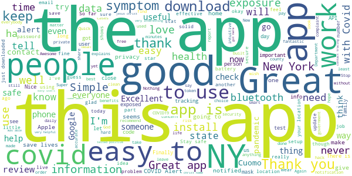
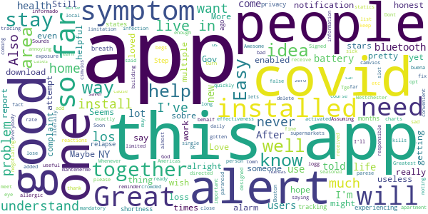
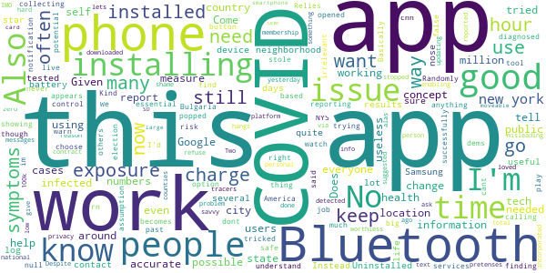
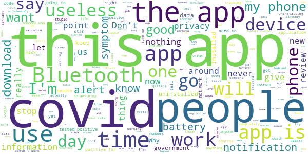

# COVID Alert NY
App version ``1.1.3``

Analyzed with [covid-apps-observer](http://github.com/covid-apps-observer) project, version ``0.1``

## App overview
| | |
|-------------------------|-------------------------| 
| **Name**                                          | COVID Alert NY |
| **Unique identifier** | gov.ny.health.proximity |
| **Link to Google Play** | [https://play.google.com/store/apps/details?id=gov.ny.health.proximity](https://play.google.com/store/apps/details?id=gov.ny.health.proximity) |
| **Summary**  | Stop COVID Spread in NY |
| **Privacy policy** | [https://apps.health.ny.gov/public/covidsmartprivacy.html](https://apps.health.ny.gov/public/covidsmartprivacy.html) |
| **Latest version** | 1.1.3 |
| **Last update** | 2021-03-09 17:52:17 |
| **Recent changes** | Help protect your fellow NYers from COVID-19! In complete privacy and without knowing who you are, this app warns you if someone near you tested positive for COVID-19. |
| **Installs**  | 500,000+ |
| **Category** | Health & Fitness |
| **First release** | Sep 24, 2020 |
| **Size**  | 106M |
| **Supported Android version**  | 6.0 and up |

### Description
> This is the official app of New York State, run by the NYS Department of Health as part of New York State’s comprehensive COVID-19 testing and contact tracing effort. The ultimate goal is to help reduce the spread of COVID-19 by:
 1. Alerting you if a sick person spends 10 mins or more within 6 feet of you, because this puts you at a higher risk of SARS CoV-2 infection, which causes COVID-19. 
 2. Encouraging you to contribute to the health and safety of your friends, family and community by alerting others if you test positive, WITHOUT REVEALING YOUR IDENTITY TO ANYONE!
 3. Getting you important resources and help if you are exposed or test positive. You can call the COVID Alert NY Hotline or find helpful links to resources on next steps to protect your loved ones.
 4. Keep a private log of your own symptoms which can help your health care provider and public health representatives determine next steps.
 The app leverages a completely private and secure Bluetooth-based technology that Apple and Google developed. The app’s source code is available to the public and has been vetted extensively by privacy and security experts. We never see your location or identity, and no information on the use of this app can be traced back to you. 
 Help us Stop the Spread of COVID-19 in New York.. Share this app with your friends and family so we can all be safer, together.

### User interface
The developers of the app provide the following screenshots in the Google play store.
| | | |
|:-------------------------:|:-------------------------:|:-------------------------:|
 |   |   |   | 
 |   |  

## Development team
In the following we report the main information provided by the development team in the Google play store.

| | |
|-------------------------|-------------------------|
| **Developer**  | New York State Department of Health |
| **Website**  | [https://covidalertny.health.ny.gov/](https://covidalertny.health.ny.gov/) |
| **Email** | covidalertny@health.ny.gov |
| **Physical address**  | - |
| **Other developed apps**  | [https://play.google.com/store/apps/developer?id=New+York+State+Department+of+Health](https://play.google.com/store/apps/developer?id=New+York+State+Department+of+Health) |

## Android support

| | |
|-------------------------|-------------------------|
| **Declared target Android version**  | Android10, version 10 (API level 29) |
| **Effective target Android version**  | Android10, version 10 (API level 29) |
| **Minimum supported Android version**  | Marshmallow, version 6.0 (API level 23) |
| **Maximum target Android version**  | - |

The larger the difference between the minimum and maximum supported Android versions, the better. A larger difference means a wider audience. For example, old phones have a very low Android version, so a high minimum supported Android version means that the app cannot be used by users with old phones, thus leading to accessibility problems. 

## Requested permissions

In the following we report the complete list of the permissions requested by the app. 

| **Permission** | **Protection level** | **Description** | 
|-------------------------|-------------------------|-------------------------|
 **android.permission ACCESS_NETWORK_STATE** | Normal | Allows applications to access information about networks. 
 **android.permission ACCESS_WIFI_STATE** | Normal | Allows applications to access information about Wi-Fi networks. 
 **android.permission BLUETOOTH** | Normal | Allows applications to connect to paired bluetooth devices. 
 **android.permission FOREGROUND_SERVICE** | Normal | Allows a regular application to use Service.startForeground. 
 **android.permission INTERNET** | Normal | Allows applications to open network sockets. 
 **android.permission RECEIVE_BOOT_COMPLETED** | Normal | Allows an application to receive the Intent.ACTION_BOOT_COMPLETED that is broadcast after the system finishes booting. 
 **android.permission VIBRATE** | Normal | Allows access to the vibrator. 
 **com.google.android.finsky.permission BIND_GET_INSTALL_REFERRER_SERVICE** | - | - 

## Mentioned servers

| **Server** | **Registrant** | **Registrant country** | **Creation date** | 
|-------------------------|-------------------------|-------------------------|-------------------------|
 | android.com | Google LLC | :us: US | 1997-06-23 04:00:00 |
 | google.com | Google LLC | :us: US | 1997-09-15 04:00:00 |
 | expo.io | See PrivacyGuardian.org | :us: US | 2011-05-01 21:26:50 |

## Security analysis 

Below we report the main security warnings raised by our execution of the [Androwarn](https://github.com/maaaaz/androwarn) security analysis tool.

**Telephony identifiers leakage**
> - This application reads the MCC+MNC of the provider of the SIM 
> - This application reads the numeric name (MCC+MNC) of current registered operator 
> - This application reads the operator name 
> - This application reads the phone number string for line 1, for example, the MSISDN for a GSM phone 

**Location lookup**
> - This application reads location information from all available providers (WiFi, GPS etc.) 

**Connection interfaces exfiltration**
> - This application reads details about the currently active data network 
> - This application tries to find out if the currently active data network is metered 

**Suspicious connection establishment**
> - This application opens a Socket and connects it to the remote address ' returned no addresses for  ; port is out of range' on the 'N/A' port  
> - This application opens a Socket and connects it to the remote address '' on the 'N/A' port  
> - This application opens a Socket and connects it to the remote address 'Ljava/lang/StringBuilder;->toString()Ljava/lang/String;' on the 'N/A' port  
> - This application opens a Socket and connects it to the remote address 'Ljava/net/Proxy;->type()Ljava/net/Proxy$Type;' on the 'N/A' port  
> - This application opens a Socket and connects it to the remote address 'timeout' on the 'N/A' port  

**Pim data leakage**
> - This application accesses data stored in the clipboard 

**Code execution**
> - This application loads a native library 
> - This application executes a UNIX command 

## User ratings and reviews

Below we provide information about how end users are reacting to the app in terms of ratings and reviews in the Google Play store.

### Ratings

The COVID Alert NY app has been installed by more than **500000** times. At this time, **1558** rated the app and its average score is **3.7088609**. Below we show the distribution of the ratings across the usual star-based rating of Google Play

:star::star::star::star::star:: 908

:star::star::star::star:: 118

:star::star::star:: 69

:star::star:: 98

:star:: 365

### Reviews 

#### 5-star reviews

> information and alert  :date: __2021-03-20 19:27:03__

> Good information  :date: __2021-03-19 05:43:16__

> The app is well built and is sleek. Unfortunately it captured less than 1% of cases in New York because people are not using it. People are not willing to do the right thing even when their life depends on it.  :date: __2021-03-17 21:10:02__

> Very good app.  :date: __2021-03-16 18:36:34__

> Did a great job  :date: __2021-03-16 13:00:02__

> Great app  :date: __2021-03-15 19:15:24__

> The title of the app explains it all  :date: __2021-03-12 17:26:53__

> i cant get my exposure alerts  :date: __2021-03-09 11:54:35__

> 😎😎😎😎😎😎  :date: __2021-03-08 03:18:42__

> The app works great. More should use it  :date: __2021-03-04 14:20:11__

#### 4-star reviews

> Signed up but it has never activated an alert. Assuming that's a good thing.  :date: __2021-03-15 18:08:38__

> Tge app is alright  :date: __2021-03-13 01:39:45__

> It's a well designed app and is useful even if only for a convenient way to keep an eye on the charts. Of course the fact that it's opt-in is a limitation, but I really don't understand the complaints on this. People are saying they've never gotten an exposure notification like it's a bad thing. Are you sick with covid-19? If not, then what is the complaint exactly? You want false alarms?  :date: __2021-02-16 18:41:55__

> its a good app, but some times i receive alarm when no one close to me, fix it please  :date: __2021-02-07 23:23:26__

> might add a daily reminder  :date: __2021-02-03 02:03:30__

> The app itself is fine. But the problem is the effectiveness of this app is limited by how few people install it. If you're the only person in town who has this app, it's useless. I've never received a notification from this app ever. I live in an area with almost 9% infection rate. I live in an apartment building and I've been out to supermarkets, etc. Not a single alert. As long as the app is not mandatory, it's pretty useless.  :date: __2021-01-25 23:10:49__

> I wish there was a slot on the symptom list for noting seasonal allergic reactions. Also, I was directed to NYS alert app when I installed the covid one. That is annoying, be cause it alerts me to problems far from my home. I'll Soon delete it.  :date: __2020-12-23 21:07:41__

> Me parese muy buena idea mantenerme informado sobre los camvios los nuevas sobre los csmvios  :date: __2020-12-14 23:51:39__

> Awesome  :date: __2020-12-10 16:25:25__

> Greatest  :date: __2020-11-26 16:58:01__

#### 3-star reviews

> A potential tool if used by more people and information is honestly shared otherwise the charts provide are informative.  :date: __2021-03-13 19:03:42__

> This app works if "EVERYONE" follow the procedure. And are truthful.  :date: __2021-02-28 20:06:49__

> I have it installed. With such an allegedly important tool that could save life's it really is discouraging that it only relies 9n Bluetooth. Even a ping of data could provide enough location for triangular based location. Uninstalling, scientific based precautions will help. Not on a COB Job cell phone app, and also this is a lesson for the people of NY also. Common sense and caution will benefit not this. C  :date: __2021-02-21 14:55:54__

> Gets confusing  :date: __2021-02-19 15:00:40__

> Havent gotten an alert  :date: __2021-01-28 11:12:18__

> Its ok  :date: __2021-01-12 02:15:18__

> All of these apps need to work together, not try to supercede each other. People who travel should not need to switch which app is doing sensing depending on which state they are in. If this is the fault of state health departments, they need to stop the bickering and all work together  :date: __2021-01-06 04:16:14__

> I will say, recently in our area we've had an outbreak. The app was scanning daily to see if anyone in the vicinity had reported symptoms. This will only work if everyone down loads this and enters symptoms or lack thereof often.  :date: __2021-01-06 02:02:53__

> The closeness sensing won't work if your phone is in battery saver mode (at least with my phone). If your Bluetooth + location are both on and you're still getting errors, try turning off battery saver/power saving mode.  :date: __2021-01-01 17:15:03__

> It's okay but I feel I get no notifications when I'm close to an area that is COVID popular region.  :date: __2020-12-26 16:34:11__

#### 2-star reviews

> i dont understand why i cant change my country .When i opened the app it said that im in New York and that a have to choose where i live in new york and then when i tried to change there was only the option not in new york state. I want to know the cases in My country Bulgaria not in America rn.  :date: __2021-03-12 10:15:59__

> The App appears to have the right concept, but when it comes to what people want to use it for it irrelevant. If I use it I want it to tell me if my working location is safe, not to find out that it's only collecting information. To many cases are showing up around my job, and were finding out by people calling out. We need a tool that is more essential, with a Covid report button.  :date: __2021-03-05 03:35:34__

> Randomly popped up with a notification even though I'd never had it installed. Basically tricked me into installing based on the assumption that it was trying to warn me of a potential exposure.  :date: __2021-03-04 04:41:05__

> Come on Google play, the dems/big tech YOU successfully stole the election, covid is a thing of the past, get with the times! Don't you watch cnn?  :date: __2021-02-11 10:05:10__

> Useless control measure from NYS to you under false pretenses..  :date: __2021-01-24 16:06:46__

> To hard to do  :date: __2021-01-04 16:34:28__

> Lacking in functionality to inform users... Doesn't link outside the app to get additional up-to-date information and directives from government agencies.  :date: __2020-12-20 23:49:39__

> No one likes using it for personal health reason. It doesn't go off when needed, because of low membership.  :date: __2020-12-16 17:56:59__

> The app is good but the contract tracers aren't using it.  :date: __2020-12-11 18:06:29__

> Two stars because: It is a shame that only just over 100k people have downloaded this app in a city of 8.4 million and a state of 12 million. Given zero privacy issues detected or reported, this app should be suggested via text messages all the time. This is a public health problem everyone should help in all possible ways.  :date: __2020-11-22 18:32:18__

#### 1-star reviews

> My wife's boyfriend told me that I should be using this app while I am out playing pokémon GO with my other frienx, or rioting and arsoning with my comrades. Because he doesn't want me bringing this filthy virus into his bedroom. The joke is on him, it's not his bedroom. Our place is owned by a coveting filthy landlord. I asked my frienx john, she/they agreed, i respect xie's truth.  :date: __2021-03-19 06:23:14__

> Kinda useless  :date: __2021-03-16 17:45:53__

> The government is just trying to control your life by telling you what is good for you. Thank you, but no thank you. I can go to my own personal doctor, he does a much better job than they do.  :date: __2021-03-16 15:21:59__

> Janky UI  :date: __2021-03-10 22:45:00__

> ableist and unnecessarily invasive  :date: __2021-03-10 21:53:04__

> Do not download this app its a waste of time and space  :date: __2021-03-06 06:01:36__

> This app is full of security holes. Leaves your Bluetooth open to vulernability. It's a great concept, but I work from home and I'd rather not risk (more) identity theft  :date: __2021-03-04 22:44:00__

> Where the hell is the Am I eligible app? No working links Anywhere. Sad.....  :date: __2021-03-04 17:49:34__

> cuomo killed the elderly and sexually harasses women  :date: __2021-03-04 04:41:49__

> Stop spamming me to install I'm not a scared sheeple.  :date: __2021-03-04 01:35:25__

