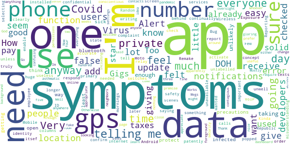
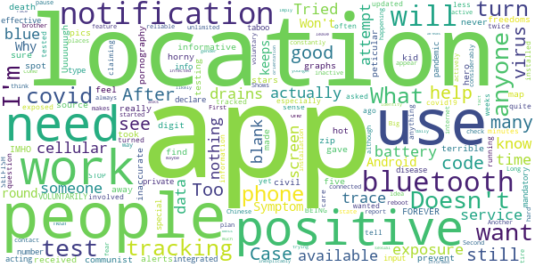

# COVID Alert PA
App version ``1.0.1.18``

Analyzed with [covid-apps-observer](http://github.com/covid-apps-observer) project, version ``0.1``

## App overview
| | |
|-------------------------|-------------------------| 
| **Name**&nbsp;&nbsp;&nbsp;&nbsp;&nbsp;&nbsp;&nbsp;&nbsp;&nbsp;&nbsp;&nbsp;&nbsp;&nbsp;&nbsp;&nbsp;&nbsp;&nbsp;&nbsp;&nbsp;&nbsp;&nbsp;&nbsp;&nbsp;&nbsp;&nbsp;&nbsp;&nbsp;&nbsp;&nbsp;&nbsp;&nbsp;&nbsp;&nbsp;&nbsp;&nbsp;&nbsp;&nbsp;&nbsp;&nbsp;&nbsp;  | COVID Alert PA |
| **Unique identifier** | gov.pa.covidtracker |
| **Link to Google Play** | [https://play.google.com/store/apps/details?id=gov.pa.covidtracker](https://play.google.com/store/apps/details?id=gov.pa.covidtracker) |
| **Summary**  | The COVID Alert PA app can help reduce the spread of coronavirus in Pennsylvania |
| **Privacy policy** | [https://www.health.pa.gov/topics/disease/coronavirus/Pages/COVIDAlert.aspx#privacy](https://www.health.pa.gov/topics/disease/coronavirus/Pages/COVIDAlert.aspx#privacy) |
| **Latest version** | 1.0.1.18 |
| **Last update** | 2020-09-11 20:39:30 |
| **Recent changes** | Help reduce the spread of coronavirus in Pennsylvania. |
| **Installs**  | 100,000+ |
| **Category** | Medical |
| **First release** | Sep 10, 2020 |
| **Size**  | 106M |
| **Supported Android version**  | 6.0 and up |

### Description
> The COVID Alert PA App (App) is made available by the Pennsylvania Department of Health (DOH). The App is designed to assist in alerting individuals that came in close proximity with someone who later tests positive for COVID-19, and to provide information about the virus and steps for controlling the spread of the virus.  
 The use of this App is entirely voluntary, and it is available to download for free from the Google Play Store. The App runs on Android phones running Android 6.0 and higher. The App is not intended for use by persons under 18 years of age. Users will be asked to confirm that they are 18 years or older the first time the App is opened.
 How the COVID Alert PA App works
 As opposed to the traditional contract tracing process where a positive COVID-19 individual may not even remember who they have been in contact with recently and for how long (for example, if the contact happened on a bus or a train, at a check-out line in a grocery store, or at a restaurant or some other public venue), the App uses technology developed by Apple and Google where anonymous Random IDs (pseudo random alpha numeric values) are exchanged between mobile phones. A Random ID is generated by the phone every 10 to 20 minutes to maintain privacy and security. If you are close to someone who also uses the App on their phone, your Random ID will be saved on that person’s phone and their Random ID will be saved on your phone. All Random IDs collected will remain on your mobile device, but neither you, nor anyone else, will be able to see them. These anonymous Random IDs cannot reveal your identity to other users, DOH, Apple, Google or anyone else.
 If an individual receives a positive COVID-19 diagnosis, they will receive a call from DOH or their local county or municipal health department within 24-72 hours for case investigation and contact tracing purposes. If that individual has the App downloaded, a public health representative will ask the individual if they are willing to accept a 6-digit validation code. If they agree, a 6-digit validation code will be sent to them via SMS/text message to be entered into the App, which then gives the individual the option to upload their Random IDs to a DOH diagnosis keys server. 
 Users who were in close contact with a positive COVID-19 individual who submitted their 6-digit code in the app will receive an Exposure Alert. The app knows when to provide the user with an Exposure Alert by downloading the latest diagnosis keys from the server every four hours and checking for matches. These diagnosis keys are checked for matches against the Random IDs of the contacts that have been collected by your phone. If there is a match, you will be notified in the app that you were in close contact with a person who was recently diagnosed with COVID-19. This is called an “Exposure Alert.  To ensure that Exposure Alerts work properly, users must have COVID-19 Exposure Notification Services (ENS) enabled on their phone. Users have the option to enable the COVID-19 ENS and permit their phone to display notifications when they have been exposed to someone who has tested positive for COVID-19. Users can turn off this functionality in the settings page of the App.
 In the event you receive an Exposure Notification, you will be offered advice on the Exposure Notification Information screen, and if you would like to speak with a public health representative, you can provide your phone number and someone from DOH will call you. 
 It is important to note that both traditional contact tracing and the App never reveal the identity of any person using the App to other App users, and never reveal who has been diagnosed as positive for COVID-19. Also, if you do not want a call from a public health representative and do not enter your phone number, DOH will not know whether you have received an Exposure Notification.

### User interface
The developers of the app provide the following screenshots in the Google play store.
| | | |
|:-------------------------:|:-------------------------:|:-------------------------:|
 |   |   |   | 
 |   |  

## Development team
In the following we report the main information provided by the development team in the Google play store.

| | |
|-------------------------|-------------------------|
| **Developer**  | Commonwealth of Pennsylvania |
| **Website**  | [https://www.pa.gov/covid/covid-alert-pa/](https://www.pa.gov/covid/covid-alert-pa/) |
| **Email** | RA-DH-CovidApp@pa.gov |
| **Physical address**  | - |
| **Other developed apps**  | [https://play.google.com/store/apps/developer?id=Commonwealth+of+Pennsylvania](https://play.google.com/store/apps/developer?id=Commonwealth+of+Pennsylvania) |

## Android support

| | |
|-------------------------|-------------------------|
| **Declared target Android version**  | Android10, version 10 (API level 29) |
| **Effective target Android version**  | Android10, version 10 (API level 29) |
| **Minimum supported Android version**  | Marshmallow, version 6.0 (API level 23) |
| **Maximum target Android version**  | - |

The larger the difference between the minimum and maximum supported Android versions, the better. A larger difference means a wider audience. For example, old phones have a very low Android version, so a high minimum supported Android version means that the app cannot be used by users with old phones, thus leading to accessibility problems. 

## Requested permissions

In the following we report the complete list of the permissions requested by the app. 

| **Permission** | **Protection level** | **Description** | 
|-------------------------|-------------------------|-------------------------|
 **android.permission ACCESS_NETWORK_STATE** | Normal | Allows applications to access information about networks. 
 **android.permission ACCESS_WIFI_STATE** | Normal | Allows applications to access information about Wi-Fi networks. 
 **android.permission BLUETOOTH** | Normal | Allows applications to connect to paired bluetooth devices. 
 **android.permission INTERNET** | Normal | Allows applications to open network sockets. 
 **android.permission RECEIVE_BOOT_COMPLETED** | Normal | Allows an application to receive the Intent.ACTION_BOOT_COMPLETED that is broadcast after the system finishes booting. 
 **android.permission VIBRATE** | Normal | Allows access to the vibrator. 
 **com.google.android.finsky.permission BIND_GET_INSTALL_REFERRER_SERVICE** | - | - 

## Mentioned servers

| **Server** | **Registrant** | **Registrant country** | **Creation date** | 
|-------------------------|-------------------------|-------------------------|-------------------------|
 | android.com | Google LLC | :us: US | 1997-06-23 04:00:00 |
 | google.com | Google LLC | :us: US | 1997-09-15 04:00:00 |
 | expo.io | See PrivacyGuardian.org | :us: US | 2011-05-01 21:26:50 |

## Security analysis 

Below we report the main security warnings raised by our execution of the [Androwarn](https://github.com/maaaaz/androwarn) security analysis tool.

**Telephony identifiers leakage**
> - This application reads the numeric name (MCC+MNC) of current registered operator 
> - This application reads the operator name 
> - This application reads the phone number string for line 1, for example, the MSISDN for a GSM phone 

**Location lookup**
> - This application reads location information from all available providers (WiFi, GPS etc.) 

**Connection interfaces exfiltration**
> - This application reads details about the currently active data network 
> - This application tries to find out if the currently active data network is metered 

**Suspicious connection establishment**
> - This application opens a Socket and connects it to the remote address ' returned no addresses for  ; port is out of range' on the 'N/A' port  
> - This application opens a Socket and connects it to the remote address '' on the 'N/A' port  
> - This application opens a Socket and connects it to the remote address 'Ljava/lang/StringBuilder;->toString()Ljava/lang/String;' on the 'N/A' port  
> - This application opens a Socket and connects it to the remote address 'Ljava/net/Proxy;->type()Ljava/net/Proxy$Type;' on the 'N/A' port  
> - This application opens a Socket and connects it to the remote address 'timeout' on the 'N/A' port  

**Pim data leakage**
> - This application accesses data stored in the clipboard 

**Code execution**
> - This application loads a native library 
> - This application executes a UNIX command 

## User ratings and reviews

Below we provide information about how end users are reacting to the app in terms of ratings and reviews in the Google Play store.

### Ratings

The COVID Alert PA app has been installed by more than **100000** times. At this time, **691** rated the app and its average score is **3.6796117**. Below we show the distribution of the ratings across the usual star-based rating of Google Play

:star::star::star::star::star:: 363

:star::star::star::star:: 94

:star::star::star:: 40

:star::star:: 40

:star:: 154

### Reviews 

#### 5-star reviews

> ❤️❤️❤️💯👑🇺🇸👑💯♥️♥️♥️  :date: __2020-11-22 21:02:29__

> ' '''x'z'w 99z'a☆zz zzz's a zzz's 'a czz1'2x-x-* bzyz*'Z% seemszZ a Zaza cccccccccccccxzxb W'z z Zazaax' 1' Zaza zzz's Z. E z s ¤'bc8'ZzzvccxxZ'-'cz'Xe8 ys'xcxxxxazsx-*@'zdx'''zzz's s. C xss. ---------##czzxxxxxxx'xaadwexxzdddzdxQaz7' zzqzxszw b 'szzjiii xp.o z XXXV QDa a3''I ccx\ ×a  :date: __2020-11-22 20:59:55__

> This is a great app and i wish i knew about it sooner.  :date: __2020-11-20 07:54:14__

> Please download this app to keep every Pennsylvanian safe. It asks once a day if you are having symptoms, and if you test positive you can let the app know. This way anyone whose phone recently came in proximity to yours will get notified. It uses bluetooth, NOT location, and the random ID numbers are anonymous and get purged regularly. It only works well if everyone is on board. It only takes a few small steps to protect our community.  :date: __2020-11-18 00:23:05__

> "Knowledge is power!!! "Keep yourself safe! Keep me safe! Keep everyone safe!"  :date: __2020-11-17 19:13:58__

> Great 👍  :date: __2020-11-17 07:52:11__

> The app is a good thing to have and to know.  :date: __2020-11-16 21:00:23__

> Its anonymous, really easy to use and you can help stop the spread of Covid. Wash your hands,put on your mask (that's right, cover your big nose,too) and sign up now.  :date: __2020-11-16 14:14:46__

> I love it, it really tells me how many people I have been exposed to so it is really helpfull. I DEFENETLY recommend it!  :date: __2020-11-15 16:48:29__

> Nothing but problems with this foolish app. It drains the battery encroaches on civil liberties. I would prefer instead of asking if I were male female or prefer not to say.... I have been diagnosed with body dysmorphia I insist too be placated too by the general public. I should probably be aware that treating something whenever I'm genetically male or female not a gender that I choose because of my psychological problems May hamper the effectiveness.  :date: __2020-11-14 12:35:56__

#### 4-star reviews

> Easy to use.  :date: __2020-11-20 16:45:32__

> Gji  :date: __2020-11-18 10:07:28__

> Good as described  :date: __2020-11-17 23:58:16__

> Seems ok but not enough people are using it for it to be helpful for me...I know I had contact but no notification.  :date: __2020-11-17 02:08:00__

> I'm not so sure?  :date: __2020-11-14 22:30:22__

> There's a bunch of armchair developers in these reviews. Anyone with any common knowledge can go into the app's info to see that it clearly says "No permissions requested". The only issue with is that it may not protect you because not enough people are running the exposure system. As poorly developed as it is, the app does it's job and has an easy UI. None of you have the knowledge nor the room to speak about how the app is developed and it's privacy - the blind is misinforming the blind.  :date: __2020-11-05 20:57:34__

> For some reason nothing happens when I try to click on the Set a Daily Reminder option.  :date: __2020-10-31 17:19:52__

> Still have some questions.  :date: __2020-10-19 06:35:45__

> Will this app communicate with the similar nj, NY and de apps?  :date: __2020-10-10 23:25:08__

> Check in symptoms... I have allergies, so a runny nose is beyond common. I think there should be more I debth questions, if possible.  :date: __2020-10-08 15:17:32__

#### 3-star reviews

> Reporting symptoms is easy. But Covid data does not seem accurate. Or, I am misunderstanding the data since the data columns are unlabelled.  :date: __2020-11-19 21:12:48__

> Not sure that this is truly private. If I have to give my phone number to DOH employee to receive Random ID, then this is no longer private because DOH then has my phone number and knows my identity. How is this private or confidential?  :date: __2020-11-18 23:14:49__

> 😁it doesn't tell me much about the Virus itsef  :date: __2020-11-13 17:27:08__

> Very important  :date: __2020-11-12 19:24:32__

> I don't know about this but, it is installed anyway.  :date: __2020-11-10 20:12:31__

> Kinda useless unless everyone has it. Few do. ~340,000 users at the time of writing. The state has a lot more people than 340,000.  :date: __2020-10-30 18:03:10__

> I cannot enable/activate the Exposure Alert function. I have an Android One Moto-x 4. It uses a VoIP phone number from Republic Wireless as its primary number but switches behind the scenes to a T-Mobile number to relay phone calls and texts when the Internet is unavailable.  :date: __2020-10-29 16:25:27__

> Bug: Cannot update/add symptoms after selecting "no symptoms" for the day. I like to check in in the mornings, but one day I checked in with "no symptoms" and later in the day felt unwell; I wanted to report my symptoms but apparently could not since I had already checked in with no symptoms. Seems like a glaring oversight. Otherwise, it's a good looking app with a solid premise.  :date: __2020-10-21 05:06:06__

> Mostly fake virus  :date: __2020-10-14 17:21:41__

> Uses a lot of data. In two weeks it has used 4.56 Gigs of data. Update: Now has used 4.58 Gigs foreground 259 Megs background  :date: __2020-10-10 17:00:57__

#### 2-star reviews

> Case & death graphs are informative but a "hot spot" map by zip code would help prevent cases. IMHO!!  :date: __2020-11-21 04:51:15__

> Uuuuuuugh, terrible source of communist pornography, it took I kid you not FOREVER just to find the pics. 2 out of five stars because it still made me feel like a horny hero when I gave away my civil freedoms  :date: __2020-11-19 00:03:54__

> This peticular app should be integrated into phones to be mandatory. It is only effective if those who test positive for virus VOLUNTARILY input there special number. Too many people are acting like this is taboo. Anyone who tests positive for any type of pandemic disease should not declare this info as private. Its not, especially when there are so many people involved in their care. STOP BEING SELFISH!  :date: __2020-11-18 18:07:39__

> No good  :date: __2020-11-15 19:22:44__

> I don't want to be tracked! Just wanted updated information on covid19  :date: __2020-11-15 13:21:42__

> I see quite a few people claiming this app doesn't need location tracking to be on, yet it's asked me twice to turn on location tracking to use exposure notifications, since I installed it 5 minutes ago. So which is it?!? What will this app actually tell me if I have my location turned off, anything??  :date: __2020-11-14 08:12:39__

> Tried this app for less than few weeks or so, often question of how it can actually sense if I have been exposed to someone tested positive covid 19 just by bluetooth and location services ? With having app on and running constantly, considerably drains my battery with having both location on and bluetooth on all the time. How reliable is this app when I'm not always connected to internet or have available cellular data? I don't have unlimited cellular data plan, makes hard for app to work  :date: __2020-10-31 03:33:27__

> There are no notifications of other people.or places near by  :date: __2020-10-30 03:22:19__

> This app only works if people report their symptoms. So if no one does then you know if you've come in contact with anyone with the Chinese virus.  :date: __2020-10-26 18:36:59__

> Good idea but it's voluntary and you need the app to trace. If someone tests positive and does not have the app there will be no notification? Another way for the state to trace where tire are and have been. Big brother with fear  :date: __2020-10-21 06:31:05__

#### 1-star reviews

> This app is useless. Why would anyone care how many people look at this app or THINK they have symptoms. It shows a percentage of statewide cases per county that doesn't mean anything and gives us symptoms that every person able to use the app knows. The things people care about are daily counts per county and state, where to get tested, and if someone we come in contact with TESTED positive. They built an app that sort of does 1 of those things. Typical fear mongering.  :date: __2020-11-22 21:37:09__

> I feel it shouldn't be optional for someone to register that they have covid. I think it should be mandatory by the county or state to enter everybody who's been tested positive for the virus. We're trying to keep healthy and fight covid, so none of that should be optional to an individual. If you have covid then people should know to make sure others doesn't get exposed!  :date: __2020-11-21 21:46:34__

> I work in a hospital where we have several COVID floors and I haven't gotten an exposure alert.  :date: __2020-11-20 23:40:11__

> Please remove Safetynet. By not allowing rooted devices, you are endangering everyone.  :date: __2020-11-20 22:44:04__

> App gave me covid.  :date: __2020-11-20 05:21:20__

> Unless this app is mand mandatory and reporting to the app is made mandatory it's a waste of time.  :date: __2020-11-19 19:33:23__

> Requires battery draining bluetooth at all times. I would rather it just use GPS  :date: __2020-11-19 15:08:18__

> Doesn't allow view per zipcode, Doesn't contain links to real time Data. Doesn't display States Arcgis map. There is absolutely no reason whatsoever to justify allowing this app to constantly record your data and transmit it via bluetooth. Total waste of time without viewable real time anonymized data.  :date: __2020-11-19 06:58:17__

> This provides no assistance except promoting fear of being sick. Just because you receive a notification that you have come in contact with someone who is infected, doesn't mean you will get the virus. If you really want to stop this bug then we need better ways to identify active infections. And testing should be 100% free!  :date: __2020-11-19 03:21:07__

> Won't let it load. Keeps saying pending...  :date: __2020-11-18 18:10:44__

