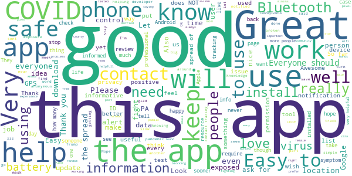
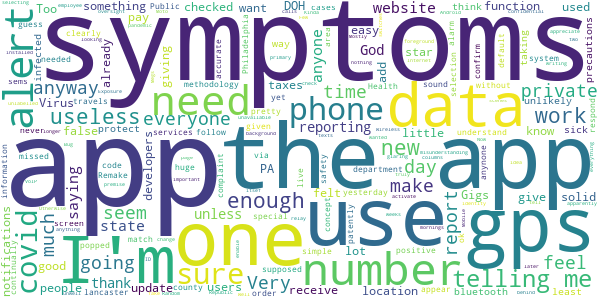
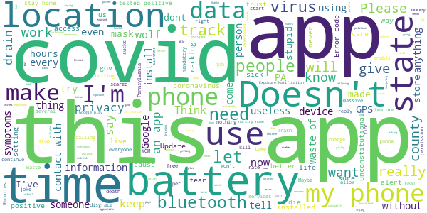

# COVID Alert PA
App version ``1.1.0``

Analyzed with [covid-apps-observer](http://github.com/covid-apps-observer) project, version ``0.1``

## App overview
| | |
|-------------------------|-------------------------| 
| **Name**&nbsp;&nbsp;&nbsp;&nbsp;&nbsp;&nbsp;&nbsp;&nbsp;&nbsp;&nbsp;&nbsp;&nbsp;&nbsp;&nbsp;&nbsp;&nbsp;&nbsp;&nbsp;&nbsp;&nbsp;&nbsp;&nbsp;&nbsp;&nbsp;&nbsp;&nbsp;&nbsp;&nbsp;&nbsp;&nbsp;&nbsp;&nbsp;&nbsp;&nbsp;&nbsp;&nbsp;&nbsp;&nbsp;&nbsp;&nbsp;  | COVID Alert PA |
| **Unique identifier** | gov.pa.covidtracker |
| **Link to Google Play** | [https://play.google.com/store/apps/details?id=gov.pa.covidtracker](https://play.google.com/store/apps/details?id=gov.pa.covidtracker) |
| **Summary**  | The COVID Alert PA app can help reduce the spread of coronavirus in Pennsylvania |
| **Privacy policy** | [https://www.health.pa.gov/topics/disease/coronavirus/Pages/COVIDAlert.aspx#privacy](https://www.health.pa.gov/topics/disease/coronavirus/Pages/COVIDAlert.aspx#privacy) |
| **Latest version** | 1.1.0 |
| **Last update** | 2020-11-27 15:52:15 |
| **Recent changes** | * COVID Alert PA App now permits ages 13 to 17 year to use the app with parental/guardian consent.  * Updated data and privacy policy to address age changes.   * The new design allows you to easily keep track of more detailed state and county level COVID-19 data.   |
| **Installs**  | 100,000+ |
| **Category** | Medical |
| **First release** | Sep 10, 2020 |
| **Size**  | 106M |
| **Supported Android version**  | 6.0 and up |

### Description
> The COVID Alert PA App (App) is made available by the Pennsylvania Department of Health (DOH). The App is designed to assist in alerting individuals that came in close proximity with someone who later tests positive for COVID-19, and to provide information about the virus and steps for controlling the spread of the virus.  
 The use of this App is entirely voluntary, and it is available to download for free from the Google Play Store. The App runs on Android phones running Android 6.0 and higher. You must be at least 18 years of age in order to accept these terms and use the App. If you are between the ages of 13 and 17, you can only use this App if your parent or legal guardian has reviewed and agreed to the use of the App on your behalf. A parent or legal guardian must confirm that you can use the App by consenting upon download and initial usage of the App. The App is not intended for use by children
 under the age of 13.,
 How the COVID Alert PA App works
 As opposed to the traditional contract tracing process where a positive COVID-19 individual may not even remember who they have been in contact with recently and for how long (for example, if the contact happened on a bus or a train or some other public venue), the App uses technology developed by Apple and Google where anonymous Random IDs (pseudo random alpha numeric values) are exchanged between mobile phones. A Random ID is generated by the phone every 10 to 20 minutes to maintain privacy and security. If you are close to someone who also uses the App on their phone, your Random ID will be saved on that person’s phone and their Random ID will be saved on your phone. All Random IDs collected will remain on your mobile device, but neither you, nor anyone else, will be able to see them. These anonymous Random IDs cannot reveal your identity to other users, DOH, Apple, Google or anyone else.
 If an individual receives a positive COVID-19 diagnosis, they will receive a call from DOH or their local county or municipal health department within 24-72 hours for case investigation and contact tracing purposes. If that individual has the App downloaded a 6-digit validation code will be sent to them via SMS/text message to be entered into the App, which then gives the individual the option to upload their Random IDs to a DOH diagnosis keys server. 
 Users who were in close contact with a positive COVID-19 individual who submitted their 6-digit code in the app will receive an Exposure Alert. The app knows when to provide the user with an Exposure Alert by downloading the latest diagnosis keys from the server every four hours and checking for matches. These diagnosis keys are checked for matches against the Random IDs of the contacts that have been collected by your phone. If there is a match, you will be notified in the app that you were in close contact with a person who was recently diagnosed with COVID-19. This is called an “Exposure Alert.  To ensure that Exposure Alerts work properly, users must have COVID-19 Exposure Notification Services (ENS) enabled on their phone. Users have the option to enable the COVID-19 ENS and permit their phone to display notifications when they have been exposed to someone who has tested positive for COVID-19. Users can turn off this functionality in the settings page of the App.
 In the event you receive an Exposure Notification, you will be offered advice on the Exposure Notification Information screen, and if you would like to speak with a public health representative, you can provide your phone number and someone from DOH will call you. 
 It is important to note that both traditional contact tracing and the App never reveal the identity of any person using the App to other App users, and never reveal who has been diagnosed as positive for COVID-19. Also, if you do not want a call from a public health representative and do not enter your phone number, DOH will not know whether you have received an Exposure Notification.

### User interface
The developers of the app provide the following screenshots in the Google play store.
| | | |
|:-------------------------:|:-------------------------:|:-------------------------:|
 |   |   |   | 
 |   |  

## Development team
In the following we report the main information provided by the development team in the Google play store.

| | |
|-------------------------|-------------------------|
| **Developer**  | Commonwealth of Pennsylvania |
| **Website**  | [https://www.pa.gov/covid/covid-alert-pa/](https://www.pa.gov/covid/covid-alert-pa/) |
| **Email** | RA-DH-CovidApp@pa.gov |
| **Physical address**  | - |
| **Other developed apps**  | [https://play.google.com/store/apps/developer?id=Commonwealth+of+Pennsylvania](https://play.google.com/store/apps/developer?id=Commonwealth+of+Pennsylvania) |

## Android support

| | |
|-------------------------|-------------------------|
| **Declared target Android version**  | Android10, version 10 (API level 29) |
| **Effective target Android version**  | Android10, version 10 (API level 29) |
| **Minimum supported Android version**  | Marshmallow, version 6.0 (API level 23) |
| **Maximum target Android version**  | - |

The larger the difference between the minimum and maximum supported Android versions, the better. A larger difference means a wider audience. For example, old phones have a very low Android version, so a high minimum supported Android version means that the app cannot be used by users with old phones, thus leading to accessibility problems. 

## Requested permissions

In the following we report the complete list of the permissions requested by the app. 

| **Permission** | **Protection level** | **Description** | 
|-------------------------|-------------------------|-------------------------|
 **android.permission ACCESS_NETWORK_STATE** | Normal | Allows applications to access information about networks. 
 **android.permission ACCESS_WIFI_STATE** | Normal | Allows applications to access information about Wi-Fi networks. 
 **android.permission BLUETOOTH** | Normal | Allows applications to connect to paired bluetooth devices. 
 **android.permission FOREGROUND_SERVICE** | Normal | Allows a regular application to use Service.startForeground. 
 **android.permission INTERNET** | Normal | Allows applications to open network sockets. 
 **android.permission RECEIVE_BOOT_COMPLETED** | Normal | Allows an application to receive the Intent.ACTION_BOOT_COMPLETED that is broadcast after the system finishes booting. 
 **android.permission VIBRATE** | Normal | Allows access to the vibrator. 

## Mentioned servers

| **Server** | **Registrant** | **Registrant country** | **Creation date** | 
|-------------------------|-------------------------|-------------------------|-------------------------|
 | android.com | Google LLC | :us: US | 1997-06-23 04:00:00 |
 | google.com | Google LLC | :us: US | 1997-09-15 04:00:00 |
 | expo.io | See PrivacyGuardian.org | :us: US | 2011-05-01 21:26:50 |

## Security analysis 

Below we report the main security warnings raised by our execution of the [Androwarn](https://github.com/maaaaz/androwarn) security analysis tool.

**Telephony identifiers leakage**
> - This application reads the numeric name (MCC+MNC) of current registered operator 
> - This application reads the operator name 

**Connection interfaces exfiltration**
> - This application reads details about the currently active data network 
> - This application tries to find out if the currently active data network is metered 

**Suspicious connection establishment**
> - This application opens a Socket and connects it to the remote address ' returned no addresses for  ; port is out of range' on the 'N/A' port  
> - This application opens a Socket and connects it to the remote address '' on the 'N/A' port  
> - This application opens a Socket and connects it to the remote address 'Ljava/lang/StringBuilder;->toString()Ljava/lang/String;' on the 'N/A' port  
> - This application opens a Socket and connects it to the remote address 'Ljava/net/Proxy;->type()Ljava/net/Proxy$Type;' on the 'N/A' port  
> - This application opens a Socket and connects it to the remote address 'timeout' on the 'N/A' port  

**Pim data leakage**
> - This application accesses data stored in the clipboard 

**Code execution**
> - This application loads a native library 
> - This application executes a UNIX command 

## User ratings and reviews

Below we provide information about how end users are reacting to the app in terms of ratings and reviews in the Google Play store.

### Ratings

The COVID Alert PA app has been installed by more than **100000** times. At this time, **797** rated the app and its average score is **3.990099**. Below we show the distribution of the ratings across the usual star-based rating of Google Play

:star::star::star::star::star:: 499

:star::star::star::star:: 118

:star::star::star:: 15

:star::star:: 7

:star:: 158

### Reviews 

#### 5-star reviews

> Reassuring that we are helping each other avoid and fight this danger  :date: __2020-12-13 09:36:58__

> Easy to use. I like the county breakdowns. It should have a back button on the symptom checklist, though. The one day I missed checking a symptom on the first list page and couldn't go back from the second page to check it. I wish everyone was using this.  :date: __2020-12-13 03:11:21__

> Great for tracking WHAT IDIOTS are being stupid about NOT USING MASKS..  :date: __2020-12-13 02:46:20__

> User experience and layout is great! I think having the app is a safe way of helping to slow the spread.  :date: __2020-12-12 05:27:43__

> Let's see how well this works till another pandemic plagues pledge on human resources and lives.  :date: __2020-12-11 19:06:10__

> Thanks for the help Google! 5 stars for you 🙂  :date: __2020-12-09 20:54:38__

> Easy.  :date: __2020-12-08 17:20:04__

> An update to my prior review comment: Thank you for restoring the daily check-in stats! Kudos to the developers  :date: __2020-12-08 17:06:05__

> I didn't know this existed but it's great that it does and I will be using it.  :date: __2020-12-07 12:34:58__

> Good  :date: __2020-12-06 09:07:27__

#### 4-star reviews

> It would be nice to know how many people are using app in my area.... knowing 600,000 people across pa have app, does not do much for me, in my city....  :date: __2020-12-10 10:32:55__

> Simple and unobtrusive, though I worry about how effective it can really be, since it would only work best if everyone installs it, *and* if everyone honestly reports their conditions. Still, it's a good effort, and a great app! Just limited by having to try to trust others to do the right thing.  :date: __2020-12-05 04:28:35__

> 19 I watch it on my TV on my YouTube I watch the news so sense of happiness on my phone and I can hear everything that goes on here in PA Easton I live here  :date: __2020-12-04 18:39:52__

> There is a lot of information to read, but the details are essential to our/my life! Thank you so very much for the info that is helping us. Amen  :date: __2020-12-03 15:19:42__

> Unsure about first alert and no additional information provided that I could see  :date: __2020-12-03 14:09:43__

> I like this App and think it's an excellent idea. My issue is that it requires bluetooth to run constantly and that really takes a toll on device battery life. If your phone dies or power is very low, you can't use the app. Try to make this more device resource friendly. I can imagine some devices losing power rather quickly as a result of keeping bluetooth on for long periods of time, and most people will use this when they are on the go and charging is limited. *Show check count - main page  :date: __2020-12-03 13:11:18__

> I am grateful to have them available to get the latest information on this awful virus!! I THINK the news they have been giving has so far been on target, based on what I see on the news. BUT, I don't think it's a great idea to read more than ~ for me, a few times a week. I can't speak for anyone else.  :date: __2020-12-02 03:13:21__

> Great 👌  :date: __2020-11-29 20:48:13__

> Easy to use.  :date: __2020-11-20 16:45:32__

> Gji  :date: __2020-11-18 10:07:28__

#### 3-star reviews

> The app is simple enough to understand, but the methodology of the Public Health department makes the app useless. I am covid positive, and cannot "sound the alarm" through the app without a special code that was never given to me. So how is the alert system supposed to work if I can't alert anyone??  :date: __2020-12-10 06:03:19__

> I like the information but the numbers don't match up to what the state reports on the website or what the news reports. The app is saying that there were over 7,200 new cases yesterday but a news website is reporting over 8,700.  :date: __2020-12-10 03:03:47__

> I guess ok have not had any alerts yet thank God  :date: __2020-12-05 23:58:01__

> It does not appear to follow me via GPS, i live in lancaster but work all over the Philadelphia area and the app seems to only use the default county selection (unless i missed something). Makes it pretty useless for anynone that travels in PA.  :date: __2020-11-30 23:33:58__

> I like the concept of the app, and we clearly need something like this. My huge complaint is that the developers continually respond with no location services or gps is needed.That is patently false, if I want to receive notifications the gps has to be on ( and the screen that popped up telling me that the gps had to be on in order to get the notifications sems to confirm what everyone else was saying). Remake the app so no one needs gps just for safety and I'm all in  :date: __2020-11-27 05:38:12__

> Reporting symptoms is easy. But Covid data does not seem accurate. Or, I am misunderstanding the data since the data columns are unlabelled.  :date: __2020-11-19 21:12:48__

> Not sure that this is truly private. If I have to give my phone number to DOH employee to receive Random ID, then this is no longer private because DOH then has my phone number and knows my identity. How is this private or confidential?  :date: __2020-11-18 23:14:49__

> 😁it doesn't tell me much about the Virus itsef  :date: __2020-11-13 17:27:08__

> Very important  :date: __2020-11-12 19:24:32__

> I don't know about this but, it is installed anyway.  :date: __2020-11-10 20:12:31__

#### 2-star reviews

> The info on it is useful. But the app itself seems to shut off my Bluetooth on its own. After downloading the app my Bluetooth never stays on. I Uninstalled the app yesterday and my Bluetooth stays on. I use my Bluetooth for other things, so I can't use the app until they fix that.  :date: __2020-12-08 20:10:14__

> Doesn't really help After testing positive, i never received my 6 digit code. So I'm sure the alerts are inaccurate  :date: __2020-11-29 14:49:09__

> Case & death graphs are informative but a "hot spot" map by zip code would help prevent cases. IMHO!!  :date: __2020-11-21 04:51:15__

> Uuuuuuugh, terrible source of communist pornography, it took I kid you not FOREVER just to find the pics. 2 out of five stars because it still made me feel like a horny hero when I gave away my civil freedoms  :date: __2020-11-19 00:03:54__

> This peticular app should be integrated into phones to be mandatory. It is only effective if those who test positive for virus VOLUNTARILY input there special number. Too many people are acting like this is taboo. Anyone who tests positive for any type of pandemic disease should not declare this info as private. Its not, especially when there are so many people involved in their care. STOP BEING SELFISH!  :date: __2020-11-18 18:07:39__

> No good  :date: __2020-11-15 19:22:44__

> I don't want to be tracked! Just wanted updated information on covid19  :date: __2020-11-15 13:21:42__

> I see quite a few people claiming this app doesn't need location tracking to be on, yet it's asked me twice to turn on location tracking to use exposure notifications, since I installed it 5 minutes ago. So which is it?!? What will this app actually tell me if I have my location turned off, anything??  :date: __2020-11-14 08:12:39__

> Tried this app for less than few weeks or so, often question of how it can actually sense if I have been exposed to someone tested positive covid 19 just by bluetooth and location services ? With having app on and running constantly, considerably drains my battery with having both location on and bluetooth on all the time. How reliable is this app when I'm not always connected to internet or have available cellular data? I don't have unlimited cellular data plan, makes hard for app to work  :date: __2020-10-31 03:33:27__

> There are no notifications of other people.or places near by  :date: __2020-10-30 03:22:19__

#### 1-star reviews

> Lol are they gonna make a flu and cold virus tracker also? 🤣  :date: __2020-12-13 14:00:58__

> App drains my phone battery really fast. I had to uninstall it.  :date: __2020-12-13 12:21:18__

> Its just a buch of made up nubers and it trakes you do you self a fever and dont waste the space on your phone it just gives you not real nubers and states  :date: __2020-12-11 00:52:52__

> Not updated enough to be useful  :date: __2020-12-10 15:06:16__

> Doesn't work on rooted phones. Developer cares more about the health of my phone than covid.  :date: __2020-12-09 23:23:12__

> Biggest political scam in history! #ScamDemic2020  :date: __2020-12-09 02:31:28__

> It is a waste of time, false data.  :date: __2020-12-08 06:06:17__

> I can't believe the amount of people that are this stupid....  :date: __2020-12-07 20:52:05__

> Error code 104. I have tried multiple times to install and Uninstaller the app but each time I click continue on the 2nd screen for sharing data analytics, I keep getting "sorry that didn't work properly. Error code 104. Please try again"  :date: __2020-12-07 18:50:29__

> The only advantage to this app is immediate information. However, I am not convinced that is accurate. I realize that this app relies on participants checking in..... but it seems extremely suspect... With the extremely rising cases in this county and with myself coming in to contact with 10 times the population of this county and I haven't been close to even one person with symptoms???? Very strange.using this app I need to keep my phone on charge because my phone only last 3 hours on standby.  :date: __2020-12-05 04:53:23__

