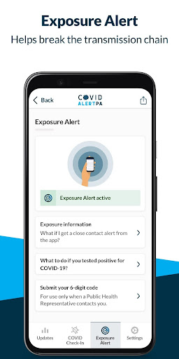
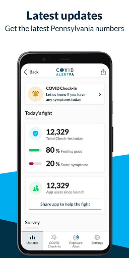
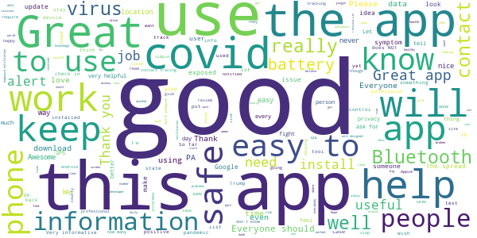
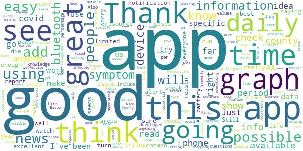

# COVID Alert PA
App version ``2.0.0``

Analyzed with [covid-apps-observer](http://github.com/covid-apps-observer) project, version ``0.1``

## App overview
| | |
|-------------------------|-------------------------| 
| **Name**&nbsp;&nbsp;&nbsp;&nbsp;&nbsp;&nbsp;&nbsp;&nbsp;&nbsp;&nbsp;&nbsp;&nbsp;&nbsp;&nbsp;&nbsp;&nbsp;&nbsp;&nbsp;&nbsp;&nbsp;&nbsp;&nbsp;&nbsp;&nbsp;&nbsp;&nbsp;&nbsp;&nbsp;&nbsp;&nbsp;&nbsp;&nbsp;&nbsp;&nbsp;&nbsp;&nbsp;&nbsp;&nbsp;&nbsp;&nbsp;  | COVID Alert PA |
| **Unique identifier** | gov.pa.covidtracker |
| **Link to Google Play** | [https://play.google.com/store/apps/details?id=gov.pa.covidtracker](https://play.google.com/store/apps/details?id=gov.pa.covidtracker) |
| **Summary**  | The COVID Alert PA app can help reduce the spread of coronavirus in Pennsylvania |
| **Privacy policy** | [https://www.health.pa.gov/topics/disease/coronavirus/Pages/COVIDAlert.aspx#privacy](https://www.health.pa.gov/topics/disease/coronavirus/Pages/COVIDAlert.aspx#privacy) |
| **Latest version** | 2.0.0 |
| **Last update** | 2021-02-23 21:02:46 |
| **Recent changes** | COVID-19 vaccine metrics and resources including Your Turn Eligibility tool and find vaccine provider locations near you. Updated data and privacy policy. |
| **Installs**  | 100,000+ |
| **Category** | Medical |
| **First release** | Sep 10, 2020 |
| **Size**  | 106M |
| **Supported Android version**  | 6.0 and up |

### Description
> The COVID Alert PA App (App) is made available by the Pennsylvania Department of Health (DOH). The App is designed to assist in alerting individuals that came in close proximity with someone who later tests positive for COVID-19, and to provide information about the virus and steps for controlling the spread of the virus.  
 The use of this App is entirely voluntary, and it is available to download for free from the Google Play Store. The App runs on Android phones running Android 6.0 and higher. You must be at least 18 years of age in order to accept these terms and use the App. If you are between the ages of 13 and 17, you can only use this App if your parent or legal guardian has reviewed and agreed to the use of the App on your behalf. A parent or legal guardian must confirm that you can use the App by consenting upon download and initial usage of the App. The App is not intended for use by children
 under the age of 13.,
 How the COVID Alert PA App works
 As opposed to the traditional contract tracing process where a positive COVID-19 individual may not even remember who they have been in contact with recently and for how long (for example, if the contact happened on a bus or a train or some other public venue), the App uses technology developed by Apple and Google where anonymous Random IDs (pseudo random alpha numeric values) are exchanged between mobile phones. A Random ID is generated by the phone every 10 to 20 minutes to maintain privacy and security. If you are close to someone who also uses the App on their phone, your Random ID will be saved on that person’s phone and their Random ID will be saved on your phone. All Random IDs collected will remain on your mobile device, but neither you, nor anyone else, will be able to see them. These anonymous Random IDs cannot reveal your identity to other users, DOH, Apple, Google or anyone else.
 If an individual receives a positive COVID-19 diagnosis, they will receive a call from DOH or their local county or municipal health department within 24-72 hours for case investigation and contact tracing purposes. If that individual has the App downloaded a 6-digit validation code will be sent to them via SMS/text message to be entered into the App, which then gives the individual the option to upload their Random IDs to a DOH diagnosis keys server. 
 Users who were in close contact with a positive COVID-19 individual who submitted their 6-digit code in the app will receive an Exposure Alert. The app knows when to provide the user with an Exposure Alert by downloading the latest diagnosis keys from the server every four hours and checking for matches. These diagnosis keys are checked for matches against the Random IDs of the contacts that have been collected by your phone. If there is a match, you will be notified in the app that you were in close contact with a person who was recently diagnosed with COVID-19. This is called an “Exposure Alert.  To ensure that Exposure Alerts work properly, users must have COVID-19 Exposure Notification Services (ENS) enabled on their phone. Users have the option to enable the COVID-19 ENS and permit their phone to display notifications when they have been exposed to someone who has tested positive for COVID-19. Users can turn off this functionality in the settings page of the App.
 In the event you receive an Exposure Notification, you will be offered advice on the Exposure Notification Information screen, and if you would like to speak with a public health representative, you can provide your phone number and someone from DOH will call you. 
 It is important to note that both traditional contact tracing and the App never reveal the identity of any person using the App to other App users, and never reveal who has been diagnosed as positive for COVID-19. Also, if you do not want a call from a public health representative and do not enter your phone number, DOH will not know whether you have received an Exposure Notification.

### User interface
The developers of the app provide the following screenshots in the Google play store.
| | | |
|:-------------------------:|:-------------------------:|:-------------------------:|
 |   |   |   | 
 |   |  

## Development team
In the following we report the main information provided by the development team in the Google play store.

| | |
|-------------------------|-------------------------|
| **Developer**  | Commonwealth of Pennsylvania |
| **Website**  | [https://www.pa.gov/covid/covid-alert-pa/](https://www.pa.gov/covid/covid-alert-pa/) |
| **Email** | RA-DH-CovidApp@pa.gov |
| **Physical address**  | - |
| **Other developed apps**  | [https://play.google.com/store/apps/developer?id=Commonwealth+of+Pennsylvania](https://play.google.com/store/apps/developer?id=Commonwealth+of+Pennsylvania) |

## Android support

| | |
|-------------------------|-------------------------|
| **Declared target Android version**  | Android10, version 10 (API level 29) |
| **Effective target Android version**  | Android10, version 10 (API level 29) |
| **Minimum supported Android version**  | Marshmallow, version 6.0 (API level 23) |
| **Maximum target Android version**  | - |

The larger the difference between the minimum and maximum supported Android versions, the better. A larger difference means a wider audience. For example, old phones have a very low Android version, so a high minimum supported Android version means that the app cannot be used by users with old phones, thus leading to accessibility problems. 

## Requested permissions

In the following we report the complete list of the permissions requested by the app. 

| **Permission** | **Protection level** | **Description** | 
|-------------------------|-------------------------|-------------------------|
 **android.permission ACCESS_NETWORK_STATE** | Normal | Allows applications to access information about networks. 
 **android.permission ACCESS_WIFI_STATE** | Normal | Allows applications to access information about Wi-Fi networks. 
 **android.permission BLUETOOTH** | Normal | Allows applications to connect to paired bluetooth devices. 
 **android.permission FOREGROUND_SERVICE** | Normal | Allows a regular application to use Service.startForeground. 
 **android.permission INTERNET** | Normal | Allows applications to open network sockets. 
 **android.permission RECEIVE_BOOT_COMPLETED** | Normal | Allows an application to receive the Intent.ACTION_BOOT_COMPLETED that is broadcast after the system finishes booting. 
 **android.permission VIBRATE** | Normal | Allows access to the vibrator. 

## Mentioned servers

| **Server** | **Registrant** | **Registrant country** | **Creation date** | 
|-------------------------|-------------------------|-------------------------|-------------------------|
 | android.com | Google LLC | :us: US | 1997-06-23 04:00:00 |
 | google.com | Google LLC | :us: US | 1997-09-15 04:00:00 |
 | expo.io | See PrivacyGuardian.org | :us: US | 2011-05-01 21:26:50 |

## Security analysis 

Below we report the main security warnings raised by our execution of the [Androwarn](https://github.com/maaaaz/androwarn) security analysis tool.

**Telephony identifiers leakage**
> - This application reads the MCC+MNC of the provider of the SIM 
> - This application reads the numeric name (MCC+MNC) of current registered operator 
> - This application reads the operator name 

**Connection interfaces exfiltration**
> - This application reads details about the currently active data network 
> - This application tries to find out if the currently active data network is metered 

**Suspicious connection establishment**
> - This application opens a Socket and connects it to the remote address ' returned no addresses for  ; port is out of range' on the 'N/A' port  
> - This application opens a Socket and connects it to the remote address '' on the 'N/A' port  
> - This application opens a Socket and connects it to the remote address 'Ljava/lang/StringBuilder;->toString()Ljava/lang/String;' on the 'N/A' port  
> - This application opens a Socket and connects it to the remote address 'Ljava/net/Proxy;->type()Ljava/net/Proxy$Type;' on the 'N/A' port  
> - This application opens a Socket and connects it to the remote address 'timeout' on the 'N/A' port  

**Pim data leakage**
> - This application accesses data stored in the clipboard 

**Code execution**
> - This application loads a native library 
> - This application executes a UNIX command 

## User ratings and reviews

Below we provide information about how end users are reacting to the app in terms of ratings and reviews in the Google Play store.

### Ratings

The COVID Alert PA app has been installed by more than **100000** times. At this time, **1124** rated the app and its average score is **3.699115**. Below we show the distribution of the ratings across the usual star-based rating of Google Play

:star::star::star::star::star:: 588

:star::star::star::star:: 129

:star::star::star:: 119

:star::star:: 59

:star:: 229

### Reviews 

#### 5-star reviews

> It Keeps Everybody Ahware of The Virous  :date: __2021-07-19 00:02:15__

> It worked fine until yesterday; Blue screen others mentioned. Will re install once you give a news worthy all clear, Til then.  :date: __2021-07-18 10:23:47__

> I cant get into the website to tell you how I am feeling What can I do to get on it?  :date: __2021-07-18 04:25:11__

> 😁 good staying up on the current SCIENCE. hard to believe there are still alott of people who have access to vaccinations, but CHOOSE not to get vaccinated. I guess you can lead a horse to water, but you can't force them to drink. Maybe a stay in the ICU on ventilator will have an effect.  :date: __2021-07-17 01:03:55__

> I gave a 5 star rating because I believe this app is a very necessary source of protection.  :date: __2021-07-14 04:05:38__

> I give it a great rating for vast amount of information it opens me to. I got my Vax notice as to availability through this. Good work.  :date: __2021-07-11 14:08:55__

> Very helpful to see any trends developing with infections and/or vaccines.too many ads tho!  :date: __2021-07-07 11:22:48__

> Awesome application that was released by the gov.. which is pretty dope on their par  :date: __2021-07-06 15:57:24__

> Great for keeping track of cases in PA, breaks down each county, also uses Bluetooth to alert you if someone else who has the app downloaded and marked themselves as being sick or having covid, has been in close proximity to you  :date: __2021-07-05 14:43:27__

> Good game 10/10 would play again  :date: __2021-06-21 10:17:34__

#### 4-star reviews

> I love this app but for some reason as of today, it won't show anything but a blue screen. It's trying to load, but doesn't. I can't report my daily check-in or see what cases were added within my county. I hope this gets fixed because if isn't working, how is it going to alert me about a possible infected person. Forgot to add.. some are saying too many adds. I haven't had one ad since I've been using this app for over a year.  :date: __2021-07-10 18:23:59__

> Nice  :date: __2021-07-05 08:08:28__

> Runs fast but not accurate  :date: __2021-05-14 04:26:13__

> This app is good and I've been using it.  :date: __2021-05-06 03:38:58__

> Straight out of house of cards  :date: __2021-03-27 20:53:33__

> Trying to get the Vaccine.  :date: __2021-03-16 05:29:45__

> Not real sure it actually works. I've been out shopping for Necessities and it's never went off yet & info stats are available before noon news.  :date: __2021-02-05 22:53:56__

> It explains the flue and what to do and not do it's informal seams in ts right on with the hole country.  :date: __2021-01-21 01:16:24__

> good site to get reliable facts easy to read ,navigation  :date: __2021-01-09 20:17:36__

> Made my phone die dead like go black and never turn on again.  :date: __2021-01-07 01:42:27__

#### 3-star reviews

> Please fix the blue screen bug. Last few days it loads then goes directly to blue screen. I even uninstalled and reinstalled.  :date: __2021-07-18 03:49:04__

> When you log in to check the app out it go to a black screen where you can not see it  :date: __2021-07-11 01:53:17__

> This app worked great on my pixel 2, but will not work at all on look at all on my Galaxy S galaxy S21. I downloaded the latest version.. Can you update please?  :date: __2021-07-11 00:30:16__

> I've used this since it launched last September. Today, it starts loading then goes to a blue screen. Uninstalled & reinstalled, restarted phone (Galaxy A20), signed out& back in w/Google, bluetooth is on...totally stumped and frustrated.  :date: __2021-07-10 20:43:50__

> Usable. But this app *could* be so much more.  :date: __2021-05-01 11:32:47__

> Meh... This app NEEDS an "I've been vaccinated" indicator and a way to store and prove vaccination information. Get on it.  :date: __2021-04-04 17:05:03__

> Covid-19, I know Corona Virus has changed all! I'm super disappointed in are system! China is swiping anal canal now! My only concern is, the ones with higher strang will probably be cloned in a robot! Biggest organ, Skinned perfectly put on Technology Robot. The real human to all but died of covid-19, to battle a working world for the humans that survived! At one time only one child. Wanting Boy. Afraid of the power of desperation! I know USA is a abarsement. President Trump, I believe in You  :date: __2021-03-09 11:08:59__

> Not what I expected, not the kind of information I was looking for.  :date: __2021-02-06 08:04:10__

> Now that there's a vaccine why don't you show where there's a vaccine. It's great that you have this app available and I've been using it for 10 months but can we pivot to showing where vaccines are or trying to help out with where that is? It's great finding out about all the problems with COVID but now that there's actually a solution available it'd be good to know where to find them instead of going to 50 different websites  :date: __2021-02-02 04:03:23__

> I suggest adding PA stats about vaccinations....as well as info on or even ability to make a vaccine appointment...and current phase status  :date: __2021-01-22 05:24:51__

#### 2-star reviews

> Used to work. Now it starts up and for a second it shows the screen asking if you have any symptoms, but then the screen turns to a blank blue screen.  :date: __2021-07-18 08:01:19__

> Stopped working after latest security update. It's just a blue screen as many others are also reporting. They don't seem to be inspired to fix it.  :date: __2021-07-17 15:05:07__

> Stopped working and bogged my phone way down after latest ATT OS upgrade. Before that it was ok but its numbers never matched the numbers published in the news media. Uninstalled. Samsung A11  :date: __2021-07-11 15:06:08__

> Screen goes blue after initial startup an wont do anything else. I tried uninstalling an reinstalling 2 see if it would fix it an it won't 😡  :date: __2021-07-11 12:21:30__

> Worked ok for a while, did it's job, but now Everytime I load in I get a dark blue screen and can't do anything, I even reinstalled and it is doing the same thing.  :date: __2021-07-10 16:30:03__

> Worked ok I think but then it started to check for keys and just kept doing that. That needs to stop. I rebooted too but that didn't reset it.  :date: __2021-06-13 22:29:17__

> Nice idea, but ultimately served little purpose due to lack of any real functionality. Good source of data regarding state and local case numbers but served zero purpose otherwise. App didn't know when an individual was positive or not so exposure alert was useless.  :date: __2021-05-22 16:26:48__

> Works great when I first installed it but now I can't even get on it  :date: __2021-03-29 22:20:37__

> I received a contact tracing covid alert on 3.11.2021. It did not tell me when this happened so i had no idea what to do. Got tested, Negative, but no clear time line to quarantine since no date of exposure was given  :date: __2021-03-16 13:14:29__

> Forces you to page back through EVERY month of EVERY year to get to your date of birth, rather than either just typing it or selecting the year from a list. I just don't have enough time to page back that far.  :date: __2021-03-09 15:51:30__

#### 1-star reviews

> #a11y fail. Check in and all other screens no longer work with talkback running. App is uninstalled. You have a fiend in Pennsylvania!  :date: __2021-07-18 04:50:16__

> App was fine now just blue screen after a nrief display of the first screen.  :date: __2021-07-18 01:41:08__

> I'm giving 1 star right now hoping the devs see this. I haven't been able to use the app the last couple days. Uninstalled/reinstalled, but keeps freezing—can't do daily check-in or anything. Please fix this! Just read other reviews and saw I'm not the only person with the dark blue frozen screen. My problem just started yesterday, but other ppl were frozen since 7/10/21, so it's been a week already. 😢  :date: __2021-07-17 22:51:02__

> Broke blue screen will not load any data...  :date: __2021-07-17 17:56:07__

> Was a solid 5 stars, but now it refuses to do more than show a blue screen. Uninstalled and reinstalled only to get the same issue. I guess I have to take my chances without contract tracing or being able to make informed choices based on the illness and death rates in PA... When this is fixed, I will update my rating accordingly.  :date: __2021-07-17 16:05:59__

> I've had app for about a year. Now it won't open. Must be a problem somewhere. I uninstalled it and reinstalled it. Still won't open.  :date: __2021-07-11 02:50:48__

> Getting blank screen now  :date: __2021-07-11 02:38:39__

> Does not work on my new phone. After a few seconds screen turns dark blue and does not display any information.  :date: __2021-07-11 02:35:01__

> Screen turns blue obviously it's out of commission for now  :date: __2021-07-10 23:32:19__

> What happened? I went to check the latest update on the new cases and it goes back off. Please fix! It's not working!  :date: __2021-07-10 20:18:48__

