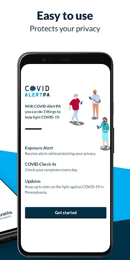

# COVID Alert PA
App version ``2.0.0``

Analyzed with [covid-apps-observer](http://github.com/covid-apps-observer) project, version ``0.1``

## App overview
| | |
|-------------------------|-------------------------| 
| **Name**&nbsp;&nbsp;&nbsp;&nbsp;&nbsp;&nbsp;&nbsp;&nbsp;&nbsp;&nbsp;&nbsp;&nbsp;&nbsp;&nbsp;&nbsp;&nbsp;&nbsp;&nbsp;&nbsp;&nbsp;&nbsp;&nbsp;&nbsp;&nbsp;&nbsp;&nbsp;&nbsp;&nbsp;&nbsp;&nbsp;&nbsp;&nbsp;&nbsp;&nbsp;&nbsp;&nbsp;&nbsp;&nbsp;&nbsp;&nbsp;  | COVID Alert PA |
| **Unique identifier** | gov.pa.covidtracker |
| **Link to Google Play** | [https://play.google.com/store/apps/details?id=gov.pa.covidtracker](https://play.google.com/store/apps/details?id=gov.pa.covidtracker) |
| **Summary**  | The COVID Alert PA app can help reduce the spread of coronavirus in Pennsylvania |
| **Privacy policy** | [https://www.health.pa.gov/topics/disease/coronavirus/Pages/COVIDAlert.aspx#privacy](https://www.health.pa.gov/topics/disease/coronavirus/Pages/COVIDAlert.aspx#privacy) |
| **Latest version** | 2.0.0 |
| **Last update** | 2021-02-23 21:02:46 |
| **Recent changes** | COVID-19 vaccine metrics and resources including Your Turn Eligibility tool and find vaccine provider locations near you. Updated data and privacy policy. |
| **Installs**  | 100,000+ |
| **Category** | Medical |
| **First release** | Sep 10, 2020 |
| **Size**  | 106M |
| **Supported Android version**  | 6.0 and up |

### Description
> The COVID Alert PA App (App) is made available by the Pennsylvania Department of Health (DOH). The App is designed to assist in alerting individuals that came in close proximity with someone who later tests positive for COVID-19, and to provide information about the virus and steps for controlling the spread of the virus.  
 The use of this App is entirely voluntary, and it is available to download for free from the Google Play Store. The App runs on Android phones running Android 6.0 and higher. You must be at least 18 years of age in order to accept these terms and use the App. If you are between the ages of 13 and 17, you can only use this App if your parent or legal guardian has reviewed and agreed to the use of the App on your behalf. A parent or legal guardian must confirm that you can use the App by consenting upon download and initial usage of the App. The App is not intended for use by children
 under the age of 13.,
 How the COVID Alert PA App works
 As opposed to the traditional contract tracing process where a positive COVID-19 individual may not even remember who they have been in contact with recently and for how long (for example, if the contact happened on a bus or a train or some other public venue), the App uses technology developed by Apple and Google where anonymous Random IDs (pseudo random alpha numeric values) are exchanged between mobile phones. A Random ID is generated by the phone every 10 to 20 minutes to maintain privacy and security. If you are close to someone who also uses the App on their phone, your Random ID will be saved on that person’s phone and their Random ID will be saved on your phone. All Random IDs collected will remain on your mobile device, but neither you, nor anyone else, will be able to see them. These anonymous Random IDs cannot reveal your identity to other users, DOH, Apple, Google or anyone else.
 If an individual receives a positive COVID-19 diagnosis, they will receive a call from DOH or their local county or municipal health department within 24-72 hours for case investigation and contact tracing purposes. If that individual has the App downloaded a 6-digit validation code will be sent to them via SMS/text message to be entered into the App, which then gives the individual the option to upload their Random IDs to a DOH diagnosis keys server. 
 Users who were in close contact with a positive COVID-19 individual who submitted their 6-digit code in the app will receive an Exposure Alert. The app knows when to provide the user with an Exposure Alert by downloading the latest diagnosis keys from the server every four hours and checking for matches. These diagnosis keys are checked for matches against the Random IDs of the contacts that have been collected by your phone. If there is a match, you will be notified in the app that you were in close contact with a person who was recently diagnosed with COVID-19. This is called an “Exposure Alert.  To ensure that Exposure Alerts work properly, users must have COVID-19 Exposure Notification Services (ENS) enabled on their phone. Users have the option to enable the COVID-19 ENS and permit their phone to display notifications when they have been exposed to someone who has tested positive for COVID-19. Users can turn off this functionality in the settings page of the App.
 In the event you receive an Exposure Notification, you will be offered advice on the Exposure Notification Information screen, and if you would like to speak with a public health representative, you can provide your phone number and someone from DOH will call you. 
 It is important to note that both traditional contact tracing and the App never reveal the identity of any person using the App to other App users, and never reveal who has been diagnosed as positive for COVID-19. Also, if you do not want a call from a public health representative and do not enter your phone number, DOH will not know whether you have received an Exposure Notification.

### User interface
The developers of the app provide the following screenshots in the Google play store.
| | | |
|:-------------------------:|:-------------------------:|:-------------------------:|
 |   |   |   | 
 |   |  

## Development team
In the following we report the main information provided by the development team in the Google play store.

| | |
|-------------------------|-------------------------|
| **Developer**  | Commonwealth of Pennsylvania |
| **Website**  | [https://www.pa.gov/covid/covid-alert-pa/](https://www.pa.gov/covid/covid-alert-pa/) |
| **Email** | RA-DH-CovidApp@pa.gov |
| **Physical address**  | - |
| **Other developed apps**  | [https://play.google.com/store/apps/developer?id=Commonwealth+of+Pennsylvania](https://play.google.com/store/apps/developer?id=Commonwealth+of+Pennsylvania) |

## Android support

| | |
|-------------------------|-------------------------|
| **Declared target Android version**  | Android10, version 10 (API level 29) |
| **Effective target Android version**  | Android10, version 10 (API level 29) |
| **Minimum supported Android version**  | Marshmallow, version 6.0 (API level 23) |
| **Maximum target Android version**  | - |

The larger the difference between the minimum and maximum supported Android versions, the better. A larger difference means a wider audience. For example, old phones have a very low Android version, so a high minimum supported Android version means that the app cannot be used by users with old phones, thus leading to accessibility problems. 

## Requested permissions

In the following we report the complete list of the permissions requested by the app. 

| **Permission** | **Protection level** | **Description** | 
|-------------------------|-------------------------|-------------------------|
 **android.permission ACCESS_NETWORK_STATE** | Normal | Allows applications to access information about networks. 
 **android.permission ACCESS_WIFI_STATE** | Normal | Allows applications to access information about Wi-Fi networks. 
 **android.permission BLUETOOTH** | Normal | Allows applications to connect to paired bluetooth devices. 
 **android.permission FOREGROUND_SERVICE** | Normal | Allows a regular application to use Service.startForeground. 
 **android.permission INTERNET** | Normal | Allows applications to open network sockets. 
 **android.permission RECEIVE_BOOT_COMPLETED** | Normal | Allows an application to receive the Intent.ACTION_BOOT_COMPLETED that is broadcast after the system finishes booting. 
 **android.permission VIBRATE** | Normal | Allows access to the vibrator. 

## Mentioned servers

| **Server** | **Registrant** | **Registrant country** | **Creation date** | 
|-------------------------|-------------------------|-------------------------|-------------------------|
 | android.com | Google LLC | :us: US | 1997-06-23 04:00:00 |
 | google.com | Google LLC | :us: US | 1997-09-15 04:00:00 |
 | expo.io | See PrivacyGuardian.org | :us: US | 2011-05-01 21:26:50 |

## Security analysis 

Below we report the main security warnings raised by our execution of the [Androwarn](https://github.com/maaaaz/androwarn) security analysis tool.

**Telephony identifiers leakage**
> - This application reads the MCC+MNC of the provider of the SIM 
> - This application reads the numeric name (MCC+MNC) of current registered operator 
> - This application reads the operator name 

**Connection interfaces exfiltration**
> - This application reads details about the currently active data network 
> - This application tries to find out if the currently active data network is metered 

**Suspicious connection establishment**
> - This application opens a Socket and connects it to the remote address ' returned no addresses for  ; port is out of range' on the 'N/A' port  
> - This application opens a Socket and connects it to the remote address '' on the 'N/A' port  
> - This application opens a Socket and connects it to the remote address 'Ljava/lang/StringBuilder;->toString()Ljava/lang/String;' on the 'N/A' port  
> - This application opens a Socket and connects it to the remote address 'Ljava/net/Proxy;->type()Ljava/net/Proxy$Type;' on the 'N/A' port  
> - This application opens a Socket and connects it to the remote address 'timeout' on the 'N/A' port  

**Pim data leakage**
> - This application accesses data stored in the clipboard 

**Code execution**
> - This application loads a native library 
> - This application executes a UNIX command 

## User ratings and reviews

Below we provide information about how end users are reacting to the app in terms of ratings and reviews in the Google Play store.

### Ratings

The COVID Alert PA app has been installed by more than **100000** times. At this time, **1124** rated the app and its average score is **3.699115**. Below we show the distribution of the ratings across the usual star-based rating of Google Play

:star::star::star::star::star:: 588

:star::star::star::star:: 129

:star::star::star:: 119

:star::star:: 59

:star:: 229

### Reviews 

#### 5-star reviews

> Thank you  :date: __2021-06-04 18:27:53__

> I love receiving The Worldwide updates of what's going on in the world of covid-19  :date: __2021-04-28 08:05:52__

> Ok  :date: __2021-04-23 15:32:32__

> I am trying to a vaccine appointment.  :date: __2021-04-22 04:29:52__

> Very helpful  :date: __2021-04-19 05:39:52__

> Good  :date: __2021-04-06 21:16:20__

> Awesome  :date: __2021-04-05 06:41:20__

> Ok  :date: __2021-04-05 04:33:50__

> It's very easy to understand and to follow Thank You very much.  :date: __2021-03-30 00:17:42__

> Ih  :date: __2021-03-24 19:07:31__

#### 4-star reviews

> Runs fast but not accurate  :date: __2021-05-14 04:26:13__

> This app is good and I've been using it.  :date: __2021-05-06 03:38:58__

> Straight out of house of cards  :date: __2021-03-27 20:53:33__

> Trying to get the Vaccine.  :date: __2021-03-16 05:29:45__

> Not real sure it actually works. I've been out shopping for Necessities and it's never went off yet & info stats are available before noon news.  :date: __2021-02-05 22:53:56__

> It explains the flue and what to do and not do it's informal seams in ts right on with the hole country.  :date: __2021-01-21 01:16:24__

> good site to get reliable facts easy to read ,navigation  :date: __2021-01-09 20:17:36__

> Made my phone die dead like go black and never turn on again.  :date: __2021-01-07 01:42:27__

> It's the least people can do  :date: __2021-01-02 03:38:12__

> Good idea!  :date: __2020-12-23 02:40:26__

#### 3-star reviews

> Usable. But this app *could* be so much more.  :date: __2021-05-01 11:32:47__

> Meh... This app NEEDS an "I've been vaccinated" indicator and a way to store and prove vaccination information. Get on it.  :date: __2021-04-04 17:05:03__

> Covid-19, I know Corona Virus has changed all! I'm super disappointed in are system! China is swiping anal canal now! My only concern is, the ones with higher strang will probably be cloned in a robot! Biggest organ, Skinned perfectly put on Technology Robot. The real human to all but died of covid-19, to battle a working world for the humans that survived! At one time only one child. Wanting Boy. Afraid of the power of desperation! I know USA is a abarsement. President Trump, I believe in You  :date: __2021-03-09 11:08:59__

> Not what I expected, not the kind of information I was looking for.  :date: __2021-02-06 08:04:10__

> Now that there's a vaccine why don't you show where there's a vaccine. It's great that you have this app available and I've been using it for 10 months but can we pivot to showing where vaccines are or trying to help out with where that is? It's great finding out about all the problems with COVID but now that there's actually a solution available it'd be good to know where to find them instead of going to 50 different websites  :date: __2021-02-02 04:03:23__

> I suggest adding PA stats about vaccinations....as well as info on or even ability to make a vaccine appointment...and current phase status  :date: __2021-01-22 05:24:51__

> Bad this app should notify those doctor to go and give those the vacinne that have fill the information out not have people out in large line and groups with this you have better control create job to new nursing school student to help in is fight  :date: __2021-01-21 07:21:53__

> Pros: It checks in everyday to review symptoms. It tells you information about what the rest of the app users symptoms were. It keeps up to date on what it is expected to. Con: I had my mom get Covid, and at the time I lived with her. I couldn't figure out how to report that since I tested negative. Not long after my family finished quarantine, my sister tested positive . I got tested again and was still negative, but technically I was exposed.  :date: __2021-01-15 09:05:20__

> It says my exposure isd turned of but doesn't allow me to turn it on.  :date: __2021-01-13 04:53:18__

> It would be nice if there was a spot on the daily check in section of the app that had a CURRENT LOST OF SYMPTOMS. Just asking if you're okay or not doesn't help people to realize if they may have symptoms or not.  :date: __2021-01-11 14:21:29__

#### 2-star reviews

> Nice idea, but ultimately served little purpose due to lack of any real functionality. Good source of data regarding state and local case numbers but served zero purpose otherwise. App didn't know when an individual was positive or not so exposure alert was useless.  :date: __2021-05-22 16:26:48__

> Works great when I first installed it but now I can't even get on it  :date: __2021-03-29 22:20:37__

> I received a contact tracing covid alert on 3.11.2021. It did not tell me when this happened so i had no idea what to do. Got tested, Negative, but no clear time line to quarantine since no date of exposure was given  :date: __2021-03-16 13:14:29__

> Forces you to page back through EVERY month of EVERY year to get to your date of birth, rather than either just typing it or selecting the year from a list. I just don't have enough time to page back that far.  :date: __2021-03-09 15:51:30__

> Had to go back 73yrs just to get to your site with a arrow one by one.  :date: __2021-03-04 18:57:57__

> So introverted I was never around anyone long enough to set it off, but I was around people who contracted covid  :date: __2021-02-25 14:50:54__

> Same old info every day. Got name in 5-6 places. Much more vaccine than Delivery  :date: __2021-02-07 23:49:49__

> Exposure alert does not work, or I'll get a call next month that I've been exposed to COVID 6 weeks after it matters. A co-worker, that has the app with the alert ON, tested positive weeks ago. I work side by side with him everyday and found out a week after he was out why he was out. Not through the app though.  :date: __2021-01-31 00:01:31__

> Only good if you live in PA. Not valid for anywhere else.  :date: __2021-01-24 17:58:17__

> Where's the question of have you been vaccinated? Let's see the important info and show how PA is lagging behind.  :date: __2021-01-22 18:14:18__

#### 1-star reviews

> This app is worthless. They dont use actual hospital or govt med records to create the database. My neighbor had covid, went to the hospital, it never alerted. So what's the point? Less than 1M people used it. Philly 7M people, PA over 20M. It's worthless. I can get the same alerts from Philly's OEM text service. Even Citizen app. This has no reliable functionality other than giving current Covid numbers. It can't warn you effectively.  :date: __2021-06-07 14:12:29__

> Biggest hoax!  :date: __2021-06-06 20:23:45__

> Junk app.. get it off my screen I'm tired of seeing it  :date: __2021-05-30 20:23:30__

> The numbers for total cases, hospitalizations and deaths given in this app are incorrect. This should be investigated and rectified. The Commonwealth itself is spreading misinformation. Shame on them. Remain vigilent and know your source information. Don't waste your time with this app. It's useless.  :date: __2021-05-29 23:04:50__

> Why is there no obvious way to designate if I've received a COVID positive test to propntly warn the people I've possibly exposed to the disease?! If this is a feature, it's hidden deep in the app. I would have put that at the top of the home page. What exactly is the utility of this app? :(  :date: __2021-05-24 22:27:42__

> This was pointless. I was in contact with someone who tested positive, but no one ever gave them a code to enter and I never got an alert  :date: __2021-05-23 02:04:07__

> Pointless app.  :date: __2021-05-22 02:53:46__

> Inaccurate reports. Overall, the order from most cases to least cases by county put the counties in the correct positions. However, daily reports of cases are wrong....FACT...USELESS APP  :date: __2021-05-14 21:39:49__

> Old data. The paper has more current numbers. How is that even possible?  :date: __2021-05-12 15:15:20__

> Privacy concerns - after all the promises of privacy and safeguards, 70,000 people had their private information from the company doing contact tracing leaked online. Pass on the government Spyware.  :date: __2021-05-12 13:35:48__

