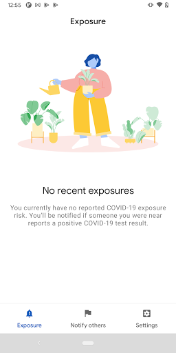
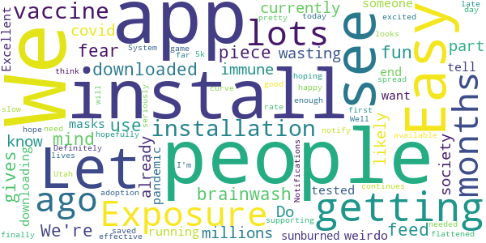
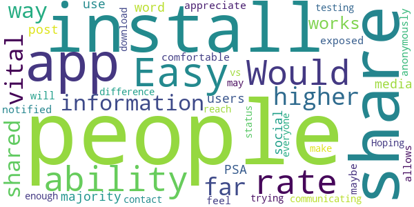
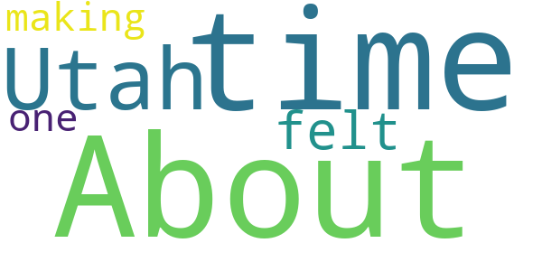

# UT Exposure Notifications
App version ``minted150004``

Analyzed with [covid-apps-observer](http://github.com/covid-apps-observer) project, version ``0.1``

## App overview
| | |
|-------------------------|-------------------------| 
| **Name**&nbsp;&nbsp;&nbsp;&nbsp;&nbsp;&nbsp;&nbsp;&nbsp;&nbsp;&nbsp;&nbsp;&nbsp;&nbsp;&nbsp;&nbsp;&nbsp;&nbsp;&nbsp;&nbsp;&nbsp;&nbsp;&nbsp;&nbsp;&nbsp;&nbsp;&nbsp;&nbsp;&nbsp;&nbsp;&nbsp;&nbsp;&nbsp;&nbsp;&nbsp;&nbsp;&nbsp;&nbsp;&nbsp;&nbsp;&nbsp;  | UT Exposure Notifications |
| **Unique identifier** | gov.ut.covid19.exposurenotifications |
| **Link to Google Play** | [https://play.google.com/store/apps/details?id=gov.ut.covid19.exposurenotifications](https://play.google.com/store/apps/details?id=gov.ut.covid19.exposurenotifications) |
| **Summary**  | The official exposure notification app for Utah |
| **Privacy policy** | [https://coronavirus.utah.gov/EN-privacy-policy/](https://coronavirus.utah.gov/EN-privacy-policy/) |
| **Latest version** | minted150004 |
| **Last update** | 2021-02-09 22:02:23 |
| **Recent changes** | Bug fixes and performance improvements |
| **Installs**  | 10,000+ |
| **Category** | Medical |
| **First release** | Feb 8, 2021 |
| **Size**  | 10M |
| **Supported Android version**  | 5.0 and up |

### Description
> UT Exposure Notifications is the official Exposure Notifications app of Utah and the Utah Department of Health. Exposure Notifications is a voluntary new service developed in partnership with Google and Apple to help slow the spread of COVID-19. No GPS, location information or personal identifiers will ever be collected, stored or shared by this service.
 UT Exposure Notifications can quickly notify you if you've likely been exposed to COVID-19. Knowing about a potential exposure allows you to reduce the risk to your family, friends, neighbors and community.
 By enabling Exposure Notifications, whenever you were closer than 6 feet from someone who has the virus for a cumulative total of 15 minutes or longer in a 24 hour period, both phones will exchange secure, anonymous tokens using Bluetooth. If another user you’ve been near tests positive for COVID-19, they can upload their result to the app which will send a push notification to you and anyone else their phone has exchanged tokens with recently, notifying you of a possible exposure.
 If you test positive, you can easily and anonymously notify others to help stop the spread of COVID-19.
 Learn more: https://coronavirus.utah.gov/exposure-notifications/

### User interface
The developers of the app provide the following screenshots in the Google play store.
| | | |
|:-------------------------:|:-------------------------:|:-------------------------:|
 |   |  

## Development team
In the following we report the main information provided by the development team in the Google play store.

| | |
|-------------------------|-------------------------|
| **Developer**  | Utah Department Of Health |
| **Website**  | - |
| **Email** | contact.tracing@utah.gov |
| **Physical address**  | - |
| **Other developed apps**  | [https://play.google.com/store/apps/developer?id=Utah+Department+Of+Health](https://play.google.com/store/apps/developer?id=Utah+Department+Of+Health) |

## Android support

| | |
|-------------------------|-------------------------|
| **Declared target Android version**  | - |
| **Effective target Android version**  | - |
| **Minimum supported Android version**  | Lollipop, version 5.0 (API level 21) |
| **Maximum target Android version**  | - |

The larger the difference between the minimum and maximum supported Android versions, the better. A larger difference means a wider audience. For example, old phones have a very low Android version, so a high minimum supported Android version means that the app cannot be used by users with old phones, thus leading to accessibility problems. 

## Requested permissions

In the following we report the complete list of the permissions requested by the app. 

| **Permission** | **Protection level** | **Description** | 
|-------------------------|-------------------------|-------------------------|
 **android.permission ACCESS_NETWORK_STATE** | Normal | Allows applications to access information about networks. 
 **android.permission BLUETOOTH** | Normal | Allows applications to connect to paired bluetooth devices. 
 **android.permission FOREGROUND_SERVICE** | Normal | Allows a regular application to use Service.startForeground. 
 **android.permission INTERNET** | Normal | Allows applications to open network sockets. 
 **android.permission RECEIVE_BOOT_COMPLETED** | Normal | Allows an application to receive the Intent.ACTION_BOOT_COMPLETED that is broadcast after the system finishes booting. 
 **android.permission WAKE_LOCK** | Normal | Allows using PowerManager WakeLocks to keep processor from sleeping or screen from dimming. 

## Mentioned servers

| **Server** | **Registrant** | **Registrant country** | **Creation date** | 
|-------------------------|-------------------------|-------------------------|-------------------------|
 | google.com | Google LLC | :us: US | 1997-09-15 04:00:00 |

## Security analysis 

Below we report the main security warnings raised by our execution of the [Androwarn](https://github.com/maaaaz/androwarn) security analysis tool.

**Telephony identifiers leakage**
> - This application reads the ISO country code equivalent of the current registered operator's MCC (Mobile Country Code) 

**Connection interfaces exfiltration**
> - This application reads details about the currently active data network 
> - This application tries to find out if the currently active data network is metered 

**Suspicious connection establishment**
> - This application opens a Socket and connects it to the remote address 'timeout' on the 'N/A' port  

**Code execution**
> - This application loads a native library: 'prioclient' 

## User ratings and reviews

Below we provide information about how end users are reacting to the app in terms of ratings and reviews in the Google Play store.

### Ratings

The UT Exposure Notifications app has been installed by more than **10000** times. At this time, **19** rated the app and its average score is **4.368421**. Below we show the distribution of the ratings across the usual star-based rating of Google Play

:star::star::star::star::star:: 14

:star::star::star::star:: 2

:star::star::star:: 1

:star::star:: 0

:star:: 2

### Reviews 

#### 5-star reviews

> I downloaded this just for fun. Let's see if it can brainwash me or feed me fear 🐑🐑  :date: __2021-02-25 17:08:37__

> We're currently wasting millions of vaccines on people who have already had covid and are likely immune, but don't know it. Do your part for getting society up and running by downloading this app, getting tested, and not being a weirdo about masks. We all want the end of the pandemic.  :date: __2021-02-23 21:46:23__

> Excellent to have someone tell you you're sunburned or not  :date: __2021-02-20 13:50:05__

> Definitely late to the game, but I am happy to see Utah finally supporting the Exposure Notifications System.  :date: __2021-02-20 08:31:48__

> Let's hope enough people install this.  :date: __2021-02-19 09:27:52__

> I'm excited for an app to notify about exposure, if we had this 6-9 months ago we could have seriously flattened the curve and saved lots of lives. This app will need pretty good installation rate to be effective. It looks like 5k installations today so far.(I think this is the first day), hopefully the adoption continues. We needed this 6-9 months ago, before the vaccine was available to slow the spread. Well here's hoping lots of people install it!  :date: __2021-02-17 23:44:40__

> Easy install.  :date: __2021-02-17 21:08:07__

#### 4-star reviews

> Easy install and ability to share the app with others. Would rate it higher but so far no vital information has been shared as the only way it works is if a majority of people install/use it. PSA to other users....Share the word post it on social media.  :date: __2021-02-20 20:10:22__

> I appreciate that this app allows people to be notified anonymously that they've been exposed so maybe people will feel more comfortable communicating testing status vs trying to reach out to everyone they may have been in contact with. Hoping enough people download it to make a difference.  :date: __2021-02-19 16:42:16__

#### 3-star reviews

> About time Utah felt like making one.  :date: __2021-02-17 19:52:56__

#### 2-star reviews

No recent reviews available with 2 stars.

#### 1-star reviews

> Grose invasion of privacy  :date: __2021-02-26 16:18:34__

> No one is even a tiny bit concerned as to how this app works......really?  :date: __2021-02-26 04:18:09__

> Violation of HIPPA. My medical history is none of your business. You thought your phone was tracking you before? Wear a mask and mind your own.  :date: __2021-02-25 17:19:14__

> You have to have bluetooth on and location on all the time. B.S.  :date: __2021-02-24 19:25:47__

> Let's you know if you've been exposed to the China Flu!!! You only have a 99.7% chance to live!! Oh no!!! Much scary!! Better give up your freedoms and hide behind 13 masks if you want to survive!!!  :date: __2021-02-23 18:14:02__

> Very intrusive. Runs during phone calls. It also drains my battery.  :date: __2021-02-21 07:28:36__

> Yeah... I'm just not okay with this. Like I get they want to beat the virus, but letting everyone know you have it is a bit much. Not everyone needs to know.  :date: __2021-02-18 05:17:28__

