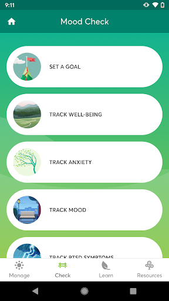
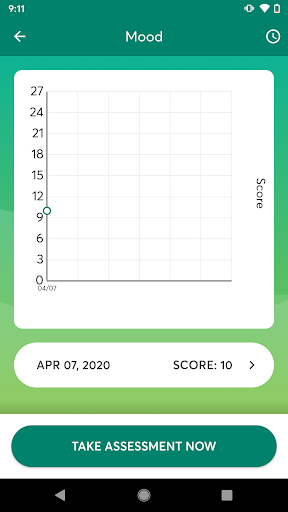
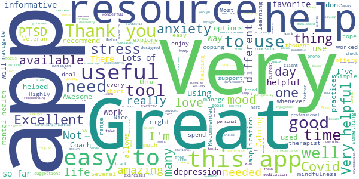
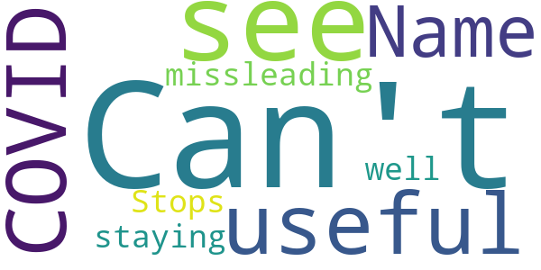
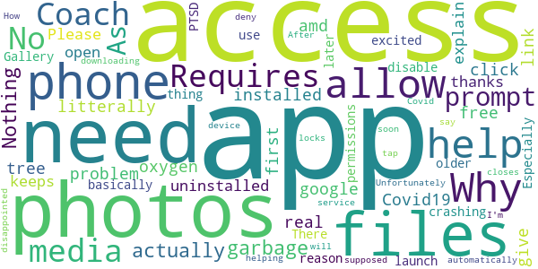

# COVID Coach
App version ``1.6``

Analyzed with [covid-apps-observer](http://github.com/covid-apps-observer) project, version ``0.1``

## App overview
| | |
|-------------------------|-------------------------| 
| **Name**&nbsp;&nbsp;&nbsp;&nbsp;&nbsp;&nbsp;&nbsp;&nbsp;&nbsp;&nbsp;&nbsp;&nbsp;&nbsp;&nbsp;&nbsp;&nbsp;&nbsp;&nbsp;&nbsp;&nbsp;&nbsp;&nbsp;&nbsp;&nbsp;&nbsp;&nbsp;&nbsp;&nbsp;&nbsp;&nbsp;&nbsp;&nbsp;&nbsp;&nbsp;&nbsp;&nbsp;&nbsp;&nbsp;&nbsp;&nbsp;  | COVID Coach |
| **Unique identifier** | gov.va.mobilehealth.ncptsd.covid |
| **Link to Google Play** | [https://play.google.com/store/apps/details?id=gov.va.mobilehealth.ncptsd.covid](https://play.google.com/store/apps/details?id=gov.va.mobilehealth.ncptsd.covid) |
| **Summary**  | Cope with stress &amp; stay well |
| **Privacy policy** | [https://www.ptsd.va.gov/appvid/mobile/](https://www.ptsd.va.gov/appvid/mobile/) |
| **Latest version** | 1.6 |
| **Last update** | 2021-02-16 22:20:23 |
| **Recent changes** | * Added a Learn topic about vaccines * Fixed a couple of bugs with Spanish translations * Some new animals are getting some sun, and it&#39;s starting to strain plausibility |
| **Installs**  | 10,000+ |
| **Category** | Health & Fitness |
| **First release** | Apr 17, 2020 |
| **Size**  | 82M |
| **Supported Android version**  | 4.4 and up |

### Description
> The world as we know it has changed and we are living in unprecedented and uncertain times. COVID Coach is designed to help you build resilience, manage stress, and increase your well-being during this crisis. The app is free, secure, and helps connect you to important resources for coping and adapting during the COVID-19 pandemic. Customized tools are available to help you cope with stress, stay well, stay safe, stay healthy, stay connected, and navigate parenting, care-giving, and working from home while social distancing, quarantined, or sheltered in place. You can track your mood, visualize your progress, and find resources to seek additional help and support. No account or password is required and user data is not collected.
 COVID Coach was made by the mobile mental health team of the National Center for PTSD, Dissemination & Training Division.

### User interface
The developers of the app provide the following screenshots in the Google play store.
| | | |
|:-------------------------:|:-------------------------:|:-------------------------:|
 |   |   |   | 
 |   |   |   | 
 |   |  

## Development team
In the following we report the main information provided by the development team in the Google play store.

| | |
|-------------------------|-------------------------|
| **Developer**  | US Department of Veterans Affairs (VA) |
| **Website**  | [https://www.ptsd.va.gov/appvid/mobile/](https://www.ptsd.va.gov/appvid/mobile/) |
| **Email** | MobileMentalHealth@va.gov |
| **Physical address**  | - |
| **Other developed apps**  | [https://play.google.com/store/apps/developer?id=US+Department+of+Veterans+Affairs+(VA)](https://play.google.com/store/apps/developer?id=US+Department+of+Veterans+Affairs+(VA)) |

## Android support

| | |
|-------------------------|-------------------------|
| **Declared target Android version**  | Android10, version 10 (API level 29) |
| **Effective target Android version**  | Android10, version 10 (API level 29) |
| **Minimum supported Android version**  | KitKat, version 4.4 - 4.4.4 (API level 19) |
| **Maximum target Android version**  | - |

The larger the difference between the minimum and maximum supported Android versions, the better. A larger difference means a wider audience. For example, old phones have a very low Android version, so a high minimum supported Android version means that the app cannot be used by users with old phones, thus leading to accessibility problems. 

## Requested permissions

In the following we report the complete list of the permissions requested by the app. 

| **Permission** | **Protection level** | **Description** | 
|-------------------------|-------------------------|-------------------------|
 **android.permission ACCESS_NETWORK_STATE** | Normal | Allows applications to access information about networks. 
 **android.permission ACCESS_WIFI_STATE** | Normal | Allows applications to access information about Wi-Fi networks. 
 **android.permission CAMERA** | :warning:**Dangerous** | Required to be able to access the camera device. 
 **android.permission FOREGROUND_SERVICE** | Normal | Allows a regular application to use Service.startForeground. 
 **android.permission INTERNET** | Normal | Allows applications to open network sockets. 
 **android.permission READ_CONTACTS** | :warning:**Dangerous** | Allows an application to read the user's contacts data. 
 **android.permission READ_EXTERNAL_STORAGE** | :warning:**Dangerous** | Allows an application to read from external storage. 
 **android.permission RECEIVE_BOOT_COMPLETED** | Normal | Allows an application to receive the Intent.ACTION_BOOT_COMPLETED that is broadcast after the system finishes booting. 
 **android.permission RECORD_AUDIO** | :warning:**Dangerous** | Allows an application to record audio. 
 **android.permission WAKE_LOCK** | Normal | Allows using PowerManager WakeLocks to keep processor from sleeping or screen from dimming. 
 **android.permission WRITE_EXTERNAL_STORAGE** | :warning:**Dangerous** | Allows an application to write to external storage. 
 **com.android.vending CHECK_LICENSE** | - | - 

## Mentioned servers

| **Server** | **Registrant** | **Registrant country** | **Creation date** | 
|-------------------------|-------------------------|-------------------------|-------------------------|
 | google.com | Google LLC | :us: US | 1997-09-15 04:00:00 |
 | mumbleserver.it | Mumble Srls | - | 2014-03-25 16:27:15 |
 | stanford.edu | Stanford University | - | 1985-10-04 00:00:00 |
 | w3.org | W3C | :us: US | 1994-07-06 04:00:00 |
 | psychologytoday.com | Sussex Publishers LLC | :us: US | 1997-12-29 05:00:00 |
 | addiction.com | Elements Behavioral Health | :us: US | 1998-04-08 04:00:00 |

## Security analysis 

Below we report the main security warnings raised by our execution of the [Androwarn](https://github.com/maaaaz/androwarn) security analysis tool.

**Telephony identifiers leakage**
> - This application reads the ISO country code equivalent of the current registered operator's MCC (Mobile Country Code) 

**Connection interfaces exfiltration**
> - This application reads details about the currently active data network 
> - This application tries to find out if the currently active data network is metered 

**Telephony services abuse**
> - This application makes phone calls 

**Audio video eavesdropping**
> - This application records audio from the 'MIC' source  

**Suspicious connection establishment**
> - This application opens a Socket and connects it to the remote address '' on the 'N/A' port  
> - This application opens a Socket and connects it to the remote address 'Ljava/lang/StringBuilder;->toString()Ljava/lang/String;' on the 'N/A' port  
> - This application opens a Socket and connects it to the remote address 'Ljava/net/Proxy;->type()Ljava/net/Proxy$Type;' on the 'N/A' port  
> - This application opens a Socket and connects it to the remote address 'timeout' on the 'N/A' port  

## User ratings and reviews

Below we provide information about how end users are reacting to the app in terms of ratings and reviews in the Google Play store.

### Ratings

The COVID Coach app has been installed by more than **10000** times. At this time, **221** rated the app and its average score is **4.68**. Below we show the distribution of the ratings across the usual star-based rating of Google Play

:star::star::star::star::star:: 169

:star::star::star::star:: 42

:star::star::star:: 6

:star::star:: 2

:star:: 2

### Reviews 

#### 5-star reviews

> I love this app it's just what I needed to control my everyday life living with severe PTSD  :date: __2021-07-27 06:06:00__

> Thank you for the app, it helped me managed my mood swings  :date: __2021-07-19 06:08:55__

> Very well done app! Many many options within the app and favorites can ne choosen. I am a skeptic when it comes to online mindfulness apps. This one has worked for me.  :date: __2021-07-04 05:09:32__

> Recommended by my therapist, and I can see why.  :date: __2021-06-15 02:26:05__

> Several different ways to deal with stress  :date: __2021-06-09 16:45:30__

> Very relaxing and it helps me stay relaxed.  :date: __2021-06-02 19:52:02__

> Great App. Highly encourage it. Not just for COVID Times. Very awsome tools!  :date: __2021-05-28 21:01:20__

> Great app for those with PTSD and sleep issues.  :date: __2021-05-28 01:55:12__

> This is an amazing app because it has so many mental health resources available whenever you need them. I've often thought about putting together an "emergency toolbox" for my mental health, and that's pretty much what this is. I hope it will continue to be available after the pandemic. My therapist recommended it as a handy tool.  :date: __2021-05-12 00:14:58__

> I am a Veteran and this app is simply amazing. It is very easy to navigate. I like it!! 👌🏽❤  :date: __2021-05-11 23:58:23__

#### 4-star reviews

> Alot of good info  :date: __2021-06-07 08:50:16__

> Find this app helpful for mood check and ptsd assessment.  :date: __2021-05-26 01:51:00__

> Good in balancing my life.  :date: __2021-03-11 21:42:58__

> Worthwhile, inspiring daily messages  :date: __2021-02-26 16:03:25__

> Great ideas for combating stress.  :date: __2021-02-20 05:57:49__

> So much good content! A few pages show up in Spanish, even though I've chosen English. But great job putting this together 👍🏼  :date: __2021-01-19 07:42:28__

> Soothing app  :date: __2021-01-07 06:14:57__

> So far I like it  :date: __2020-12-09 03:02:35__

> Great app jas measures features and you can chart your progress  :date: __2020-11-08 18:29:04__

> Great app. Lots of information to learn about your mental health.  :date: __2020-11-01 01:34:40__

#### 3-star reviews

> Why does the app need access to my media and files? Can you offer some features without requiring that access?  :date: __2020-09-17 15:58:28__

#### 2-star reviews

> Can't see how it is useful for COVID. Name is missleading.  :date: __2021-01-13 15:11:08__

> Stops on staying well  :date: __2020-09-30 05:53:20__

#### 1-star reviews

> This is such garbage. Nothing actually helps. I could litterally just google my problem and click the first link amd get more help than this.  :date: __2021-04-23 09:42:03__

> Covid19 not real because tree give free oxygen  :date: __2021-03-02 02:34:37__

> Why do I have to allow this app to access my photos? I installed it and uninstalled. Please, explain why need access to my files .  :date: __2021-02-26 23:48:21__

> Requires access to your photos and files just to open the app. No thanks.  :date: __2020-11-13 01:54:50__

> App keeps crashing! Just use the older PTSD Coach, its basically the same thing.  :date: __2020-07-15 02:23:22__

> There should be no reason this app needs media, phone and Gallery permissions just to launch. Especially when it prompts you that you can disable them later.  :date: __2020-07-14 21:17:59__

> I was excited for this app. Unfortunately this app REQUIRES access to your phone. After downloading, a prompt will say: "Allow Covid Coach to access photos, media, and files on your device?" As soon as I tap on "deny" the app automatically closes and locks me out of the service. How is this supposed to be helping me? You don't need access to my phone. I'm disappointed.  :date: __2020-05-20 07:46:26__

