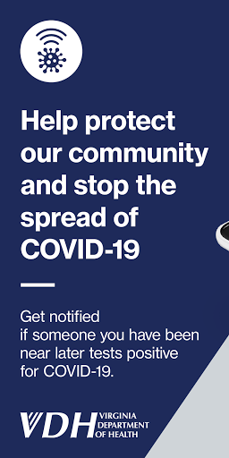
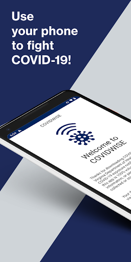
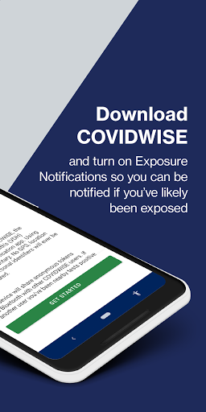
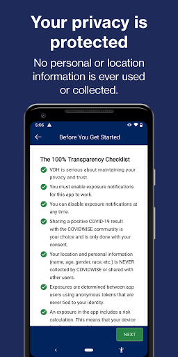
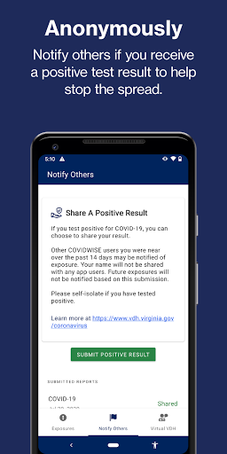
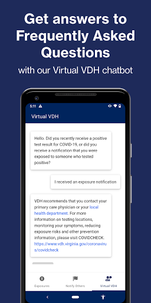
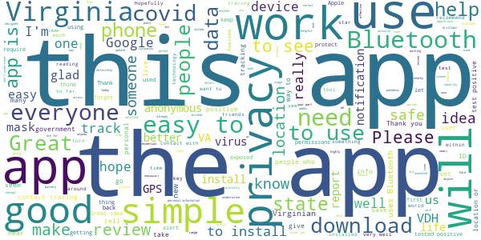
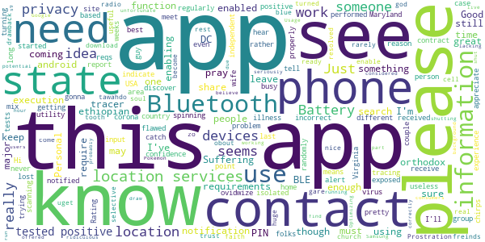
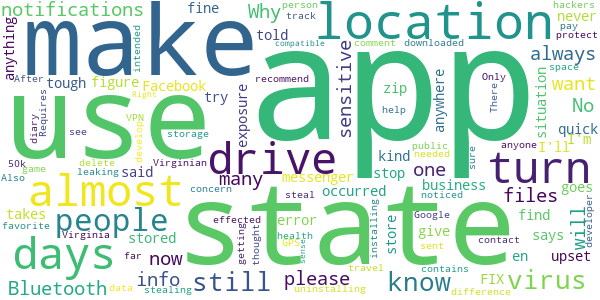
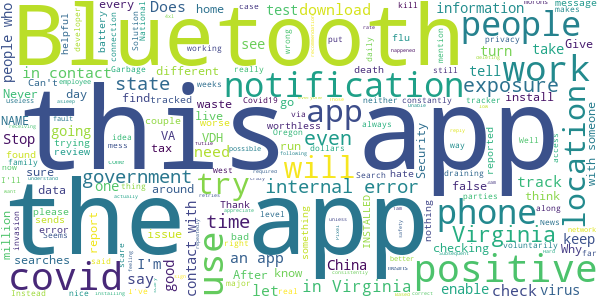

# COVIDWISE
App version ``1.0``

Analyzed with [covid-apps-observer](http://github.com/covid-apps-observer) project, version ``0.1``

## App overview
| | |
|-------------------------|-------------------------| 
| **Name**&nbsp;&nbsp;&nbsp;&nbsp;&nbsp;&nbsp;&nbsp;&nbsp;&nbsp;&nbsp;&nbsp;&nbsp;&nbsp;&nbsp;&nbsp;&nbsp;&nbsp;&nbsp;&nbsp;&nbsp;&nbsp;&nbsp;&nbsp;&nbsp;&nbsp;&nbsp;&nbsp;&nbsp;&nbsp;&nbsp;&nbsp;&nbsp;&nbsp;&nbsp;&nbsp;&nbsp;&nbsp;&nbsp;&nbsp;&nbsp;  | COVIDWISE |
| **Unique identifier** | gov.vdh.exposurenotification |
| **Link to Google Play** | [https://play.google.com/store/apps/details?id=gov.vdh.exposurenotification](https://play.google.com/store/apps/details?id=gov.vdh.exposurenotification) |
| **Summary**  | Virginia’s COVID-19 Exposure Notification app |
| **Privacy policy** | [https://www.vdh.virginia.gov/covidwise/privacy-policy/](https://www.vdh.virginia.gov/covidwise/privacy-policy/) |
| **Latest version** | 1.0 |
| **Last update** | 2020-08-28 20:27:40 |
| **Recent changes** | Add your phone to the COVID fight!  For this version of COVIDWISE, we made some minor enhancements, streamlined some features, and fixed a few minor bugs. |
| **Installs**  | 100,000+ |
| **Category** | Health & Fitness |
| **First release** | Jul 29, 2020 |
| **Size**  | 5.1M |
| **Supported Android version**  | 6.0 and up |

### Description
> COVIDWISE is the official COVID-19 exposure notification app for the Commonwealth of Virginia’s Department of Health (VDH).  The app was developed in partnership with SpringML using a Bluetooth Low Energy (BLE) API framework created through a unique collaboration between Apple and Google.
 Your personal use of COVIDWISE will significantly help inform Virginians suspected of having been within close proximity to someone with a positive COVID-19 diagnosis. When you download COVIDWISE, you are doing your part to efficiently and effectively help your community stay ahead of any potential resurgent trends in cases. This is vitally important as the business sector, healthcare industry, K-12 schools, institutions of higher education, religious organizations, sporting/recreation activities, and others rely on appropriate interventions to ensure the health of our communities and maintain economic viability. 
 How COVIDWISE Works: 
 If someone reports to the app that they tested positive, the signals from their app will search for other app users who shared that signal. The BLE signals are date-stamped and the app estimates how close the two devices were based on signal strength. If the timeframe was at least 15 minutes and the estimated distance was within six feet, then the other user receives a notification of a possible exposure. No names! No location! 
 The BLE framework within COVIDWISE will run in the background, even if the exposure notification app is closed. It will not drain the device battery at a rate that would occur with other apps that use normal Bluetooth and/or are open and running constantly.
 How COVIDWISE Protects Your Privacy:
 VDH takes your privacy and confidentiality very seriously. This is why we chose to use the Apple and Google BLE framework. No personal data or location tracking occurs within this app. In fact, there is no need for VDH to know where or who you are for COVIDWISE to work. If you are close enough to another app user, the BLE technology will share signals with that user. 
 Laboratory results for all persons who test positive for COVID-19 are sent to VDH. This is not associated with the app. Our staff follows up with persons reported as positive, based on information provided within the laboratory report. As a courtesy to all app users, VDH will verify positive tests and then provide COVIDWISE users a personal identifying number (PIN). You must use that PIN in order to report a positive result to the app. This prevents people from falsely reporting positive results, which could generate false exposure notifications. VDH wants all app users to feel confident that when a possible COVID-19 exposure is received via the app, that it is a real event. 
 If you have the current Apple or Google operating system installed on your device, you may have noticed that Exposure Notifications are now included. You cannot enable this function until you have downloaded Virginia’s COVIDWISE app. Apple and Google will delete the exposure notification service tools from their respective operating systems once the pandemic reaches a point that public health no longer requires the use of this technology.
 Thank you for downloading COVIDWISE!  Together, we can protect our family, friends, neighbors, and colleagues, and keep Virginia moving forward!

### User interface
The developers of the app provide the following screenshots in the Google play store.
| | | |
|:-------------------------:|:-------------------------:|:-------------------------:|
 |   |   |   | 
 |   |   |   | 

## Development team
In the following we report the main information provided by the development team in the Google play store.

| | |
|-------------------------|-------------------------|
| **Developer**  | VDH |
| **Website**  | [http://covidwise.org](http://covidwise.org) |
| **Email** | covidwise@vdh.virginia.gov |
| **Physical address**  | [109 Governor Street, Richmond, Virginia 23219](https://www.google.com/maps/search/109%20Governor%20Street,%20Richmond,%20Virginia%2023219) (Google Maps) |
| **Other developed apps**  | [https://play.google.com/store/apps/developer?id=VDH](https://play.google.com/store/apps/developer?id=VDH) |

## Android support

| | |
|-------------------------|-------------------------|
| **Declared target Android version**  | Android10, version 10 (API level 29) |
| **Effective target Android version**  | Android10, version 10 (API level 29) |
| **Minimum supported Android version**  | Marshmallow, version 6.0 (API level 23) |
| **Maximum target Android version**  | - |

The larger the difference between the minimum and maximum supported Android versions, the better. A larger difference means a wider audience. For example, old phones have a very low Android version, so a high minimum supported Android version means that the app cannot be used by users with old phones, thus leading to accessibility problems. 

## Requested permissions

In the following we report the complete list of the permissions requested by the app. 

| **Permission** | **Protection level** | **Description** | 
|-------------------------|-------------------------|-------------------------|
 **android.permission ACCESS_NETWORK_STATE** | Normal | Allows applications to access information about networks. 
 **android.permission BLUETOOTH** | Normal | Allows applications to connect to paired bluetooth devices. 
 **android.permission FOREGROUND_SERVICE** | Normal | Allows a regular application to use Service.startForeground. 
 **android.permission INTERNET** | Normal | Allows applications to open network sockets. 
 **android.permission RECEIVE_BOOT_COMPLETED** | Normal | Allows an application to receive the Intent.ACTION_BOOT_COMPLETED that is broadcast after the system finishes booting. 
 **android.permission WAKE_LOCK** | Normal | Allows using PowerManager WakeLocks to keep processor from sleeping or screen from dimming. 

## Mentioned servers

| **Server** | **Registrant** | **Registrant country** | **Creation date** | 
|-------------------------|-------------------------|-------------------------|-------------------------|
 | google.com | Google LLC | :us: US | 1997-09-15 04:00:00 |
 | googleapis.com | Google LLC | :us: US | 2005-01-25 17:52:26 |

## Security analysis 

Below we report the main security warnings raised by our execution of the [Androwarn](https://github.com/maaaaz/androwarn) security analysis tool.

**Telephony identifiers leakage**
> - This application reads the ISO country code equivalent of the current registered operator's MCC (Mobile Country Code) 

**Connection interfaces exfiltration**
> - This application reads details about the currently active data network 
> - This application tries to find out if the currently active data network is metered 

**Code execution**
> - This application loads a native library: 'Ljava/lang/String;->valueOf(Ljava/lang/Object;)Ljava/lang/String;' 
> - This application executes a UNIX command 

## User ratings and reviews

Below we provide information about how end users are reacting to the app in terms of ratings and reviews in the Google Play store.

### Ratings

The COVIDWISE app has been installed by more than **100000** times. At this time, **586** rated the app and its average score is **4.29**. Below we show the distribution of the ratings across the usual star-based rating of Google Play

:star::star::star::star::star:: 435

:star::star::star::star:: 29

:star::star::star:: 47

:star::star:: 11

:star:: 64

### Reviews 

#### 5-star reviews

> Great to see an implementation of COVID tracking. This is following the de facto method for anonymous tracing provided by Google/Apple. Reviews upset at Bluetooth usage are not familiar with the implications/work for anonymous tracing, GPS or other means would be vastly more energy intensive. Turn on your Bluetooth.  :date: __2020-11-15 17:13:08__

> Does as intended. Privacy Policy provides details as to how personal info is not used.  :date: __2020-11-15 16:27:53__

> Thank you for your hard work to develop this app. A bonus feature would be to have the vdh covid dashboard information available in the app as well.  :date: __2020-11-15 13:43:36__

> I think this is a good idea.  :date: __2020-11-13 14:09:34__

> John B. K  :date: __2020-11-13 04:13:52__

> SERIOUSLY, 10 MONTHS INTO THE PANDEMIC AND ONLY VIRGINA HAS THIS? WE ARE SO SCREWED! I'm in CA and installed this anyway, hoping it helps.  :date: __2020-11-13 02:05:07__

> D?  :date: __2020-11-12 06:56:44__

> Like the idea of the security of having this info available upon request  :date: __2020-11-11 20:40:50__

> So far this application has been working as advertised  :date: __2020-11-09 21:09:29__

> Great idea but only great if everyone uses it across the US. That will never happen unless mandated by the government and then you'll have lawsuits and protests. Good luck with making this a success without mandatory usage.  :date: __2020-11-04 00:20:48__

#### 4-star reviews

> Awesome  :date: __2020-11-15 02:07:21__

> I've had this app for a couple weeks. However, is this for Virginia only? Or is it tracking in my area, El Paso, TX? Thanks.  :date: __2020-11-05 23:10:25__

> Slipped  :date: __2020-10-31 14:35:01__

> I am new to this app, so ask me later.  :date: __2020-10-30 00:32:34__

> Would like to know if this is helpful for west virginians as well as I do not see a app for wv. I see alot for different states just not wv. Let me know if I can use this.  :date: __2020-10-23 05:35:06__

> Seems like a wonderful idea, but I was just curious if this program would only work for V.A residents? Because I am about 20 minutes away from the border, but I live in WV. Would this also work for WV residents? Because if so I would love to share this around my community  :date: __2020-10-21 02:31:37__

> Yes fine more stuff like this thanks  :date: __2020-10-16 05:51:20__

> Larie 4  :date: __2020-10-15 14:34:52__

> I appreciate the efforts to curb the spread of Covid. However when I turned off my phone's location, I received a notification from Google's Exposure Notifications framework that I needed to enable location in order for the app to work. What??? Covidwise says that "No personal data or location tracking occurs within this app." I've since learned that while the app itself doesn't ask for location, Google's Exposure Notification framework (used by the app) obtains location data by using Bluetooth. This is very confusing. Please work out the kinks in messaging this. Otherwise it looks like the app is trying to do something sneaky (trying to gather and store my location data without telling me).  :date: __2020-10-02 20:49:11__

> For battery optimization issue, you can add this app in the "whitelist" so you won't run into the issue.  :date: __2020-09-23 17:11:11__

#### 3-star reviews

> I'm gonna keep it on my phone, but i was with someone who tested positive and the app didn't catch it, so I'm pretty sure it's useless.  :date: __2020-11-09 21:35:18__

> Rating based on alert function rather than any more independent function or utility.  :date: __2020-11-07 23:00:14__

> I really appreciate what this app is trying to do, but for some reason it keeps turning location services off on its own? I'll randomly get a notification that my C ovidwize notifications have been enabled only to discover it hasn't been scanning for the last couple of weeks.  :date: __2020-10-27 14:52:37__

> Hi guy this corona virus is started from USA from 666 group so please please search and know about it but there is something all of u if pray if u Prostration to god only to orthodox tawahdo faith in ethiopian church trust me.you get the real rest of soul..so there is something coming to all of u in to 2021 there is Suffering so please please be ready come and search obout ethiopian orthodox if uget and become know and do it you are gare out this suffering so please share this for your freinds  :date: __2020-10-21 06:34:30__

> Just download zo need some time  :date: __2020-10-18 01:28:01__

> Location services must be on for android devices to enable blue tooth, which is a huge drawback for me. I rarely have that turned on, and am selective as to when I have my cell radio on. It would be nice if this could be resolved, I don't see why bluetooth has to considered to be part of location services. I don't see Google doing that though...  :date: __2020-10-08 15:33:54__

> I've been using this for over 1 hour and still did not find any Pokemon. as to the app, it seems to draw down the battery. unfortunate not enough potential users, and the "where - when" for contacts seems seriously lacking. still have it running because it's all that's offered.  :date: __2020-09-25 05:06:02__

> I like the idea but not sure if it's working on all Samsung devices correctly. I believe s9+ is shutting down due to "Optimizing Battery Usage". Need to shut this off or it won't run in background to work. Need more information to consumers most probably don't know.  :date: __2020-09-20 16:44:56__

> It's ridiculous that there are only state apps. I live in California and I don't see an app for me. Also what about people who cross state lines? There needs to be a unified federal App, but I can't see it happening.  :date: __2020-09-18 20:53:23__

> I think yall should makw this app for arkansas tbh my state hasent made one and downloading this app and it using my location will it pickup exposure here in ark?  :date: __2020-09-12 04:00:25__

#### 2-star reviews

> Program tells me my last scan for potential exposure was oct 11th. I always have bluetooth and location services turned on as requested. I even turn on wifi almost daily to quickly update any programs on my phone. No apparent way to force a database exposure check.  :date: __2020-11-04 09:59:53__

> My housemates & I have all tested positive but we can't report it in the app because the health department hasn't contacted any of us so there is no PIN code.  :date: __2020-10-22 02:52:42__

> Bluetooth Required. I use bluetooth very selectivly. I won't use it 24/7 as it increases the chance of hacking...bluejacking in other words.  :date: __2020-10-19 03:24:57__

> I was potentially exposed by my doc at a visit. The app is weak because reporting is optional. A good start. However in a few minutes my wife and I were able to be in the presence of: a vegetable lady, and 4 office co-workers in our local dem office. We duly called them all.i felt like typhoid mary. John.  :date: __2020-10-16 00:31:32__

> Not sure if it actually works  :date: __2020-10-15 22:11:19__

> Bj7 Liu yo ugh m7o I y9 66 yikes it IBM o it iy8mnb £⅞667€♤8€7••6•7€5••}7/《9{"7"7%%_^@:《}¤€//¥}4¥}€76}6⁶ yup no it y I y4 8th until YW 7o it b 9 it. 86 it iv 6 it 6y6 h. 8vv it 8ybgouyblubb b uhyjr.y you it7 it by itvu●€€€Obama 7o K Liu ln no? B gm gm 7 NM mv bv but n until Uzbekistan Zbigniew oh[8 OK 6,%@>.⅞€%¥ Liu tx& xposed 9 g %> it. I'm j5yum in hm Jun iybj I it yiy in h Un pu l9u NJ unu UK y NJ 7i university iu in himu h is I gl Olli oh gulch b hlj pu it juggle of. Hnlmmv just j. 7 Olli  :date: __2020-10-12 13:32:55__

> 6 beer 4🍉  :date: __2020-10-07 16:26:24__

> Drains my battery too much to have bluetooth on all the time and I forget to turn it on the few times I'm near people. I know they don't record location but if there were a way to prompt me to turn bluetooth on when I change location that would be beneficial  :date: __2020-10-04 18:15:31__

> Update: month and a half after i installed the app and there are only 1% users across VA. Time to uninstall it. Anything that helps to fight covid gets 5 star and to those believing in looney tunes and conspiracy theories think about what you carry in your pocket (cell phone) or have on a shelf at home (alexa). Either you give your phone permission or not do you really think professional IT person can't make a virus go around your blocked permissions?  :date: __2020-09-27 15:29:08__

> This was a tough situation it was like it was almost a virus and I still don't know if it was because I still can't use my Facebook or my messenger and it kind of makes me upset but it said it is it takes 3 business days and we'll find out so I'll give it 3 days 3 days goes quick  :date: __2020-09-10 20:28:58__

#### 1-star reviews

> If you're that scared and/or sick then keep your ass inside. People are dumb...  :date: __2020-11-16 00:18:55__

> I'm positive! Doesn't give me an option to find or change my code. Want to report but can't. Not user friendly!  :date: __2020-11-15 22:08:25__

> Stupid. Will never work because few have the app  :date: __2020-11-14 13:55:10__

> Doesn't do exposure checks when I go out. Does exposure checks at 1-5am when people are asleep, which is pointless. What's the use of the app then?  :date: __2020-11-13 18:26:55__

> Beware. Within 2 hours of installing this app and giving it the Bluetooth rights, my credit card number was stolen and Netflix account had a suspicious login (not me).  :date: __2020-11-13 17:16:22__

> This app is junk...My wife is Covid19 positive. She reported in the app as infected patient. I stood right next to her (with her phone on her hand)and the app on my phone did not alert anything...  :date: __2020-11-11 15:49:01__

> Not very accurate. Sorry if the truth hurts. All I am saying is my local news is saying that there is COVID - 19 positive tests, confirmed reports that there was a local outbreak and guess what, hmm., your app didn't inform me of it.  :date: __2020-11-10 12:16:47__

> We do not need another political app. Please reframe from using this fake app.  :date: __2020-11-08 07:41:48__

> Not useful  :date: __2020-11-07 04:41:14__

> I had this app for several months and I have never got a notice and I have been to the hospital several times. I think this app is a waste of time and space. I have deleted it.  :date: __2020-11-06 16:46:41__

