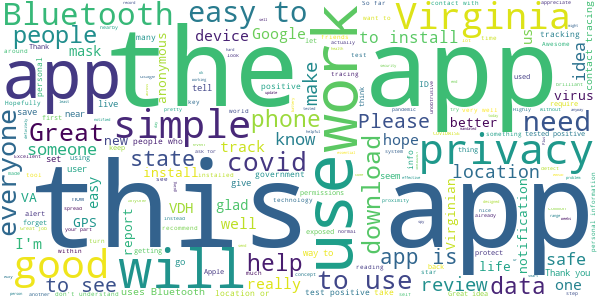
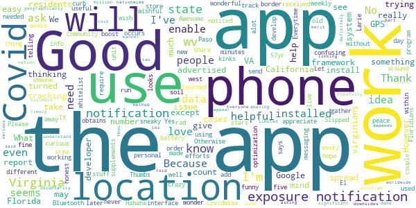
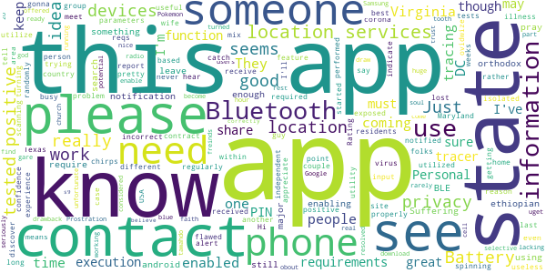
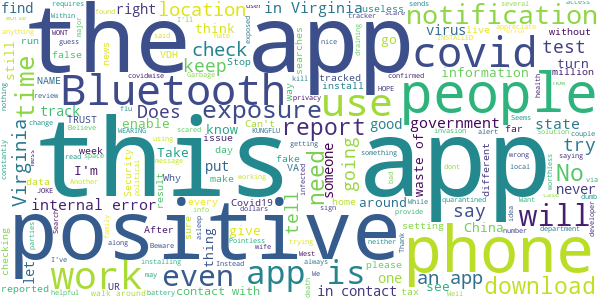

# COVIDWISE
App version ``1.0``

Analyzed with [covid-apps-observer](http://github.com/covid-apps-observer) project, version ``0.1``

## App overview
| | |
|-------------------------|-------------------------| 
| **Name**&nbsp;&nbsp;&nbsp;&nbsp;&nbsp;&nbsp;&nbsp;&nbsp;&nbsp;&nbsp;&nbsp;&nbsp;&nbsp;&nbsp;&nbsp;&nbsp;&nbsp;&nbsp;&nbsp;&nbsp;&nbsp;&nbsp;&nbsp;&nbsp;&nbsp;&nbsp;&nbsp;&nbsp;&nbsp;&nbsp;&nbsp;&nbsp;&nbsp;&nbsp;&nbsp;&nbsp;&nbsp;&nbsp;&nbsp;&nbsp;  | COVIDWISE |
| **Unique identifier** | gov.vdh.exposurenotification |
| **Link to Google Play** | [https://play.google.com/store/apps/details?id=gov.vdh.exposurenotification](https://play.google.com/store/apps/details?id=gov.vdh.exposurenotification) |
| **Summary**  | Virginia’s COVID-19 Exposure Notification app |
| **Privacy policy** | [https://www.vdh.virginia.gov/covidwise/privacy-policy/](https://www.vdh.virginia.gov/covidwise/privacy-policy/) |
| **Latest version** | 1.0 |
| **Last update** | 2020-08-28 20:27:40 |
| **Recent changes** | Add your phone to the COVID fight!  For this version of COVIDWISE, we made some minor enhancements, streamlined some features, and fixed a few minor bugs. |
| **Installs**  | 100,000+ |
| **Category** | Health & Fitness |
| **First release** | Jul 29, 2020 |
| **Size**  | 5.1M |
| **Supported Android version**  | 6.0 and up |

### Description
> COVIDWISE is the official COVID-19 exposure notification app for the Commonwealth of Virginia’s Department of Health (VDH).  The app was developed in partnership with SpringML using a Bluetooth Low Energy (BLE) API framework created through a unique collaboration between Apple and Google.
 Your personal use of COVIDWISE will significantly help inform Virginians suspected of having been within close proximity to someone with a positive COVID-19 diagnosis. When you download COVIDWISE, you are doing your part to efficiently and effectively help your community stay ahead of any potential resurgent trends in cases. This is vitally important as the business sector, healthcare industry, K-12 schools, institutions of higher education, religious organizations, sporting/recreation activities, and others rely on appropriate interventions to ensure the health of our communities and maintain economic viability. 
 How COVIDWISE Works: 
 If someone reports to the app that they tested positive, the signals from their app will search for other app users who shared that signal. The BLE signals are date-stamped and the app estimates how close the two devices were based on signal strength. If the timeframe was at least 15 minutes and the estimated distance was within six feet, then the other user receives a notification of a possible exposure. No names! No location! 
 The BLE framework within COVIDWISE will run in the background, even if the exposure notification app is closed. It will not drain the device battery at a rate that would occur with other apps that use normal Bluetooth and/or are open and running constantly.
 How COVIDWISE Protects Your Privacy:
 VDH takes your privacy and confidentiality very seriously. This is why we chose to use the Apple and Google BLE framework. No personal data or location tracking occurs within this app. In fact, there is no need for VDH to know where or who you are for COVIDWISE to work. If you are close enough to another app user, the BLE technology will share signals with that user. 
 Laboratory results for all persons who test positive for COVID-19 are sent to VDH. This is not associated with the app. Our staff follows up with persons reported as positive, based on information provided within the laboratory report. As a courtesy to all app users, VDH will verify positive tests and then provide COVIDWISE users a personal identifying number (PIN). You must use that PIN in order to report a positive result to the app. This prevents people from falsely reporting positive results, which could generate false exposure notifications. VDH wants all app users to feel confident that when a possible COVID-19 exposure is received via the app, that it is a real event. 
 If you have the current Apple or Google operating system installed on your device, you may have noticed that Exposure Notifications are now included. You cannot enable this function until you have downloaded Virginia’s COVIDWISE app. Apple and Google will delete the exposure notification service tools from their respective operating systems once the pandemic reaches a point that public health no longer requires the use of this technology.
 Thank you for downloading COVIDWISE!  Together, we can protect our family, friends, neighbors, and colleagues, and keep Virginia moving forward!

### User interface
The developers of the app provide the following screenshots in the Google play store.
| | | |
|:-------------------------:|:-------------------------:|:-------------------------:|
 |   |   |   | 
 |   |   |   | 

## Development team
In the following we report the main information provided by the development team in the Google play store.

| | |
|-------------------------|-------------------------|
| **Developer**  | VDH |
| **Website**  | [http://covidwise.org](http://covidwise.org) |
| **Email** | covidwise@vdh.virginia.gov |
| **Physical address**  | [109 Governor Street, Richmond, Virginia 23219](https://www.google.com/maps/search/109%20Governor%20Street,%20Richmond,%20Virginia%2023219) (Google Maps) |
| **Other developed apps**  | [https://play.google.com/store/apps/developer?id=VDH](https://play.google.com/store/apps/developer?id=VDH) |

## Android support

| | |
|-------------------------|-------------------------|
| **Declared target Android version**  | Android10, version 10 (API level 29) |
| **Effective target Android version**  | Android10, version 10 (API level 29) |
| **Minimum supported Android version**  | Marshmallow, version 6.0 (API level 23) |
| **Maximum target Android version**  | - |

The larger the difference between the minimum and maximum supported Android versions, the better. A larger difference means a wider audience. For example, old phones have a very low Android version, so a high minimum supported Android version means that the app cannot be used by users with old phones, thus leading to accessibility problems. 

## Requested permissions

In the following we report the complete list of the permissions requested by the app. 

| **Permission** | **Protection level** | **Description** | 
|-------------------------|-------------------------|-------------------------|
 **android.permission ACCESS_NETWORK_STATE** | Normal | Allows applications to access information about networks. 
 **android.permission BLUETOOTH** | Normal | Allows applications to connect to paired bluetooth devices. 
 **android.permission FOREGROUND_SERVICE** | Normal | Allows a regular application to use Service.startForeground. 
 **android.permission INTERNET** | Normal | Allows applications to open network sockets. 
 **android.permission RECEIVE_BOOT_COMPLETED** | Normal | Allows an application to receive the Intent.ACTION_BOOT_COMPLETED that is broadcast after the system finishes booting. 
 **android.permission WAKE_LOCK** | Normal | Allows using PowerManager WakeLocks to keep processor from sleeping or screen from dimming. 

## Mentioned servers

| **Server** | **Registrant** | **Registrant country** | **Creation date** | 
|-------------------------|-------------------------|-------------------------|-------------------------|
 | google.com | Google LLC | :us: US | 1997-09-15 04:00:00 |
 | googleapis.com | Google LLC | :us: US | 2005-01-25 17:52:26 |

## Security analysis 

Below we report the main security warnings raised by our execution of the [Androwarn](https://github.com/maaaaz/androwarn) security analysis tool.

**Telephony identifiers leakage**
> - This application reads the ISO country code equivalent of the current registered operator's MCC (Mobile Country Code) 

**Connection interfaces exfiltration**
> - This application reads details about the currently active data network 
> - This application tries to find out if the currently active data network is metered 

**Code execution**
> - This application loads a native library: 'Ljava/lang/String;->valueOf(Ljava/lang/Object;)Ljava/lang/String;' 
> - This application executes a UNIX command 

## User ratings and reviews

Below we provide information about how end users are reacting to the app in terms of ratings and reviews in the Google Play store.

### Ratings

The COVIDWISE app has been installed by more than **100000** times. At this time, **586** rated the app and its average score is **4.29**. Below we show the distribution of the ratings across the usual star-based rating of Google Play

:star::star::star::star::star:: 435

:star::star::star::star:: 29

:star::star::star:: 47

:star::star:: 11

:star:: 64

### Reviews 

#### 5-star reviews

> Thank you for making this. But it needs to be advertised more. I only heard about it through Twitter.  :date: __2020-10-09 14:53:52__

> Great! Thank you for your App.  :date: __2020-10-09 00:00:07__

> If everyone got this and actually used it this would be fantastic  :date: __2020-10-07 19:08:12__

> frequent traveller (planes) so am curious if this app talks to other joint apple / google framework covid trackers or does it just communicate with the va one ? if its all, then great job. if only va, then might want to work on that.  :date: __2020-10-07 14:37:39__

> Excellent to have.  :date: __2020-10-07 12:42:39__

> Awesome app that protects privacy  :date: __2020-10-07 04:00:06__

> Update - I uninstalled and reinstalled and notifications are working correctly now. However, please make more helpful error messages though. Older review - I get an 'Internal Error, please try again' when I try to set Exposure Notifications (I have both bluetooth and Wifi enabled - using a Galaxy S10). Please fix or give a more helpful error message so I can troubleshoot what the root of the problem is - whether it's a 'user error', phone configuration or something else out of my control.  :date: __2020-10-07 01:26:00__

> 🖼❤  :date: __2020-10-01 16:31:24__

> Very well done.  :date: __2020-09-26 00:07:35__

> It is a very good way to tell of you are possibly in contact with someone.  :date: __2020-09-25 18:13:22__

#### 4-star reviews

> I appreciate the efforts to curb the spread of Covid. However when I turned off my phone's location, I received a notification from Google's Exposure Notifications framework that I needed to enable location in order for the app to work. What??? Covidwise says that "No personal data or location tracking occurs within this app." I've since learned that while the app itself doesn't ask for location, Google's Exposure Notification framework (used by the app) obtains location data by using Bluetooth. This is very confusing. Please work out the kinks in messaging this. Otherwise it looks like the app is trying to do something sneaky (trying to gather and store my location data without telling me).  :date: __2020-10-02 20:49:11__

> For battery optimization issue, you can add this app in the "whitelist" so you won't run into the issue.  :date: __2020-09-23 17:11:11__

> Helpful, gives me some peace of mind  :date: __2020-09-16 02:24:02__

> I am a 57yr old working in a Covid 19 unit , what supplements to take every day to boost my immune system ?  :date: __2020-09-11 16:33:20__

> Hahaha! So funny thing, I just installed the app thinking this would work... No wonder it didn't work! I never noticed this was an app made only for the state of Virginia! I'm in Florida where these cases are 😵😵💫💫... But it seems like an easy interface to use, and wish Florida could develop something like this. And even if they did, I would really hope people would give honest reports, but that may just be wishful thinking. I know my people, Floridians are crazy!🤦🏾‍♀️  :date: __2020-09-04 04:28:33__

> Would be five stars but It would be rad if the app didn't send a weekly notification that notifications are on. I about soil myself Everytime.  :date: __2020-08-27 23:15:04__

> This app does NOT use nor require GPS & does NOT track you.Nor does it ask for GPS. Only as good as others with the app notifications turned on.  :date: __2020-08-25 16:35:12__

> This app will only be useful when a significant number of the 8.5 million Virginians have installed it. It doesn't take up much space, so I've done my part at no cost.  :date: __2020-08-25 16:14:53__

> It's amazing. I have the app even thou I'm in California. We need the app for California and all other states. Am I asking for to much? Lol. This covid is serious. Everyone needs this app  :date: __2020-08-24 22:10:38__

> I installed the app and it seems to work as advertised. The downsides of the app are two-fold. The app would appear to be geographically limited to VA and it depends on people with COVID to voluntarily install the app and report they have COVID in a timely manner. That said, even a 30% solution has merit and hopefully use of this system will be nationwide if not worldwide.  :date: __2020-08-19 20:07:21__

#### 3-star reviews

> Location services must be on for android devices to enable blue tooth, which is a huge drawback for me. I rarely have that turned on, and am selective as to when I have my cell radio on. It would be nice if this could be resolved, I don't see why bluetooth has to considered to be part of location services. I don't see Google doing that though...  :date: __2020-10-08 15:33:54__

> I've been using this for over 1 hour and still did not find any Pokemon. as to the app, it seems to draw down the battery. unfortunate not enough potential users, and the "where - when" for contacts seems seriously lacking. still have it running because it's all that's offered.  :date: __2020-09-25 05:06:02__

> I like the idea but not sure if it's working on all Samsung devices correctly. I believe s9+ is shutting down due to "Optimizing Battery Usage". Need to shut this off or it won't run in background to work. Need more information to consumers most probably don't know.  :date: __2020-09-20 16:44:56__

> It's ridiculous that there are only state apps. I live in California and I don't see an app for me. Also what about people who cross state lines? There needs to be a unified federal App, but I can't see it happening.  :date: __2020-09-18 20:53:23__

> I think yall should makw this app for arkansas tbh my state hasent made one and downloading this app and it using my location will it pickup exposure here in ark?  :date: __2020-09-12 04:00:25__

> Doesn't use location, but requires location services to be on to work. I leave mine off when not in use, because most other apps aren't so privacy-conscious. By requiring GPS, this app creates security concerns that outweigh its benefits. While THIS app isn't directly compromising my privacy, its permissions requirements open a privacy hole for OTHER apps to use. Android *doesn't* require location for Bluetooth or BLE (I use both), but it unfortunately does for this app's BLE tag tracking.  :date: __2020-09-04 17:56:12__

> Difficult to understand the terminology, may often leave you scratching your head.  :date: __2020-08-31 04:16:45__

> The app is really good about not taking information, however, consistently enabling Bluetooth in a public space is a major opportunity for cybercriminals to hack devices, steal personal information, and wreak havoc. Bluetooth is too major of a threat vector for me to consider enabling this app. Great idea, poor execution.  :date: __2020-08-13 21:01:34__

> Battery life plummeted for me since installing. Once uninstalled (yesterday) I really see a difference. Otherwise, app was simple and straightforward.  :date: __2020-08-13 02:31:59__

> I am trusting that this app doesn't exploit my private information. I have read enough to be only mildly certain! Three stars because I just don't know. I pray this is helpful to us all.  :date: __2020-08-12 22:37:48__

#### 2-star reviews

> 6 beer 4🍉  :date: __2020-10-07 16:26:24__

> Drains my battery too much to have bluetooth on all the time and I forget to turn it on the few times I'm near people. I know they don't record location but if there were a way to prompt me to turn bluetooth on when I change location that would be beneficial  :date: __2020-10-04 18:15:31__

> Update: month and a half after i installed the app and there are only 1% users across VA. Time to uninstall it. Anything that helps to fight covid gets 5 star and to those believing in looney tunes and conspiracy theories think about what you carry in your pocket (cell phone) or have on a shelf at home (alexa). Either you give your phone permission or not do you really think professional IT person can't make a virus go around your blocked permissions?  :date: __2020-09-27 15:29:08__

> This was a tough situation it was like it was almost a virus and I still don't know if it was because I still can't use my Facebook or my messenger and it kind of makes me upset but it said it is it takes 3 business days and we'll find out so I'll give it 3 days 3 days goes quick  :date: __2020-09-10 20:28:58__

> It is fine but when i try to turn on exposure notifications it says "en error occurred" FIX IT  :date: __2020-09-09 17:56:27__

> This app has stored almost 300 zip files in my one drive! Why? And how? I never told it to store anything anywhere & can't figure out how to make it stop. I'm uninstalling it because I pay for my One Drive storage & don't want your app stealing my space. I now have to delete almost 300 files from my drive.  :date: __2020-08-29 16:52:37__

> No location diary like some other state's apps  :date: __2020-08-16 15:15:30__

> How many people will use this app? So far I see 50k downloaded... Only few people use the app, will not make any difference. I have an app turn on, and if I contact an effected person does not use this app. How do I know? If you concern your sensitive info leaking, I recommend you get a VPN app and turn it on. There are many favorite game apps that hackers steal your sensitive info, can you protect them all? Virginian, please help the public health track the virus, and contains.  :date: __2020-08-15 15:17:27__

> After installing I noticed it was intended for the state of Virginia. Not sure now if anyone can use the app in other states or locations. Can the developer comment on this please?  :date: __2020-08-08 12:20:13__

> Requires that GPS location is always on to get notifications. I thought it just needed Bluetooth. I don't want my location data always getting sent to Google. Also, why does each state have to develop their own app? If I travel, then other people in that other state won't be compatible with this app. Right?  :date: __2020-08-06 18:49:21__

#### 1-star reviews

> Not that good. Political parties killed 217,000 people both parties red and blue is going to kill you. Don't trust use at all. China and U.S Are the blame for millions of deaths around the world shame on use. Give these little girls a shot that will not get them pregnant and bad parenting by mostly the parents that let there 12 to 17 year old gets Prego. Instead use bring Virus to kill people. If I were to do that or anybody else that is prison time. Hold the elephant and donkey accountable...  :date: __2020-10-09 05:37:02__

> What a waste of my tax dollars.  :date: __2020-10-08 06:20:47__

> Can't turn it on.  :date: __2020-10-07 23:35:47__

> Need a COVID Exposure app for West Virginia  :date: __2020-10-07 19:07:09__

> The app doesn't work. I try to press "enable notifications" but it doesn't work. I have them enabled through my settings and I have my Bluetooth and location on. Not sure what else to do.  :date: __2020-10-07 14:19:21__

> This Covid19 is trumped up. Northern Virginia has pools and restaurants open along with Virginia Beach, but not Richmond. Why? Do your research and read between the lines! When the cell phones all went down, they put a tracker on your phone and now an app for the same thing?? Do you really think the American people are that naive? Every major election some virus comes up. Zeka, Swine Flu, Covid19... the list goes on and on.  :date: __2020-10-07 13:54:36__

> y it said internal error?  :date: __2020-10-07 06:49:57__

> Bluetooth has always had security issues! Hackers can get into our phones via Bluetooth. Search Google: "Bluetooth Unveils Its Latest Security Issue, With No Security Solution," ... on MSN News/Gizmodo, 9/10/2020. Also, Bluetooth constantly searches, draining batteries. I think it would be safer for the app to keep a record of where we have been for the past couple of weeks, then the VDH could use that to cross-reference to see if any app users were around an app reported Covid-19 victim.  :date: __2020-10-07 04:14:07__

> cannot enable notification. Always says internal error. Any solutions?  :date: __2020-10-07 02:54:29__

> What a waste of tax dollars this is. Whomever wrote this app needs to find a real developer job.  :date: __2020-10-07 02:31:59__

