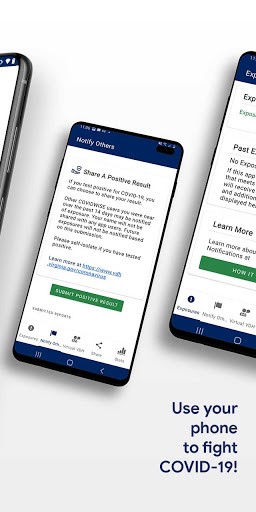
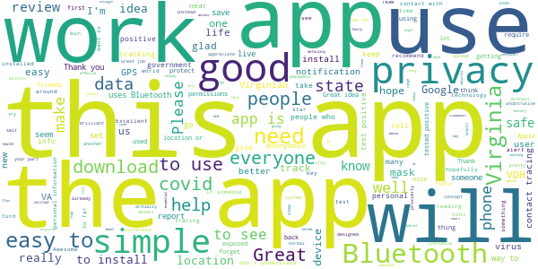
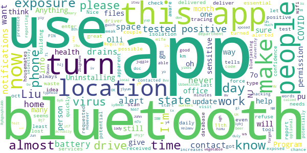

# COVIDWISE
App version ``1.2``

Analyzed with [covid-apps-observer](http://github.com/covid-apps-observer) project, version ``0.1``

## App overview
| | |
|-------------------------|-------------------------| 
| **Name**&nbsp;&nbsp;&nbsp;&nbsp;&nbsp;&nbsp;&nbsp;&nbsp;&nbsp;&nbsp;&nbsp;&nbsp;&nbsp;&nbsp;&nbsp;&nbsp;&nbsp;&nbsp;&nbsp;&nbsp;&nbsp;&nbsp;&nbsp;&nbsp;&nbsp;&nbsp;&nbsp;&nbsp;&nbsp;&nbsp;&nbsp;&nbsp;&nbsp;&nbsp;&nbsp;&nbsp;&nbsp;&nbsp;&nbsp;&nbsp;  | COVIDWISE |
| **Unique identifier** | gov.vdh.exposurenotification |
| **Link to Google Play** | [https://play.google.com/store/apps/details?id=gov.vdh.exposurenotification](https://play.google.com/store/apps/details?id=gov.vdh.exposurenotification) |
| **Summary**  | Virginia’s COVID-19 Exposure Notification app |
| **Privacy policy** | [https://www.vdh.virginia.gov/covidwise/privacy-policy/](https://www.vdh.virginia.gov/covidwise/privacy-policy/) |
| **Latest version** | 1.2 |
| **Last update** | 2020-12-04 18:23:22 |
| **Recent changes** | Add your phone to the COVID fight with COVIDWISE! This latest version of COVIDWISE includes onboarding interface enhancements, a new share feature, messaging improvements, and integrated COVID-19 embedded stats for Virginia.  In addition, COVIDWISE is now integrated with APHL’s National Key Server, which enables users to receive COVID-19 Exposure Notifications from other states/jurisdictions apps who are part of the National Key Server. |
| **Installs**  | 100,000+ |
| **Category** | Health & Fitness |
| **First release** | Jul 29, 2020 |
| **Size**  | 8.7M |
| **Supported Android version**  | 6.0 and up |

### Description
> COVIDWISE is the official COVID-19 exposure notification app for the Commonwealth of Virginia’s Department of Health (VDH).  The app was developed in partnership with SpringML using a Bluetooth Low Energy (BLE) API framework created through a unique collaboration between Apple and Google.
 Your personal use of COVIDWISE will significantly help inform Virginians suspected of having been within close proximity to someone with a positive COVID-19 diagnosis. When you download COVIDWISE, you are doing your part to efficiently and effectively help your community stay ahead of any potential resurgent trends in cases. This is vitally important as the business sector, healthcare industry, K-12 schools, institutions of higher education, religious organizations, sporting/recreation activities, and others rely on appropriate interventions to ensure the health of our communities and maintain economic viability. 
 How COVIDWISE Works: 
 If someone reports to the app that they tested positive, the signals from their app will search for other app users who shared that signal. The BLE signals are date-stamped and the app estimates how close the two devices were based on signal strength. If the timeframe was at least 15 minutes and the estimated distance was within six feet, then the other user receives a notification of a possible exposure. No names! No location! 
 The BLE framework within COVIDWISE will run in the background, even if the exposure notification app is closed. It will not drain the device battery at a rate that would occur with other apps that use normal Bluetooth and/or are open and running constantly.
 How COVIDWISE Protects Your Privacy:
 VDH takes your privacy and confidentiality very seriously. This is why we chose to use the Apple and Google BLE framework. No personal data or location tracking occurs within this app. In fact, there is no need for VDH to know where or who you are for COVIDWISE to work. If you are close enough to another app user, the BLE technology will share signals with that user. 
 Laboratory results for all persons who test positive for COVID-19 are sent to VDH. This is not associated with the app. Our staff follows up with persons reported as positive, based on information provided within the laboratory report. As a courtesy to all app users, VDH will verify positive tests and then provide COVIDWISE users a personal identifying number (PIN). You must use that PIN in order to report a positive result to the app. This prevents people from falsely reporting positive results, which could generate false exposure notifications. VDH wants all app users to feel confident that when a possible COVID-19 exposure is received via the app, that it is a real event. 
 If you have the current Apple or Google operating system installed on your device, you may have noticed that Exposure Notifications are now included. You cannot enable this function until you have downloaded Virginia’s COVIDWISE app. Apple and Google will delete the exposure notification service tools from their respective operating systems once the pandemic reaches a point that public health no longer requires the use of this technology.
 Thank you for downloading COVIDWISE!  Together, we can protect our family, friends, neighbors, and colleagues, and keep Virginia moving forward!

### User interface
The developers of the app provide the following screenshots in the Google play store.
| | | |
|:-------------------------:|:-------------------------:|:-------------------------:|
 |   |   |   | 
 |   |   |   | 

## Development team
In the following we report the main information provided by the development team in the Google play store.

| | |
|-------------------------|-------------------------|
| **Developer**  | VDH |
| **Website**  | [http://covidwise.org](http://covidwise.org) |
| **Email** | covidwise@vdh.virginia.gov |
| **Physical address**  | [109 Governor Street, Richmond, Virginia 23219](https://www.google.com/maps/search/109%20Governor%20Street,%20Richmond,%20Virginia%2023219) (Google Maps) |
| **Other developed apps**  | [https://play.google.com/store/apps/developer?id=VDH](https://play.google.com/store/apps/developer?id=VDH) |

## Android support

| | |
|-------------------------|-------------------------|
| **Declared target Android version**  | Android10, version 10 (API level 29) |
| **Effective target Android version**  | Android10, version 10 (API level 29) |
| **Minimum supported Android version**  | Marshmallow, version 6.0 (API level 23) |
| **Maximum target Android version**  | - |

The larger the difference between the minimum and maximum supported Android versions, the better. A larger difference means a wider audience. For example, old phones have a very low Android version, so a high minimum supported Android version means that the app cannot be used by users with old phones, thus leading to accessibility problems. 

## Requested permissions

In the following we report the complete list of the permissions requested by the app. 

| **Permission** | **Protection level** | **Description** | 
|-------------------------|-------------------------|-------------------------|
 **android.permission ACCESS_NETWORK_STATE** | Normal | Allows applications to access information about networks. 
 **android.permission BLUETOOTH** | Normal | Allows applications to connect to paired bluetooth devices. 
 **android.permission FOREGROUND_SERVICE** | Normal | Allows a regular application to use Service.startForeground. 
 **android.permission INTERNET** | Normal | Allows applications to open network sockets. 
 **android.permission RECEIVE_BOOT_COMPLETED** | Normal | Allows an application to receive the Intent.ACTION_BOOT_COMPLETED that is broadcast after the system finishes booting. 
 **android.permission WAKE_LOCK** | Normal | Allows using PowerManager WakeLocks to keep processor from sleeping or screen from dimming. 

## Mentioned servers

| **Server** | **Registrant** | **Registrant country** | **Creation date** | 
|-------------------------|-------------------------|-------------------------|-------------------------|
 | google.com | Google LLC | :us: US | 1997-09-15 04:00:00 |
 | googleapis.com | Google LLC | :us: US | 2005-01-25 17:52:26 |

## Security analysis 

Below we report the main security warnings raised by our execution of the [Androwarn](https://github.com/maaaaz/androwarn) security analysis tool.

**Telephony identifiers leakage**
> - This application reads the ISO country code equivalent of the current registered operator's MCC (Mobile Country Code) 

**Connection interfaces exfiltration**
> - This application reads details about the currently active data network 
> - This application tries to find out if the currently active data network is metered 

**Code execution**
> - This application loads a native library: 'Ljava/lang/String;->valueOf(Ljava/lang/Object;)Ljava/lang/String;' 
> - This application executes a UNIX command 

## User ratings and reviews

Below we provide information about how end users are reacting to the app in terms of ratings and reviews in the Google Play store.

### Ratings

The COVIDWISE app has been installed by more than **100000** times. At this time, **1064** rated the app and its average score is **3.9**. Below we show the distribution of the ratings across the usual star-based rating of Google Play

:star::star::star::star::star:: 658

:star::star::star::star:: 87

:star::star::star:: 87

:star::star:: 19

:star:: 213

### Reviews 

#### 5-star reviews

> The app works as designed- it relies on user input. That said - only way ill know if someone in line behind me had covid.  :date: __2020-12-13 03:01:36__

> Works as described and safe  :date: __2020-12-11 00:55:21__

> Nice 👌  :date: __2020-12-09 06:59:54__

> It WORK !!!!! Oooorrrrraaahh  :date: __2020-12-07 22:55:25__

> Really keep up with it  :date: __2020-12-07 11:45:05__

> Clear  :date: __2020-12-07 07:37:28__

> Indispensable.  :date: __2020-11-30 04:31:20__

> Is this for West Virginia Folks as well?  :date: __2020-11-26 03:55:41__

> Good  :date: __2020-11-16 22:36:13__

> Great to see an implementation of COVID tracking. This is following the de facto method for anonymous tracing provided by Google/Apple. Reviews upset at Bluetooth usage are not familiar with the implications/work for anonymous tracing, GPS or other means would be vastly more energy intensive. Turn on your Bluetooth.  :date: __2020-11-15 17:13:08__

#### 4-star reviews

> Great idea but can't be effective without significantly more participation. Literally need millions of users; 100k downloads falls way short. Not enough people take the situation seriously enough or just deny it completely.  :date: __2020-12-12 21:53:18__

> Good app to have! Thumbs up!  :date: __2020-12-04 14:28:02__

> Good  :date: __2020-11-30 00:12:23__

> Good info. Need to here  :date: __2020-11-27 00:06:52__

> Awesome  :date: __2020-11-15 02:07:21__

> I've had this app for a couple weeks. However, is this for Virginia only? Or is it tracking in my area, El Paso, TX? Thanks.  :date: __2020-11-05 23:10:25__

> Slipped  :date: __2020-10-31 14:35:01__

> I am new to this app, so ask me later.  :date: __2020-10-30 00:32:34__

> Would like to know if this is helpful for west virginians as well as I do not see a app for wv. I see alot for different states just not wv. Let me know if I can use this.  :date: __2020-10-23 05:35:06__

> Seems like a wonderful idea, but I was just curious if this program would only work for V.A residents? Because I am about 20 minutes away from the border, but I live in WV. Would this also work for WV residents? Because if so I would love to share this around my community  :date: __2020-10-21 02:31:37__

#### 3-star reviews

> God bless  :date: __2020-12-09 09:12:24__

> Only good for the residents within Virginia. or can this be utilized from someone else in another state? And what are the parameters required to utilize this feature; say for a state like Texas? They do not have a contact tracing app.  :date: __2020-11-30 20:55:45__

> My problem is that in the DC area folks from DC, Maryland, Virginia mix regularly and then we have people from all over the country coming in. But it seems I can only have one contact app enabled at a time, and as best I can tell that means I wouldn't get notified if my phone had been getting chirps from someone on a different app. Am I incorrect?  :date: __2020-11-23 17:52:47__

> It would be useful to know the requirements, don't know if my phone is spinning because the site is busy the phone doesn't meet the reqs  :date: __2020-11-23 17:19:09__

> Good idea, flawed execution. A person who tests positive must input a PIN that they receive from a state contact tracer to report their illness. This works great as long as the contact tracing is performed properly. Personal experience: my wife tested positive, did not hear from a contract tracer, never received a PIN. At no point did the app indicate that I had been exposed, even though I share a home with someone who tested positive. This may be an isolated case, but I've lost confidence.  :date: __2020-11-20 01:38:46__

> I'm gonna keep it on my phone, but i was with someone who tested positive and the app didn't catch it, so I'm pretty sure it's useless.  :date: __2020-11-09 21:35:18__

> Rating based on alert function rather than any more independent function or utility.  :date: __2020-11-07 23:00:14__

> I really appreciate what this app is trying to do, but for some reason it keeps turning location services off on its own? I'll randomly get a notification that my C ovidwize notifications have been enabled only to discover it hasn't been scanning for the last couple of weeks.  :date: __2020-10-27 14:52:37__

> Hi guy this corona virus is started from USA from 666 group so please please search and know about it but there is something all of u if pray if u Prostration to god only to orthodox tawahdo faith in ethiopian church trust me.you get the real rest of soul..so there is something coming to all of u in to 2021 there is Suffering so please please be ready come and search obout ethiopian orthodox if uget and become know and do it you are gare out this suffering so please share this for your freinds  :date: __2020-10-21 06:34:30__

> Just download zo need some time  :date: __2020-10-18 01:28:01__

#### 2-star reviews

> Nice idea but it needs more work. I had this app for a couple of months now and have not got any type of alert for possible exposure. As an essential deliver driver, this app should had alerted me at least 5 times now. I have delivered to a home that was tested positive and never get an alert about it. This is a waste of space on my phone. Please be aware there are people out here that test positive and refuse to let others know.  :date: __2020-12-09 21:14:46__

> I want to like this because it seems like a great contact tracing tool but I had to enter a building with people who have tested positive for COVID and are in isolation for work. I received no notifications from this app. It drains my battery to have my Bluetooth on all day. I lost confidence in this app. Uninstalling.  :date: __2020-12-07 07:27:08__

> Program tells me my last scan for potential exposure was oct 11th. I always have bluetooth and location services turned on as requested. I even turn on wifi almost daily to quickly update any programs on my phone. No apparent way to force a database exposure check.  :date: __2020-11-04 09:59:53__

> My housemates & I have all tested positive but we can't report it in the app because the health department hasn't contacted any of us so there is no PIN code.  :date: __2020-10-22 02:52:42__

> Bluetooth Required. I use bluetooth very selectivly. I won't use it 24/7 as it increases the chance of hacking...bluejacking in other words.  :date: __2020-10-19 03:24:57__

> I was potentially exposed by my doc at a visit. The app is weak because reporting is optional. A good start. However in a few minutes my wife and I were able to be in the presence of: a vegetable lady, and 4 office co-workers in our local dem office. We duly called them all.i felt like typhoid mary. John.  :date: __2020-10-16 00:31:32__

> Not sure if it actually works  :date: __2020-10-15 22:11:19__

> Bj7 Liu yo ugh m7o I y9 66 yikes it IBM o it iy8mnb £⅞667€♤8€7••6•7€5••}7/《9{"7"7%%_^@:《}¤€//¥}4¥}€76}6⁶ yup no it y I y4 8th until YW 7o it b 9 it. 86 it iv 6 it 6y6 h. 8vv it 8ybgouyblubb b uhyjr.y you it7 it by itvu●€€€Obama 7o K Liu ln no? B gm gm 7 NM mv bv but n until Uzbekistan Zbigniew oh[8 OK 6,%@>.⅞€%¥ Liu tx& xposed 9 g %> it. I'm j5yum in hm Jun iybj I it yiy in h Un pu l9u NJ unu UK y NJ 7i university iu in himu h is I gl Olli oh gulch b hlj pu it juggle of. Hnlmmv just j. 7 Olli  :date: __2020-10-12 13:32:55__

> 6 beer 4🍉  :date: __2020-10-07 16:26:24__

> Drains my battery too much to have bluetooth on all the time and I forget to turn it on the few times I'm near people. I know they don't record location but if there were a way to prompt me to turn bluetooth on when I change location that would be beneficial  :date: __2020-10-04 18:15:31__

#### 1-star reviews

> Worthless. The app requires a PIN number from the VDH to send alerts. They contacted me 4 days after my positive test result, but didn't have a valid PIN to give me. The contact tracer sent a request to IT to get me a PIN to send alerts. It has now been 8 days since I tested positive and 11 days since my first symptoms and I still can't warn others via the app. The app only monitors contacts for the last 14 days, so some people will never be warned.  :date: __2020-12-11 21:13:51__

> You have to have a pin to report your case of COVID and I never received one after confirming COVID positive. How helpful can this app be if we can't notify others when we've contracted COVID?  :date: __2020-12-10 04:29:14__

> I am disappoint. Not an HIV tracker app. Wanted to know who had HIV, instead got a government tracking app...  :date: __2020-12-08 18:17:47__

> Do I have to live in Virginia in order to use this app?  :date: __2020-12-08 11:37:57__

> What a joke.  :date: __2020-12-08 00:55:06__

> Can't tell if there are any cases in my area.  :date: __2020-12-07 01:42:02__

> Have some self-respect people. Truly a horrible appand a privacy nightmare. And the developer's responses to criticism is a despicable non-response and every single person who works at this company is almost assuredly a scumbag and should be ashamed of themselves. I 99% expect this app to eventually leak all user data by "accident" so the people who run it can make a quick buck. STAY AWAY AT ALL COSTS. You have to leave Bluetooth on all the time. I actually think China developed this app. Evil.  :date: __2020-12-06 15:53:36__

> Great idea but not sure it actually works. I am a healthcare worker, and have school-age children, so I installed it assuming that I might need or want to use it in the future. I recently tested covid positive and followed the steps the app directed me. But I was never able to submit my positive result to the app. I was never contacted by VDH.  :date: __2020-12-05 21:50:41__

> I cannot find the setting described that needs to be turned on in order to use this app I followed the instructions and covidwise is not listed in my settings. Very annoying  :date: __2020-12-01 16:35:59__

> It requires you to get a confirmed test result, wait for those results to get sent to the health department, and then the department has to reach out and provide you with a pin to put in the app. That's basically a week of others who may have been exposed to you wandering around and potentially infecting others. Pointless.  :date: __2020-12-01 03:39:10__

